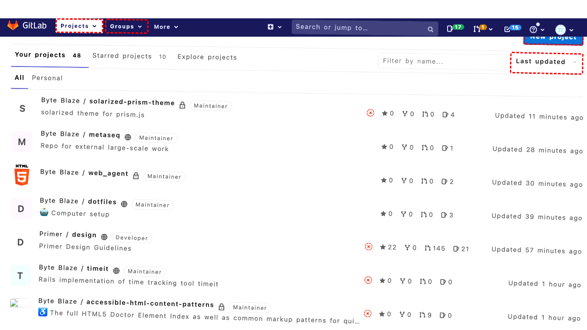
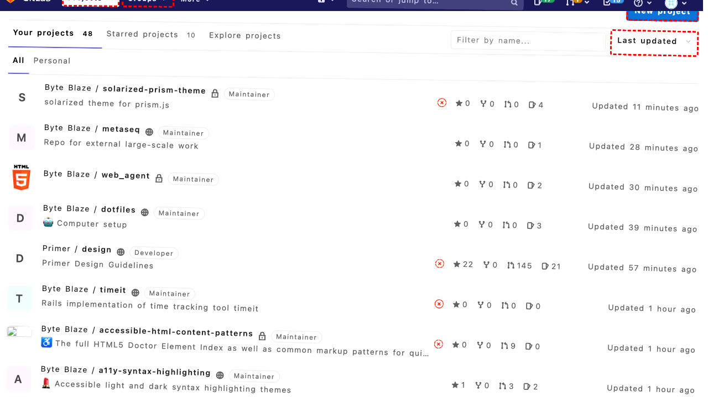
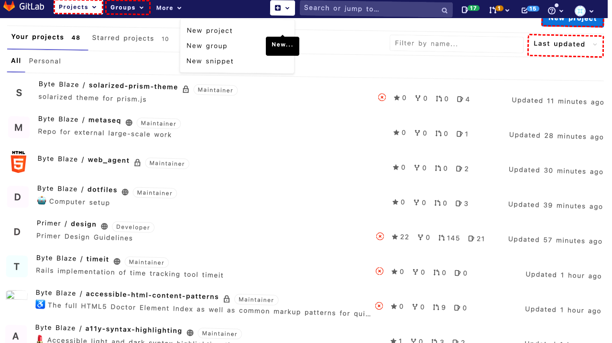
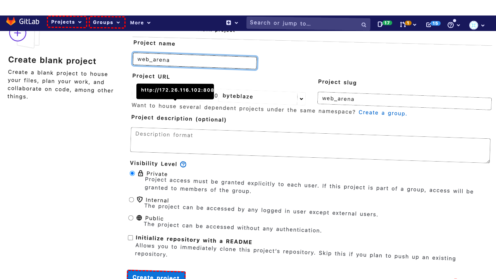
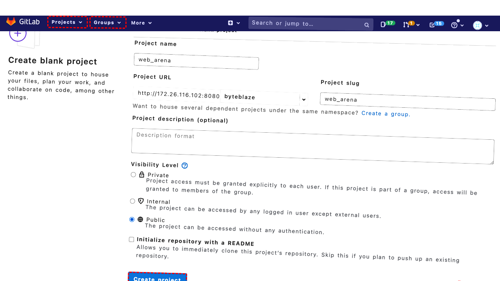
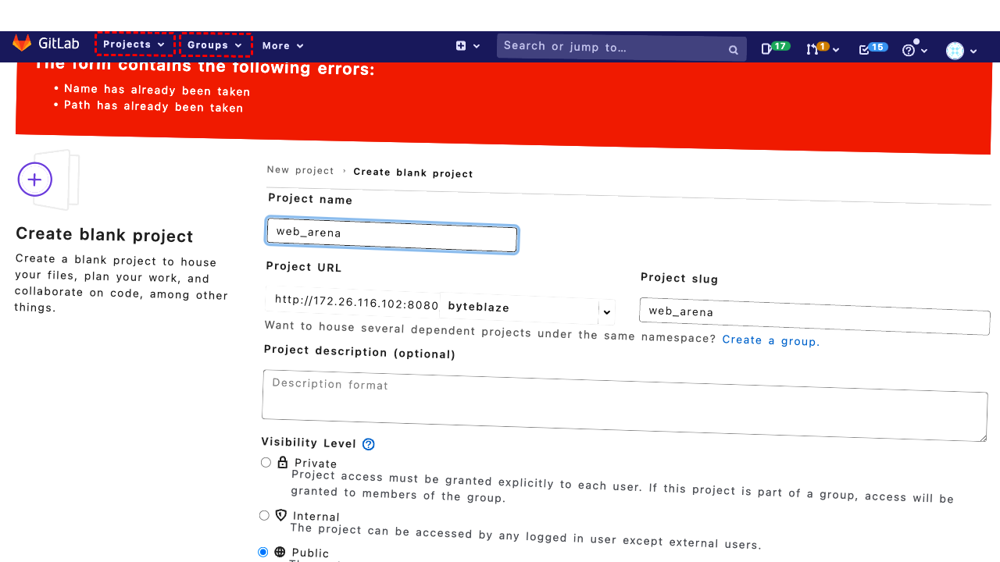
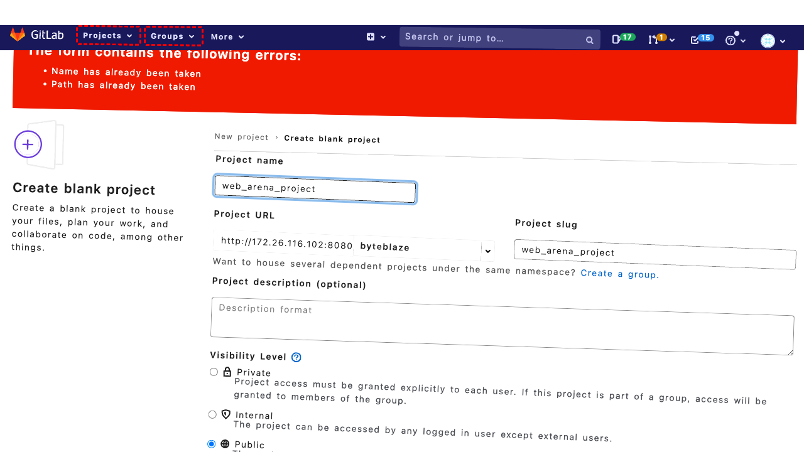
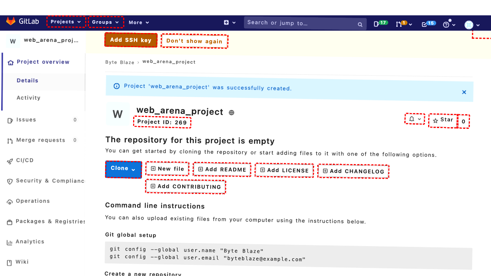
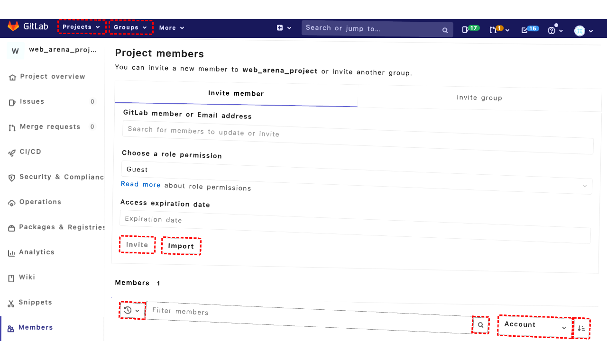

## Intent

Start a private project project_site with NodeJS template and add primer, convexegg, vinta as members

## RM

Thoughts: The user's intent is to create a private project named "project_site" using the NodeJS template and add specific members. The action history shows the agent selected the NodeJS template (actions 1-5), attempted to fill the project name "project_site" (actions 7 and 9), and clicked a button (action 10). However, the final state indicates the project name field was not visible or properly filled, and the agent encountered an error, failing to complete the project creation or add members. Since the agent did not successfully create the project or add members as required, the task is a failure.

Status: failure

## Final Response 

## Captions

===============Looking at the goal and the current page, I need to create a new private project called "project_site" using the NodeJS template and then add three members (primer, convexegg, vinta).

The current page is the GitLab dashboard showing projects. I can see there's a "New project" link available. The first step should be to click this link to start creating a new project.
===============The error indicates that the "New project" link is being intercepted by another element (likely the profile dropdown in the header). I need to try a different approach to create a new project. Looking at the accessibility tree, I can see there's also a "New..." dropdown in the left navigation menu (element 125) that should lead to project creation.

Let me try using the "New..." dropdown instead:
===============Looking at the current situation, I can see that clicking the "New..." dropdown (element 125) was successful, and now I need to select the "New project" option from the dropdown menu. The accessibility tree shows that after clicking "New...", a dropdown list appears with options including "New project" (element 131), "New group" (element 133), and "New snippet" (element 135).

Since my goal is to create a new project, I should click on the "New project" option from this dropdown.
===============Looking at the current state, I can see I'm on the "New Project" page with three tabs: "Blank project", "Create from template", and "Import project". The goal requires creating a project with the NodeJS template, so I need to switch to the "Create from template" tab rather than using the default "Blank project" tab.

The accessibility tree shows the tablist with three tabs, and "Create from template" has element ID 243. I should click this tab to access the template selection.
===============Looking at the current page, I can see I'm on the "Create from template" tab which shows various project templates. The goal requires using the NodeJS template, which I can see in the accessibility tree as "NodeJS Express" with a radio button labeled "Use template" (element 358).

I need to select the NodeJS Express template by clicking its "Use template" radio button.
===============Looking at the error, the issue is that the radio button (element 358) is being intercepted by its label (element 359). When this happens, it's often better to click the label element directly instead of the radio button itself. The label is associated with the radio button and clicking it should have the same effect of selecting the template.

Since the goal is to select the NodeJS Express template, I should click the "Use template" label (element 359) for the NodeJS Express section rather than the radio button itself.
===============Looking at the current state, I can see that clicking the "Use template" label for NodeJS Express was successful, and now I need to proceed with creating the project. The next step should be to fill in the project name "project_site" and ensure it's set as private.

From the accessibility tree, I can see various form fields that would appear after selecting a template, but they're not currently visible in the tree. Typically, after selecting a template, GitLab would show a form to configure the project details including the project name, visibility settings, etc.

I should look for the project name input field. Based on common GitLab patterns and previous actions, the project name field often has an ID like "543" or similar. Let me try to fill the project name field.
===============Looking at the error, the issue is that element "543" (the project name field) is not currently visible on the page. This suggests that after selecting the template, the page may have navigated to a different URL or the form fields are loaded dynamically and aren't yet available in the accessibility tree.

Let me check the current URL and page state. Since I'm on the "New Project" page and have selected the NodeJS template, I should wait a moment for the page to load the project configuration form, then try to find the project name field again.

Let me first wait briefly and then try to locate the project name field by its common attributes or look for other visible form elements.
===============Looking at the current situation, I've successfully selected the NodeJS Express template but the project configuration form hasn't loaded yet. After waiting 1 second, I should now be able to see the project creation form.

The goal requires creating a private project called "project_site". I need to find and fill the project name field. Based on GitLab's typical structure and previous experience, the project name field is usually available after template selection. Let me try to locate and fill it with the project name "project_site".
===============Looking at the error, the project name field (element 543) is still not visible. This suggests the page may have navigated to a different URL after template selection, or the form fields are loaded in a different way. Let me check if I'm still on the same page or if there's a different form structure.

From the original accessibility tree, I can see that after template selection, the typical flow would be to click a "Create project" button (which might have ID 586 based on previous patterns). However, I haven't actually filled the project name yet.

Let me try a different approach - I'll look for the project name field by its label or try to interact with the form in a different way. Since the template selection was successful, I should be able to see the project configuration form. Let me try to find and click the "Create project" button directly, as it might reveal any missing required fields like the project name.

## Images












## Main Prompt

```md
User Intent: Start a private project project_site with NodeJS template and add primer, convexegg, vinta as members

Action History:
1: click("224")
2: click("125")
3: click("131")
4: click("243")
5: click("358")
6: click("359")
7: fill("543", "project_site")
8: noop(1000)
9: fill("543", "project_site")
10: click("586")


The detailed final state of the webpage:

```md
Looking at the error, the project name field (element 543) is still not visible. This suggests the page may have navigated to a different URL after template selection, or the form fields are loaded in a different way. Let me check if I'm still on the same page or if there's a different form structure.

From the original accessibility tree, I can see that after template selection, the typical flow would be to click a "Create project" button (which might have ID 586 based on previous patterns). However, I haven't actually filled the project name yet.

Let me try a different approach - I'll look for the project name field by its label or try to interact with the form in a different way. Since the template selection was successful, I should be able to see the project configuration form. Let me try to find and click the "Create project" button directly, as it might reveal any missing required fields like the project name.
```

Bot response to the user: None.
```
