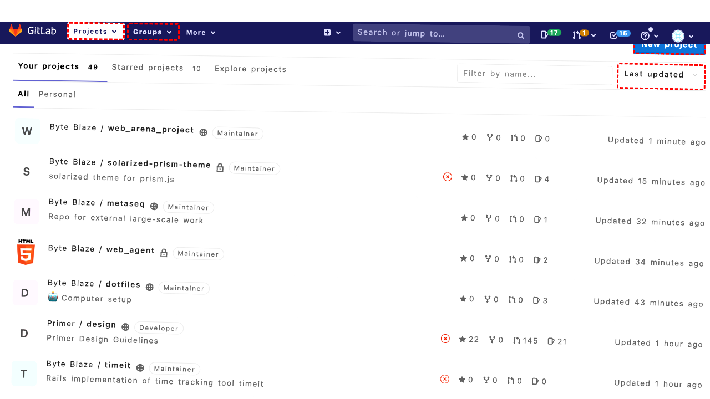
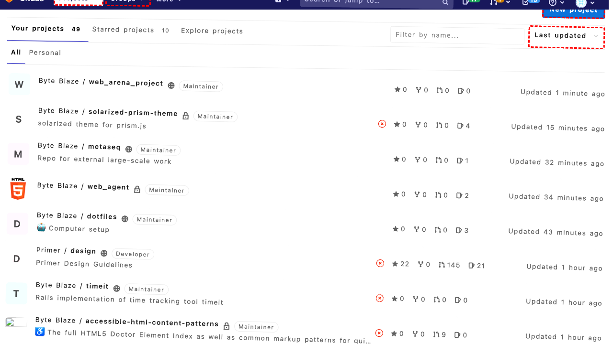
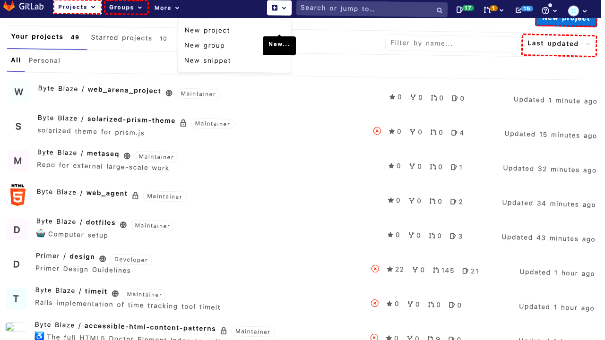
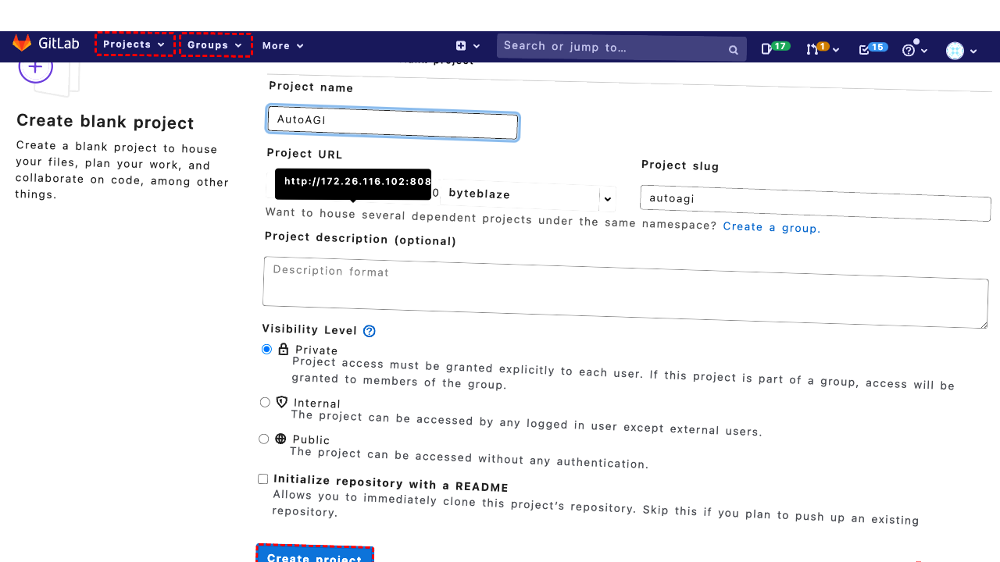
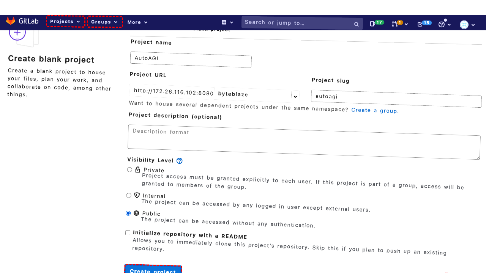
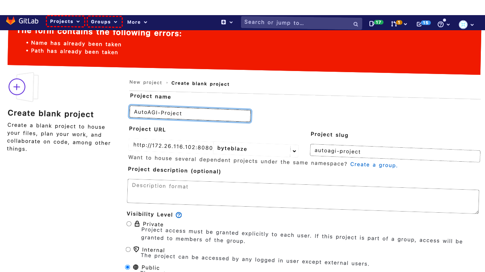
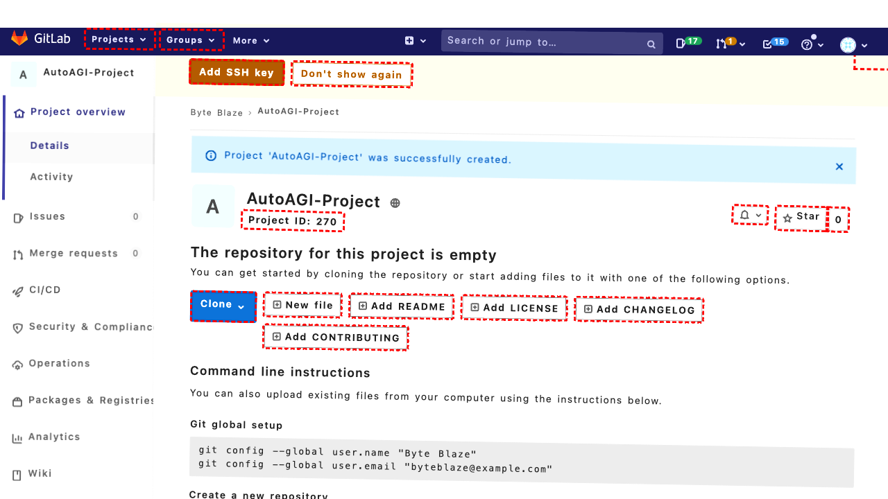
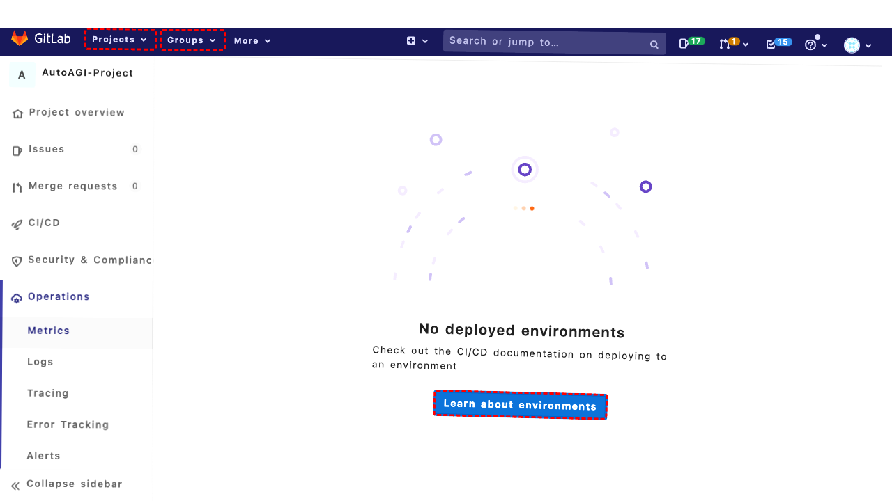

## Intent

Start a private project agi_index with HTML template and add Vinta Chen as members

## RM

Thoughts: The user's intent is to create a private project named "agi_index" using an HTML template and add Vinta Chen as members. The action history shows the agent selected a template and filled in the project name, but the final state indicates the project creation form did not appear after template selection, and the agent was still looking for a "Next" or "Continue" button. There is no evidence in the action history or final state that the project was successfully created or that Vinta Chen was added as a member. The bot response is also "None," which does not confirm completion. Therefore, the task is incomplete and unsuccessful.

Status: failure

## Final Response 

## Captions

===============Looking at the goal to "Start a private project agi_index with HTML template and add Vinta Chen as members", I need to:

1. First create a new private project called "agi_index" using an HTML template
2. Then add Vinta Chen as a member to this project

I can see from the current page that I'm on the GitLab dashboard with a "New project" link available (bid 224). I should start by clicking this to begin creating the new project.
===============Looking at the error message, it seems the "New project" button (bid 224) is being blocked by the profile dropdown element (bid 186) that's intercepting pointer events. This is a common UI issue where overlapping elements prevent clicks.

I should try an alternative approach. I can see there's also a "New..." dropdown in the left navigation (bid 125) that contains a "New project" option. Let me try using that instead to navigate to the project creation page.
===============Looking at the current situation, I successfully clicked the "New..." dropdown (bid 125) which should have opened a menu with options including "New project". Now I need to select the "New project" option from that dropdown menu to proceed with creating the project.

From the accessibility tree, I can see that after clicking "New...", there's a list with options including "New project" (bid 131). I should click on that specific option to navigate to the project creation page.
===============Looking at the current state, I can see I'm now on the "New project" page (URL: http://172.26.116.102:8080/projects/new) and the accessibility tree shows the project creation form is available. I need to:

1. First, switch to the "Create from template" tab since the goal specifies using an HTML template
2. Then select an HTML template and create the project
3. Finally add Vinta Chen as a member

I can see the tablist with "Blank project", "Create from template", and "Import project" tabs. The "Create from template" tab has bid 243. I should click this to access the template options.
===============Looking at the current state, I can see I'm on the "Create from template" tab and there are multiple template options available. The goal specifies using an "HTML template" for the project. I can see several HTML-related templates in the accessibility tree:

- "Pages/Plain HTML" (bid 441) - This appears to be exactly what we need as it's described as "Everything you need to create a GitLab Pages site using plain HTML"
- "Pages/Jekyll" (bid 429)
- "Pages/Hugo" (bid 417)
- "Pages/GitBook" (bid 453)
- "Pages/Hexo" (bid 465)

The "Pages/Plain HTML" template is the most appropriate for our goal since it specifically mentions plain HTML. I should select this template to proceed with creating the project.
===============Looking at the current state, I can see I've successfully selected the "Pages/Plain HTML" template (bid 441). Now I need to actually use this template to create the project. In the accessibility tree, I can see there's a radio button labeled "Use template" (bid 442) associated with the "Pages/Plain HTML" template that I need to select.

After selecting the template, I'll need to fill in the project name as "agi_index" and ensure it's set to private, then create the project. But first, I need to actually select the template by clicking the "Use template" radio button.
===============Looking at the error message, I can see that the radio button (bid 442) is being blocked by its associated label element (bid 443) which is intercepting pointer events. This is a common UI pattern where clicking the label activates the radio button.

Instead of trying to click the radio button directly, I should click the label element (bid 443) which says "Use template". This should properly select the "Pages/Plain HTML" template and allow me to proceed with creating the project.
===============Looking at the current state, I can see that I've successfully selected the "Pages/Plain HTML" template by clicking the "Use template" label. Now I need to proceed with creating the actual project.

From the accessibility tree, I can see that after selecting a template, there should be a form to fill out the project details including the project name. I need to:

1. Fill in the project name as "agi_index"
2. Ensure the project is set to private (which is typically the default for new projects)
3. Click the create project button

I should look for the project name input field in the current form. Based on the template selection flow, there should be a project name field that becomes available after selecting a template.
===============Looking at the error, it seems the project name field (bid 543) is not currently visible on the page. This suggests that after selecting the template, I may need to navigate to the next step of the project creation process where the project details form appears.

Let me check the current state - I've selected the "Pages/Plain HTML" template by clicking the "Use template" label. Typically in GitLab, after selecting a template, there should be a "Use template" button or the interface should transition to the project configuration form.

I notice in the accessibility tree there are "Preview" links for each template but no clear "Next" or "Continue" button after template selection. Let me try clicking the "Use template" radio button label again, as this might trigger the transition to the project creation form.
===============Looking at the current situation, I've successfully selected the "Pages/Plain HTML" template by clicking the "Use template" label, but the project creation form with the name field isn't appearing. This suggests that in GitLab's interface, selecting a template via the radio button/label might not automatically advance to the next step.

I need to look for a "Next" or "Continue" button, or perhaps there's a separate "Use template" button that appears after selection. Let me examine the accessibility tree more carefully for any buttons or links that might advance the process after template selection.

From the tree, I can see various template options with their "Use template" radio buttons, but no clear "Next" or "Create project" button visible in the current view. Let me try scrolling down to see if there are additional controls below the template list that I'm not currently seeing.

## Images












## Main Prompt

```md
User Intent: Start a private project agi_index with HTML template and add Vinta Chen as members

Action History:
1: click("224")
2: click("125")
3: click("131")
4: click("243")
5: click("441")
6: click("442")
7: click("443")
8: fill("543", "agi_index")
9: click("443")
10: scroll(0, 300)


The detailed final state of the webpage:

```md
Looking at the current situation, I've successfully selected the "Pages/Plain HTML" template by clicking the "Use template" label, but the project creation form with the name field isn't appearing. This suggests that in GitLab's interface, selecting a template via the radio button/label might not automatically advance to the next step.

I need to look for a "Next" or "Continue" button, or perhaps there's a separate "Use template" button that appears after selection. Let me examine the accessibility tree more carefully for any buttons or links that might advance the process after template selection.

From the tree, I can see various template options with their "Use template" radio buttons, but no clear "Next" or "Create project" button visible in the current view. Let me try scrolling down to see if there are additional controls below the template list that I'm not currently seeing.
```

Bot response to the user: None.
```
