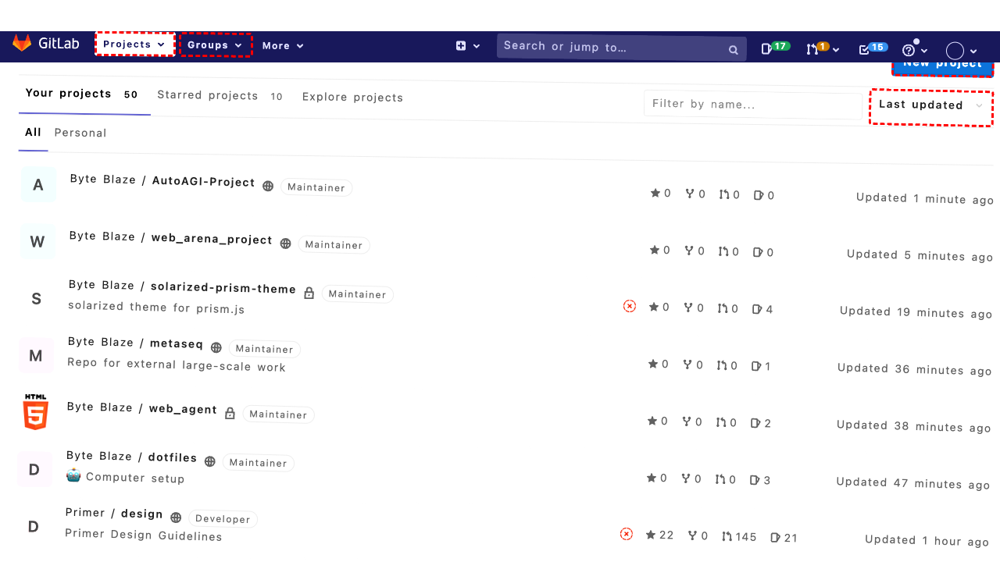
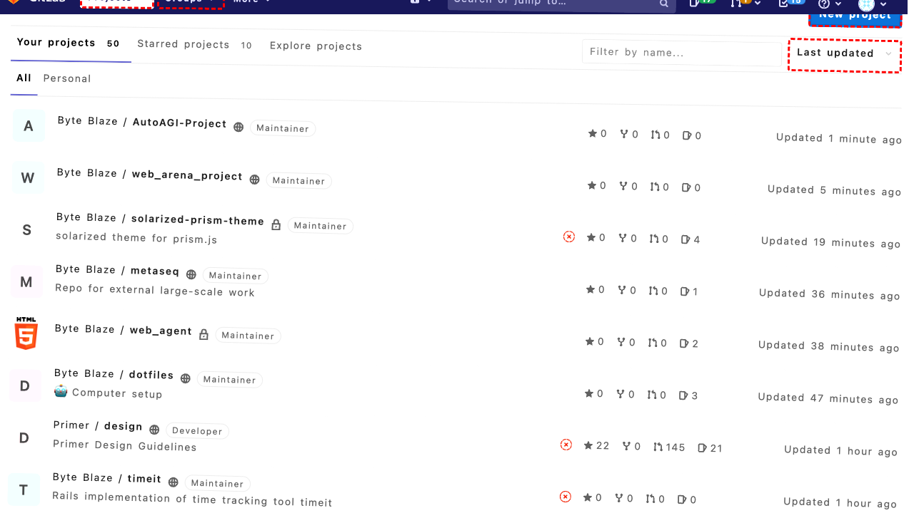
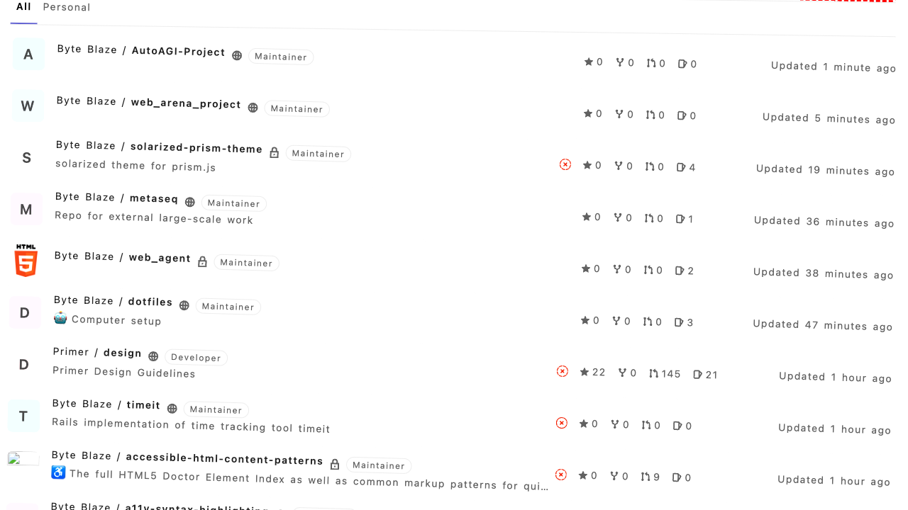
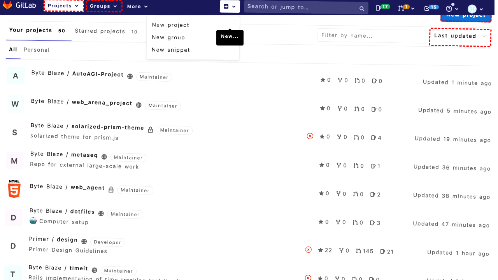
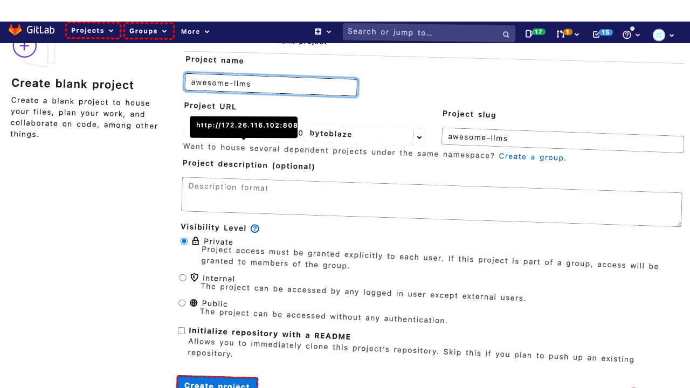
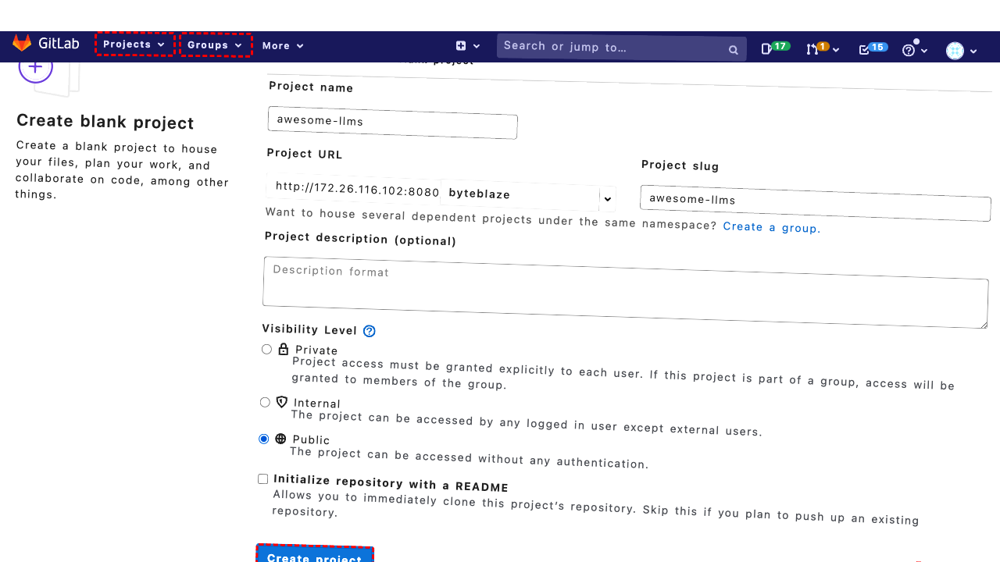
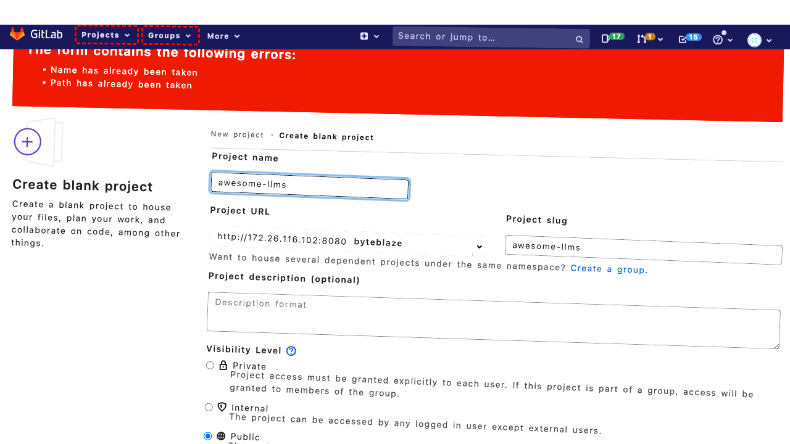

## Intent

Start a private project AGISite with JEKYLL template and add Rohan and Vinta as members

## RM

Thoughts: The user's intent is to start a private project named "AGISite" using the JEKYLL template and add Rohan and Vinta as members. This is a content modification task, as it involves creating a project and modifying its settings (adding members). The action history shows the agent attempted to navigate and click various elements, but the final state indicates an error: the "Create project" button is not visible, and the agent is considering alternative steps like clicking "Preview." Crucially, there is no evidence in the action history or final state that the project was successfully created, the name "AGISite" was set, the project was made private, or members Rohan and Vinta were added. The agent's actions appear incomplete and stuck at the template selection stage, leading to failure.

Status: failure

## Final Response 

## Captions

===============Looking at the goal to create a private project "AGISite" with JEKYLL template and add Rohan and Vinta as members, I can see I'm currently on the GitLab dashboard page. I need to:

1. First create a new project using the JEKYLL template
2. Make it private
3. Add Rohan and Vinta as members

The current page shows a "New project" link (bid 224) which I should click to start the project creation process. This is the logical first step.
===============The error indicates that the "New project" button (bid 224) is being intercepted by another element (the profile dropdown at bid 186). This is a common UI issue where overlapping elements prevent clicks. Let me try an alternative approach - I'll use the "New..." dropdown in the left navigation (bid 125) which should also lead to project creation.
===============Looking at the current situation, I can see that clicking the "New..." dropdown (bid 125) was successful since it's now expanded and showing the project creation options. The dropdown shows "New project", "New group", and "New snippet" options. Since I need to create a new project, I should click the "New project" option (bid 131) from this dropdown menu.
===============Looking at the current state, I can see I'm on the "New Project" page with three tabs: "Blank project", "Create from template", and "Import project". Since the goal is to create a project with the JEKYLL template, I need to switch to the "Create from template" tab (bid 243) to access the template options.
===============Looking at the current page, I can see I'm on the "Create from template" tab which shows various project templates. I need to find and select the "Pages/Jekyll" template to create a Jekyll-based project. From the accessibility tree, I can see there's a "Pages/Jekyll" template with a radio button (bid 430) that I need to select to use this template.
===============Looking at the error, I can see that the radio button (bid 430) is being intercepted by its label element (bid 431). This is a common UI pattern where clicking the label also selects the radio button. Since the radio button itself is being blocked by its label, I should click on the label element instead to select the "Pages/Jekyll" template.
===============Looking at the current state, I can see that I successfully selected the "Pages/Jekyll" template by clicking its label. Now I need to proceed with creating the project. The next logical step would be to click the "Create project" button or fill in the project details. Since I'm on the template selection page and have selected the Jekyll template, I should look for a "Create project" or "Next" button to proceed with the project creation process.

From the accessibility tree, I can see various template options but no clear "Create project" button visible in the current view. This suggests I may need to scroll down to find the project creation button, or the button might appear after template selection. Let me try scrolling down to see if there's a "Create project" button below the template list.
===============Looking at the current situation, I can see that I've successfully selected the "Pages/Jekyll" template and scrolled down. Now I need to proceed with actually creating the project. Based on the GitLab interface pattern, after selecting a template, there should be a "Create project" or "Use template" button that appears or becomes available to proceed to the project configuration screen.

From the accessibility tree, I can see there are "Use template" radio buttons for each template (like bid 430 for Jekyll), but I need to find the actual "Create project" button. Since I've already selected the template by clicking its label, I should look for a button that says "Create project" or similar to proceed to the next step where I can name the project "AGISite" and set it as private.

Let me look for a "Create project" button - it's likely at the bottom of the page after the template list.
===============Looking at the error, it seems the "Create project" button (bid 586) is not currently visible on the page. This suggests I may need to navigate to the next step differently. After selecting a template in GitLab, there's typically a "Use template" button that needs to be clicked first before proceeding to the project configuration screen.

From the accessibility tree, I can see that for the "Pages/Jekyll" template, there's a "Use template" label (bid 431) that I already clicked to select the template. However, there might be a separate "Use template" button that appears or becomes active after template selection. Let me try clicking the "Preview" link (bid 428) for the Jekyll template first, as this might trigger the next step in the template selection process.

## Images











## Main Prompt

```md
User Intent: Start a private project AGISite with JEKYLL template and add Rohan and Vinta as members

Action History:
1: click("224")
2: click("125")
3: click("131")
4: click("243")
5: click("430")
6: click("431")
7: scroll(0, 300)
8: click("586")
9: click("428")


The detailed final state of the webpage:

```md
Looking at the error, it seems the "Create project" button (bid 586) is not currently visible on the page. This suggests I may need to navigate to the next step differently. After selecting a template in GitLab, there's typically a "Use template" button that needs to be clicked first before proceeding to the project configuration screen.

From the accessibility tree, I can see that for the "Pages/Jekyll" template, there's a "Use template" label (bid 431) that I already clicked to select the template. However, there might be a separate "Use template" button that appears or becomes active after template selection. Let me try clicking the "Preview" link (bid 428) for the Jekyll template first, as this might trigger the next step in the template selection process.
```

Bot response to the user: None.
```
