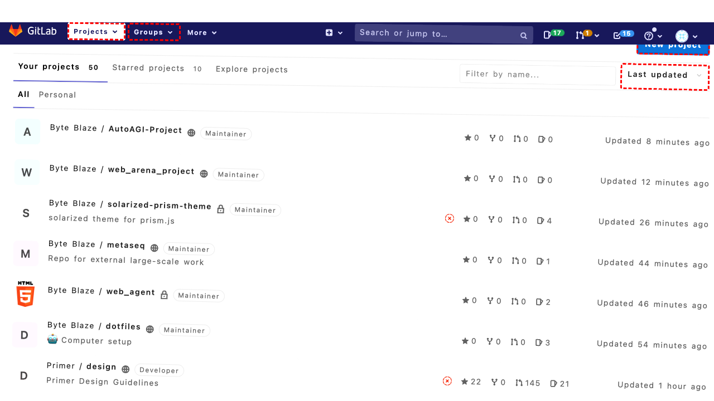
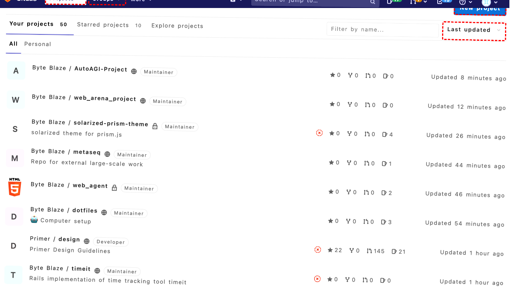
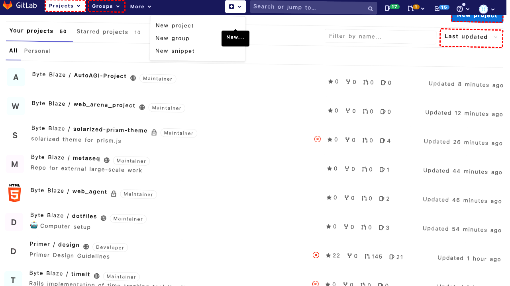
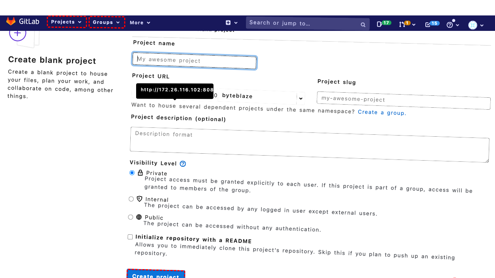
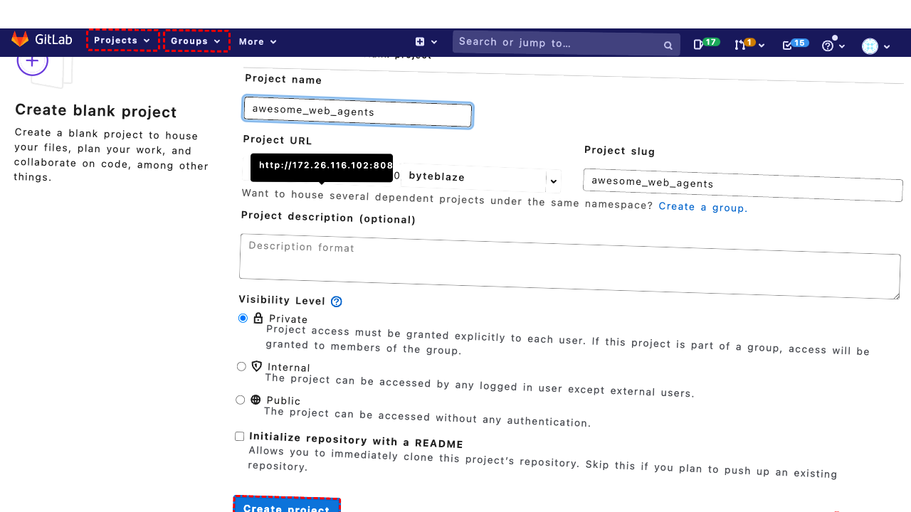
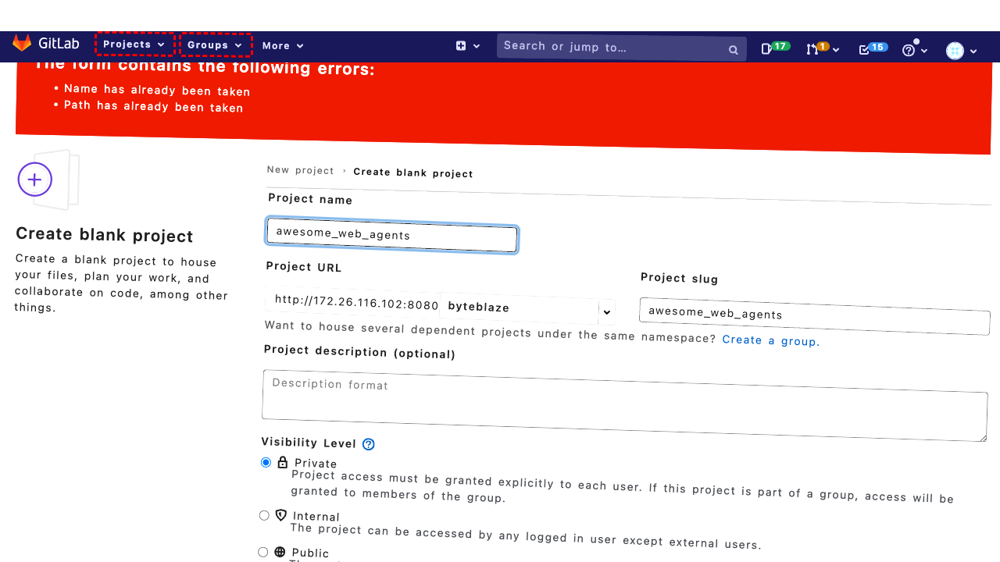
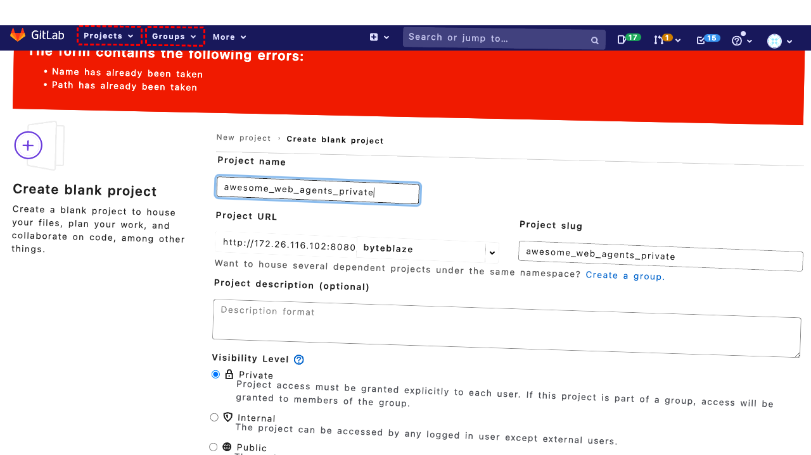
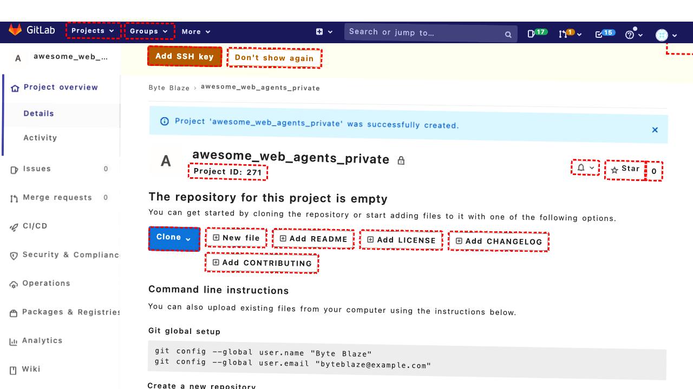
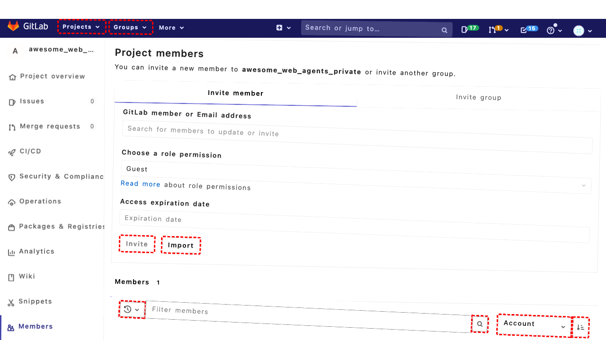

## Intent

Create a private Android repository called "web_agent_android_xs" using the right template to speed up development.

## RM

Thoughts: The user's intent is to create a private Android repository called "web_agent_android_xs" using the right template. This is a content modification task, as it involves creating a new repository with specific settings. The action history shows the agent selected a template (likely Android, based on the final state description), filled in the repository name, and clicked a button, but the final state indicates the project creation form was not reached—the expected fields were not visible, and the page may not have redirected properly. The agent's noop actions suggest waiting, but the final state still reflects an incomplete process, with no confirmation of repository creation. Therefore, the task was not successfully completed.

Status: failure

## Final Response 

## Captions

===============Looking at the current page, I can see we're on the GitLab dashboard with a "New project" link available. The goal is to create a private Android repository called "web_agent_android_xs" using a template to speed up development.

I need to:
1. Click the "New project" link to start creating a repository
2. Look for template options, specifically Android templates
3. Create the repository with the specified name and ensure it's private

The "New project" link is clearly visible in the accessibility tree with ID '224'. This is the logical first step to begin the repository creation process.
===============The error indicates that the "New project" link is being intercepted by another element (the profile dropdown). I need to find an alternative way to access the new project creation. Looking at the accessibility tree, I can see there's also a "New..." dropdown in the left navigation with ID '125' that should lead to project creation options.
===============Looking at the accessibility tree, I can see that after clicking the "New..." dropdown (ID '125'), it expanded and now shows options including "New project" (ID '131'). Since the goal is to create a new project, I should click on the "New project" option from this dropdown menu.
===============Looking at the current state, I can see we're on the "New project" page with three tabs: "Blank project", "Create from template", and "Import project". The goal is to create a private Android repository using a template to speed up development. Currently, the "Blank project" tab is selected by default, but I need to switch to the "Create from template" tab to find Android templates.

The "Create from template" tab has ID '243' in the accessibility tree. I should click this tab to access the template selection options.
===============Looking at the current page state, I can see we're now on the "Create from template" tab where various project templates are displayed. I can see an Android template listed with the description "A ready-to-go template for use with Android apps." This is exactly what we need to speed up development.

The Android template has a radio button labeled "Use template" with ID '394' according to the accessibility tree. I need to select this Android template to proceed with creating the repository.
===============Looking at the error, I can see that the radio button with ID '394' is being intercepted by a label element with ID '395'. The error indicates that the label is intercepting pointer events, preventing direct clicking on the radio button.

In HTML forms, it's common for labels to be associated with form controls, and clicking the label often has the same effect as clicking the associated control. Since the label with ID '395' is associated with the Android template's "Use template" option, I should click the label instead of the radio button directly.

The label has the text "Use template" and ID '395', which should select the Android template for us.
===============Looking at the current state, I can see that I successfully selected the Android template by clicking the "Use template" label. Now I need to proceed with creating the project with the specific name "web_agent_android_xs" and ensure it's private.

The next step should be to fill in the project name field. Looking at the accessibility tree, I can see various form fields that would appear after selecting a template, though they're not explicitly shown in the current tree. Based on the GitLab interface flow, after selecting a template, the next page typically has a project name input field and visibility settings.

I should look for the project name input field. From previous experience with GitLab, the project name field often has an ID like '543' or similar. Let me try to fill that field with the desired repository name.
===============Looking at the error, it seems the element with ID '543' is not currently visible on the page. This suggests that either:

1. The project creation form hasn't fully loaded yet after selecting the template
2. The ID has changed or is different than expected
3. We need to navigate to the next step of the template selection process

Let me check if there might be a "Next" or "Continue" button that needs to be clicked first after selecting the Android template. Looking at the accessibility tree, I can see various template options but no obvious next step button. However, in GitLab's workflow, after selecting a template, there should be a button to proceed to the project configuration.

Let me try to find and click a button that would take us to the project setup form. I'll look for a button with text like "Create project" or "Next" that might appear after template selection.
===============Looking at the error, it seems the element with ID '586' is not visible on the current page. This suggests that after selecting the Android template, we might need to wait for the page to update or navigate to a different form.

Let me reconsider the workflow: after clicking "Use template" for the Android template, GitLab should redirect us to a project creation form where we can set the project name and visibility. The fact that both '543' and '586' are not visible suggests we might still be on the template selection page, or the page hasn't updated properly.

Let me check if there's a "Next" or "Continue" button specifically for the Android template selection. Looking at the accessibility tree again, I notice that each template has its own "Use template" radio button and label, but no separate navigation button. In GitLab's interface, clicking "Use template" should automatically take us to the project creation form.

Let me try a different approach - perhaps I need to wait for the page to update after selecting the template, or there might be a button that appears after template selection. Let me look for any visible form elements or buttons that might have appeared.
===============Looking at the current situation, I've selected the Android template but haven't been redirected to the project creation form yet. The error messages suggest that the expected form fields (IDs '543' and '586') aren't visible on the current page.

Let me reconsider the workflow: After clicking "Use template" for a specific template in GitLab, it should automatically navigate to a project creation form where I can set the project name and visibility. The fact that this hasn't happened suggests either:

1. The page needs more time to redirect
2. There might be an additional step I'm missing
3. The template selection might require a different interaction

Let me try to find if there's a "Next" or "Continue" button that appears after template selection, or check if the page has updated with new form elements. I'll look for any visible input fields or buttons that might indicate we've moved to the project configuration step.

## Images












## Main Prompt

```md
User Intent: Create a private Android repository called "web_agent_android_xs" using the right template to speed up development.

Action History:
1: click("224")
2: click("125")
3: click("131")
4: click("243")
5: click("394")
6: click("395")
7: fill("543", "web_agent_android_xs")
8: click("586")
9: noop(2000)
10: noop(3000)


The detailed final state of the webpage:

```md
Looking at the current situation, I've selected the Android template but haven't been redirected to the project creation form yet. The error messages suggest that the expected form fields (IDs '543' and '586') aren't visible on the current page.

Let me reconsider the workflow: After clicking "Use template" for a specific template in GitLab, it should automatically navigate to a project creation form where I can set the project name and visibility. The fact that this hasn't happened suggests either:

1. The page needs more time to redirect
2. There might be an additional step I'm missing
3. The template selection might require a different interaction

Let me try to find if there's a "Next" or "Continue" button that appears after template selection, or check if the page has updated with new form elements. I'll look for any visible input fields or buttons that might indicate we've moved to the project configuration step.
```

Bot response to the user: None.
```
