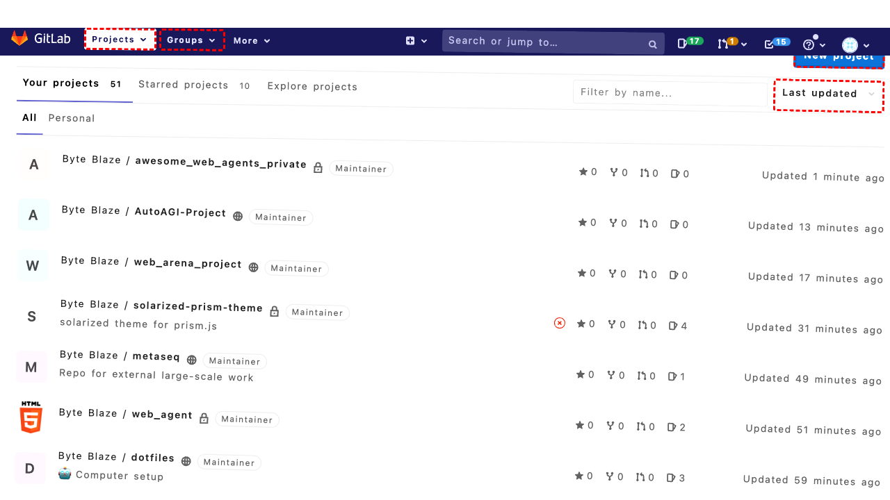
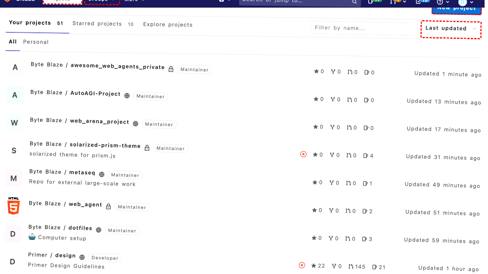
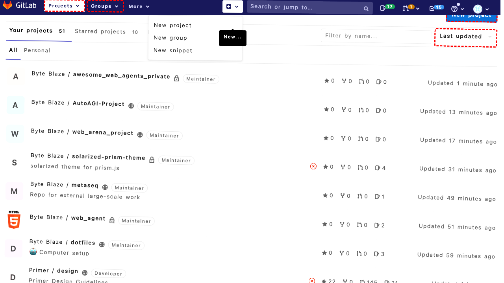
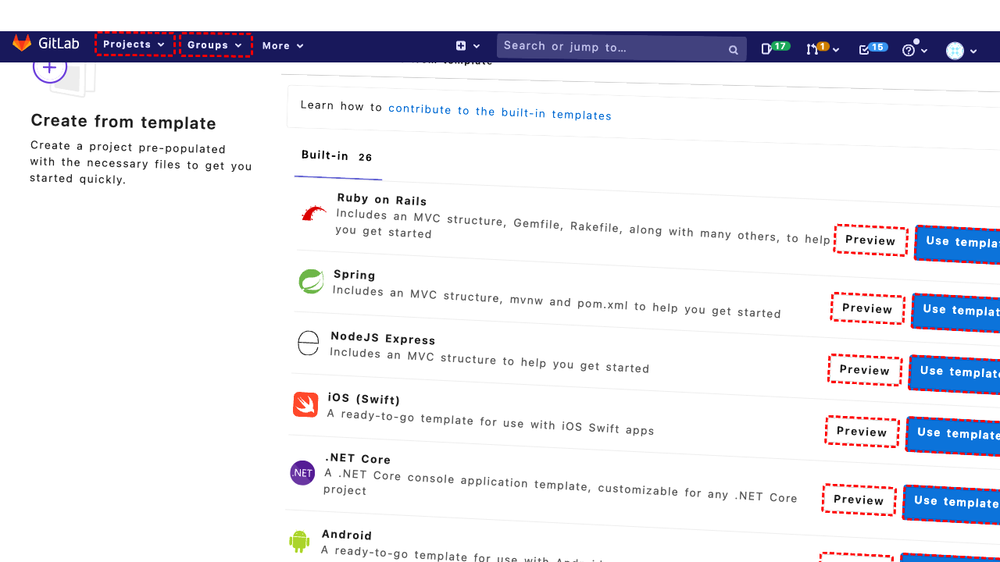
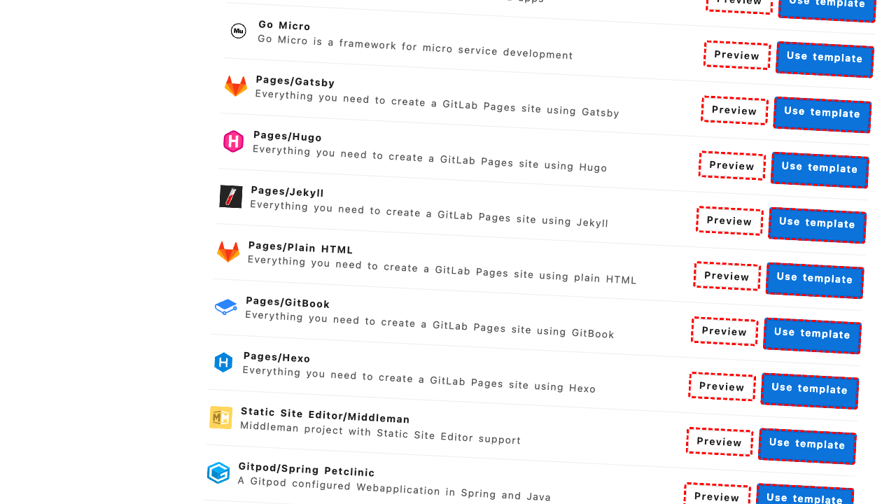
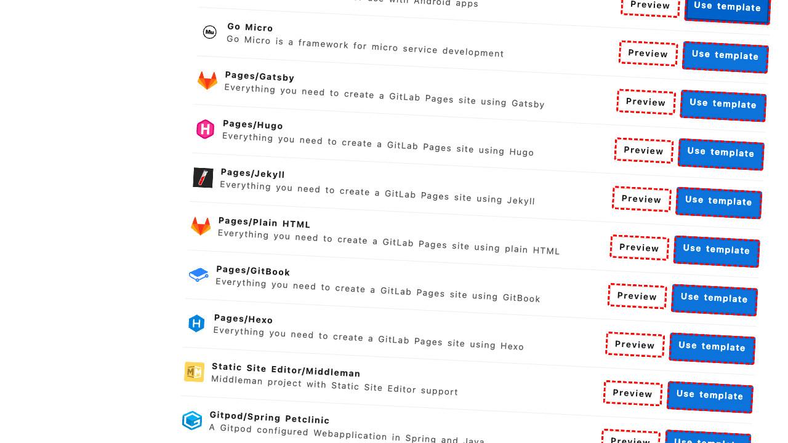
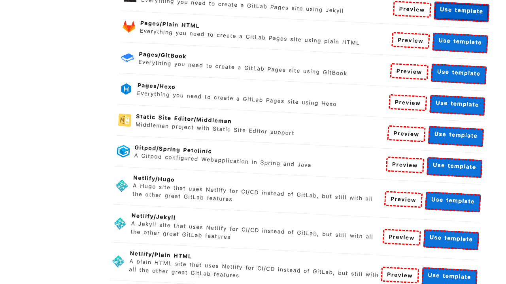
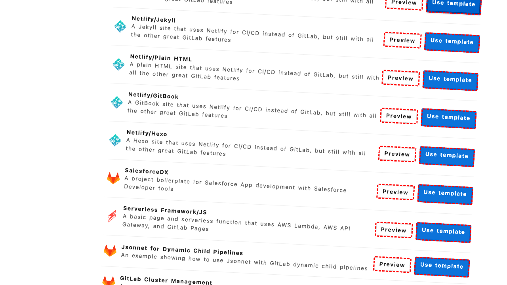
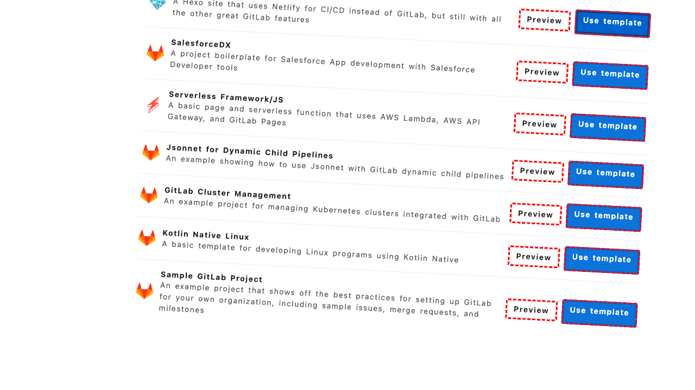
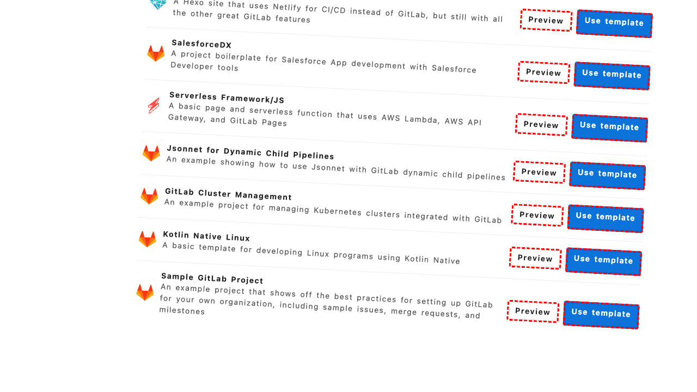

## Intent

Create a private NodeJS repository called "web_agent_nodejs" using the right template to speed up development.

## RM

Thoughts: The user's intent is to create a private NodeJS repository called "web_agent_nodejs" using a template. This is a content modification task, so I need to examine the action history and final state to determine success. The action history shows the agent filled in the repository name and attempted to click buttons, but the final state indicates the project creation form did not appear and the agent encountered an error (element with bid '586' not visible). The agent's actions did not successfully complete the creation process, as the final state reflects confusion and an incomplete flow, with no confirmation of repository creation.

Status: failure

## Final Response 

## Captions

===============Looking at the current page, I can see we're on the GitLab dashboard with a "New project" link available. The goal is to create a private NodeJS repository called "web_agent_nodejs" using a template to speed up development.

I need to:
1. Click the "New project" link to start creating a repository
2. Look for template options, specifically NodeJS templates
3. Create the repository with the specified name and private visibility

The "New project" link is clearly visible with bid '224' in the accessibility tree.
===============The error indicates that the "New project" button is being intercepted by another element (the profile dropdown). I need to try a different approach to navigate to the project creation page. Looking at the accessibility tree, I can see there's also a "New..." dropdown in the left navigation with bid '125' that contains a "New project" option. Let me try using that instead.
===============Looking at the current situation, I can see that clicking the "New..." dropdown (bid '125') should reveal a menu with "New project" as an option. The accessibility tree shows that this dropdown is expanded and contains a list with "New project" (bid '131'), "New group" (bid '133'), and "New snippet" (bid '135') options.

Since the dropdown is already expanded (expanded=True in the accessibility tree), I can now directly click on the "New project" option to navigate to the project creation page.
===============Looking at the current state, I can see we're on the "New project" page with three tabs: "Blank project", "Create from template", and "Import project". The goal is to create a NodeJS repository using a template. Currently, the "Blank project" tab is selected by default, but I need to switch to the "Create from template" tab to find NodeJS templates.

The accessibility tree shows the tablist with three tabs, and "Create from template" has bid '243'. I should click this tab to access the template options.
===============Looking at the current page state, I can see we're now on the "Create from template" tab which shows various project templates. I need to find and select the NodeJS Express template since the goal is to create a NodeJS repository.

In the accessibility tree, I can see the "NodeJS Express" template with its "Use template" radio button having bid '358'. This is the appropriate template for a NodeJS project that will help speed up development with its MVC structure.
===============Looking at the error, the issue is that the radio button (bid '358') is being intercepted by its label element (bid '359'). When an element is intercepted by another element, it means the label is covering the radio button and preventing direct clicks.

The solution is to click on the label element instead, which will still select the radio button. The label has bid '359' and contains the text "Use template" for the NodeJS Express template.
===============Looking at the current state, I can see that I've successfully selected the NodeJS Express template by clicking the "Use template" label. Now I need to proceed with creating the project with the specified name "web_agent_nodejs".

The next step should be to fill in the project name field and create the repository. Based on the accessibility tree and typical GitLab flow, after selecting a template, there should be a form to enter project details including the project name. I need to find and fill the project name field with "web_agent_nodejs" and then click the create button.
===============Looking at the error, the issue is that the project name field with bid '543' is not currently visible on the page. This suggests that after selecting the template, we may need to scroll down to see the project creation form, or there might be additional steps needed before the name field becomes available.

Let me first try scrolling down to see if the project name field becomes visible:
===============Looking at the current situation, I've successfully selected the NodeJS Express template and scrolled down, but the project name field (bid '543') is still not visible. This suggests that after template selection, there might be a "Next" or "Continue" button that needs to be clicked before reaching the project naming step.

Let me examine the accessibility tree more carefully. After the template selection, there should be a button to proceed to the project configuration. I need to look for a button that says something like "Create project", "Next", or "Continue" that would take us to the form where we can name the project.
===============Looking at the current situation, I've successfully selected the NodeJS Express template but the project creation form with the name field isn't appearing. The error suggests the element with bid '586' (which I assumed was a create button) is not visible.

Let me reconsider the flow. After selecting a template in GitLab, there should be a "Use template" button that appears or becomes enabled. Looking back at the accessibility tree, I see that for each template there's a radio button with label "Use template", but there might be a separate "Create project" or "Use template" button that appears after selection.

Let me try clicking on the actual "Use template" button/link that might appear after template selection. Looking at the accessibility tree, I see there's a link with bid '356' labeled "Preview" for the NodeJS Express template, but I need to find the actual action button to proceed.

Let me try a different approach - I'll look for any button that says "Create project" or similar that might have appeared after template selection:

## Images












## Main Prompt

```md
User Intent: Create a private NodeJS repository called "web_agent_nodejs" using the right template to speed up development.

Action History:
1: click("224")
2: click("125")
3: click("131")
4: click("243")
5: click("358")
6: click("359")
7: fill("543", "web_agent_nodejs")
8: scroll(0, 300)
9: click("586")
10: click("311")


The detailed final state of the webpage:

```md
Looking at the current situation, I've successfully selected the NodeJS Express template but the project creation form with the name field isn't appearing. The error suggests the element with bid '586' (which I assumed was a create button) is not visible.

Let me reconsider the flow. After selecting a template in GitLab, there should be a "Use template" button that appears or becomes enabled. Looking back at the accessibility tree, I see that for each template there's a radio button with label "Use template", but there might be a separate "Create project" or "Use template" button that appears after selection.

Let me try clicking on the actual "Use template" button/link that might appear after template selection. Looking at the accessibility tree, I see there's a link with bid '356' labeled "Preview" for the NodeJS Express template, but I need to find the actual action button to proceed.

Let me try a different approach - I'll look for any button that says "Create project" or similar that might have appeared after template selection:
```

Bot response to the user: None.
```
