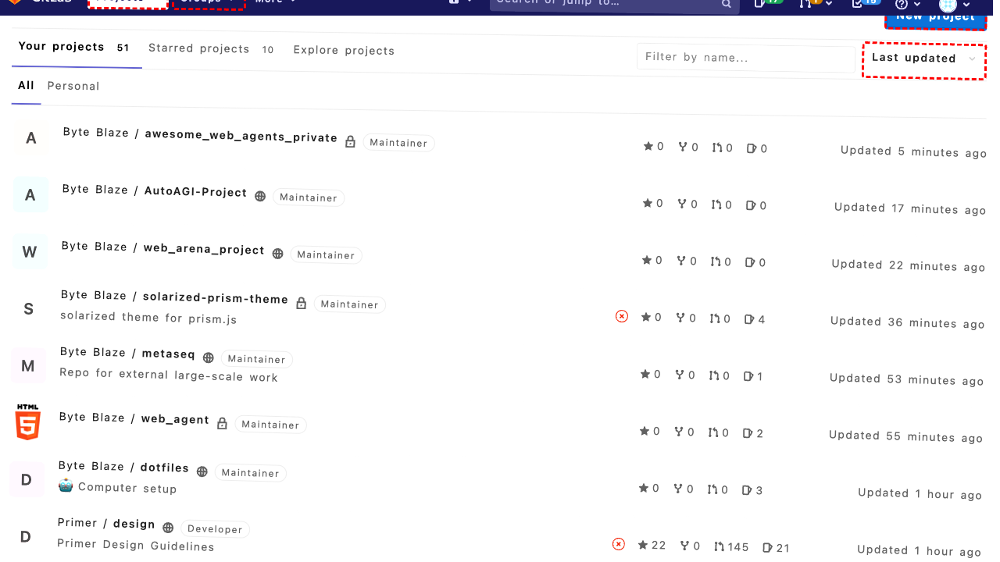
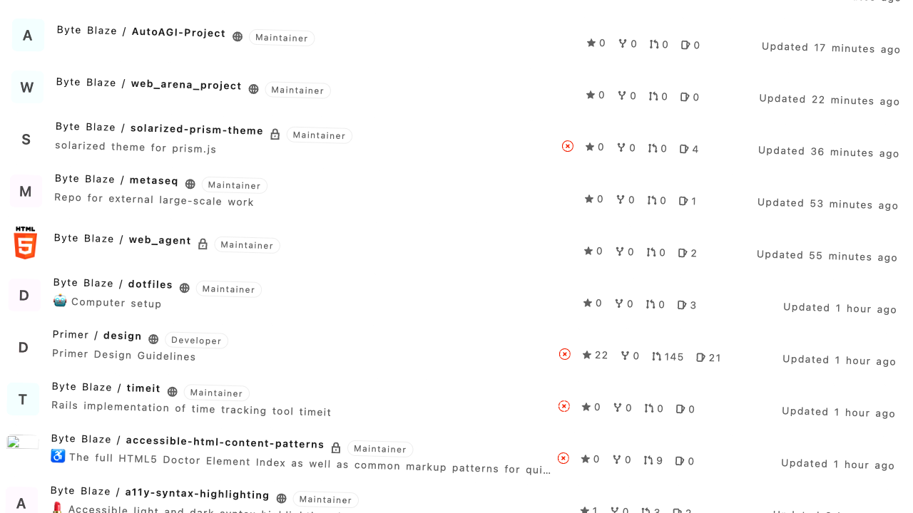
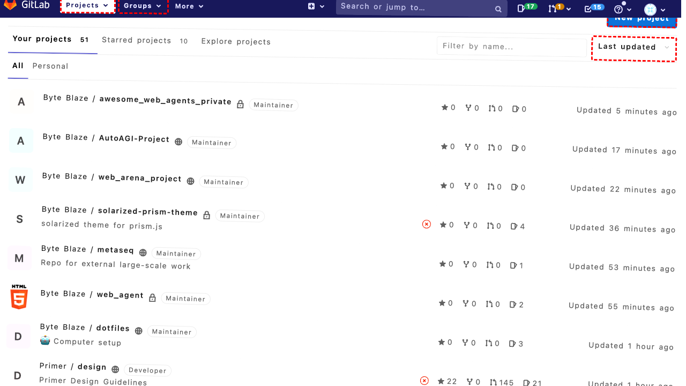
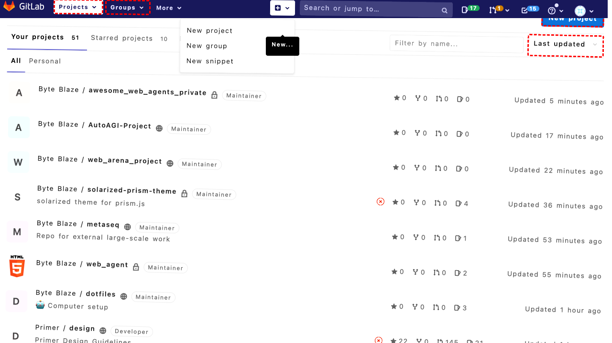
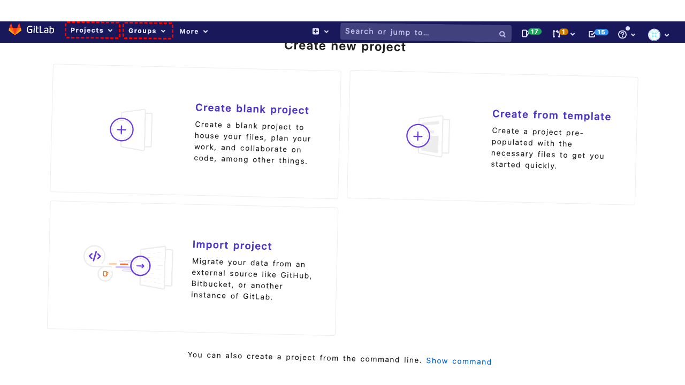
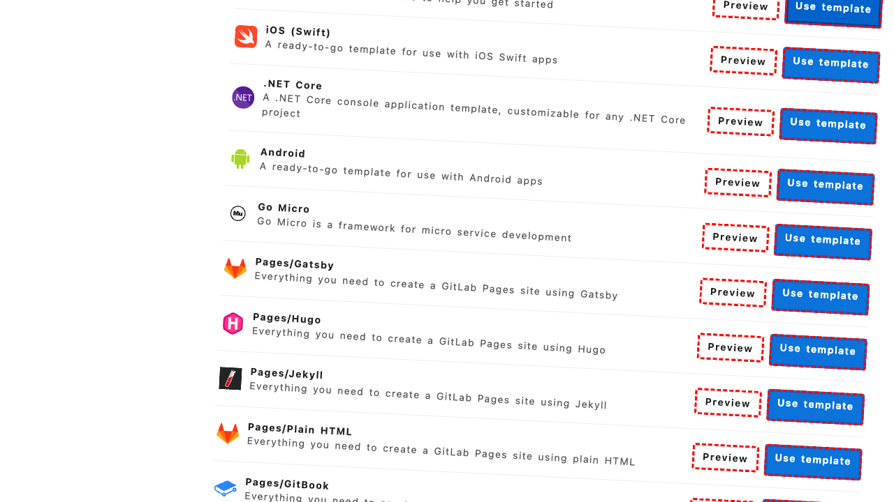
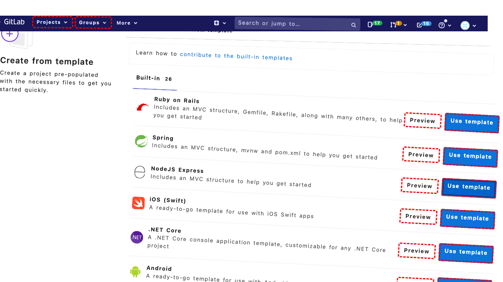

## Intent

Start a private project project_site with NodeJS template and add primer, convexegg, vinta as members

## RM

Thoughts: The user's intent is to start a private project named "project_site" using the NodeJS template and add specific members (primer, convexegg, vinta). The action history shows the agent clicked various elements, including selecting the NodeJS template, but the final state indicates the agent did not successfully proceed to project configuration or member addition—it is still looking for a "Next" or "Continue" button. There is no evidence in the action history or final state that the project was created, set as private, or that the specified members were added. The bot also provided no response to the user, which is problematic for task completion. Since this is a content modification task (creating and configuring a project), the agent's actions did not achieve the intended outcome.

Status: failure

## Final Response 

## Captions

===============Looking at the current page, I can see I'm on the GitLab Projects dashboard. To accomplish the goal of creating a private project with NodeJS template and adding members, I need to first click the "New project" button that's visible in the accessibility tree.

The "New project" link has bid 270 according to the accessibility tree. This should take me to the project creation page where I can specify the project details including making it private and selecting the NodeJS template.
===============Looking at the error message, I can see that the click on "New project" (bid 270) failed because another element (bid 225) was intercepting pointer events. This appears to be a dropdown menu or overlay that's blocking the click.

Let me try a different approach. I'll scroll down slightly to potentially move away from any interfering elements, then try clicking the "New project" button again.
===============Looking at the error message, it seems there's still an element intercepting the click on the "New project" button. Let me try a different approach. I'll first click on a different area of the page to potentially dismiss any overlays or dropdowns, then try clicking "New project" again. I'll click on the main heading "Projects" which should be a safe area to click.
===============Looking at the error messages, it seems there's a persistent issue with the header element (bid 51) intercepting clicks on the "New project" button. The header appears to be creating an overlay that's blocking interactions with the main content area.

Let me try a different approach. I'll use the keyboard navigation to access the "New project" functionality. I can see there's a "New..." link in the header navigation (bid 138) that might provide access to project creation. This could be an alternative way to create a new project without dealing with the overlay issue.
===============Looking at the current situation, I can see that clicking the "New..." dropdown (bid 138) was successful, and now I need to select "New project" from the dropdown menu that appears. The accessibility tree shows that after clicking "New..." (which is expanded), there's a list with options including "New project" (bid 144). This should take me to the project creation page where I can specify the project details.
===============Looking at the current state, I can see that I successfully clicked the "New..." dropdown (bid 138) and then clicked "New project" (bid 144), which should have taken me to the project creation page. The current accessibility tree shows I'm now on the "New Project · GitLab" page with three main options: "Create blank project", "Create from template", and "Import project".

Since my goal is to create a project with a NodeJS template, I need to click the "Create from template" option (bid 285) to access the template selection where I can find the NodeJS template.
===============Looking at the current state, I can see I'm on the "Create from template" page where various project templates are listed. I can see the "NodeJS Express" template in the list (with radio button bid 443). To select this template, I need to click the radio button associated with it.
===============Looking at the error message, I can see that the radio button for the NodeJS Express template (bid 443) is being intercepted by its label element (bid 444). This is a common issue where the label covers the actual radio input.

Instead of clicking the radio button directly, I should click the label element (bid 444) which is associated with the "Use template" text for the NodeJS Express template. This should select the template without the interception issue.
===============Looking at the current state, I successfully selected the NodeJS Express template by clicking the label (bid 444). Now I need to proceed to the next step of project creation where I can specify the project name as "project_site" and set it as private. The accessibility tree doesn't show the typical project creation form yet, so I likely need to click a "Next" or "Continue" button to proceed to the project configuration page where I can set the project name and visibility.

Let me look for a "Next" button or similar navigation element to proceed with the template selection. Based on typical GitLab workflow, after selecting a template, there should be a button to continue to project configuration.
===============Looking at the current situation, I successfully selected the NodeJS Express template, but clicking bid "1000" (which appears to be a navigation list item) didn't progress to the project configuration. I need to find the actual "Next" or "Continue" button that should appear after template selection.

Let me look for a button that says "Next" or "Continue" or similar. Since the accessibility tree doesn't show such a button clearly, I'll try clicking the "Use template" text/label again, as sometimes this action triggers the next step in the workflow.

## Images












## Main Prompt

```md
User Intent: Start a private project project_site with NodeJS template and add primer, convexegg, vinta as members

Action History:
1: click("270")
2: scroll(0, 200)
3: click("270")
4: click("268")
5: click("270")
6: click("138")
7: click("144")
8: click("285")
9: click("443")
10: click("444")
11: click("1000")
12: click("444")


The detailed final state of the webpage:

```md
Looking at the current situation, I successfully selected the NodeJS Express template, but clicking bid "1000" (which appears to be a navigation list item) didn't progress to the project configuration. I need to find the actual "Next" or "Continue" button that should appear after template selection.

Let me look for a button that says "Next" or "Continue" or similar. Since the accessibility tree doesn't show such a button clearly, I'll try clicking the "Use template" text/label again, as sometimes this action triggers the next step in the workflow.
```

Bot response to the user: None.
```
