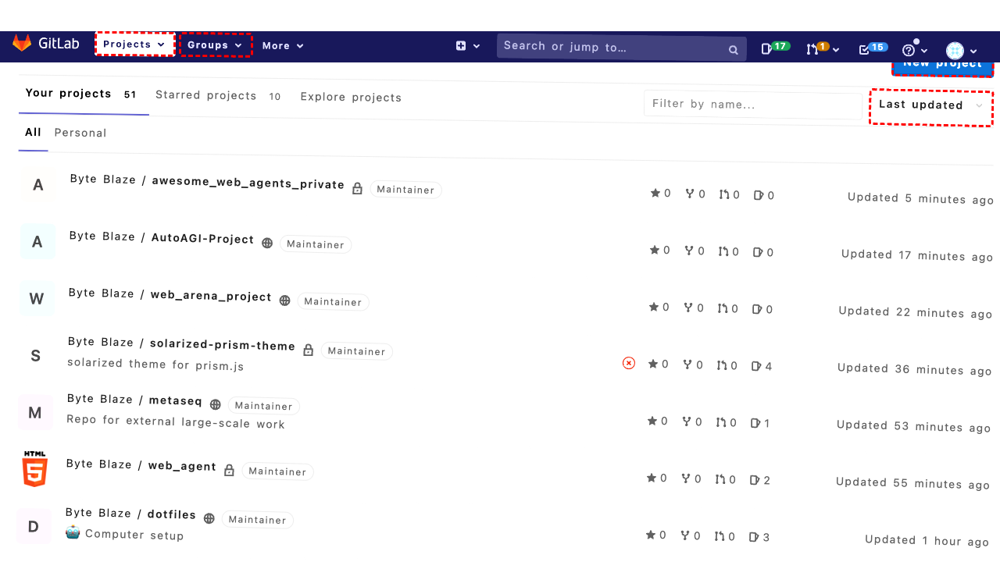
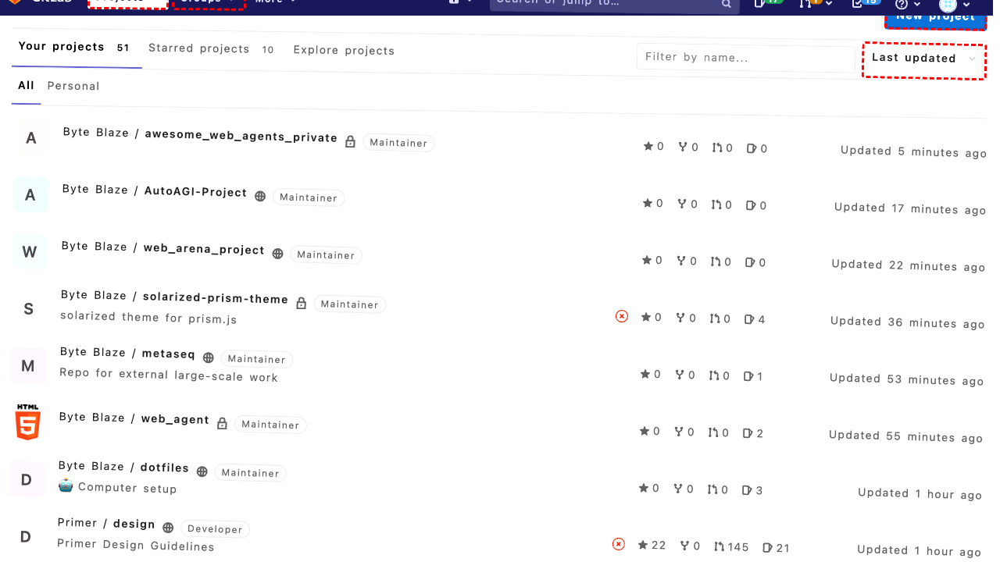
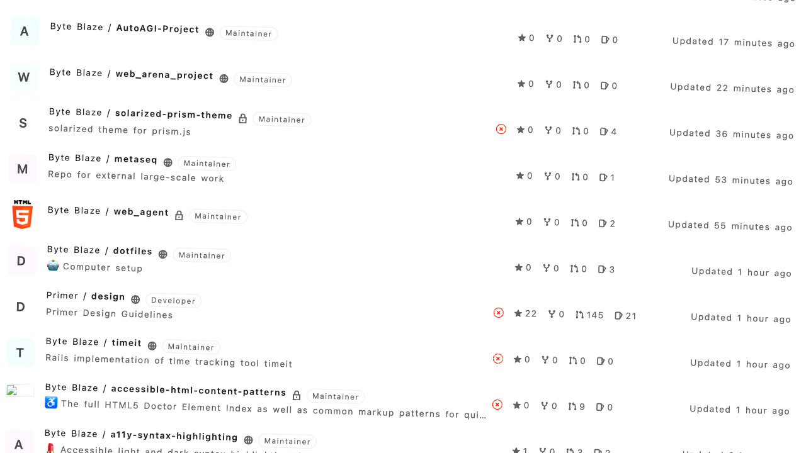
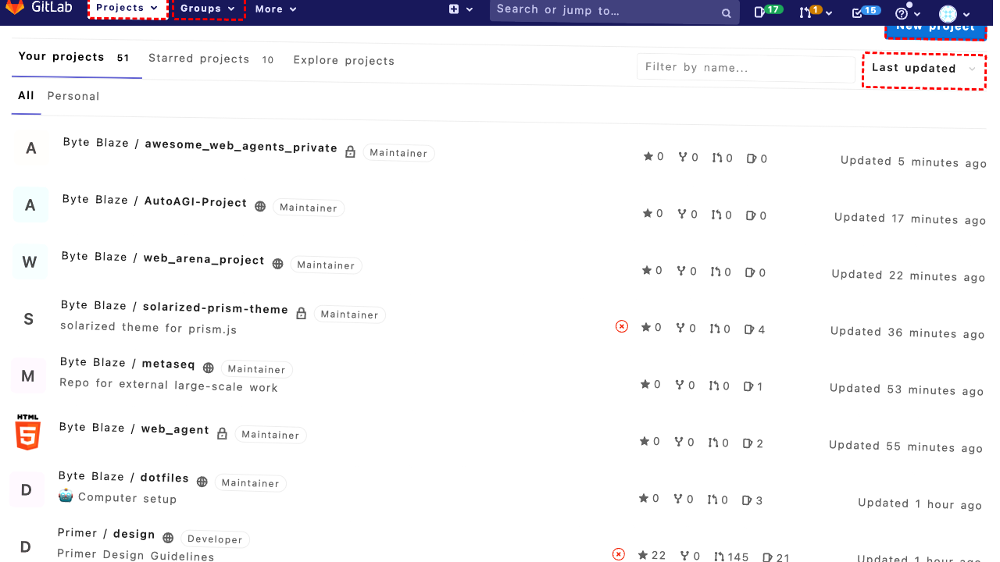
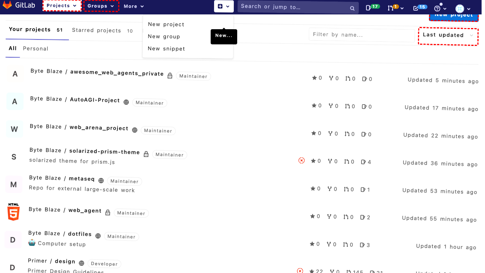
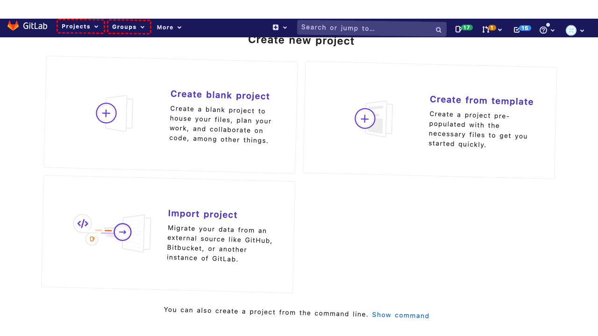
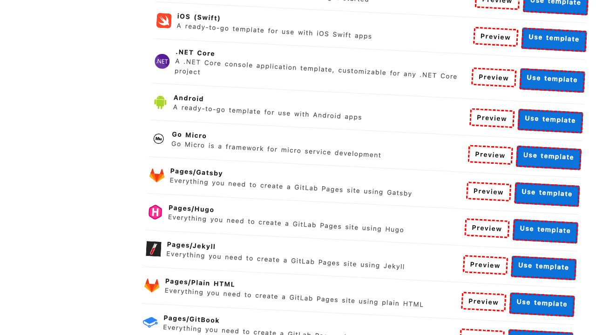
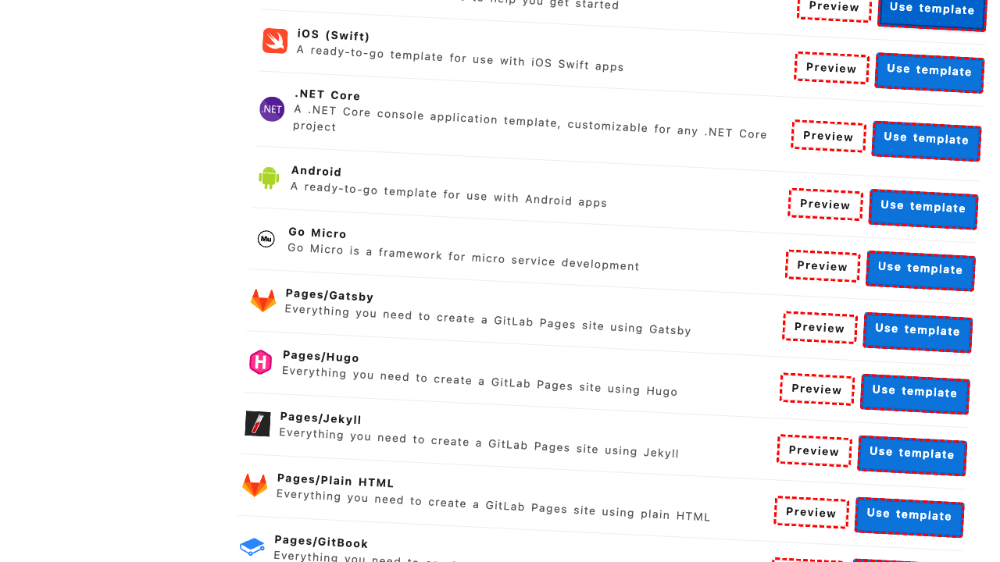
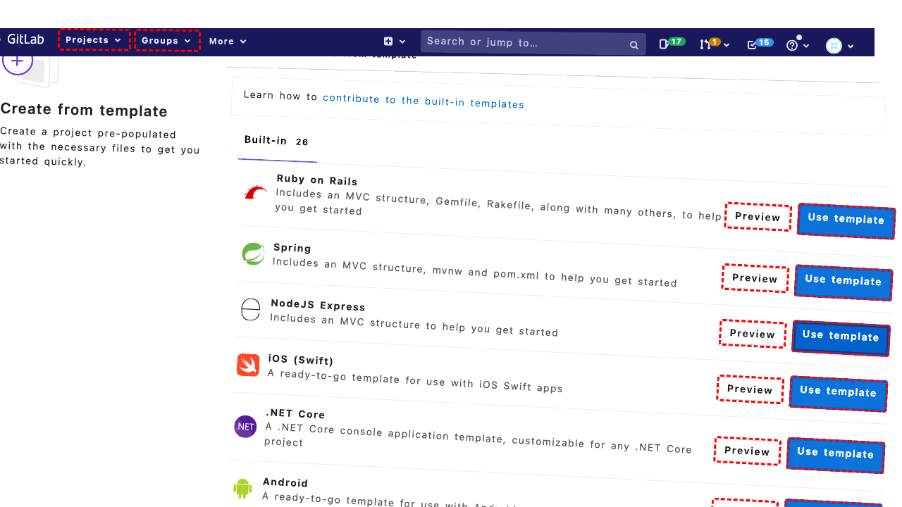

## Intent

Create a private HTML repository called "web_agent_index" using the right template to speed up development.

## RM

Thoughts: The user's intent is to create a private HTML repository called "web_agent_index" using the right template, which falls under the "Content modification" task type. The action history shows the agent clicked several elements (likely to navigate to the repository creation page and select the "Pages/Plain HTML" template), filled the project name as "web_agent_index", and scrolled multiple times. However, the final state of the webpage indicates that the project configuration form (including the project name field) is still not visible, and the agent encountered an error that the element exists but is not in the viewport. The agent did not complete the form submission or finalize the repository creation, and the bot provided no response. Since the task is content modification, I must examine the action history and final state: the repository was not successfully created due to the form not being fully accessible and no confirmation of creation in the final state.

Status: failure

## Final Response 

## Captions

===============Looking at the current page, I can see I'm on the GitLab dashboard with a list of projects. To create a private HTML repository called "web_agent_index" using a template, I need to:

1. First click on the "New project" link to start the repository creation process
2. Then select a template to speed up development

I can see the "New project" link is available with bid '224' in the accessibility tree. This will take me to the project creation page where I can choose a template.
===============The error indicates that the "New project" button is being intercepted by another element (the profile dropdown). I need to try a different approach. Looking at the accessibility tree, I can see there's also a "New..." dropdown in the left navigation with bid '125' that contains a "New project" option. Let me try using that instead.
===============Looking at the current situation, I can see that clicking the "New..." dropdown (bid '125') was successful since it's now expanded (expanded=True in the accessibility tree). The dropdown now shows options including "New project" (bid '131'), "New group" (bid '133'), and "New snippet" (bid '135').

Since my goal is to create a private HTML repository called "web_agent_index" using a template, I should now click on the "New project" option from this dropdown menu. This will take me to the project creation page where I can select a template and configure the repository settings.
===============Looking at the current page, I can see I'm now on the "New Project" page with three tabs: "Blank project", "Create from template", and "Import project". My goal is to create a private HTML repository called "web_agent_index" using a template to speed up development.

Since I want to use a template, I should click on the "Create from template" tab (bid '243') rather than the default "Blank project" tab. This will show me available templates that I can use for the HTML repository.
===============Looking at the current page, I can see I'm on the "Create from template" tab which shows various project templates. My goal is to create a private HTML repository called "web_agent_index".

I can see several HTML-related templates available:
- "Pages/Plain HTML" (bid '441') - which is described as "Everything you need to create a GitLab Pages site using plain HTML"
- "Pages/Hugo" (bid '417')
- "Pages/Jekyll" (bid '429')
- And others

Since I need a plain HTML repository, the "Pages/Plain HTML" template (bid '441') is the most appropriate choice. I should click on the "Use template" radio button associated with this template to select it.
===============Looking at the error, I can see that the radio button (bid '442') is being intercepted by its label element (bid '443'). The label is covering the radio button and intercepting pointer events.

To work around this, I should click on the label element instead of the radio button itself. The label is associated with the radio button and clicking it should still select the "Pages/Plain HTML" template. The label has bid '443' and contains the text "Use template".
===============Looking at the current state, I can see that I successfully selected the "Pages/Plain HTML" template by clicking the label (bid '443'). Now I need to proceed with creating the project using this template.

The next step should be to click the button that creates the project from the selected template. Looking at the accessibility tree, I can see there should be a "Create project" or similar button that appears after selecting a template. However, I don't see it in the current view, which suggests I may need to scroll down to find it.

Let me first scroll down to reveal any hidden form elements or buttons that might be below the current viewport.
===============Looking at the current state, I can see that I've successfully selected the "Pages/Plain HTML" template and scrolled down. Now I need to fill in the project name and create the repository.

I can see in the accessibility tree that after template selection, there should be a form to configure the project. I need to:
1. Fill in the project name field with "web_agent_index"
2. Ensure the repository is set to private
3. Click the create project button

Let me first look for the project name input field. Based on the template structure, there should be a field to enter the project name. I'll try to find and fill it.
===============Looking at the error, it seems the project name field (bid '543') is not currently visible in the viewport. Since I successfully selected the template but the form fields aren't visible, I need to scroll further down to reveal the project configuration form that appears after template selection.

The error indicates the element exists but isn't visible, so I should scroll more to bring the form into view. Let me scroll further down to find the project name field and other configuration options.
===============Looking at the current situation, I've successfully selected the "Pages/Plain HTML" template and scrolled down, but the project configuration form (including the project name field) is still not visible. The error indicates the element exists but isn't in the viewport, so I need to continue scrolling to reveal the form where I can enter the project name and configure the repository settings.

Let me scroll further down to bring the project creation form into view.

## Images












## Main Prompt

```md
User Intent: Create a private HTML repository called "web_agent_index" using the right template to speed up development.

Action History:
1: click("224")
2: click("125")
3: click("131")
4: click("243")
5: click("442")
6: click("443")
7: scroll(0, 300)
8: fill("543", "web_agent_index")
9: scroll(0, 500)
10: scroll(0, 800)


The detailed final state of the webpage:

```md
Looking at the current situation, I've successfully selected the "Pages/Plain HTML" template and scrolled down, but the project configuration form (including the project name field) is still not visible. The error indicates the element exists but isn't in the viewport, so I need to continue scrolling to reveal the form where I can enter the project name and configure the repository settings.

Let me scroll further down to bring the project creation form into view.
```

Bot response to the user: None.
```
