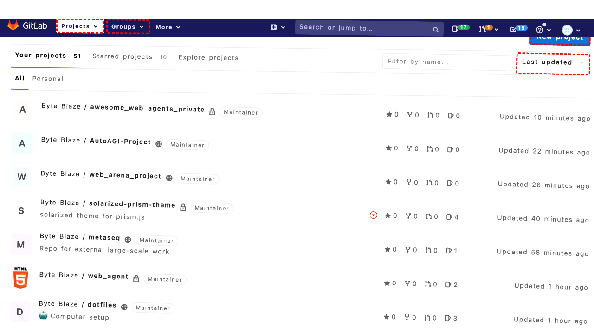
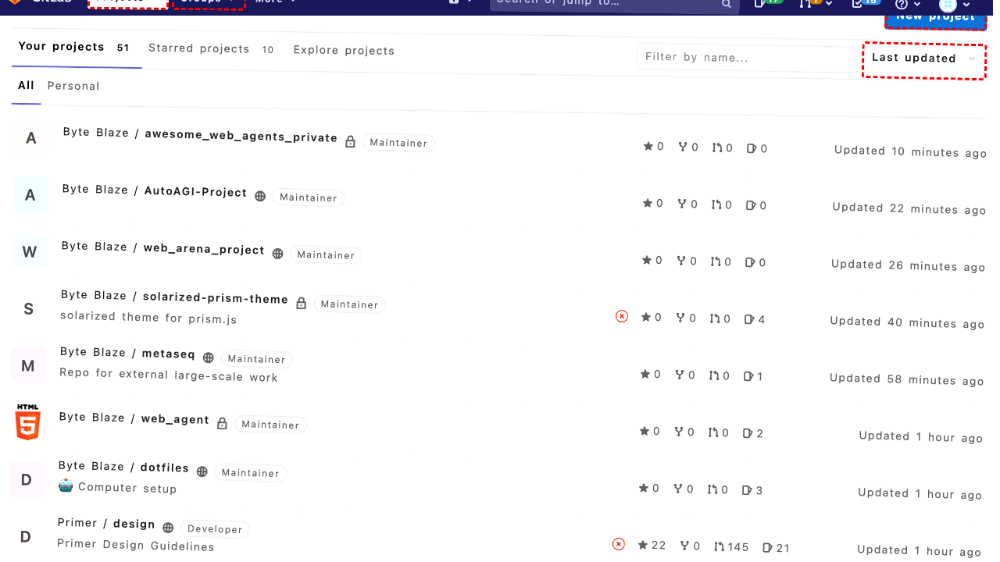
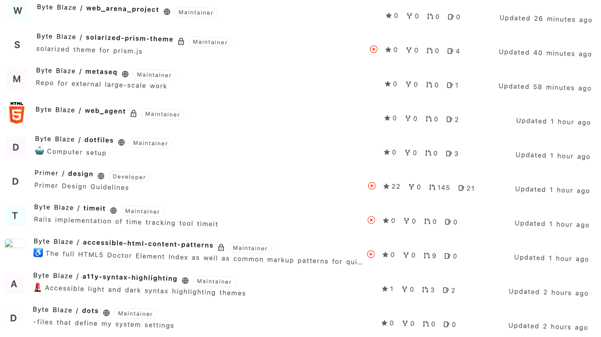
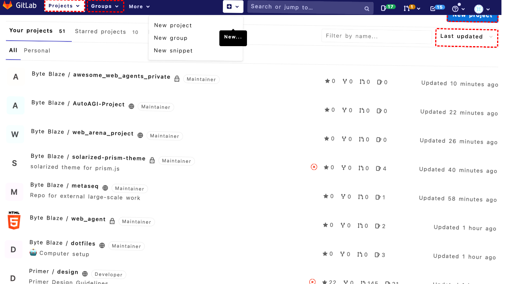
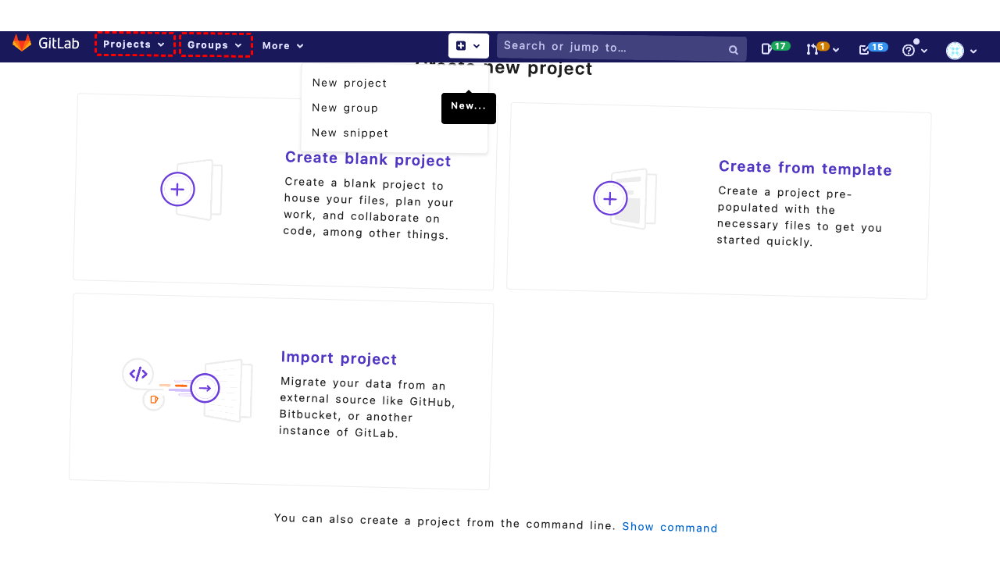
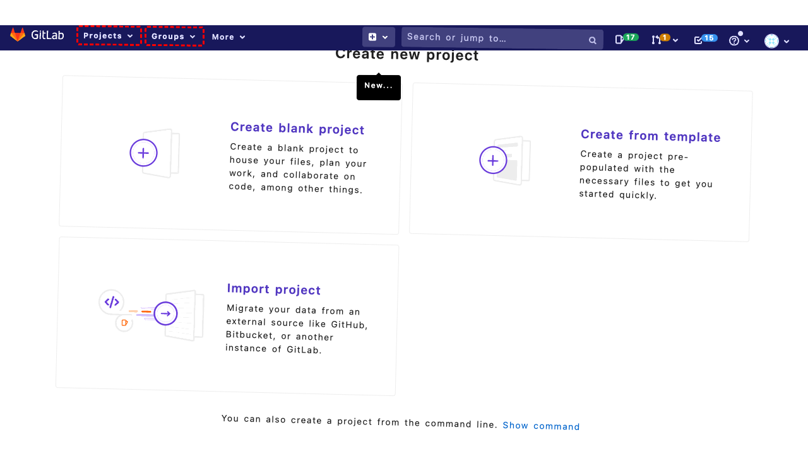
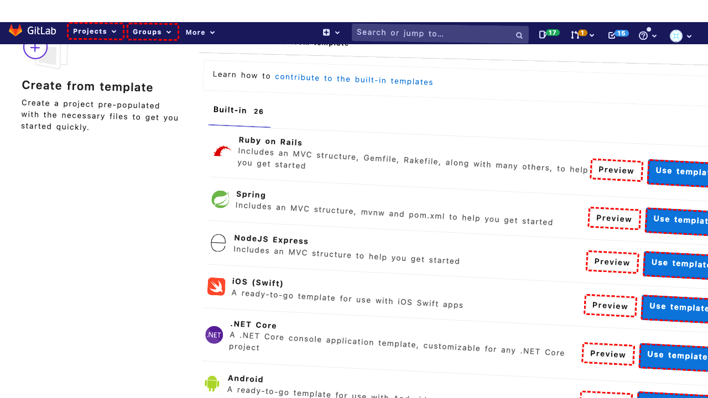
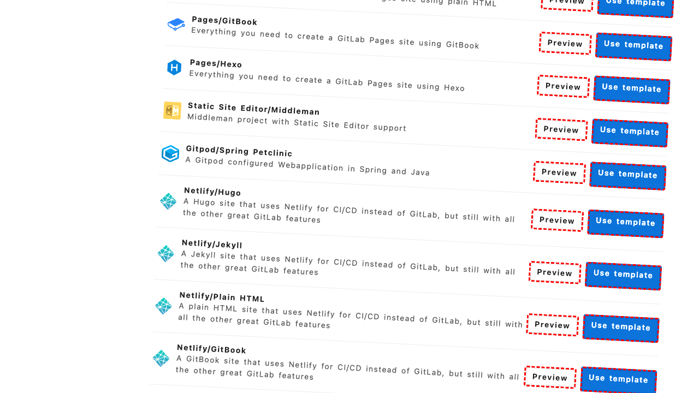

## Intent

Create a private JEKYLL repository called "11711_gitlab" using the right template to speed up development.

## RM

Thoughts: The user's intent is to create a private Jekyll repository called "11711_gitlab" using the right template. The action history shows the agent selected a template (likely Jekyll, based on the final state description), scrolled, and filled the project name field. However, the final state indicates the agent is still in the process of trying to fill the project name field and has not completed the creation (e.g., no submit action, no confirmation of repository creation). The bot response is "None," and the final state does not confirm the repository was successfully created. Since this is a content modification task (creating a repository), the agent's actions are insufficient to confirm success, as the repository creation is not finalized.

Status: failure

## Final Response 

## Captions

===============Looking at the current page, I can see we're on the GitLab dashboard with a "New project" link available. The goal is to create a private Jekyll repository called "11711_gitlab" using a template to speed up development.

I need to:
1. Click the "New project" link to start creating a repository
2. Look for template options (likely Jekyll-related templates)
3. Create the repository with the specified name

The "New project" link is clearly visible in the accessibility tree with bid '224'.
===============The error indicates that the "New project" link is being intercepted by another element (likely the profile dropdown). Let me try a different approach by using the "New..." dropdown in the left navigation, which should also lead to project creation.

Looking at the accessibility tree, I can see there's a "New..." link with bid '125' in the left navigation panel. This should provide access to project creation options.
===============Looking at the current situation, I can see that clicking the "New..." dropdown (bid '125') should reveal project creation options. The accessibility tree shows that this dropdown is expanded and contains a "New project" option with bid '131'. Since the goal is to create a Jekyll repository using a template, I should click "New project" to proceed to the project creation page where template options will be available.
===============Looking at the current state, I can see we're on the "New project" page with three tabs available: "Blank project", "Create from template", and "Import project". The goal is to create a Jekyll repository using a template, so I need to switch to the "Create from template" tab. The accessibility tree shows this tab has bid '243'.
===============Looking at the current page state, I can see we're on the "Create from template" tab which is focused and selected. The accessibility tree shows various template options including "Pages/Jekyll" with a radio button for "Use template" (bid '430'). Since the goal is to create a private Jekyll repository called "11711_gitlab", I need to select the Jekyll template and then proceed to configure the project.

The "Pages/Jekyll" template appears to be exactly what we need - it states "Everything you need to create a GitLab Pages site using Jekyll." I should click the "Use template" radio button for this template.
===============Looking at the error message, I can see that the radio button with bid '430' is being intercepted by its label element with bid '431'. The error indicates that the label is intercepting pointer events, preventing direct clicking on the radio button.

Since the label is associated with the radio button, I can click the label instead to select the Jekyll template. The label has bid '431' and contains the text "Use template" for the Pages/Jekyll template.
===============Looking at the current state, I can see that I successfully clicked the "Use template" label for the Pages/Jekyll template. Now I need to proceed with creating the project with the specified name "11711_gitlab".

The next step should be to fill in the project name field and create the repository. Based on the template creation flow, after selecting a template, there should be a project name input field and a "Create project" button. I need to locate these elements to complete the repository creation.

Let me look for the project name input field and create button in the current page context.
===============Looking at the error, it seems the element with bid '543' (project name field) is not currently visible on the page. This suggests that after selecting the Jekyll template, we may need to scroll down to see the project configuration form, or there might be an intermediate step.

Let me scroll down to reveal more of the page content, as the project name field might be located further down the page after the template selection area.
===============Looking at the current situation, I can see that after selecting the Jekyll template by clicking the "Use template" label, I need to scroll to find the project configuration form. The scroll action should reveal more of the page content where the project name field and create button are likely located.

After scrolling, I should be able to see the project name input field where I can enter "11711_gitlab" and then proceed to create the project.
===============Looking at the current situation, I've successfully selected the Jekyll template by clicking the "Use template" label, and I've scrolled down to reveal more of the page. Now I need to find and fill the project name field with "11711_gitlab".

Based on the template creation flow, after selecting a template and scrolling, the project configuration form should become visible. Let me try filling the project name field again, as it should now be visible after the scroll actions.

## Images












## Main Prompt

```md
User Intent: Create a private JEKYLL repository called "11711_gitlab" using the right template to speed up development.

Action History:
1: click("224")
2: click("125")
3: click("131")
4: click("243")
5: click("430")
6: click("431")
7: fill("543", "11711_gitlab")
8: scroll(0, 300)
9: scroll(0, 400)
10: fill("543", "11711_gitlab")


The detailed final state of the webpage:

```md
Looking at the current situation, I've successfully selected the Jekyll template by clicking the "Use template" label, and I've scrolled down to reveal more of the page. Now I need to find and fill the project name field with "11711_gitlab".

Based on the template creation flow, after selecting a template and scrolling, the project configuration form should become visible. Let me try filling the project name field again, as it should now be visible after the scroll actions.
```

Bot response to the user: None.
```
