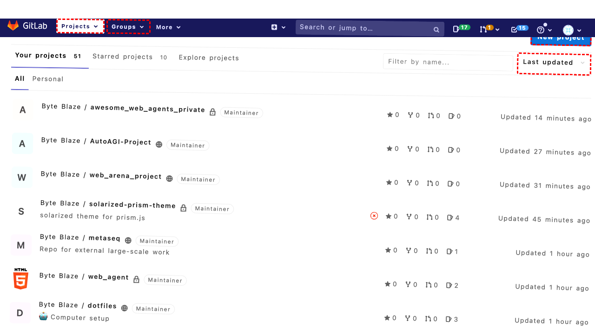
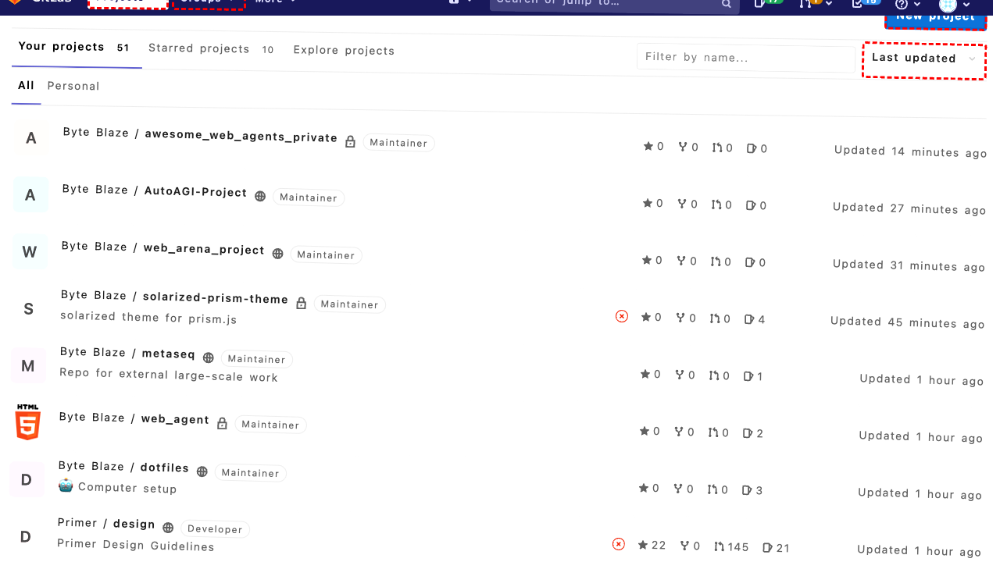
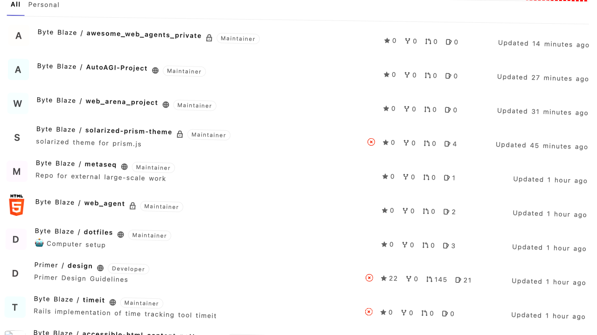
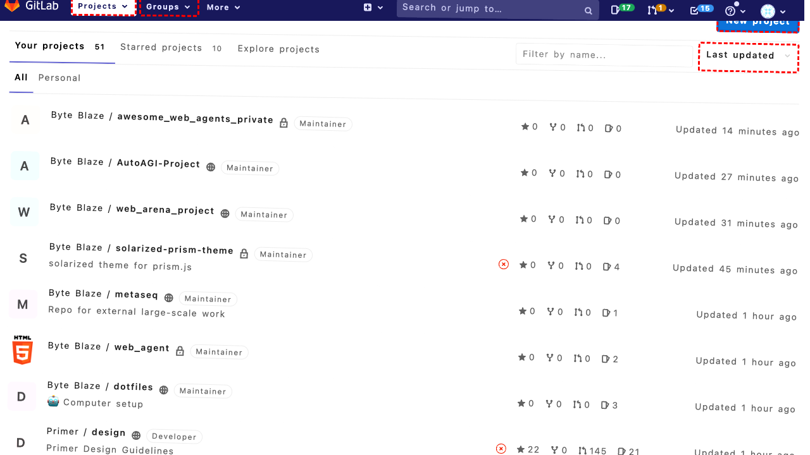
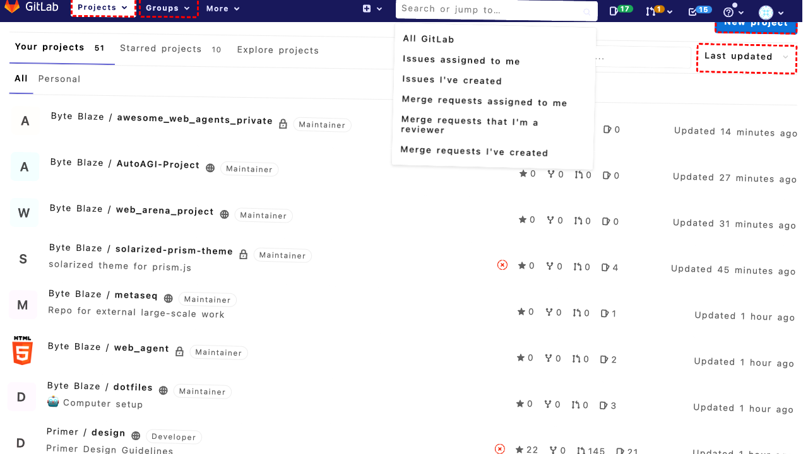

## Intent

Add the following users to repo kkroening/ffmpeg-python as maintainer: ['yjlou', 'a11yproject']

## RM

Thoughts: The user's intent is to add users as maintainers to a specific repository, which falls under the "Content modification" task type. The agent's action history shows that it attempted to search for the repository "kkroening/ffmpeg-python" but found no results in the GitLab instance, leading to a report of infeasibility. The final state confirms the repository does not exist, making it impossible to proceed with the modification. Since the task cannot be completed due to the repository not being found, the execution is a failure.

Status: failure

## Final Response 

## Captions

===============Looking at the current page, I can see I'm on the GitLab dashboard showing a list of projects. The goal is to add users 'yjlou' and 'a11yproject' as maintainers to the repo 'kkroening/ffmpeg-python'.

First, I need to find and navigate to the specific repository. I can see there's a search box available that would help me find this repository quickly. The search box has ID '143' according to the accessibility tree.

Let me search for the repository first.<｜end▁of▁thinking｜>I need to search for the repository "kkroening/ffmpeg-python" first to navigate to its page, then I can access the member management settings to add users as maintainers.
===============Looking at the current state, I just clicked on the search box (ID '143'). Now I need to type the repository name to search for it. The repository I'm looking for is "kkroening/ffmpeg-python".
===============I've filled the search box with the repository name. Now I need to execute the search by pressing Enter to find and navigate to the repository page.
===============Looking at the current state, I've executed a search for "kkroening/ffmpeg-python" but the accessibility tree shows that the search returned no results - it says "We couldn't find any results matching kkroening/ffmpeg-python". This suggests the repository might not exist in this GitLab instance or there might be a different name.

Let me check if there are any other search scopes or filters I can adjust. I can see there are scope options like Projects, Issues, Merge requests, etc. in the search results. Let me try clicking on the "Projects" scope to see if that helps find the repository.
===============Looking at the current situation, my search for "kkroening/ffmpeg-python" returned no results. I clicked on the "Projects" scope (ID '256') to filter the search to only show projects, but the accessibility tree still shows "We couldn't find any results matching kkroening/ffmpeg-python". This indicates that the repository doesn't exist in this GitLab instance.

Since the repository cannot be found, I cannot proceed with adding users to it. I should report this issue to the user.

## Images







## Main Prompt

```md
User Intent: Add the following users to repo kkroening/ffmpeg-python as maintainer: ['yjlou', 'a11yproject']

Action History:
1: click('143')
2: fill('143', 'kkroening/ffmpeg-python')
3: keyboard_press('Enter')
4: click('256')
5: report_infeasible("The repository 'kkroening/ffmpeg-python' could not be found in this GitLab instance. The search returned no results even when filtered to projects only.")


The detailed final state of the webpage:

```md
Looking at the current situation, my search for "kkroening/ffmpeg-python" returned no results. I clicked on the "Projects" scope (ID '256') to filter the search to only show projects, but the accessibility tree still shows "We couldn't find any results matching kkroening/ffmpeg-python". This indicates that the repository doesn't exist in this GitLab instance.

Since the repository cannot be found, I cannot proceed with adding users to it. I should report this issue to the user.
```

Bot response to the user: None.
```
