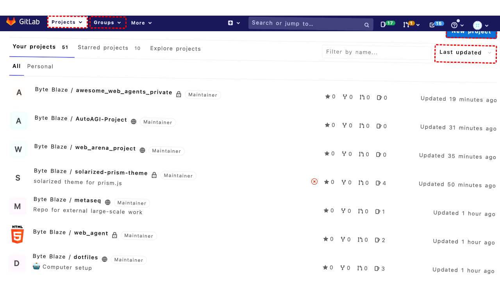
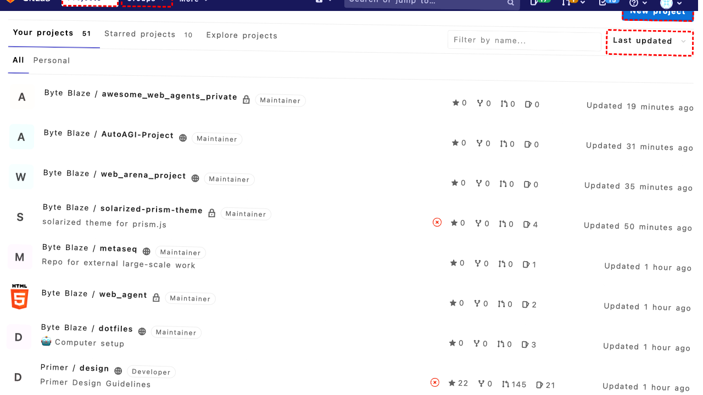
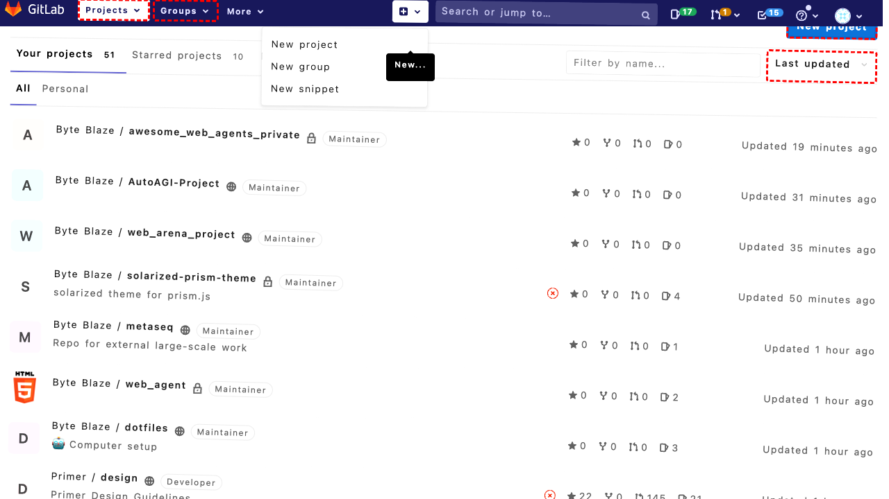
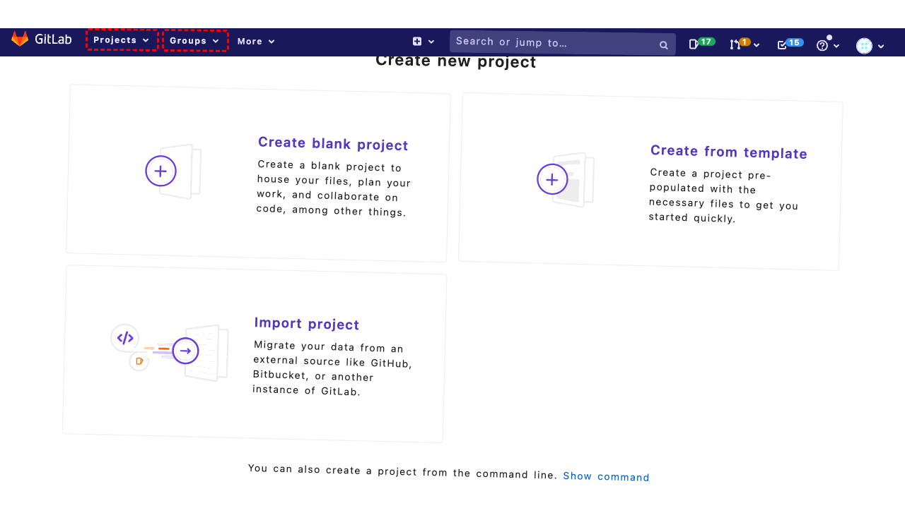
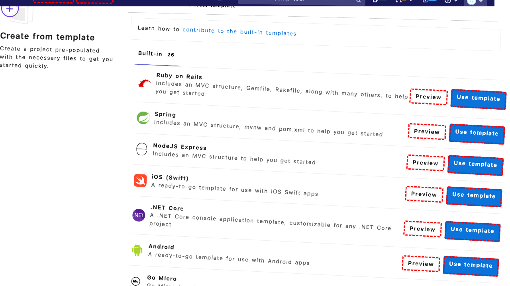
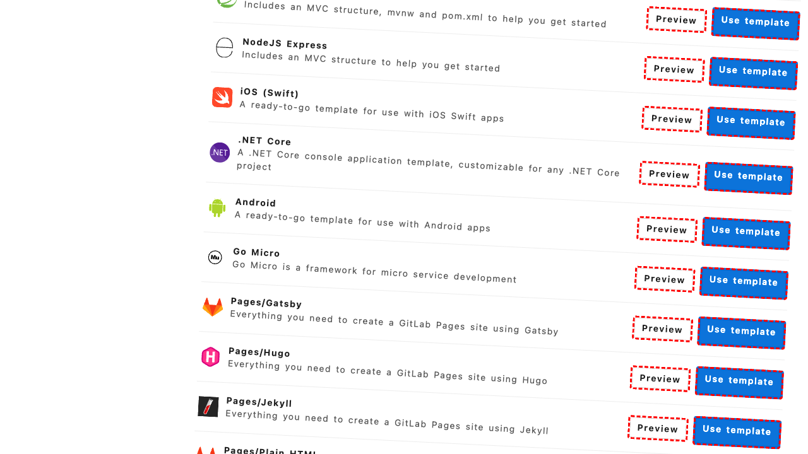
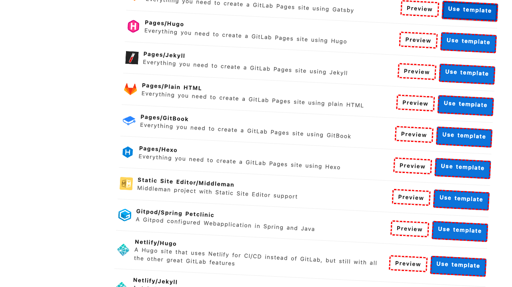
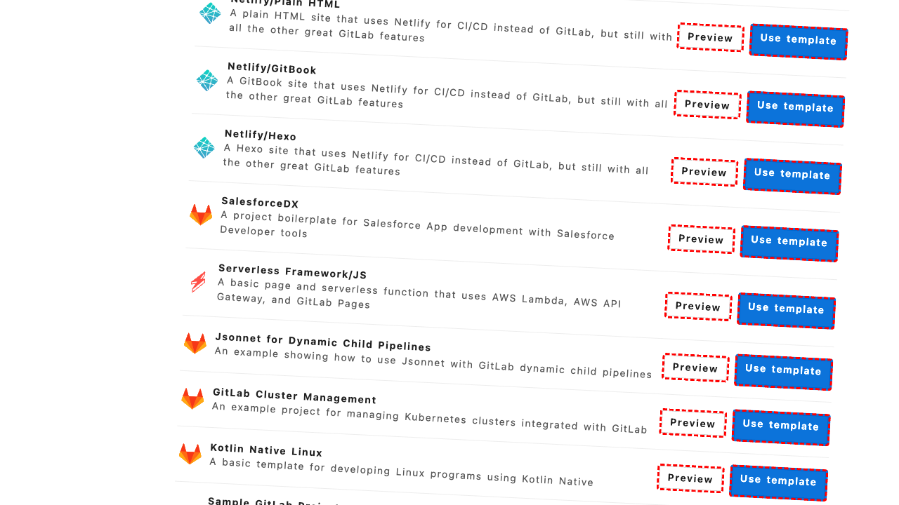

## Intent

Create a private blank repository called "web_agent" using the right template to speed up development.

## RM

Thoughts: The user's intent is to create a private blank repository called "web_agent" using a specific template. The action history shows the agent clicked on a template ("Pages/Plain HTML") but did not proceed to the configuration page to set the repository name or privacy settings. The final state indicates the agent is still on the template selection page and has not reached the step to input the repository name or set it as private. Therefore, the task is incomplete and unsuccessful.

Status: failure

## Final Response 

## Captions

===============Looking at the current page, I can see I'm on the GitLab dashboard in the Projects section. I need to create a new private repository called "web_agent" using a template. I can see there's a "New project" link available on the page, which is likely where I need to start.

The "New project" link has bid 270, so I'll click that to begin the repository creation process.
===============Looking at the error message, I can see that the click on "New project" (bid 270) failed because another element (bid 225) was intercepting pointer events. This suggests there might be an overlapping element or dropdown menu that's blocking the click.

Let me try a different approach. I notice there's also a "New..." link in the top navigation bar with bid 138. This might be an alternative way to access the project creation functionality.
===============Looking at the current situation, I can see that clicking the "New..." link (bid 138) was successful since there's no error message. The accessibility tree shows that this link is expanded and has a dropdown menu with options including "New project" (bid 144). This is exactly what I need to create the repository.

Now I should click on the "New project" option from this dropdown menu to proceed with creating the new repository.
===============Looking at the current page state, I can see I'm now on the "Create new project" page with three options: "Create blank project", "Create from template", and "Import project". My goal is to create a private blank repository called "web_agent" using a template to speed up development.

The "Create from template" option (bid 285) is exactly what I need since it mentions creating a project "pre-populated with the necessary files to get you started quickly." This aligns with using a template to speed up development.
===============Looking at the current page, I can see I'm on the "Create from template" page with many template options available. The goal is to create a private blank repository called "web_agent" using a template. Since this is the template selection page, I need to choose an appropriate template first before proceeding to configure the repository details.

I notice there are various templates available including web-related ones like "Pages/Gatsby", "Pages/Hugo", "Pages/Jekyll", etc. For a "web_agent" project, a basic web template would be appropriate. The "Pages/Plain HTML" template seems like a good starting point as it provides the minimal structure needed for a web project without being too opinionated.

I'll select the "Pages/Plain HTML" template by clicking its "Use template" radio button.
===============Looking at the error, I can see that the radio button (bid 539) is being intercepted by its label element (bid 540). This is a common issue where the label covers the actual radio input. Instead of clicking the radio button directly, I should click the label element that says "Use template" for the "Pages/Plain HTML" template, which has bid 540.
===============Looking at the current state, I can see that I successfully selected the "Pages/Plain HTML" template by clicking its "Use template" label (bid 540). Now I need to proceed to the next step where I can configure the repository details, including setting the name to "web_agent" and making it private.

The page doesn't show an obvious "Next" or "Continue" button in the accessibility tree, but typically after selecting a template, there should be a way to proceed to the project configuration. Let me look for a button that might say "Create project" or similar that would take me to the next step where I can set the repository name and privacy settings.
===============Looking at the error, I can see that clicking "New project" (bid 1002) failed because it's being intercepted by the navbar header. This suggests that the "New project" link I clicked is actually in the navigation breadcrumbs, not the main action button I need.

Let me re-examine the accessibility tree. I can see I'm on the "Create from template" page and I've successfully selected the "Pages/Plain HTML" template. Now I need to find the actual "Create project" or "Next" button that will take me to the configuration page where I can set the repository name to "web_agent" and make it private.

Looking through the tree, I notice there are radio buttons for each template with "Use template" labels, but no obvious "Create" or "Continue" button visible in the current accessibility tree. This might mean I need to scroll down to find the action button, or the button might appear after template selection.

Let me try scrolling down to see if there's a "Create project" button below the template list.
===============Looking at the current situation, I successfully selected the "Pages/Plain HTML" template by clicking its "Use template" label. Now I need to proceed to the project configuration page where I can set the repository name to "web_agent" and configure it as private.

After scrolling, I should look for a "Create project" or "Next" button that typically appears after template selection. The accessibility tree shows various template options but no clear action button yet. Let me continue scrolling to find the button that will take me to the next step.
===============Looking at the current situation, I've successfully selected the "Pages/Plain HTML" template by clicking its "Use template" label. However, I haven't yet found the button to proceed to the project configuration page where I can set the repository name to "web_agent" and make it private.

The accessibility tree shows I'm still on the template selection page with many template options listed. After selecting a template, there should typically be a "Create project" or "Next" button that appears, but it's not visible in the current view. Since I've already scrolled down twice, let me try scrolling further to see if the action button is located further down the page.

## Images











## Main Prompt

```md
User Intent: Create a private blank repository called "web_agent" using the right template to speed up development.

Action History:
1: click("270")
2: click("138")
3: click("144")
4: click("285")
5: click("539")
6: click("540")
7: click("1002")
8: scroll(0, 300)
9: scroll(0, 500)
10: scroll(0, 800)


The detailed final state of the webpage:

```md
Looking at the current situation, I've successfully selected the "Pages/Plain HTML" template by clicking its "Use template" label. However, I haven't yet found the button to proceed to the project configuration page where I can set the repository name to "web_agent" and make it private.

The accessibility tree shows I'm still on the template selection page with many template options listed. After selecting a template, there should typically be a "Create project" or "Next" button that appears, but it's not visible in the current view. Since I've already scrolled down twice, let me try scrolling further to see if the action button is located further down the page.
```

Bot response to the user: None.
```
