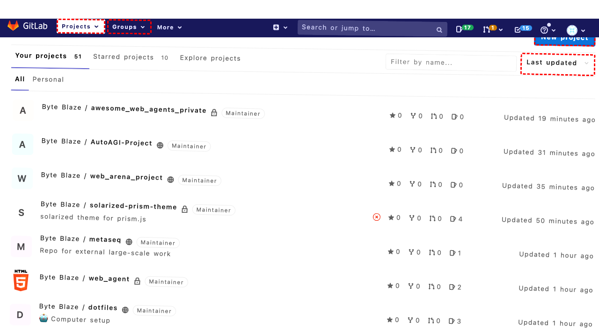
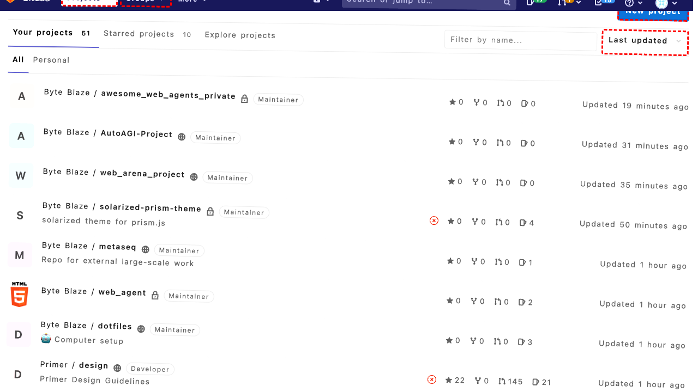
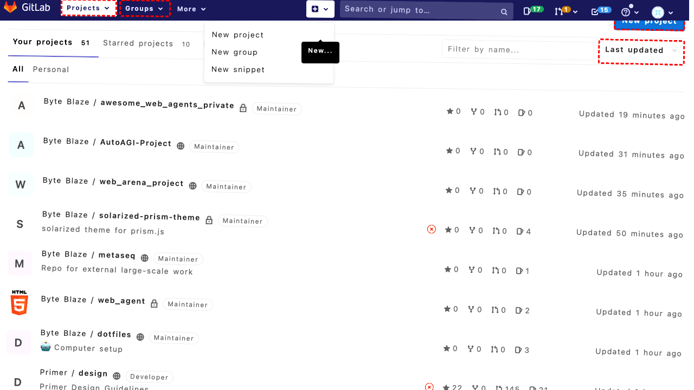
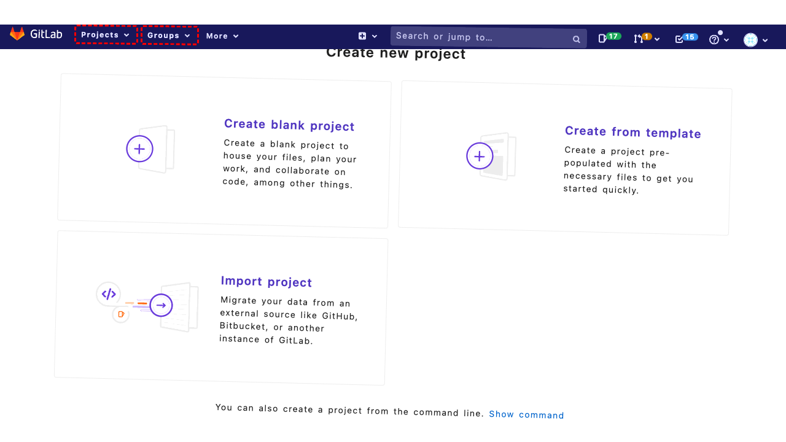

## Intent

Tell me the email address of the contributor who has the most commits to branch main

## RM

Thoughts: This is an information seeking task where the user wants the email address of the contributor with the most commits to the main branch. The agent's action history shows it navigated to the Contributors page and correctly identified the top contributor, SecUpwN, with 824 commits and the associated email address. The final state confirms the list is sorted by commit count in descending order, so the first entry is indeed the contributor with the most commits. The agent's response accurately provides the requested email address, fulfilling the user's intent.

Status: success

## Final Response "The contributor with the most commits to branch main is SecUpwN with email address SecUpwN@users.noreply.github.com"

## Captions

===============Looking at the current page, I can see we're on the GitLab repository page for Android-IMSI-Catcher-Detector. To find the contributor with the most commits to the main branch, I need to navigate to the repository's commit history or contributors page.

I can see there's a "Repository" link in the sidebar with ID 253, and within the repository section, there should be access to commits and contributors information. Let me first click on the "Repository" link to access the repository view where I can then navigate to the commits or contributors page.
===============Looking at the current page, I can see we're already on the repository page (the URL shows we're in the tree/master view). I need to navigate to either the "Commits" or "Contributors" page to find information about commit counts per contributor.

In the accessibility tree, I can see there's a "Commits" link with ID 265 and a "Contributors" link with ID 271 under the Repository section. Since I want to find the contributor with the most commits, the "Contributors" page would be the most direct way to get this information as it typically shows commit counts per contributor.

Let me click on the "Contributors" link to navigate to the contributors page.
===============Looking at the current page, I can see we're already on the Contributors page (the URL shows we're at /-/graphs/master). The accessibility tree shows a list of contributors with their commit counts and email addresses. The first contributor listed is "SecUpwN" with 824 commits and email "SecUpwN@users.noreply.github.com". Since the list appears to be sorted by commit count (descending), the first contributor has the most commits to the main branch.

I can now directly provide the email address of the contributor with the most commits.

## Images





## Main Prompt

```md
User Intent: Tell me the email address of the contributor who has the most commits to branch main

Action History:
1: click("253")
2: click("271")
3: send_msg_to_user("The contributor with the most commits to branch main is SecUpwN with email address SecUpwN@users.noreply.github.com")


The detailed final state of the webpage:

```md
Looking at the current page, I can see we're already on the Contributors page (the URL shows we're at /-/graphs/master). The accessibility tree shows a list of contributors with their commit counts and email addresses. The first contributor listed is "SecUpwN" with 824 commits and email "SecUpwN@users.noreply.github.com". Since the list appears to be sorted by commit count (descending), the first contributor has the most commits to the main branch.

I can now directly provide the email address of the contributor with the most commits.
```

Bot response to the user: "The contributor with the most commits to branch main is SecUpwN with email address SecUpwN@users.noreply.github.com".
```
