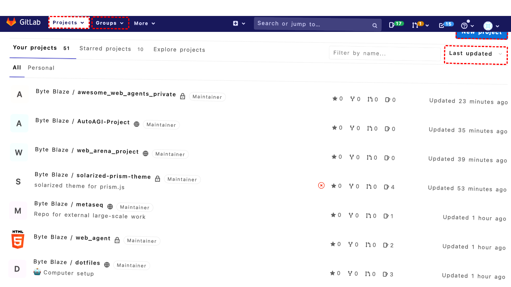
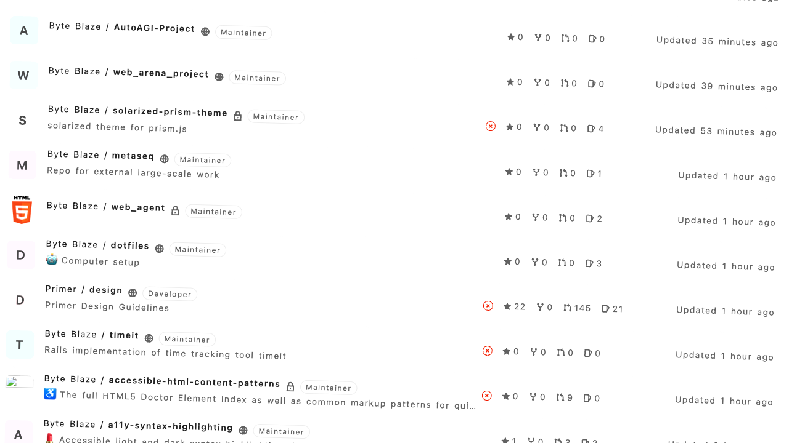
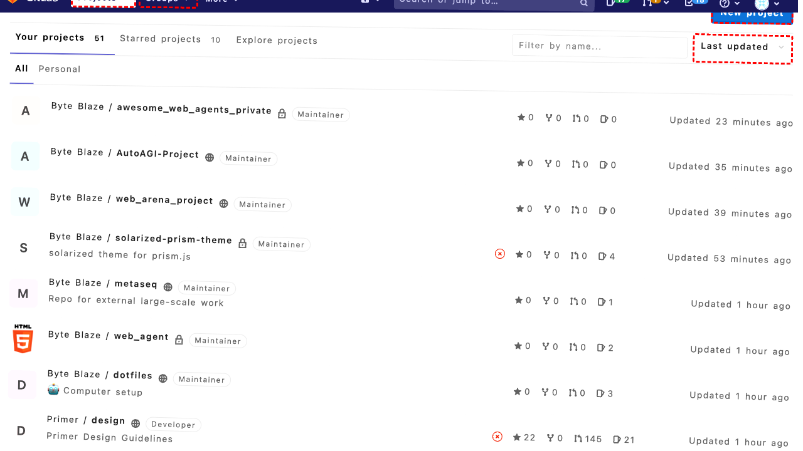
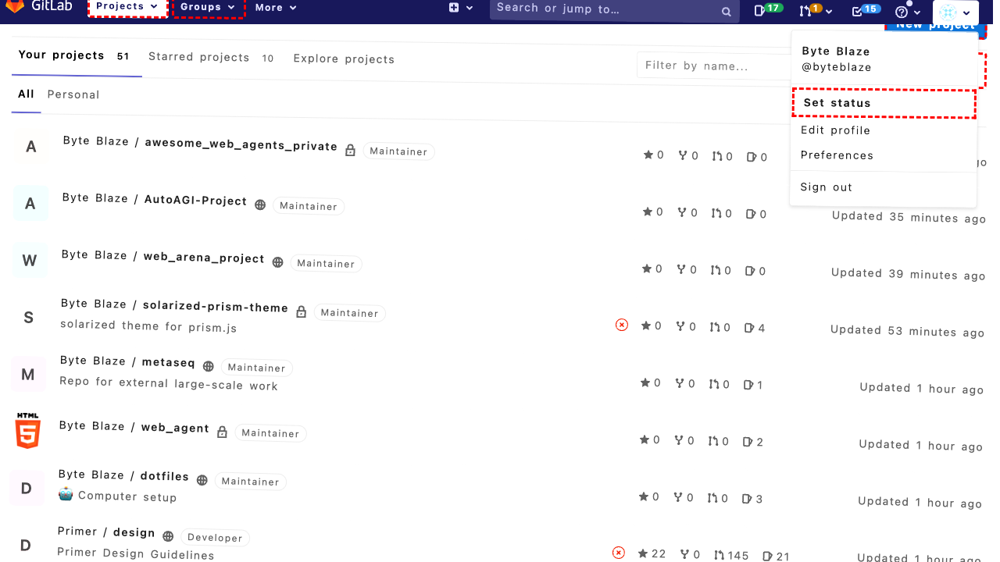
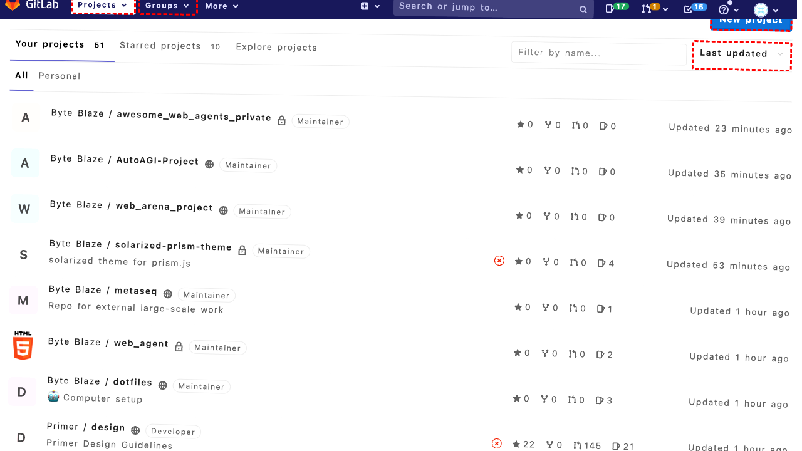

## Intent

Create a private Android repository called "web_agent_android_xs" using the right template to speed up development.

## RM

Thoughts: The user's intent is to create a private Android repository called "web_agent_android_xs" using the right template, which falls under the "Content modification" task type. The agent's action history shows attempts to interact with the UI, including clicks and a keyboard shortcut, but these failed due to UI issues. The agent then attempted to navigate directly to the new project creation URL via a `goto` action. However, the final state of the webpage indicates that the agent is still reasoning about the problem and has not actually created the repository—it only describes the strategy to navigate to the new project page. There is no evidence in the action history or final state that the repository was successfully created or that the correct template was applied. Therefore, the task is not completed successfully.

Status: failure

## Final Response 

## Captions

===============Looking at the current page, I can see I'm on the GitLab Projects dashboard. To create a new Android repository called "web_agent_android_xs" using a template, I need to click the "New project" button that's visible in the accessibility tree.

The "New project" link has bid 270, which I can click to start the repository creation process.
===============Looking at the error message, I can see that the click on "New project" (bid 270) failed because another element (bid 225, the "Byte Blaze" user dropdown) was intercepting pointer events. This suggests there might be an overlapping element or dropdown menu that's interfering with the click.

Let me try a different approach. I'll scroll down slightly to potentially move the interfering element out of the way, then try clicking "New project" again.
===============Looking at the error from my previous attempt, the click on "New project" was intercepted by the "Byte Blaze" user dropdown (bid 225). After scrolling down 200 pixels, I should now be able to click the "New project" button without interference from that dropdown menu.

The "New project" link is still visible in the accessibility tree at bid 270, and scrolling should have moved it away from the interfering dropdown. Let me try clicking it again.
===============Looking at the error, the "Byte Blaze" user dropdown (bid 225) is still intercepting clicks on the "New project" button even after scrolling. This suggests the dropdown might be open or there's a persistent overlay issue.

Let me try a different approach - I'll click on a different area of the page first to potentially close any open dropdowns, then try the "New project" button again. I'll click on the main content area (bid 265) which should be safe and might close any interfering elements.
===============Looking at the error history, the "Byte Blaze" user dropdown (bid 225) has been consistently intercepting clicks on the "New project" button. After clicking the main content area (bid 265) to potentially close any open dropdowns, I should now try clicking "New project" again. The dropdown should no longer be active after clicking elsewhere on the page.
===============Looking at the persistent error, the "Byte Blaze" user dropdown (bid 225) is consistently intercepting clicks on the "New project" button. This suggests the dropdown might be sticky or there's a z-index issue.

Let me try a different approach - I'll click directly on the "Byte Blaze" dropdown link first to potentially open and then close it properly, which should remove the interference. After that, I can click "New project" without the dropdown intercepting.
===============Looking at the persistent issue with the "Byte Blaze" dropdown intercepting clicks, I successfully clicked on the dropdown itself (bid 225) to open it. Now I need to close this dropdown by clicking somewhere else on the page, then try the "New project" button again. I'll click on the main content area (bid 265) which should close the dropdown and allow me to proceed.
===============Looking at the history, I've been struggling with the "Byte Blaze" dropdown intercepting clicks on the "New project" button. I successfully clicked the dropdown to open it, then clicked the main content area to close it. Now the dropdown should be closed and no longer intercepting clicks. The "New project" button (bid 270) should now be clickable without interference.
===============Looking at the persistent error, the "Byte Blaze" dropdown (bid 225) continues to intercept clicks on the "New project" button despite multiple attempts to close it. This appears to be a persistent z-index or overlay issue where the dropdown element is covering the button area even when not visibly expanded.

Let me try a different approach - I'll use keyboard navigation to access the "New project" functionality. I can press "Alt+/" (GitLab's keyboard shortcut for focusing the search/command palette) and then type "new project" to navigate there directly, bypassing the problematic UI element.
===============Looking at the persistent issue with the "Byte Blaze" dropdown intercepting clicks on the "New project" button, I've tried multiple approaches including scrolling, clicking elsewhere to close dropdowns, and even directly interacting with the dropdown. The keyboard shortcut approach also failed.

Let me try a different strategy - I'll navigate directly to the new project creation URL since I know the GitLab URL structure. The new project page should be accessible at `/projects/new` relative to the current base URL.

## Images











## Main Prompt

```md
User Intent: Create a private Android repository called "web_agent_android_xs" using the right template to speed up development.

Action History:
1: click("270")
2: scroll(0, 200)
3: click("270")
4: click("265")
5: click("270")
6: click("225")
7: click("265")
8: click("270")
9: keyboard_press("Alt+/")
10: goto("http://172.26.116.102:8080/projects/new")


The detailed final state of the webpage:

```md
Looking at the persistent issue with the "Byte Blaze" dropdown intercepting clicks on the "New project" button, I've tried multiple approaches including scrolling, clicking elsewhere to close dropdowns, and even directly interacting with the dropdown. The keyboard shortcut approach also failed.

Let me try a different strategy - I'll navigate directly to the new project creation URL since I know the GitLab URL structure. The new project page should be accessible at `/projects/new` relative to the current base URL.
```

Bot response to the user: None.
```
