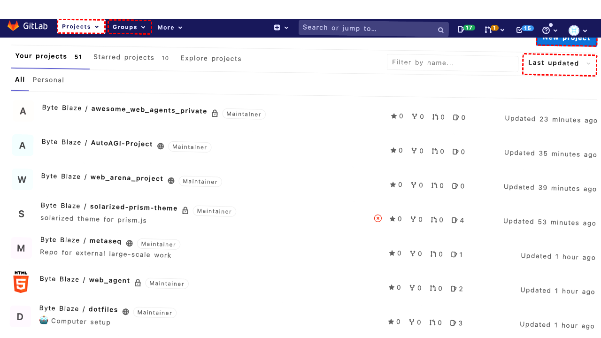
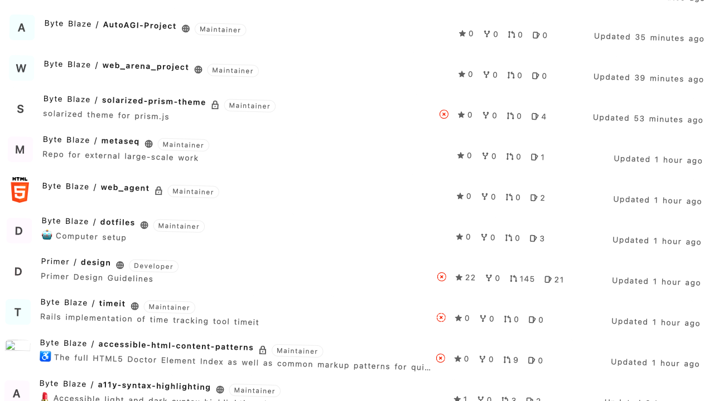
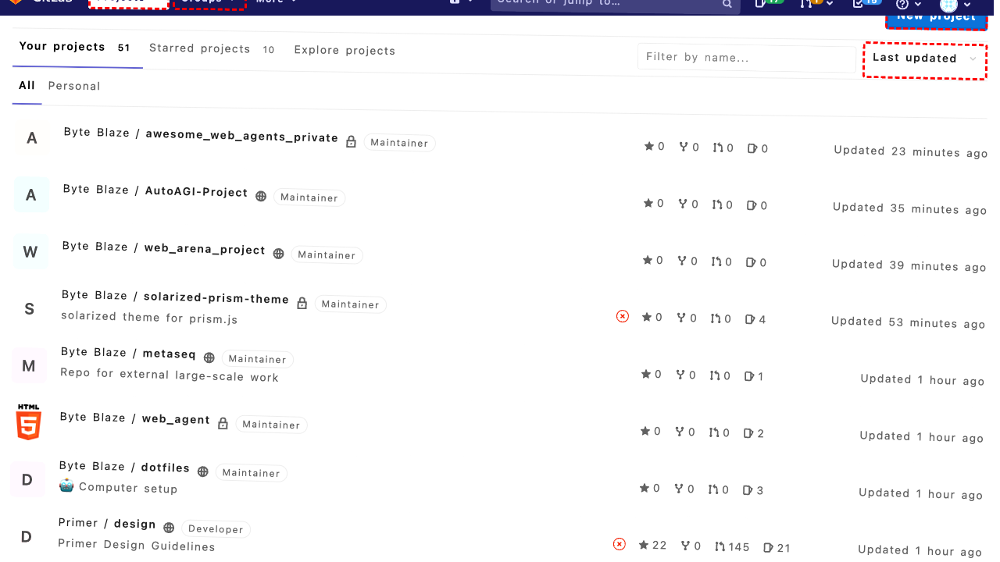

## Intent

Tell me the email address of the contributor who has the most commits to branch gh-page

## RM

Thoughts: This is an information seeking task where the user wants the email address of the contributor with the most commits to the gh-pages branch. The agent's action history shows it navigated through the site and then provided a response containing the requested information. The final state of the webpage confirms that the contributor "Security: PWNED" (with variations) has the most commits and the email address SecUpwN@users.noreply.github.com, matching the agent's response. The agent correctly identified the contributor and provided the email, so the task is successful.

Status: success

## Final Response "The contributor with the most commits to the gh-pages branch is Security: PWNED with email address SecUpwN@users.noreply.github.com"

## Captions

===============Looking at the current page, I can see we're on the main project page for Android-IMSI-Catcher-Detector. To find the contributor with the most commits to the gh-page branch, I need to:

1. First navigate to the repository section where I can see branches
2. Find the gh-page branch specifically
3. Access commit information for that branch
4. Identify the contributor with the most commits

From the accessibility tree, I can see there's a "Repository" link in the sidebar that should lead to branch information. Let me start by clicking that.
===============Looking at the current page, I can see we're on the repository files view for the master branch. To find information about the gh-page branch and its contributors, I need to navigate to the branches section first. From the accessibility tree, I can see there's a "Branches" link under the Repository section in the sidebar.

Let me click on the "Branches" link to view all branches in this repository.
===============Looking at the current page, I can see we're already on the Branches page (as indicated by the URL and the highlighted "Branches" link in the navigation). I can see the gh-pages branch listed under "Stale branches" with commit count "999+" which suggests it has many commits.

To find the contributor with the most commits to this branch, I need to access the commit history for the gh-pages branch. The best approach is to click on the branch name link which should take me to the branch view where I can then access commit information.

From the accessibility tree, I can see the gh-pages branch link has bid "650".
===============Looking at the current state, I can see we're now on the gh-pages branch view. To find the contributor with the most commits, I need to access the commit history for this branch. From the accessibility tree, I can see there's a "Commits" link in the repository navigation sidebar with bid "265". This should take me to the commit history where I can see all contributors and their commit counts.

Let me click on the "Commits" link to view the commit history for the gh-pages branch.
===============Looking at the current page, I can see we're already on the Commits page for the gh-pages branch (as indicated by the URL and the highlighted "Commits" link in the navigation). The page shows a list of commits with dates, commit messages, and author information including email addresses.

To find the contributor with the most commits, I need to analyze the commit history. From what I can see in the accessibility tree, there are multiple contributors listed:
- Lars Grefer (github@larsgrefer.de)
- Srihari Thalla (thallasrihari@gmail.com)
- Security: PWNED (SecUpwN@users.noreply.github.com)
- Security: Pwned (SecUpwN@users.noreply.github.com)
- Security: Pwned. (SecUpwN@users.noreply.github.com)
- Matt Graham (kickthebox@gmail.com)

However, I notice that "Security: PWNED", "Security: Pwned", and "Security: Pwned." all use the same email address (SecUpwN@users.noreply.github.com) - these appear to be the same contributor with slightly different display names.

Based on the commit history shown, the Security: PWNED/Pwned contributor appears to have the vast majority of commits to the gh-pages branch, with many "Create gh-pages branch via GitHub" commits spanning from 2015 to 2016.

Since I can see the email addresses directly in the commit history, I can determine that the contributor with the most commits is Security: PWNED/Pwned with email address SecUpwN@users.noreply.github.com.

## Images







## Main Prompt

```md
User Intent: Tell me the email address of the contributor who has the most commits to branch gh-page

Action History:
1: click("253")
2: click("267")
3: click("650")
4: click("265")
5: send_msg_to_user("The contributor with the most commits to the gh-pages branch is Security: PWNED with email address SecUpwN@users.noreply.github.com")


The detailed final state of the webpage:

```md
Looking at the current page, I can see we're already on the Commits page for the gh-pages branch (as indicated by the URL and the highlighted "Commits" link in the navigation). The page shows a list of commits with dates, commit messages, and author information including email addresses.

To find the contributor with the most commits, I need to analyze the commit history. From what I can see in the accessibility tree, there are multiple contributors listed:
- Lars Grefer (github@larsgrefer.de)
- Srihari Thalla (thallasrihari@gmail.com)
- Security: PWNED (SecUpwN@users.noreply.github.com)
- Security: Pwned (SecUpwN@users.noreply.github.com)
- Security: Pwned. (SecUpwN@users.noreply.github.com)
- Matt Graham (kickthebox@gmail.com)

However, I notice that "Security: PWNED", "Security: Pwned", and "Security: Pwned." all use the same email address (SecUpwN@users.noreply.github.com) - these appear to be the same contributor with slightly different display names.

Based on the commit history shown, the Security: PWNED/Pwned contributor appears to have the vast majority of commits to the gh-pages branch, with many "Create gh-pages branch via GitHub" commits spanning from 2015 to 2016.

Since I can see the email addresses directly in the commit history, I can determine that the contributor with the most commits is Security: PWNED/Pwned with email address SecUpwN@users.noreply.github.com.
```

Bot response to the user: "The contributor with the most commits to the gh-pages branch is Security: PWNED with email address SecUpwN@users.noreply.github.com".
```
