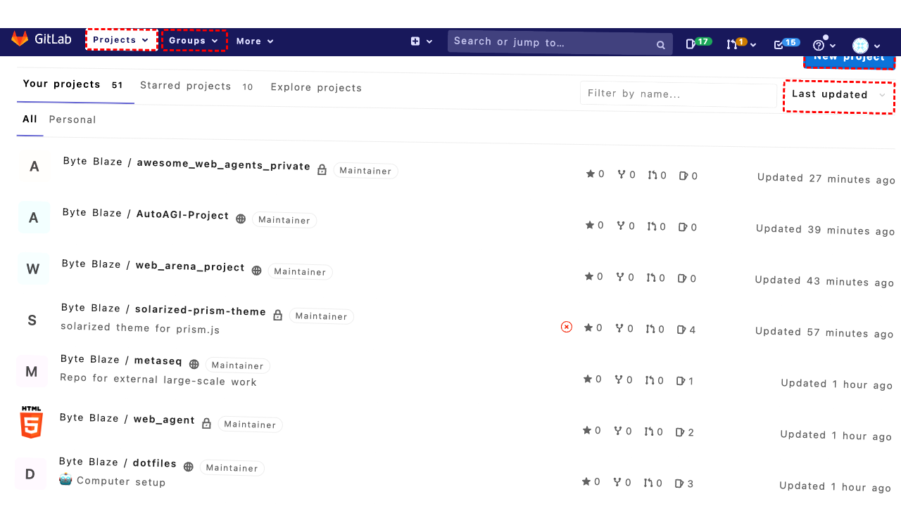
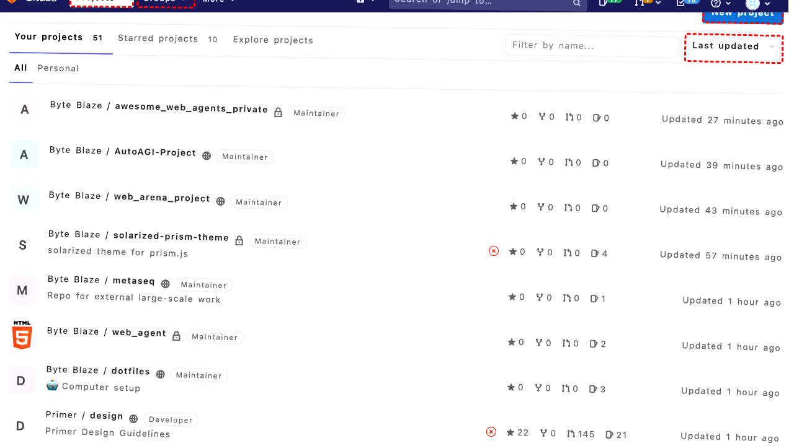
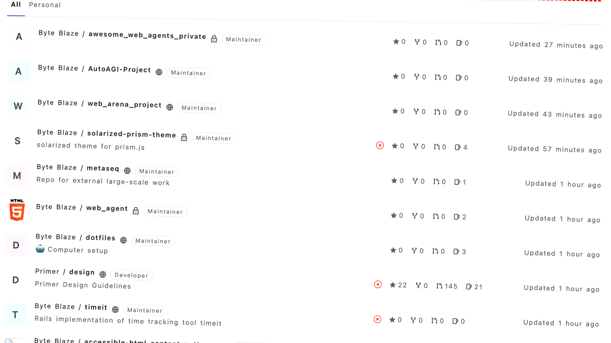
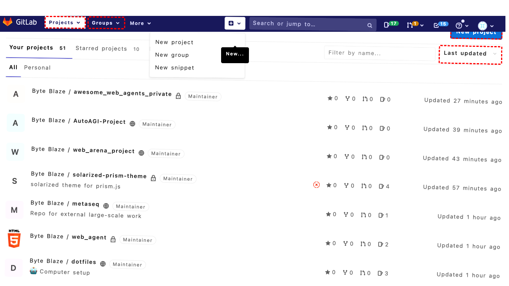
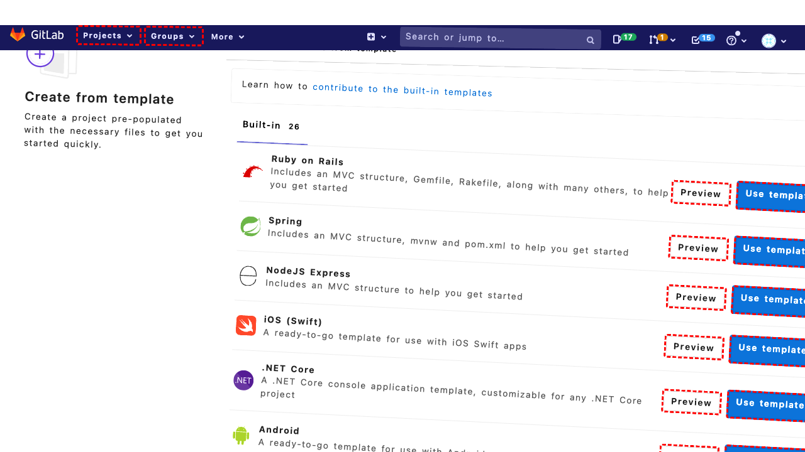
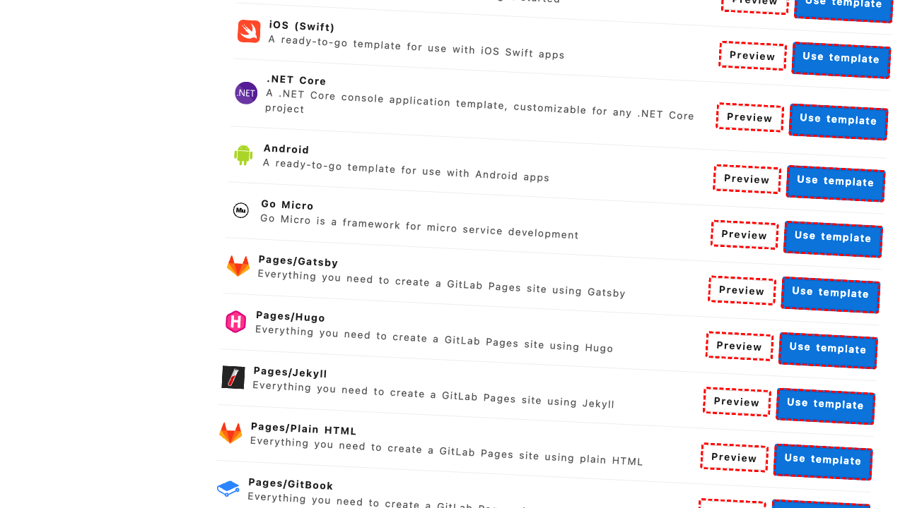
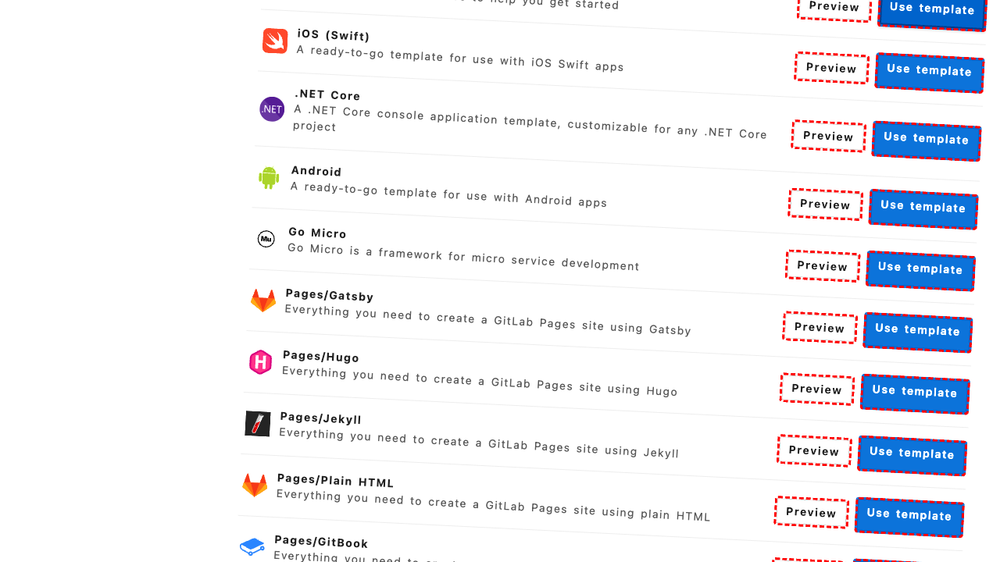
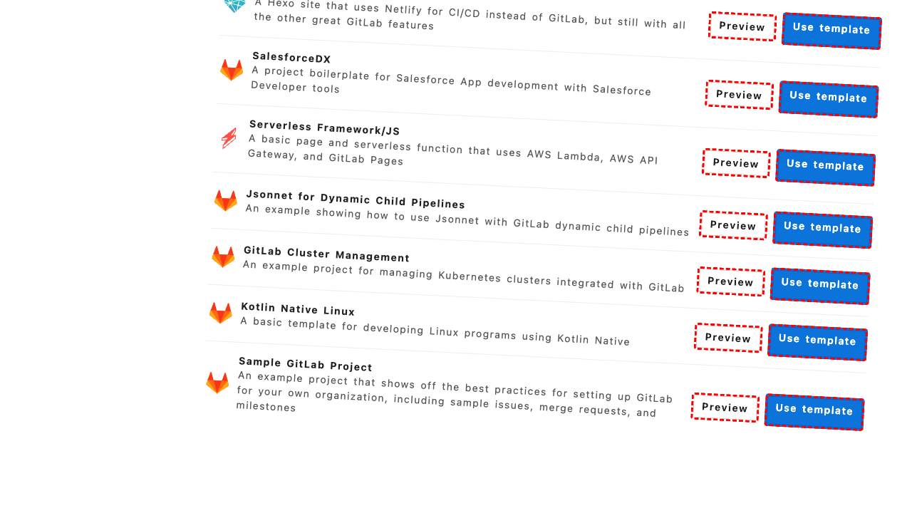

## Intent

Create a private NodeJS repository called "web_agent_nodejs" using the right template to speed up development.

## RM

Thoughts: The user's intent is to create a private NodeJS repository called "web_agent_nodejs" using a template. The action history shows that the agent selected a template (likely "NodeJS Express" based on the final state) and filled in the project name as "web_agent_nodejs". However, there is no action to set the repository as private, and no "Create project" button was clicked to finalize the creation. The final state indicates the agent is still in the configuration phase and has not completed the project creation. Since the task is content modification (creating a repository with specific settings), and the agent did not complete the creation process or set the repository to private, the task fails.

Status: failure

## Final Response 

## Captions

===============Looking at the current page, I can see I'm on the GitLab Projects dashboard. To create a new private NodeJS repository called "web_agent_nodejs" using a template, I need to click the "New project" button which is visible in the accessibility tree.

The "New project" link has bid 270 according to the accessibility tree. This should take me to the project creation page where I can select templates and configure repository settings.
===============Looking at the error message, it appears that the click on "New project" (bid 270) is being intercepted by another element (bid 225) that's overlapping it. This is a common issue in web interfaces where dropdown menus or other elements can block clicks.

I can see from the accessibility tree that there's a user profile link with bid 225 ("Byte Blaze") that might be interfering. Since the "New project" link is still visible and accessible, I should try a different approach - perhaps scrolling slightly to ensure the element is fully in view and not obstructed, then trying the click again.

Let me scroll down a bit to potentially move any overlapping elements out of the way, then attempt the click again.
===============Looking at the current situation, the previous attempts to click "New project" (bid 270) have been blocked by an overlapping element (bid 225). The scroll action was intended to reposition the page, but the issue persists.

Let me analyze the accessibility tree more carefully. I can see there's a "New..." dropdown menu at bid 138 that might be an alternative way to access project creation. This dropdown likely contains a "New project" option. Since the direct "New project" link is being blocked, using the dropdown menu might be a more reliable approach.
===============Looking at the current situation, I can see that clicking the "New..." dropdown menu (bid 138) should reveal options including "New project". Since the direct "New project" link (bid 270) was being blocked by an overlapping element, using the dropdown menu is a logical alternative approach. The dropdown is already expanded according to the accessibility tree, so I should be able to see and click the "New project" option that appears within it.

From the accessibility tree, I can see that after clicking bid 138, there's a list with list items including "New project" at bid 144. This should take me to the project creation page where I can select templates and configure the repository settings.
===============Looking at the current state, I can see I'm now on the "New Project" page in GitLab (Tab 0). The page shows three main options:
1. "Create blank project" (bid 278)
2. "Create from template" (bid 285)
3. "Import project" (bid 292)

Since my goal is to create a private NodeJS repository using a template to speed up development, I should click on the "Create from template" option. This will allow me to select from pre-configured templates, including NodeJS templates, which will provide the necessary files and structure to get started quickly.
===============Looking at the current page, I can see I'm already on the "Create from template" page (URL shows #create_from_template). The accessibility tree shows multiple template options including "NodeJS Express" at bid 443. Since my goal is to create a private NodeJS repository called "web_agent_nodejs" using a template, I should select the "NodeJS Express" template by clicking its corresponding radio button.

The "NodeJS Express" template has a radio button with bid 443 that I need to select.
===============Looking at the error message, I can see that the radio button for "NodeJS Express" (bid 443) is being blocked by its label element (bid 444) which is intercepting pointer events. This is a common issue where the actual radio button is visually hidden and the label is the clickable area that users interact with.

Since the label element (bid 444) is the one that's intercepting clicks and is the visible part that says "Use template", I should click on the label instead of the radio button itself. This will still select the template but avoids the blocking issue.
===============Looking at the current state, I can see that I've successfully selected the "NodeJS Express" template by clicking its label (bid 444). Now I need to proceed with creating the project. The next step would typically be to click a "Create project" or "Next" button to move to the project configuration page where I can set the project name to "web_agent_nodejs" and configure it as private.

From the accessibility tree, I can see there's likely a "Create project" button or similar that should now be available after selecting a template. Let me look for this button to proceed with the project creation process.
===============Looking at the error message, I can see that the element with bid 991 is outside of the viewport, which means it's not currently visible on screen. Since I've already selected the NodeJS Express template, I need to find the actual "Create project" or "Next" button that should be available to proceed with project creation.

Let me scroll down the page to find the project creation button that should appear after template selection. The button is likely located further down the page, below the template list.
===============Looking at the current situation, I've successfully selected the "NodeJS Express" template but need to find and click the "Create project" button to proceed. After scrolling down, I should be able to see the project creation form where I can set the project name to "web_agent_nodejs" and configure it as private. Let me look for the project creation form elements that should now be visible after template selection.

From the accessibility tree, I can see there's a form section with various input fields for project configuration. I need to find the project name field to enter "web_agent_nodejs" and ensure the project visibility is set to private.

## Images












## Main Prompt

```md
User Intent: Create a private NodeJS repository called "web_agent_nodejs" using the right template to speed up development.

Action History:
1: click("270")
2: scroll(0, 100)
3: noop(500)
4: click("270")
5: click("138")
6: click("144")
7: click("285")
8: click("443")
9: click("444")
10: click("991")
11: scroll(0, 300)
12: noop(500)
13: fill("991", "web_agent_nodejs")


The detailed final state of the webpage:

```md
Looking at the current situation, I've successfully selected the "NodeJS Express" template but need to find and click the "Create project" button to proceed. After scrolling down, I should be able to see the project creation form where I can set the project name to "web_agent_nodejs" and configure it as private. Let me look for the project creation form elements that should now be visible after template selection.

From the accessibility tree, I can see there's a form section with various input fields for project configuration. I need to find the project name field to enter "web_agent_nodejs" and ensure the project visibility is set to private.
```

Bot response to the user: None.
```
