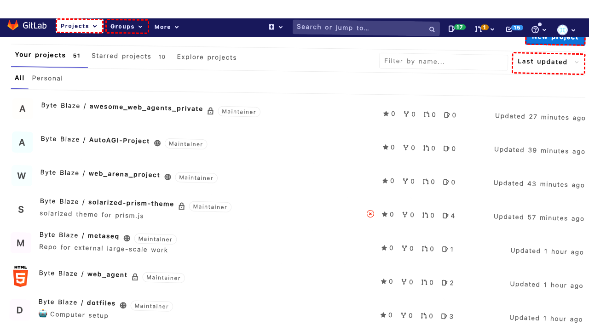
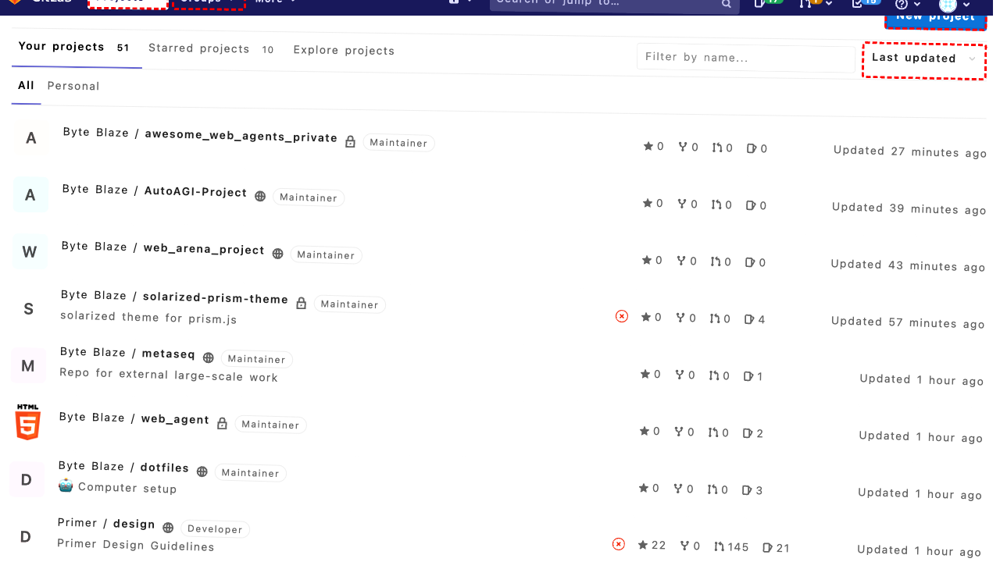
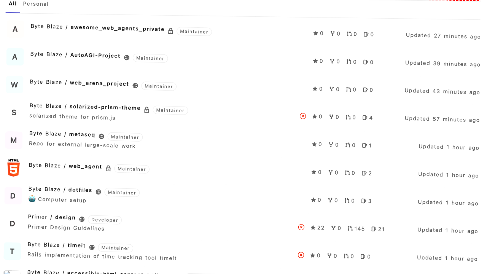
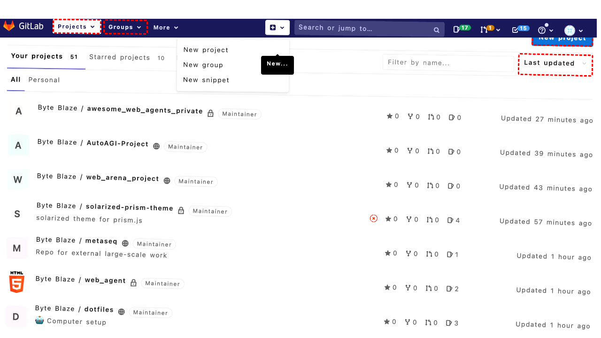

## Intent

Tell me the number of commits of the contributor who has the most commits to branch main

## RM

Thoughts: This is an information seeking task where the user wants to know the number of commits of the contributor with the most commits to branch main. The agent's response directly provides the requested information (Vinta Chen with 414 commits), which matches what is visible in the final state of the webpage. The agent successfully identified and communicated the correct information without any errors or omissions.

Status: success

## Final Response "The contributor with the most commits to branch main is Vinta Chen with 414 commits."

## Captions

===============Looking at the current page, I can see we're on the awesome-python repository page in GitLab. The goal is to find the number of commits of the contributor who has the most commits to the branch main.

From the accessibility tree, I can see there's a link showing "1,636 Commits" (bid 522) which likely leads to the commit history. To find the contributor with the most commits, I need to navigate to the commit history page where I can analyze the contributors.

Let me click on the commits link to access the commit history where I can see all contributors and their commit counts.
===============Looking at the current page, I can see we're already on the commits page for the awesome-python repository (URL shows "/commits/master"). The accessibility tree shows a list of commits with author information, but to find the contributor with the most commits, I need to access a page that provides contributor statistics.

I notice there's a "Contributors" link in the repository navigation menu (bid 270) which should show contributor statistics including commit counts. This would be the most efficient way to find the top contributor and their commit count.

Let me click on the Contributors link to access the contributor statistics page.
===============Looking at the current page, I can see we're already on the Contributors page (URL shows "/graphs/master" and the page title is "Contributors"). The accessibility tree shows a list of contributors with their commit counts.

I can see the first contributor listed is "Vinta Chen" with "414 commits" - this appears to be the contributor with the most commits based on the ordering. The goal is to tell the number of commits of the contributor who has the most commits to branch main, which in this case is Vinta Chen with 414 commits.

Since I can directly see this information on the current page, I'll send this result to the user.

## Images





## Main Prompt

```md
User Intent: Tell me the number of commits of the contributor who has the most commits to branch main

Action History:
1: click("522")
2: click("270")
3: send_msg_to_user("The contributor with the most commits to branch main is Vinta Chen with 414 commits.")


The detailed final state of the webpage:

```md
Looking at the current page, I can see we're already on the Contributors page (URL shows "/graphs/master" and the page title is "Contributors"). The accessibility tree shows a list of contributors with their commit counts.

I can see the first contributor listed is "Vinta Chen" with "414 commits" - this appears to be the contributor with the most commits based on the ordering. The goal is to tell the number of commits of the contributor who has the most commits to branch main, which in this case is Vinta Chen with 414 commits.

Since I can directly see this information on the current page, I'll send this result to the user.
```

Bot response to the user: "The contributor with the most commits to branch main is Vinta Chen with 414 commits.".
```
