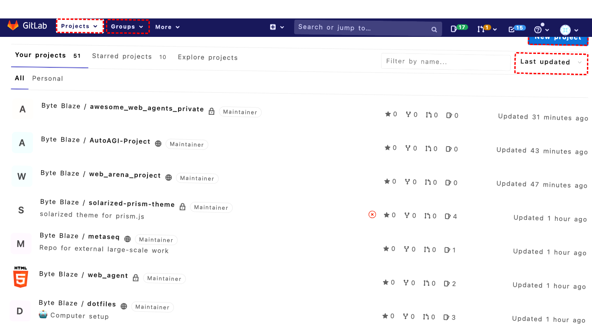
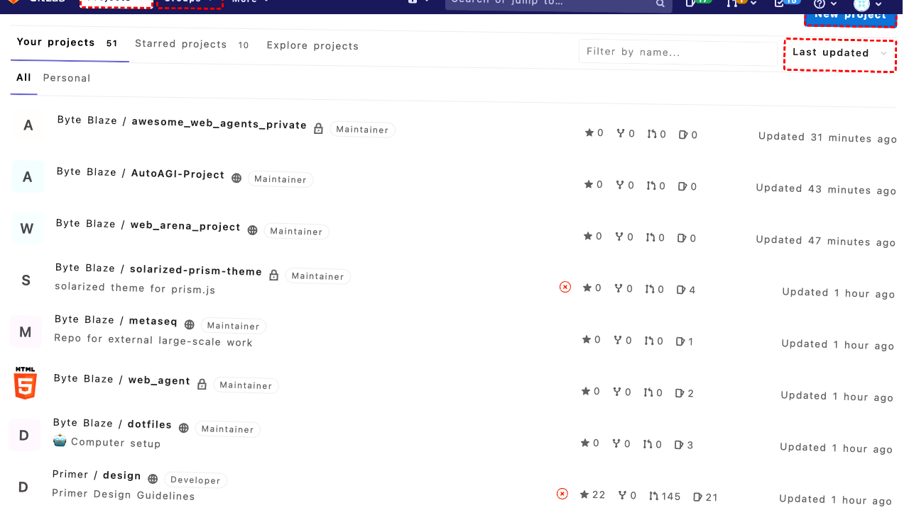
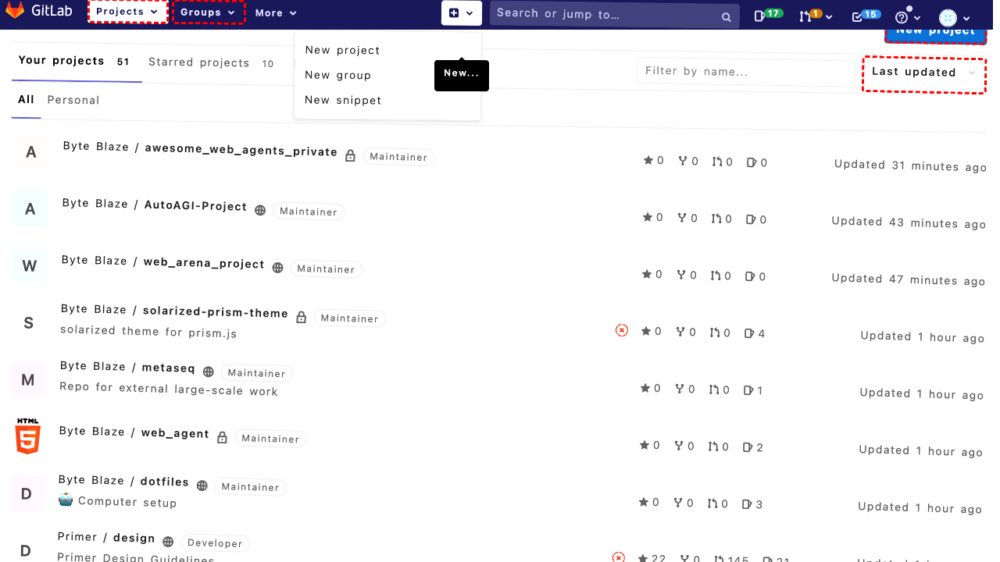
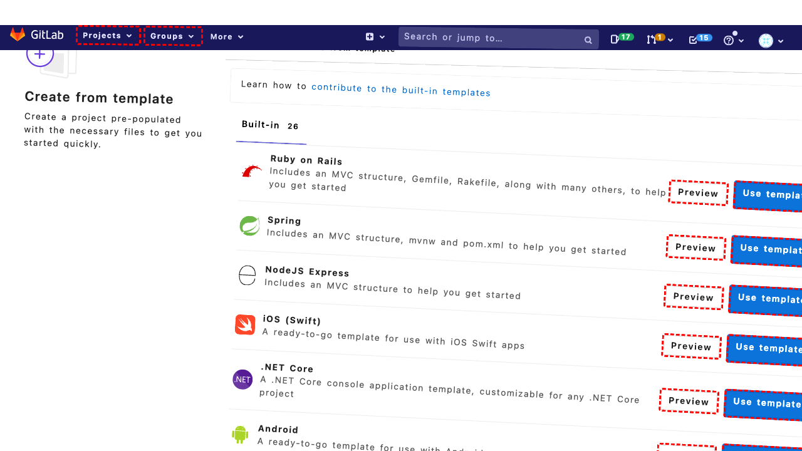
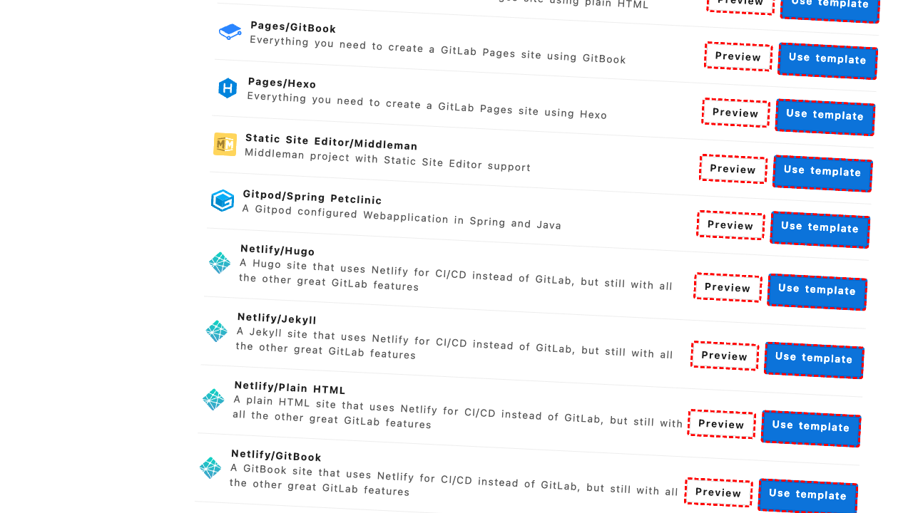
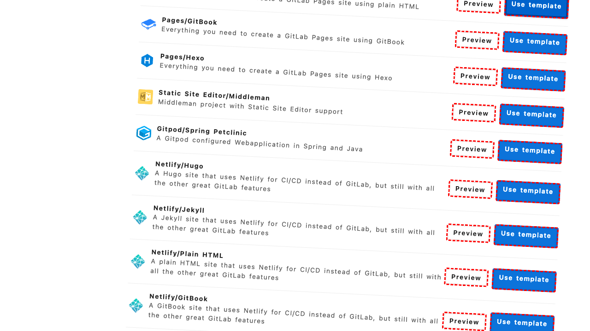

## Intent

Create a private HTML repository called "web_agent_index" using the right template to speed up development.

## RM

Thoughts: The user's intent is to create a private HTML repository called "web_agent_index" using the right template, which falls under the "Content modification" task type. The agent's action history shows it clicked on various elements, including element "540" (likely the "Use template" radio for "Pages/Plain HTML"), but the final state indicates the agent is still on the template selection page and has not proceeded to the configuration or creation step. The agent has not entered the repository name, set it as private, or completed the project creation, and the final state explicitly states no "Create project" button was found or clicked. Therefore, the task is not successfully completed.

Status: failure

## Final Response 

## Captions

===============Looking at the current page, I can see I'm on the GitLab dashboard in the Projects section. To create a new private HTML repository called "web_agent_index" using a template, I need to click the "New project" button that's visible in the accessibility tree.

The "New project" link has bid 270 according to the accessibility tree. Clicking this should take me to the project creation page where I can select templates and configure repository settings.
===============Looking at the error message, I can see that the click on "New project" (bid 270) failed because another element (bid 225) was intercepting pointer events. This suggests there might be an overlapping element or dropdown menu that's interfering with the click.

Let me try a different approach. I notice there's also a "New..." button in the top navigation bar with bid 138. This might be an alternative way to access the project creation functionality, or it might open a dropdown with "New project" as an option.
===============Looking at the current situation, my previous click on the "New..." button (bid 138) should have opened a dropdown menu. According to the accessibility tree, this dropdown contains options including "New project" (bid 144), "New group" (bid 146), and "New snippet" (bid 148). Since I need to create a new project, I should click on the "New project" option in this dropdown menu.
===============Looking at the current state, I can see I'm on the "New Project" page in GitLab. The accessibility tree shows three main options: "Create blank project", "Create from template", and "Import project". Since the goal is to create a private HTML repository using a template to speed up development, I should click on the "Create from template" option, which has bid 285 according to the accessibility tree.
===============Looking at the current page, I can see I'm already on the "Create from template" page (as indicated by the URL and the heading "Create from template"). The accessibility tree shows various template options including "Pages/Plain HTML" which would be appropriate for creating an HTML repository. I need to select this template and then proceed to configure the repository as private with the name "web_agent_index".

The "Pages/Plain HTML" template has a radio button with bid 539 that I need to select, then I can proceed to the next step of configuration.
===============Looking at the error message, I can see that the radio button (bid 539) is being intercepted by its label element (bid 540). This is a common issue where the label element covers the radio button and intercepts clicks. The solution is to click on the label element instead of the radio button itself, as this will still select the radio button while avoiding the interception issue.
===============Looking at the current state, I can see that I successfully selected the "Pages/Plain HTML" template by clicking its label (bid 540). Now I need to proceed to the next step where I can configure the repository name and privacy settings. The page should have a "Next" or "Continue" button that will take me to the project configuration form where I can set the repository name to "web_agent_index" and make it private.

Let me look for a "Next" button or similar navigation element. Based on the accessibility tree structure, I should find a button that allows me to proceed after selecting the template.
===============Looking at the current state, I can see that I've successfully selected the "Pages/Plain HTML" template. Now I need to proceed to the project configuration page where I can set the repository name to "web_agent_index" and configure it as private.

The accessibility tree doesn't show an obvious "Next" or "Continue" button, but there should be some way to proceed after template selection. Let me look for a button that might be labeled "Create project", "Next", or similar. I notice there's a "New project" link (bid 1002) in the navigation, but that would take me back. Let me try scrolling to see if there's a button further down the page that I'm missing.
===============Looking at the current state, I can see I've successfully selected the "Pages/Plain HTML" template and scrolled down the page. Now I need to find the button to proceed with creating the project. The accessibility tree shows various template options but doesn't clearly indicate a "Next" or "Create project" button. However, after template selection, there should be a way to continue to the project configuration page where I can set the repository name and privacy settings.

Let me look more carefully at the accessibility tree. I notice there might be a button or link that appears after template selection. Since I've already selected the template by clicking its label, the interface should now show me options to proceed. Let me try looking for a button with text like "Create project", "Next", or similar that would take me to the configuration form.
===============Looking at the current situation, I've successfully selected the "Pages/Plain HTML" template but haven't found a clear "Next" or "Create project" button to proceed to the configuration page. The accessibility tree shows I'm on the template selection page, but after selecting a template, there should be a way to continue.

Let me look more carefully at the template section. I notice that each template has a "Use template" radio button with associated labels (like bid 540 for the Pages/Plain HTML template). After selecting a template, there might be a button that appears or becomes enabled. Let me check if there's a "Create project" button that appears after template selection, possibly at the bottom of the page or in a fixed position.

Since scrolling didn't reveal an obvious button, let me try looking for a button with text like "Create project" or similar that might be available now that I've selected a template. I'll search the accessibility tree more systematically for any button elements that could serve this purpose.

## Images











## Main Prompt

```md
User Intent: Create a private HTML repository called "web_agent_index" using the right template to speed up development.

Action History:
1: click("270")
2: click("138")
3: click("144")
4: click("285")
5: click("539")
6: click("540")
7: noop(1000)
8: scroll(0, 300)
9: noop(1500)
10: noop(1000)


The detailed final state of the webpage:

```md
Looking at the current situation, I've successfully selected the "Pages/Plain HTML" template but haven't found a clear "Next" or "Create project" button to proceed to the configuration page. The accessibility tree shows I'm on the template selection page, but after selecting a template, there should be a way to continue.

Let me look more carefully at the template section. I notice that each template has a "Use template" radio button with associated labels (like bid 540 for the Pages/Plain HTML template). After selecting a template, there might be a button that appears or becomes enabled. Let me check if there's a "Create project" button that appears after template selection, possibly at the bottom of the page or in a fixed position.

Since scrolling didn't reveal an obvious button, let me try looking for a button with text like "Create project" or similar that might be available now that I've selected a template. I'll search the accessibility tree more systematically for any button elements that could serve this purpose.
```

Bot response to the user: None.
```
