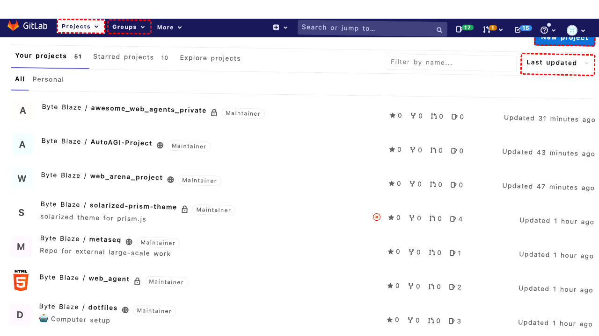
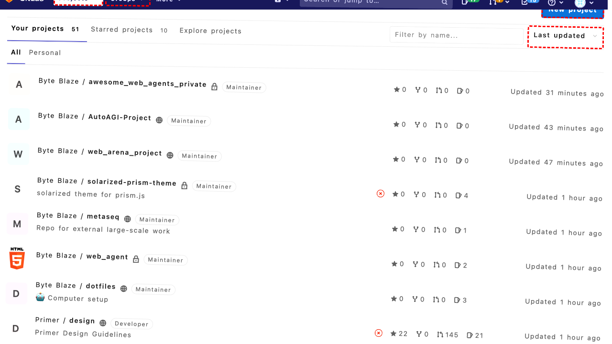
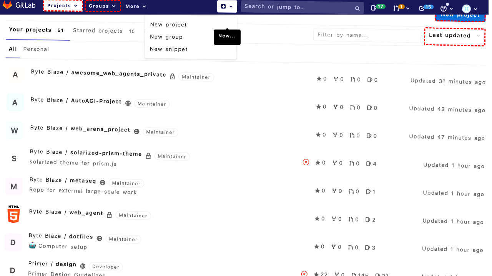
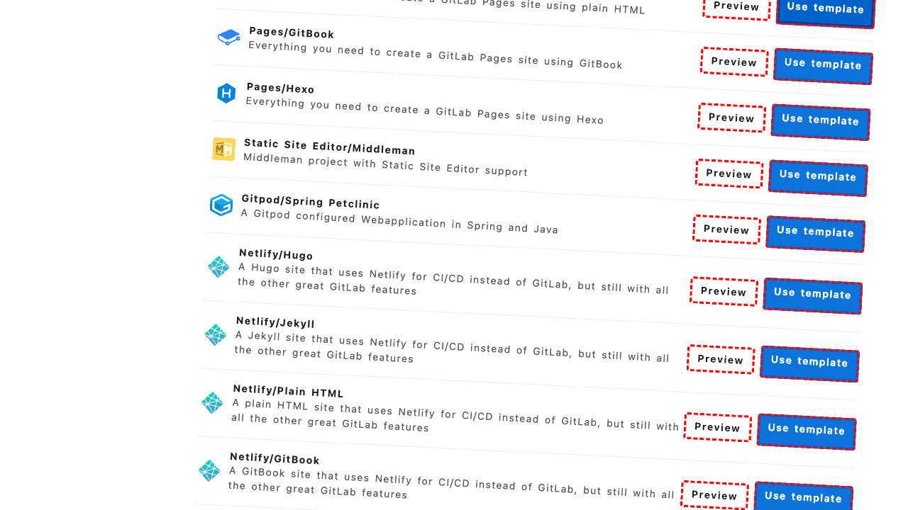
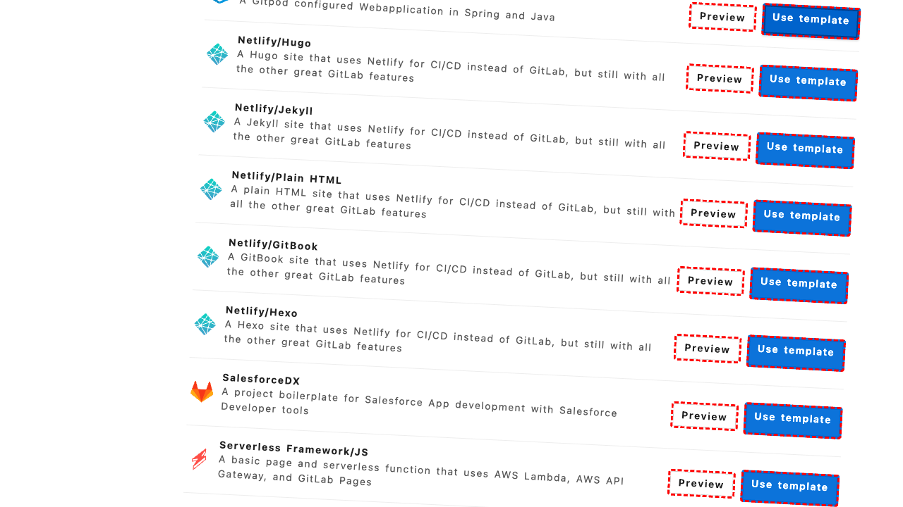

## Intent

Tell me the full name, gitlab account name, location and email address of the contributor who has the most commits to branch php52

## RM

Thoughts: The user intent is information seeking, specifically requesting the full name, GitLab account name, location, and email address of the contributor with the most commits to branch php52. The agent's action history shows multiple clicks but no successful retrieval of the required information. The final state indicates the agent is stuck on the Contributors page, has identified Andrew M. Whalen as the top contributor with 14 commits, and has his full name and email, but lacks the GitLab account name and location. The agent's response to the user is "None," meaning no information was provided. Since the agent failed to deliver the requested information (missing GitLab account name and location) and did not state that the information is unavailable, the task is a failure.

Status: failure

## Final Response 

## Captions

===============Looking at the current page, I can see I'm on a GitLab repository page for the "archive-my-tweets" project, specifically on the "Files" view of the "github/fork/chtitux/addRssFeed" branch.

To find the contributor with the most commits to the php52 branch, I need to navigate to the contributors page for that specific branch. I can see in the accessibility tree that there's a "Contributors" link available in the repository navigation menu with ID 271.

Let me click on the "Contributors" link to view the contributor statistics for this branch.
===============Looking at the current page state, I can see that I'm already on the Contributors page for the "github/fork/chtitux/addRssFeed" branch, not the php52 branch that was requested in the goal. The page shows contributors to the current branch with Andrew Whalen having the most commits (30 commits).

To find the contributor with the most commits to the php52 branch, I need to switch to that branch first. I can see there's a branch selector button with ID 414 that currently shows "github/fork/chtitux/addRssFeed". I should click this to change branches.
===============Looking at the current page, I can see that clicking the branch selector (ID 414) has opened a dropdown menu showing available branches. I can see "php52" listed as one of the branches in the dropdown with ID 530. Now I need to click on the php52 branch to switch to it and view the contributors for that specific branch.
===============Looking at the current page state, I can see that I'm now on the Contributors page for the php52 branch. The accessibility tree shows a list of contributors with their commit counts:

- Andrew M. Whalen: 14 commits
- andrew.whalen: 7 commits
- andrew.whalen@gmail.com: 6 commits
- ProgVal: 6 commits

Andrew M. Whalen has the most commits (14) to the php52 branch. I can see his full name is "Andrew M. Whalen", his GitLab account name appears to be "Andrew M. Whalen" (from the heading), his email is "github@amwhalen.com", but I don't see location information displayed on this page.

Since the location information isn't visible on the current contributors page, I should navigate to Andrew M. Whalen's profile page to find his location. I can click on his name heading which has ID 447.
===============Looking at the current page state, I can see that I successfully navigated to the php52 branch contributors page and identified Andrew M. Whalen as the contributor with the most commits (14). I have his full name "Andrew M. Whalen", his GitLab account name appears to be "Andrew M. Whalen" (from the heading), and his email "github@amwhalen.com".

However, I don't see location information displayed on this contributors page. I need to navigate to Andrew M. Whalen's profile page to find his location. I can see his name is displayed as a heading with ID 447, which should be clickable to navigate to his profile.
===============Looking at the current state, I can see I'm on the Contributors page for the php52 branch and have identified Andrew M. Whalen as the contributor with the most commits (14). I have:

- Full name: Andrew M. Whalen
- GitLab account name: Andrew M. Whalen (from heading)
- Email: github@amwhalen.com

However, the location information is not visible on this page. I need to navigate to Andrew M. Whalen's profile page to find his location. I can see his name is displayed as a clickable heading with ID 447.
===============Looking at the current page, I can see I'm on the Contributors page for the php52 branch and have successfully identified Andrew M. Whalen as the contributor with the most commits (14). I have his full name and email from the current page, but I need to get his GitLab account name (which might be different from his display name) and location information, which aren't visible here.

I need to click on Andrew M. Whalen's name (ID 447) to navigate to his profile page where I can find his GitLab username and location information.
===============Looking at the current page, I can see I'm still on the Contributors page for the php52 branch. I've been trying to click Andrew M. Whalen's name (ID 447) to navigate to his profile, but it seems the click action isn't working as expected. Let me check if there might be another way to access his profile.

Looking at the accessibility tree, I notice that Andrew M. Whalen's name appears as a heading (ID 447), but it might not be clickable. However, I can see there's a navigation section at the top with Andrew M. Whalen's name as a clickable link (ID 394) that might lead to his profile. Let me try clicking that instead.
===============Looking at the current state, I can see I'm still on the Contributors page for the php52 branch. I've been trying various approaches to navigate to Andrew M. Whalen's profile but haven't succeeded yet.

Let me analyze the accessibility tree more carefully. I notice there's a navigation section at the top with Andrew M. Whalen's name displayed as "Andrew M. Whalen" (from the main heading) and there's also a user profile link in the top navigation bar with ID 187 that shows a gravatar image. This might be the current user's profile link, but I need to find Andrew M. Whalen's profile specifically.

Since I can see Andrew M. Whalen's name in the contributors list with ID 447, let me try a different approach. I'll use the search functionality to find Andrew M. Whalen's profile directly. I can see there's a search box with ID 143 in the navigation.
===============Looking at the current situation, I can see I'm stuck on the Contributors page for the php52 branch. I've identified Andrew M. Whalen as the contributor with the most commits (14), and I have his full name and email from the current page. However, I need his GitLab account name (which might be different from his display name) and location information, which aren't visible here.

My previous attempts to click on Andrew M. Whalen's name (ID 447) and the navigation link (ID 394) haven't worked. Let me try a different approach - I'll use the search functionality to find Andrew M. Whalen's profile directly. I can see there's a search box with ID 143 in the navigation bar.

## Images










## Main Prompt

```md
User Intent: Tell me the full name, gitlab account name, location and email address of the contributor who has the most commits to branch php52

Action History:
1: click("271")
2: click("414")
3: click("530")
4: click("447")
5: click("447")
6: click("447")
7: click("447")
8: click("394")
9: click("143")
10: click("143")


The detailed final state of the webpage:

```md
Looking at the current situation, I can see I'm stuck on the Contributors page for the php52 branch. I've identified Andrew M. Whalen as the contributor with the most commits (14), and I have his full name and email from the current page. However, I need his GitLab account name (which might be different from his display name) and location information, which aren't visible here.

My previous attempts to click on Andrew M. Whalen's name (ID 447) and the navigation link (ID 394) haven't worked. Let me try a different approach - I'll use the search functionality to find Andrew M. Whalen's profile directly. I can see there's a search box with ID 143 in the navigation bar.
```

Bot response to the user: None.
```
