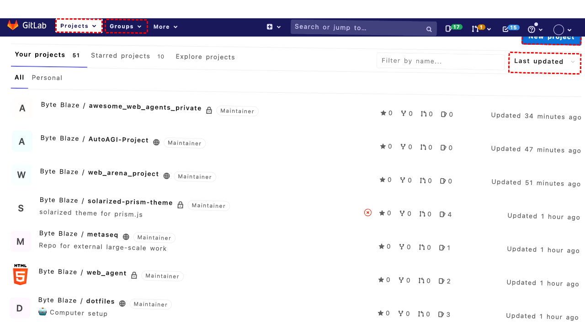
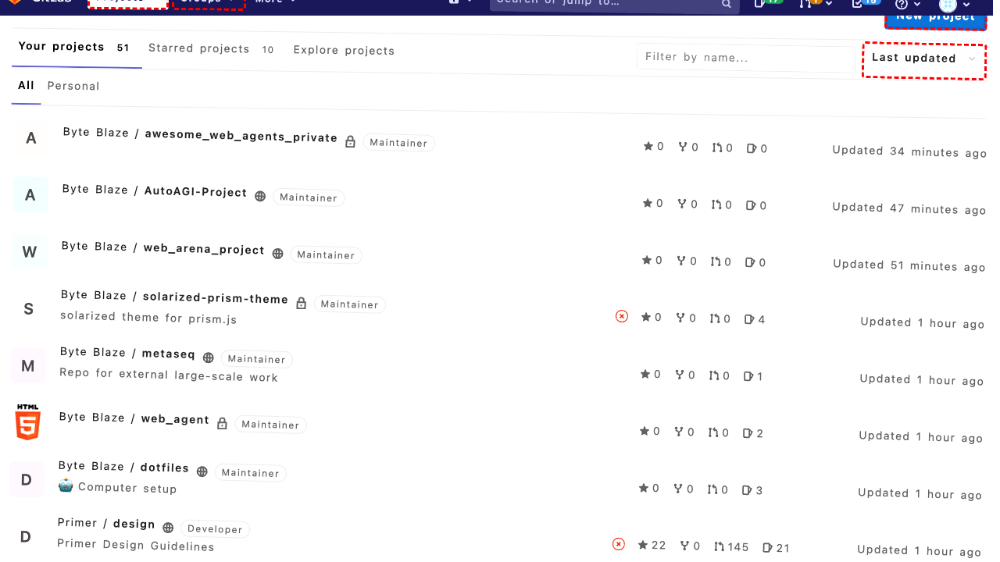
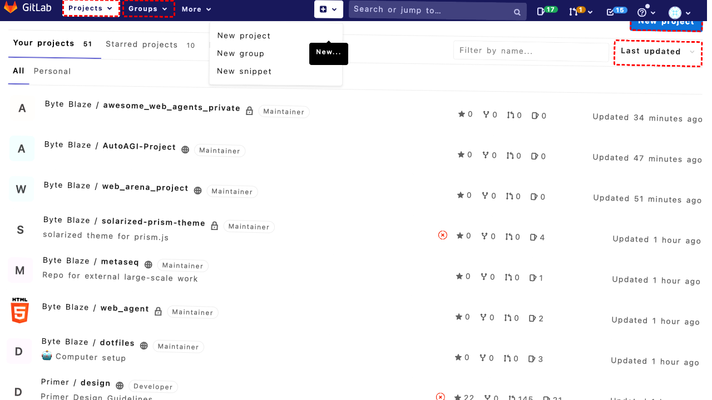
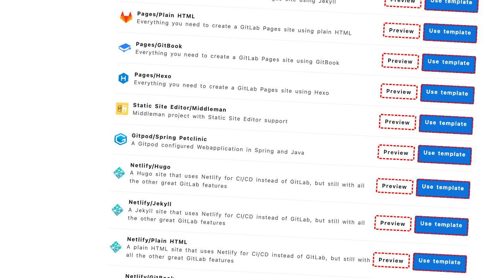
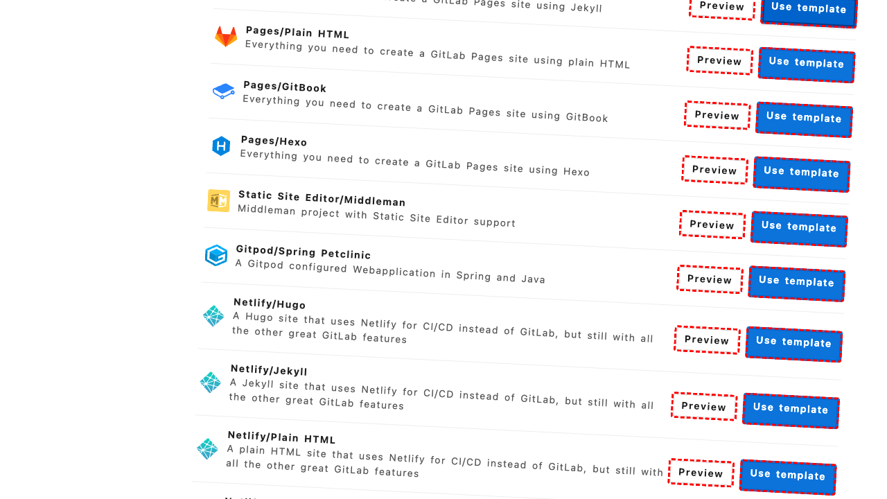
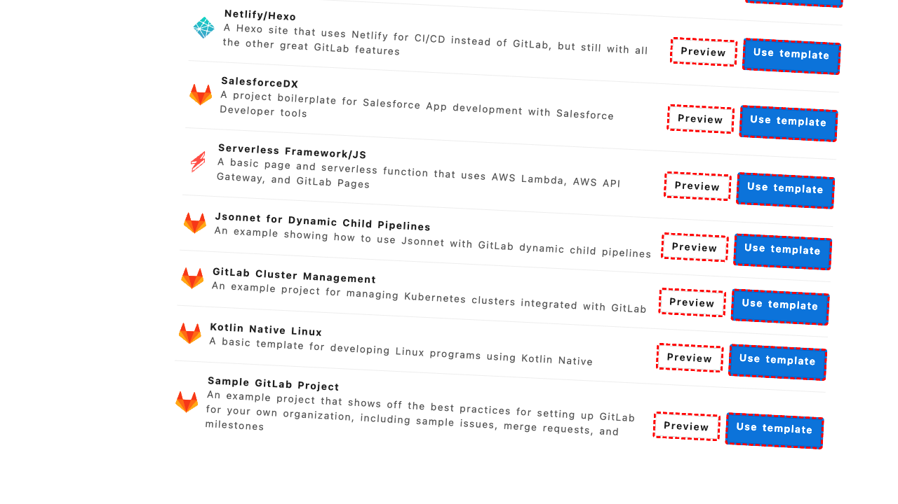

## Intent

Create a private JEKYLL repository called "11711_gitlab" using the right template to speed up development.

## RM

Thoughts: The user's intent is to create a private Jekyll repository called "11711_gitlab" using the right template. The action history shows the agent clicked various elements (likely template selection steps) and then navigated to the project creation page. However, the final state indicates that the agent has only selected the "Pages/Jekyll" template but has not proceeded to the project configuration page to set the project name or visibility. The agent's response is "None," and the final state does not confirm that the repository was created with the specified name and privacy settings. Since this is a content modification task (creating a repository), the agent's actions are insufficient as the repository creation process is incomplete.

Status: failure

## Final Response 

## Captions

===============Looking at the current page, I can see we're on the GitLab dashboard in the Projects section. To create a new private Jekyll repository called "11711_gitlab" using a template, I need to click the "New project" button that's visible in the accessibility tree.

The "New project" link has bid 270 according to the accessibility tree. Clicking this should take us to the project creation page where we can select templates and configure repository settings.
===============Looking at the error message, the click action failed because another element (bid "225" - the Byte Blaze profile link) was intercepting pointer events and covering the "New project" button. This suggests there might be some overlay or dropdown menu interfering.

Let me try a different approach. I can see there's also a "New..." button in the top navigation bar with bid 138. This might be an alternative way to access the project creation functionality.
===============Looking at the current situation, the previous click on "New..." (bid 138) should have opened a dropdown menu. According to the accessibility tree, this dropdown contains options for "New project", "New group", and "New snippet". Since we want to create a new project, I should click on the "New project" option in this dropdown menu.

The accessibility tree shows that the "New project" link in the dropdown has bid 144.
===============Looking at the current state, I can see we're on the "New Project" page in GitLab. The accessibility tree shows three main options:
1. "Create blank project" (bid 278)
2. "Create from template" (bid 285)
3. "Import project" (bid 292)

Since the goal is to create a Jekyll repository using a template to speed up development, I should click on the "Create from template" option. This will take us to the template selection page where we can find and use a Jekyll template.
===============Looking at the current page state, I can see we're already on the "Create from template" page (URL: http://172.26.116.102:8080/projects/new#create_from_template). The accessibility tree shows various template options including "Pages/Jekyll" which is exactly what we need for creating a Jekyll repository.

I can see the "Pages/Jekyll" template with the radio button that has bid 527. I need to select this template by clicking the radio button, then proceed to configure the project with the name "11711_gitlab" and set it as private.
===============Looking at the error message, the click on the radio button (bid 527) is failing because the label element (bid 528) is intercepting pointer events. This is a common issue where the actual clickable area is the label rather than the radio button itself.

The accessibility tree shows that bid 528 is the label for the "Use template" text associated with the Pages/Jekyll template. Since the label is intercepting clicks, I should click on the label instead of the radio button to select the template.
===============Looking at the current state, I can see that we're on the "Create from template" page and I've successfully selected the "Pages/Jekyll" template by clicking the label (bid 528). Now I need to proceed with creating the project.

The next step would typically be to click a "Next" or "Create project" button to move to the project configuration page where I can set the project name to "11711_gitlab" and configure it as private. However, I don't see such a button in the current accessibility tree.

Let me scroll down to see if there are more options or a continue button that's not currently visible in the viewport.
===============Looking at the current situation, I've successfully selected the "Pages/Jekyll" template and scrolled down. Now I need to find and click the button that will take me to the project configuration page where I can set the project name to "11711_gitlab" and configure it as private.

The accessibility tree doesn't show a clear "Next" or "Create project" button in the visible portion, but after scrolling, there should be more content available. Let me try scrolling further to reveal any hidden buttons or continue options that might be below the current viewport.
===============Looking at the current situation, I've successfully selected the "Pages/Jekyll" template and scrolled down. The goal is to create a private repository called "11711_gitlab" using this template. After selecting a template, GitLab typically redirects to a project configuration page where I can set the project name, visibility, and other settings.

Since I don't see any "Next" or "Continue" buttons in the current accessibility tree after scrolling, it's possible that selecting the template automatically redirected us to the project configuration page, or there might be a button that wasn't captured in the accessibility tree. Let me try navigating directly to the project creation URL with the template pre-selected, or look for any form elements that might allow me to proceed.

Let me first check if there are any form fields or buttons that might have appeared after template selection by examining the accessibility tree more carefully. I notice there's a "LabelText" element at the very end (bid 991) that might contain additional form elements. Let me try interacting with it or see if there are any other actionable elements.
===============Looking at the current situation, I've successfully selected the "Pages/Jekyll" template but haven't yet proceeded to the project configuration page where I can set the project name and visibility. The accessibility tree doesn't show a clear "Next" or "Continue" button, which suggests that either:

1. The template selection automatically redirects to the next step, or
2. There's a button that wasn't captured in the accessibility tree

Let me try navigating directly to the project creation page with the template parameter, as GitLab often uses URL parameters for template selection. Since we're currently at `/projects/new#create_from_template`, I should try going to the main project creation URL to see if the template selection is preserved.

## Images












## Main Prompt

```md
User Intent: Create a private JEKYLL repository called "11711_gitlab" using the right template to speed up development.

Action History:
1: click("270")
2: click("138")
3: click("144")
4: click("285")
5: click("527")
6: click("528")
7: scroll(0, 300)
8: scroll(0, 500)
9: noop(1000)
10: goto("http://172.26.116.102:8080/projects/new")


The detailed final state of the webpage:

```md
Looking at the current situation, I've successfully selected the "Pages/Jekyll" template but haven't yet proceeded to the project configuration page where I can set the project name and visibility. The accessibility tree doesn't show a clear "Next" or "Continue" button, which suggests that either:

1. The template selection automatically redirects to the next step, or
2. There's a button that wasn't captured in the accessibility tree

Let me try navigating directly to the project creation page with the template parameter, as GitLab often uses URL parameters for template selection. Since we're currently at `/projects/new#create_from_template`, I should try going to the main project creation URL to see if the template selection is preserved.
```

Bot response to the user: None.
```
