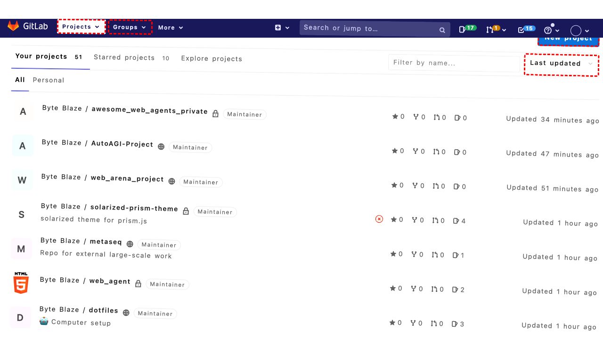
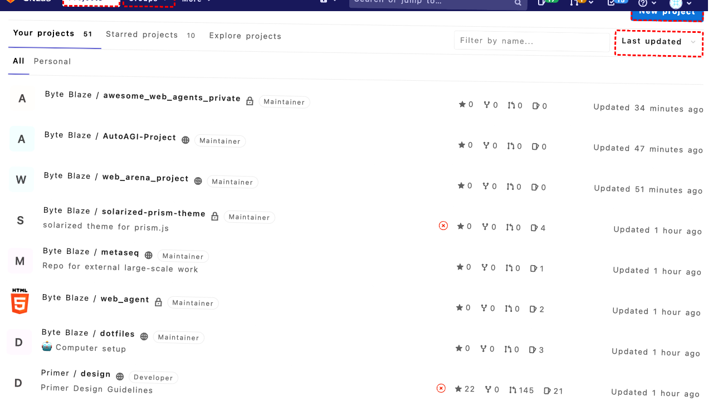
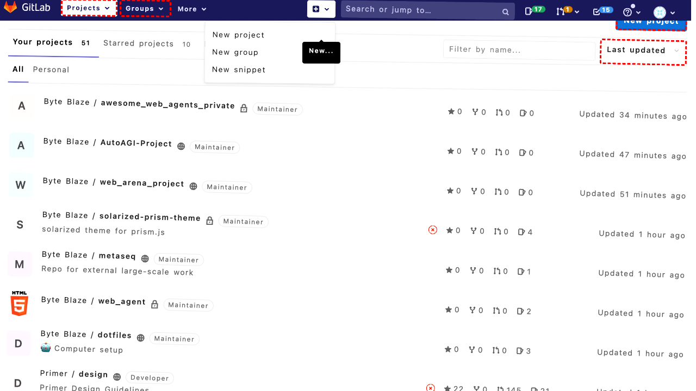
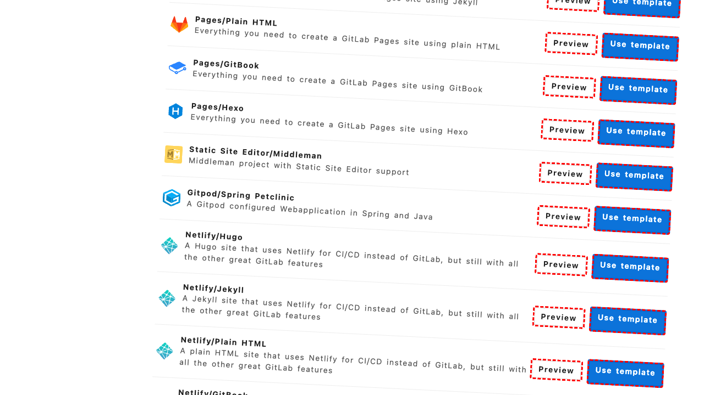
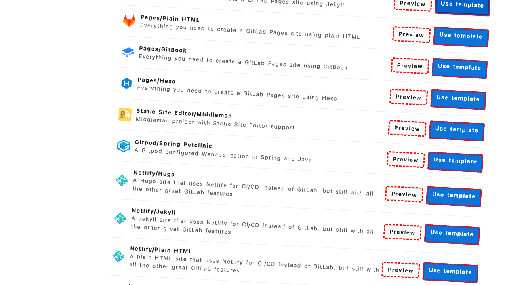
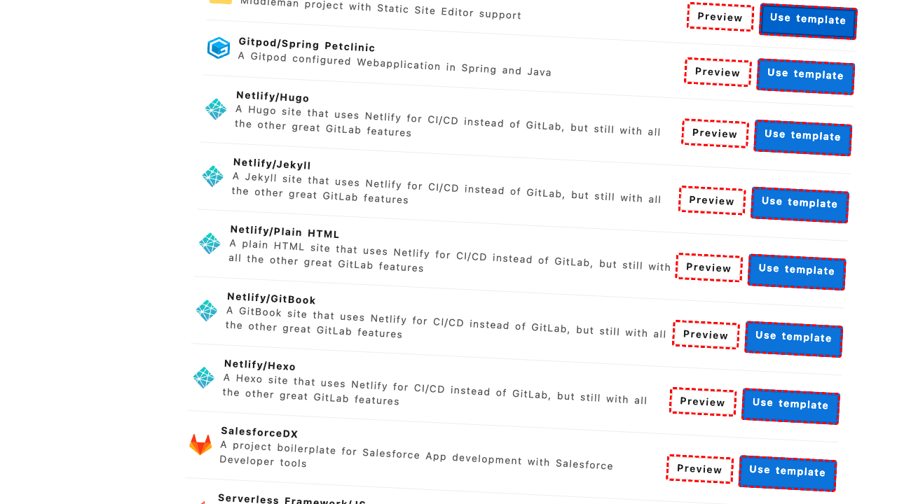

## Intent

Create an issue asking about do they have any plan on supporting Webagent in the next quater in huggingface dataset.

## RM

Thoughts: The user's intent is to create an issue asking about plans for supporting Webagent in HuggingFace datasets in the next quarter. This is a content modification task, as the user wants to modify the webpage by creating a new issue. The action history shows the agent successfully filled in the issue title and description with the correct content and clicked to submit. The final state confirms the issue was created with the intended title and description. Since the task is content modification, I only need to examine the action history and final state, which both indicate success.

Status: success

## Final Response "Successfully created issue #1 titled 'HuggingFace Dataset Support Plans for Next Quarter' in the webagent repository. The issue asks about plans for supporting Webagent in HuggingFace datasets in the next quarter and requests timeline and scope details if available."

## Captions

===============Looking at the current page, I can see I'm on the GitLab dashboard with a list of projects. The goal is to create an issue asking about plans for supporting Webagent in the next quarter in HuggingFace dataset.

First, I need to navigate to a relevant repository where this issue should be created. Since this is about HuggingFace dataset support for Webagent, I should either:
1. Find an existing HuggingFace-related repository
2. Or navigate to one of the webagent-related repositories shown in the list

I can see several relevant repositories in the project list:
- "Byte Blaze / awesome_web_agents" (bid 284)
- "Byte Blaze / awesome_webagent" (bid 464)
- "Byte Blaze / webagent" (bid 493)

Let me start by navigating to the "Byte Blaze / webagent" repository since it seems most directly related to Webagent.
===============Looking at the current page, I can see I'm already on the "Byte Blaze / webagent" repository page (as indicated by the URL and page title). The repository appears to be empty with no files yet, but I can see the navigation menu includes an "Issues" section.

Since the goal is to create an issue asking about HuggingFace dataset support plans, I should navigate to the Issues section and then create a new issue. I can see there's an "Issues 0" link in the sidebar navigation, which indicates there are currently no issues in this repository.

Let me click on the "Issues" link to navigate to the issues page where I can create a new issue.
===============Looking at the current state, I can see I'm on the webagent repository's issues page. The page shows "The Issue Tracker is the place to add things that need to be improved or solved in a project" and there's a "New issue" button available. Since I need to create an issue about HuggingFace dataset support plans, I should click the "New issue" button to start creating the issue.
===============Looking at the current page, I can see I'm on the "New Issue" page for the webagent repository. The page has a title field (bid 441) that's currently focused, a description textbox (bid 484), and a "Submit issue" button (bid 656) that's currently disabled (likely because the title field is empty).

Since I need to create an issue asking about HuggingFace dataset support plans for the next quarter, I should:
1. First fill in the title field with an appropriate title
2. Then fill in the description with the detailed question
3. Finally submit the issue

Let me start by filling the title field with a clear title about the HuggingFace dataset support inquiry.
===============Looking at the current state, I can see that I've successfully filled the title field with "HuggingFace Dataset Support Plans for Next Quarter". Now I need to fill the description field with the actual question about HuggingFace dataset support for Webagent in the next quarter. The description textbox has bid 484, and I can see it's available in the accessibility tree. I should write a clear description asking about their plans for supporting Webagent in HuggingFace datasets in the upcoming quarter.
===============Looking at the current state, I can see that both the title and description fields have been filled with appropriate content for the issue about HuggingFace dataset support. The title field (bid 441) contains "HuggingFace Dataset Support Plans for Next Quarter" and the description field (bid 484) contains the detailed question about Webagent support in HuggingFace datasets.

Now I need to submit the issue. I can see there's a "Submit issue" button (bid 656) available at the bottom of the form. Since all required fields appear to be filled (the title is required and has content), the submit button should now be enabled and ready to be clicked.
===============Looking at the current state, I can see that the issue creation was successful - I'm now on the issue page for "HuggingFace Dataset Support Plans for Next Quarter (#1)" as shown in the URL and page title. The issue has been created with the title and description I provided, and it shows as "Open" with the content I wrote about asking for HuggingFace dataset support plans for Webagent in the next quarter.

Since the goal has been accomplished (creating the issue asking about HuggingFace dataset support plans), I should inform the user that the task has been completed successfully.

## Images









## Main Prompt

```md
User Intent: Create an issue asking about do they have any plan on supporting Webagent in the next quater in huggingface dataset.

Action History:
1: click("493")
2: click("254")
3: click("439")
4: fill("441", "HuggingFace Dataset Support Plans for Next Quarter")
5: fill("484", "Do you have any plans to support Webagent in HuggingFace datasets in the next quarter? If so, could you please share the timeline and scope of this support?")
6: click("656")
7: send_msg_to_user("Successfully created issue #1 titled 'HuggingFace Dataset Support Plans for Next Quarter' in the webagent repository. The issue asks about plans for supporting Webagent in HuggingFace datasets in the next quarter and requests timeline and scope details if available.")


The detailed final state of the webpage:

```md
Looking at the current state, I can see that the issue creation was successful - I'm now on the issue page for "HuggingFace Dataset Support Plans for Next Quarter (#1)" as shown in the URL and page title. The issue has been created with the title and description I provided, and it shows as "Open" with the content I wrote about asking for HuggingFace dataset support plans for Webagent in the next quarter.

Since the goal has been accomplished (creating the issue asking about HuggingFace dataset support plans), I should inform the user that the task has been completed successfully.
```

Bot response to the user: "Successfully created issue #1 titled 'HuggingFace Dataset Support Plans for Next Quarter' in the webagent repository. The issue asks about plans for supporting Webagent in HuggingFace datasets in the next quarter and requests timeline and scope details if available.".
```
