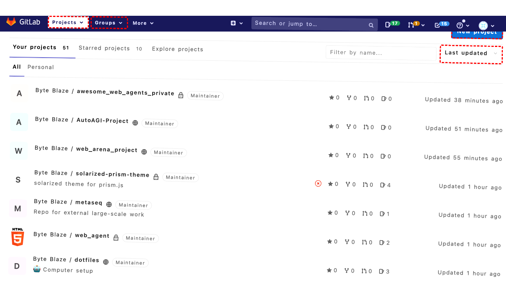

## Intent

create a new group "n-lab" with members patou, egpast, westurner, jontutcher

## RM

Thoughts: The user's intent is to create a new group "n-lab" with specific members. The action history shows the agent successfully created the group "n-lab" (actions 7-9) and received a success message. However, the agent did not add any members (patou, egpast, westurner, jontutcher) to the group, as indicated by the final state which only mentions the group creation and notes that the "Members" link is available but not yet used. Since the task requires both creating the group and adding the specified members, and the members were not added, the task is incomplete and thus a failure.

Status: failure

## Final Response 

## Captions

===============Looking at the current page, I can see we're on the GitLab dashboard in the "Projects" section. To create a new group with members, I need to navigate to the Groups section first. I can see there's a "Groups" button in the left navigation menu with the text "Groups".

The goal is to create a new group called "n-lab" with members patou, egpast, westurner, and jontutcher. The first step is to navigate to the Groups section where I can create a new group.
===============Looking at the current page, I can see that clicking the "Groups" button has expanded the groups section in the left navigation. I can now see options for "Your groups" and "Explore groups". To create a new group, I should navigate to the "Your groups" page where I can find the option to create a new group.
===============Looking at the current state, I can see we're on the Groups dashboard page. The accessibility tree shows there's a "New group" link available with ID 223. Since the goal is to create a new group called "n-lab" with specific members, I should click this "New group" link to start the group creation process.
===============Looking at the error message, the click on "New group" (bid 223) failed because another element (the user profile dropdown with bid 186) was intercepting pointer events. This suggests there might be an overlay or dropdown menu that's currently open and blocking interactions.

I can see from the current page state that we're still on the Groups dashboard. The "New group" link is visible but being blocked. I should first try to close any open dropdowns by clicking elsewhere on the page, then retry clicking the "New group" link.

Let me click on a neutral area of the page (like the main heading "Groups") to potentially close any open dropdowns, then retry the "New group" link.
===============Looking at the error, there's an SVG element in the header that's intercepting pointer events and blocking clicks. This suggests there might be a persistent overlay or navigation element that's interfering.

Since clicking on the heading also failed due to the same issue, I should try a different approach. Let me scroll the page to potentially move the interfering element out of the way, then try clicking the "New group" link again.
===============Looking at the current situation, I can see that previous attempts to click on the "New group" link were blocked by other elements intercepting pointer events. The scroll action was successful, which may have moved the page content and potentially cleared any overlays or dropdowns that were interfering.

Now I can see from the accessibility tree that the "New group" link (bid 223) is still available and should be clickable. Since we've scrolled the page, the interfering elements may no longer be blocking interactions. I'll try clicking the "New group" link again to proceed with creating the group.
===============Looking at the error message, I can see that the user profile dropdown (bid 186) is persistently intercepting pointer events and blocking clicks on the "New group" link. This suggests the profile dropdown might be open or there's some overlay issue.

Since direct clicking isn't working due to this interference, I should try a different approach. Let me navigate directly to the new group creation URL using the goto action, which should bypass the need to click the blocked element.
===============Looking at the current state, I can see we're now on the "New Group" page as intended. The page shows the group creation form with fields for "Group name", "Group URL", "Group description", and "Visibility level".

Since the goal is to create a group called "n-lab" with specific members, I should first fill out the required group information. The "Group name" field (bid 236) is focused and required, so I'll start by entering the group name "n-lab".
===============Looking at the current state, I can see the group name "n-lab" has already been filled in the form (as shown in the accessibility tree where the textbox value is 'n-lab'). The form appears to be properly filled with the group name and URL automatically populated as "n-lab".

The next step is to create the group by clicking the "Create group" button. Once the group is created, I can then add the specified members (patou, egpast, westurner, jontutcher) to the group. The "Create group" button has bid 288.
===============Looking at the current state, I can see the group "n-lab" was successfully created (as indicated by the success message "Group 'n-lab' was successfully created." in the accessibility tree). Now I need to add the specified members (patou, egpast, westurner, jontutcher) to this group.

From the accessibility tree, I can see there's a "Members" link in the left navigation menu (bid 292) that will take me to the member management section where I can add users to the group.

## Images




## Main Prompt

```md
User Intent: create a new group "n-lab" with members patou, egpast, westurner, jontutcher

Action History:
1: click("77")
2: click("84")
3: click("223")
4: click("221")
5: scroll(0, 200)
6: click("223")
7: goto("http://172.26.116.102:8080/groups/new")
8: fill("236", "n-lab")
9: click("288")
10: click("292")


The detailed final state of the webpage:

```md
Looking at the current state, I can see the group "n-lab" was successfully created (as indicated by the success message "Group 'n-lab' was successfully created." in the accessibility tree). Now I need to add the specified members (patou, egpast, westurner, jontutcher) to this group.

From the accessibility tree, I can see there's a "Members" link in the left navigation menu (bid 292) that will take me to the member management section where I can add users to the group.
```

Bot response to the user: None.
```
