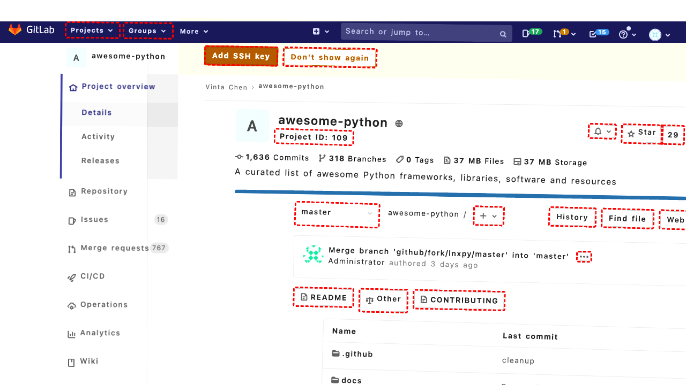
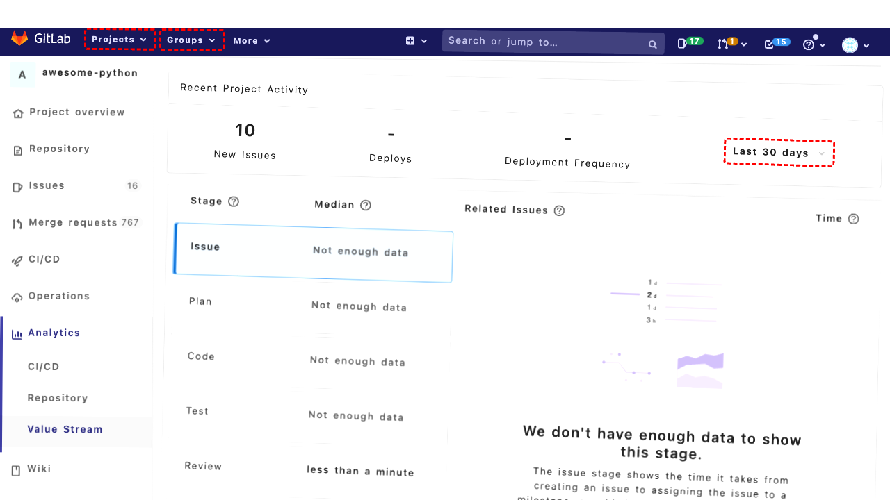
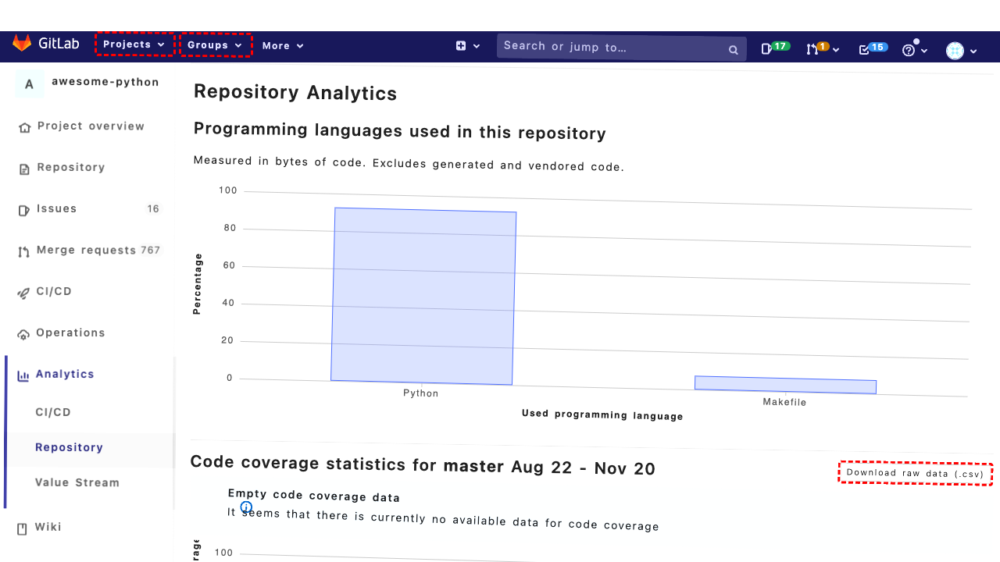
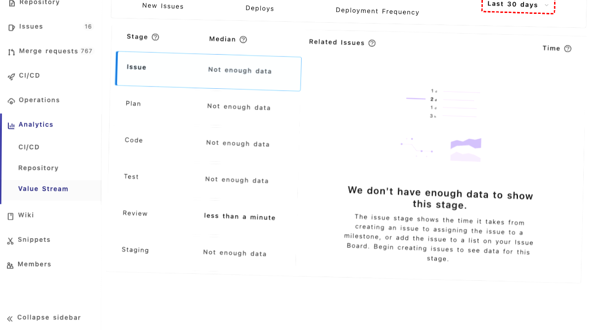
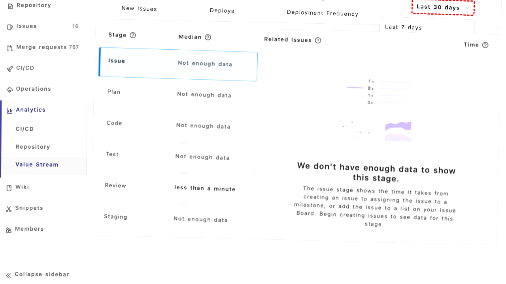
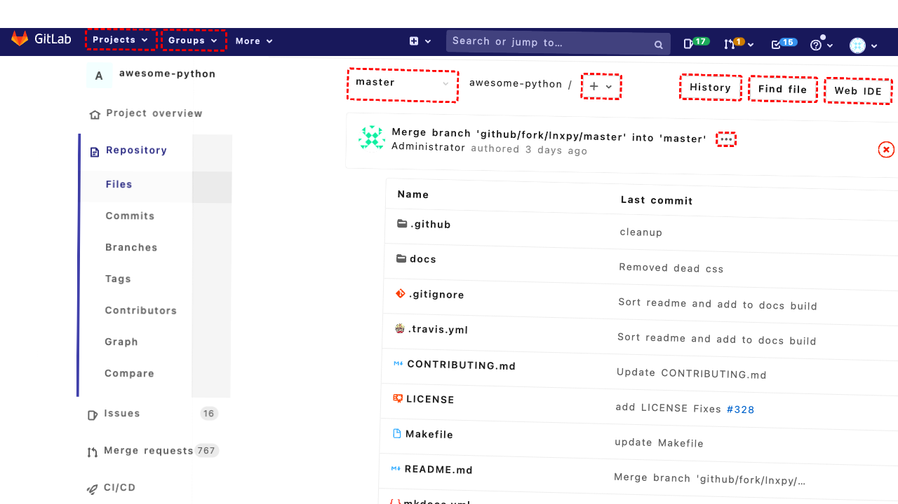
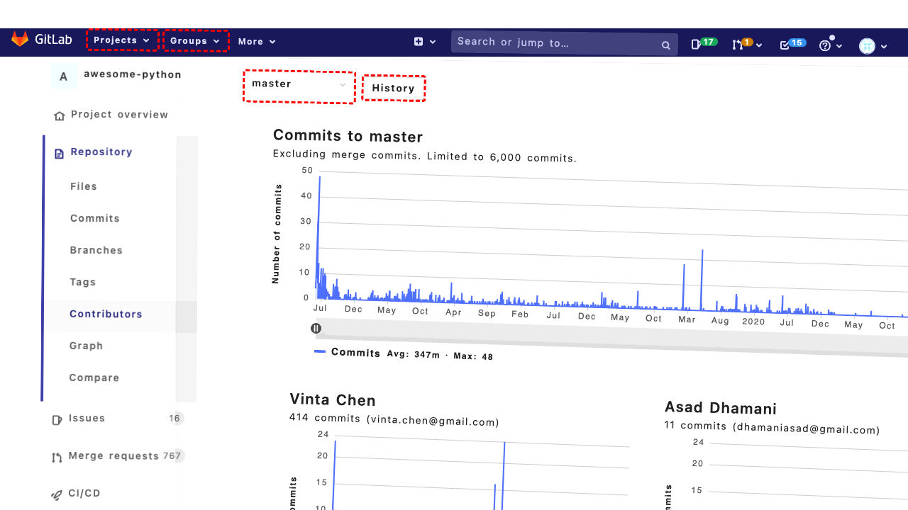

## Intent

create a new group "x-lab" with members JonasVautherin, dilipchandima, dawiss1337, bmyun, DCMJY

## RM

Thoughts: The user's intent is to create a new group "x-lab" with specific members, which falls under the "Content modification" task type. The action history shows that the agent successfully navigated to the group creation page, filled in the group name "x-lab", and proceeded to the members page. However, the agent only filled in the first member "JonasVautherin" and did not complete adding all specified members (JonasVautherin, dilipchandima, dawiss1337, bmyun, DCMJY). The final state indicates the agent is still on the members page with the "Add to group" button disabled, meaning no members have been successfully added yet. Since the task requires creating the group with all specified members and this was not completed, the execution is a failure.

Status: failure

## Final Response 

## Captions

===============Looking at the current page, I can see we're on the GitLab dashboard in the "Projects" section. To create a new group with members, I need to navigate to the Groups section first. I can see there's a "Groups" button in the left navigation menu.

The goal is to create a new group called "x-lab" with specific members. I should start by clicking on the Groups button to access group management.
===============Looking at the current state, I can see that I previously clicked on the "Groups" button (bid 77) which is now expanded. The expanded Groups menu shows options for "Your groups" and "Explore groups". To create a new group, I need to navigate to the groups management page where I can create a new group.

The "Your groups" link (bid 84) appears to be the appropriate next step to access group management and creation functionality.
===============Looking at the current state, I can see we're now on the Groups dashboard page. The accessibility tree shows there's a "New group" link (bid 223) available, which is exactly what I need to create the new group "x-lab". This link should take me to the group creation form where I can specify the group name and add members.
===============Looking at the error message, I can see that the "New group" link (bid 223) is being intercepted by another element - specifically the user profile dropdown (bid 186) from the header. This is a common UI issue where overlapping elements prevent clicks.

The error shows that the element is visible, enabled, and stable, but the click is being intercepted. I need to try a different approach. Let me scroll the page to potentially move the interfering element out of the way, then try clicking the "New group" link again.
===============Looking at the current situation, I can see that my previous attempt to click the "New group" link was intercepted by the user profile dropdown. After scrolling down 200 pixels, I should now try clicking the "New group" link again since the scroll may have repositioned the elements and reduced the overlap.

The "New group" link (bid 223) is still the correct element to click to start creating the new group "x-lab" with the specified members.
===============Looking at the error, I can see that the "New group" link (bid 223) is still being intercepted by the user profile dropdown (bid 186) even after scrolling. The issue is that the header element is overlapping and intercepting clicks.

Since direct clicking isn't working due to the UI overlap, I should try a different approach. Let me navigate directly to the new group creation URL using the goto action, as I can see from the accessibility tree that the "New group" link points to "/groups/new".
===============Looking at the current state, I can see we're now on the "New Group" page (as indicated by the active tab title and URL). The accessibility tree shows the group creation form is fully loaded with all the necessary fields:

- Group name textbox (bid 236, focused)
- Group URL textbox (bid 246)
- Group description textbox (bid 252)
- Visibility level options
- Create group button (bid 288)

Since we're already on the correct page for creating a new group, I can proceed to fill out the form with the group name "x-lab" as specified in the goal. The group name field is already focused, so I can directly fill it.
===============Looking at the current state, I can see that the group name field (bid 236) has already been filled with "x-lab" from my previous action. The form appears to be ready for submission since all required fields (group name and group URL) are populated.

The goal is to create a group called "x-lab" with specific members, but I notice that adding members typically happens after group creation in GitLab's workflow. The current form doesn't show member addition fields, which suggests members are added after the group is created.

I should now click the "Create group" button to create the group first, then navigate to the member management section to add the specified users.
===============Looking at the current state, I can see the group "x-lab" has been successfully created (as indicated by the success message "Group 'x-lab' was successfully created."). The page shows the group details page for "x-lab" with various navigation options including a "Members" link (bid 292).

Since the group has been created successfully, I now need to add the specified members (JonasVautherin, dilipchandima, dawiss1337, bmyun, DCMJY) to the group. The "Members" link in the left navigation menu is the correct place to manage group members.
===============Looking at the current state, I can see we're now on the Members page for the "x-lab" group. The accessibility tree shows the member management interface with:

- A search textbox (bid 361) for "Search for a user"
- A role selection dropdown (bid 368) currently set to "Guest"
- An "Add to group" button (bid 383) that is currently disabled

To add the specified members, I need to search for each user and add them with appropriate roles. The process would be to search for a user, select them from search results, choose a role, and click "Add to group". However, I notice the "Add to group" button is currently disabled, which suggests I need to first search for and select a user to enable it.

Let me start by searching for the first user "JonasVautherin" to see if the system can find them and enable the add button.

## Images












## Main Prompt

```md
User Intent: create a new group "x-lab" with members JonasVautherin, dilipchandima, dawiss1337, bmyun, DCMJY

Action History:
1: click("77")
2: click("84")
3: click("223")
4: scroll(0, 200)
5: click("223")
6: goto("http://172.26.116.102:8080/groups/new")
7: fill("236", "x-lab")
8: click("288")
9: click("292")
10: fill("361", "JonasVautherin")


The detailed final state of the webpage:

```md
Looking at the current state, I can see we're now on the Members page for the "x-lab" group. The accessibility tree shows the member management interface with:

- A search textbox (bid 361) for "Search for a user"
- A role selection dropdown (bid 368) currently set to "Guest"
- An "Add to group" button (bid 383) that is currently disabled

To add the specified members, I need to search for each user and add them with appropriate roles. The process would be to search for a user, select them from search results, choose a role, and click "Add to group". However, I notice the "Add to group" button is currently disabled, which suggests I need to first search for and select a user to enable it.

Let me start by searching for the first user "JonasVautherin" to see if the system can find them and enable the add button.
```

Bot response to the user: None.
```
