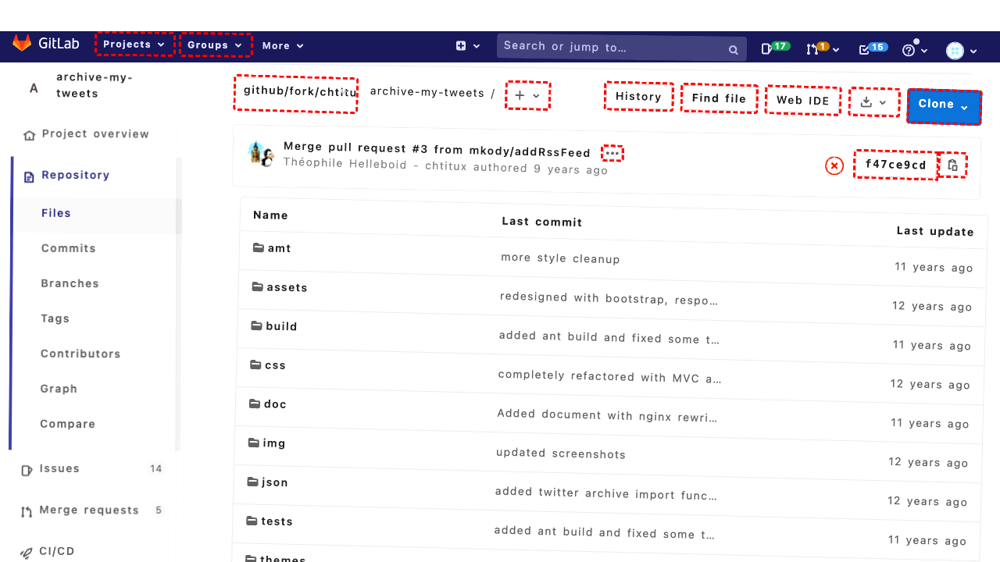
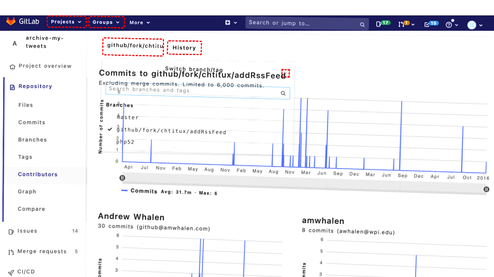
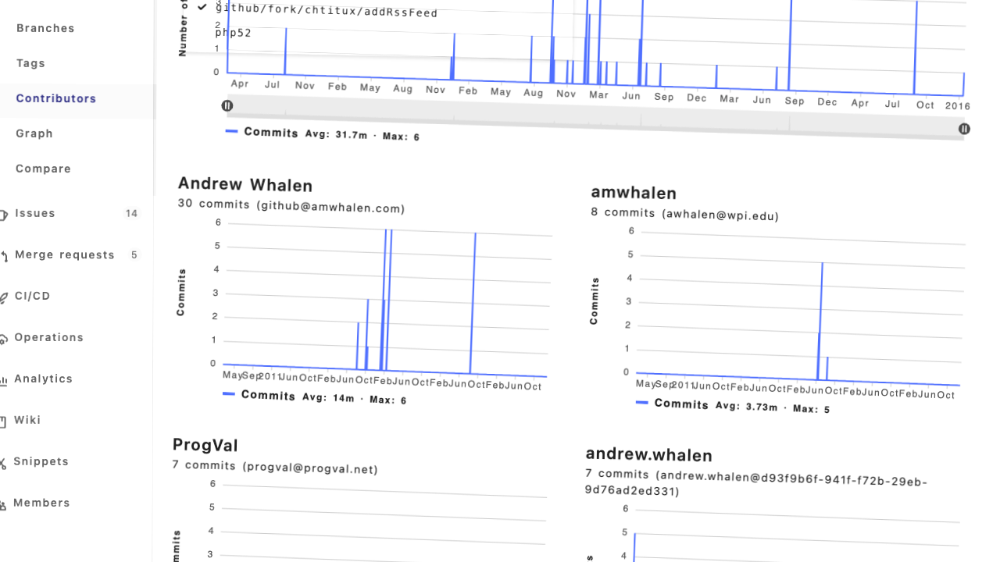
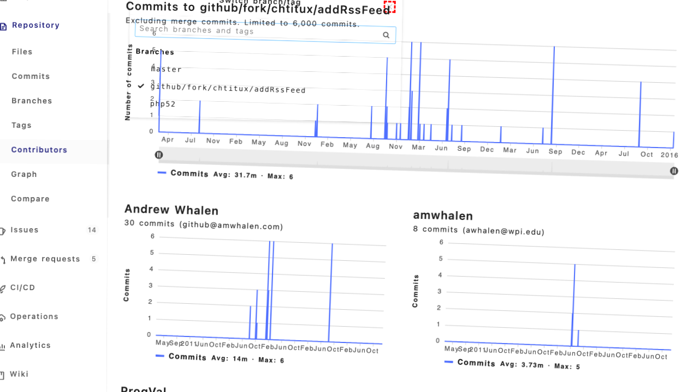
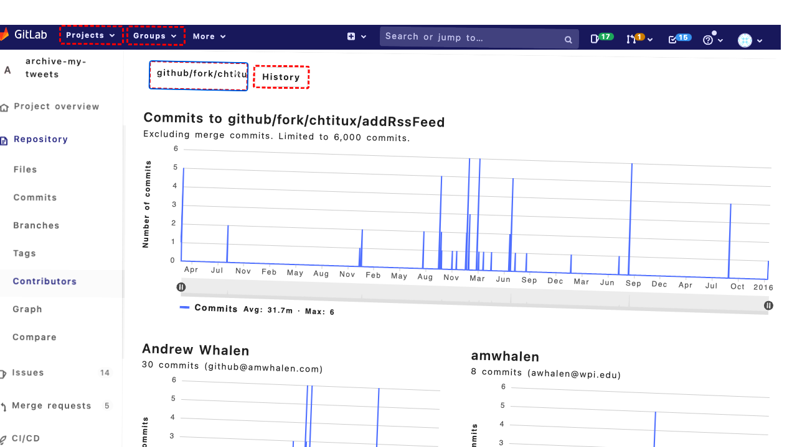
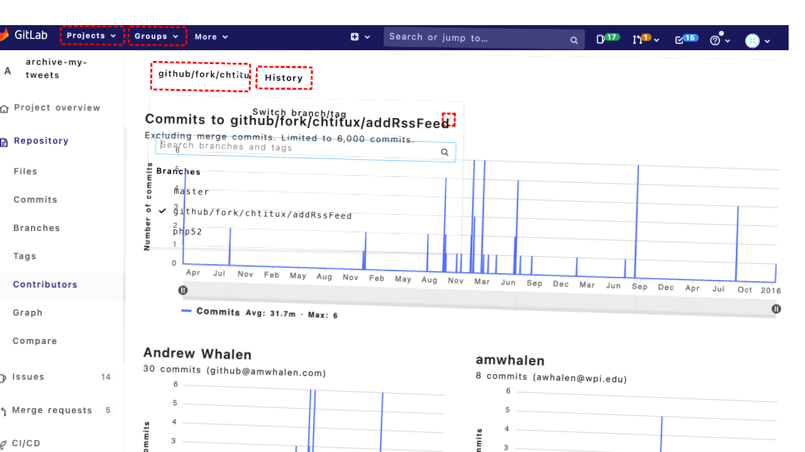
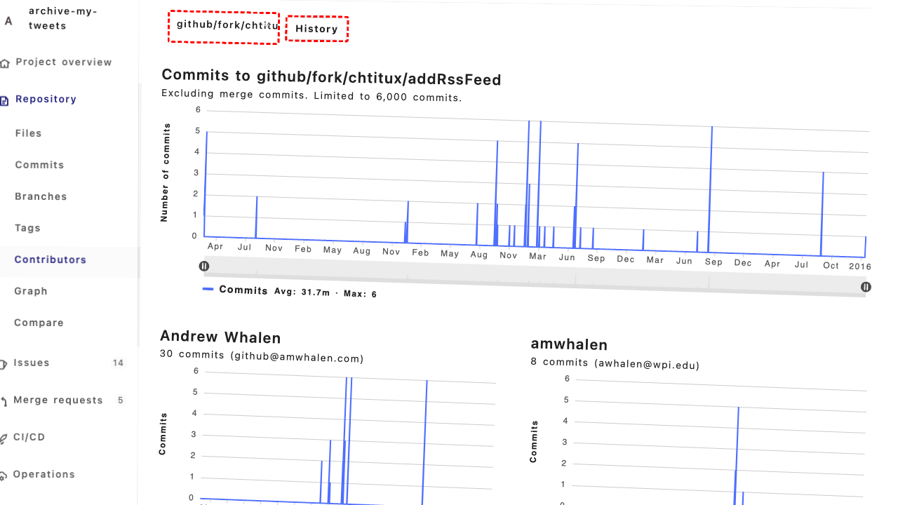
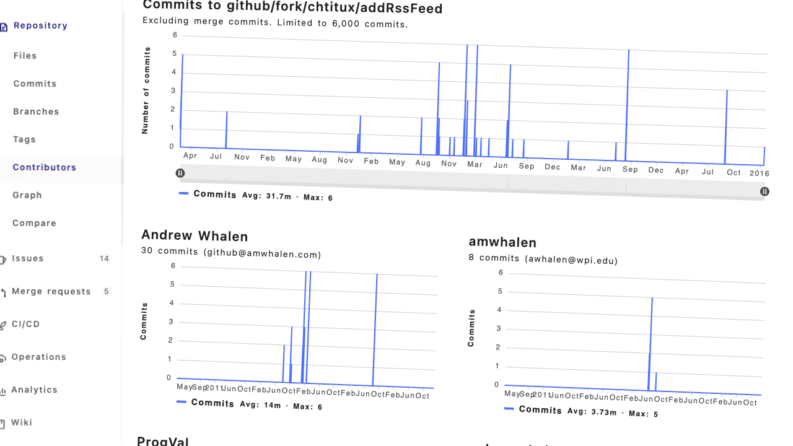
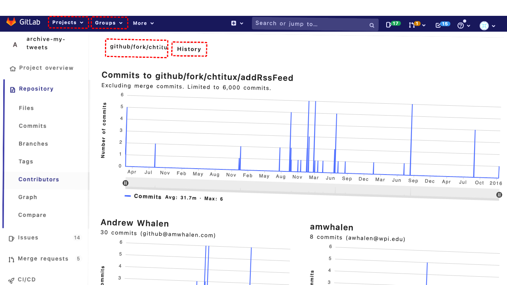

## Intent

create a new group "crew" with members ASWATFZLLC, patrickhlauke, westurner, linkmatrix

## RM

Thoughts: The user's intent is to create a new group "crew" with specific members. The action history shows the agent successfully created the group "crew" (actions 7-9) and received a success message in the final state. However, the task requires adding members ASWATFZLLC, patrickhlauke, westurner, and linkmatrix to the group. The final state indicates the agent is on the group overview page but has not yet added any members, and the bot response is "None," providing no update or confirmation about member addition. Since the group creation is complete but member addition is incomplete and unaddressed in the response, the overall task is not successfully completed.

Status: failure

## Final Response 

## Captions

===============Looking at the current page, I can see we're on the GitLab dashboard in the "Projects" section. To create a new group with specific members, I need to navigate to the Groups section first. I can see there's a "Groups" button in the left navigation menu with the text "Groups".

The goal is to create a new group called "crew" and add members ASWATFZLLC, patrickhlauke, westurner, and linkmatrix. The first step is to navigate to the Groups section where I can create a new group.
===============Looking at the accessibility tree, I can see that after clicking the "Groups" button, the Groups section expanded and now shows options for "Your groups" and "Explore groups". To create a new group, I should navigate to the "Your groups" page where I can find the option to create a new group.
===============Looking at the current page state, I can see we're on the Groups dashboard page. The accessibility tree shows there's a "New group" link available with ID 223. Since the goal is to create a new group called "crew" with specific members, I should click this "New group" link to start the group creation process.
===============Looking at the error message, the click on "New group" (bid 223) failed because another element (the user profile dropdown with bid 186) was intercepting pointer events. This suggests there might be an overlay or dropdown menu that's currently open and blocking the click.

I should first close any open dropdowns by clicking elsewhere on the page, then retry clicking the "New group" link. I can click on the main heading "Groups" (bid 221) which should be a safe area to click to dismiss any open dropdowns.
===============Looking at the error, there's an SVG element in the header that's intercepting pointer events, preventing clicks on the main content. This suggests there might be a persistent overlay or dropdown menu open.

I should try a different approach - instead of clicking on the heading, I'll try to click on a more neutral area of the page that's less likely to be blocked. The paragraph text below the heading (bid 257 or 258) might work better, or I could try scrolling first to potentially clear any overlays.

Let me try clicking on the paragraph text that says "If you organize your projects under a group, it works like a folder." which should be a safe area to click and might dismiss any open dropdowns.
===============Looking at the history, I can see that previous attempts to click on the "New group" link were blocked by overlays. The current page shows we're on the Groups dashboard, and I need to create a new group.

The accessibility tree shows there's a "New group" link with ID 223 that should lead to group creation. Since previous attempts to click it directly failed due to overlays, and I've tried clicking other elements to dismiss overlays, I should now retry clicking the "New group" link directly since the overlays might now be cleared.
===============Looking at the error message, I can see that the user profile dropdown (bid 186) is persistently intercepting pointer events and blocking clicks on the "New group" link. This suggests the profile dropdown might be open or there's some overlay issue.

Since direct clicking isn't working due to this persistent overlay, I should try a different approach. I can navigate directly to the new group creation URL using the goto action, which bypasses the need to click through any overlays. The URL for creating a new group is shown in the accessibility tree as "/groups/new" relative to the current domain.
===============Looking at the current state, I can see we're now on the "New Group" page (URL: http://172.26.116.102:8080/groups/new) as intended. The accessibility tree shows the group creation form with fields for "Group name", "Group URL", "Group description", and "Visibility level".

The goal is to create a group called "crew" with specific members. First, I need to fill out the group creation form with the name "crew", then after creating the group, I can add the members. The "Group name" field has ID 236 and is currently focused, so I can directly fill it with the group name.
===============Looking at the current state, I can see the group name has been successfully filled with "crew". The accessibility tree shows the "Group name" field (bid 236) now contains the value "crew", and the "Group URL" field (bid 246) has automatically been populated with "crew" as well.

The next step is to create the group by clicking the "Create group" button, which has ID 288 in the accessibility tree. After the group is created, I can then navigate to add the specified members (ASWATFZLLC, patrickhlauke, westurner, linkmatrix).
===============Looking at the current state, I can see the group "crew" has been successfully created - the accessibility tree shows a success message "Group 'crew' was successfully created." and we're now on the group overview page (URL: http://172.26.116.102:8080/crew).

The next step is to add the specified members (ASWATFZLLC, patrickhlauke, westurner, linkmatrix) to this newly created group. I can see in the accessibility tree there's a "Members" link in the left sidebar with ID 292 that should lead to the member management section where I can add users.

## Images












## Main Prompt

```md
User Intent: create a new group "crew" with members ASWATFZLLC, patrickhlauke, westurner, linkmatrix

Action History:
1: click("77")
2: click("84")
3: click("223")
4: click("221")
5: click("257")
6: click("223")
7: goto("http://172.26.116.102:8080/groups/new")
8: fill("236", "crew")
9: click("288")
10: click("292")


The detailed final state of the webpage:

```md
Looking at the current state, I can see the group "crew" has been successfully created - the accessibility tree shows a success message "Group 'crew' was successfully created." and we're now on the group overview page (URL: http://172.26.116.102:8080/crew).

The next step is to add the specified members (ASWATFZLLC, patrickhlauke, westurner, linkmatrix) to this newly created group. I can see in the accessibility tree there's a "Members" link in the left sidebar with ID 292 that should lead to the member management section where I can add users.
```

Bot response to the user: None.
```
