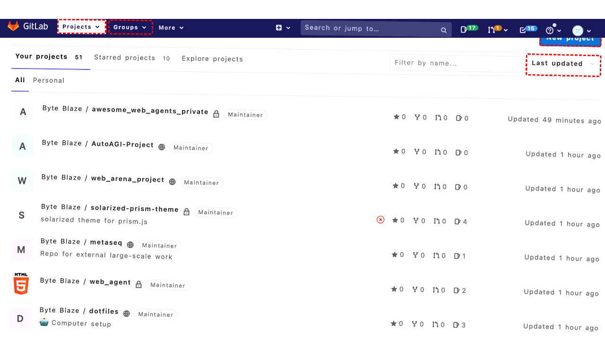

## Intent

create a new group "coding_friends" with members qhduan, Agnes-U

## RM

Thoughts: The user's intent is to create a new group named "coding_friends" with members qhduan and Agnes-U, which falls under the "Content modification" task type. The action history shows the agent attempted to navigate and interact with elements, including clicking on ID 125 (the "New..." dropdown), but there is no evidence in the action history or the final state that the group was actually created—specifically, no actions to input the group name or add the specified members. The final state only describes a plan to click the "New..." dropdown, and the bot provided no response. Since the content modification (group creation) was not completed, the task is a failure.

Status: failure

## Final Response 

## Captions

===============Looking at the goal to create a new group "coding_friends" with members qhduan and Agnes-U, I can see that I'm currently on the GitLab dashboard page. To create a group, I need to navigate to the Groups section first. I can see there's a "Groups" button in the left navigation menu with ID 77.

Let me click on the Groups button to navigate to the groups management page where I can create a new group.
===============Looking at the current state, I can see I'm on the GitLab dashboard and I need to create a new group. I can see the "Groups" button in the left navigation menu is expanded (expanded=True) and there are options for "Your groups" and "Explore groups". Since I want to create a new group, I should navigate to the groups management page first.

The "Groups" button has ID 77, so I'll click on it to access the groups section where I should be able to find an option to create a new group.
===============Looking at the current state, I can see I'm on the GitLab dashboard page and need to create a new group. I can see the "Groups" button in the left navigation menu (ID 77) which appears to be focused but not expanded (expanded=False). Since I need to create a new group, I should first navigate to the groups section where I can find the option to create a new group.

Let me click on the Groups button to access the groups management interface.
===============Looking at the current state, I can see I'm on the GitLab dashboard page. I need to create a new group called "coding_friends" with members qhduan and Agnes-U.

From the accessibility tree, I can see there's a "Groups" button in the left navigation menu with ID 77 that appears to be expanded (expanded=True). Since I need to create a new group, I should first navigate to the groups management page where I can find the option to create a new group.

Let me click on the "Your groups" link (ID 84) which should take me to the groups management page where I can create a new group.
===============Looking at the current state, I can see I'm already on the Groups page (URL: http://172.26.116.102:8080/dashboard/groups) based on the active tab information. The accessibility tree shows there's a "New group" link with ID 223 available on this page. Since I need to create a new group called "coding_friends", I should click this "New group" link to start the group creation process.
===============Looking at the error message, I can see that the "New group" link (ID 223) is being blocked by another element - specifically the profile dropdown (ID 186) from the header is intercepting pointer events. This is a common UI issue where overlapping elements prevent clicks.

Since I'm already on the Groups page and need to create a new group, I should try a different approach. Let me scroll the page to potentially move the blocking element out of the way, then try clicking the "New group" link again.
===============Looking at the current situation, I can see that I'm on the Groups page and need to create a new group. The previous attempt to click the "New group" link (ID 223) failed because it was being blocked by the profile dropdown element. After scrolling the page, the blocking element should now be out of the way, so I can try clicking the "New group" link again to start the group creation process.
===============Looking at the error message, I can see that the "New group" link (ID 223) is still being blocked by the profile dropdown element (ID 186) even after scrolling. The profile dropdown from the header is intercepting pointer events and preventing the click.

Since scrolling didn't resolve the issue, I need to try a different approach. Let me scroll further down the page to ensure the blocking element is completely out of the viewport, then try clicking the "New group" link again.
===============Looking at the history, I can see that multiple attempts to click the "New group" link (ID 223) have failed due to the profile dropdown element (ID 186) blocking it. Even after scrolling, the issue persists.

Since I'm already on the Groups page and need to create a new group, I should try a different navigation approach. I notice from the accessibility tree that there's also a "New..." dropdown in the left navigation menu (ID 125) that might contain an option to create a new group. Let me try this alternative path to access the group creation functionality.
===============Looking at the history, I can see that multiple attempts to click the "New group" link directly from the Groups page have failed due to the profile dropdown blocking the click. However, I notice from the accessibility tree that there's a "New..." dropdown in the left navigation menu (ID 125) that contains a "New group" option (ID 133). This appears to be an alternative way to access the group creation functionality that might not be blocked by the same UI issues.

Let me click on the "New..." dropdown to access the group creation option through this alternative path.

## Images




## Main Prompt

```md
User Intent: create a new group "coding_friends" with members qhduan, Agnes-U

Action History:
1: click("77")
2: click("77")
3: click("77")
4: click("84")
5: click("223")
6: scroll(0, 200)
7: click("223")
8: scroll(0, 500)
9: click("125")
10: click("125")


The detailed final state of the webpage:

```md
Looking at the history, I can see that multiple attempts to click the "New group" link directly from the Groups page have failed due to the profile dropdown blocking the click. However, I notice from the accessibility tree that there's a "New..." dropdown in the left navigation menu (ID 125) that contains a "New group" option (ID 133). This appears to be an alternative way to access the group creation functionality that might not be blocked by the same UI issues.

Let me click on the "New..." dropdown to access the group creation option through this alternative path.
```

Bot response to the user: None.
```
