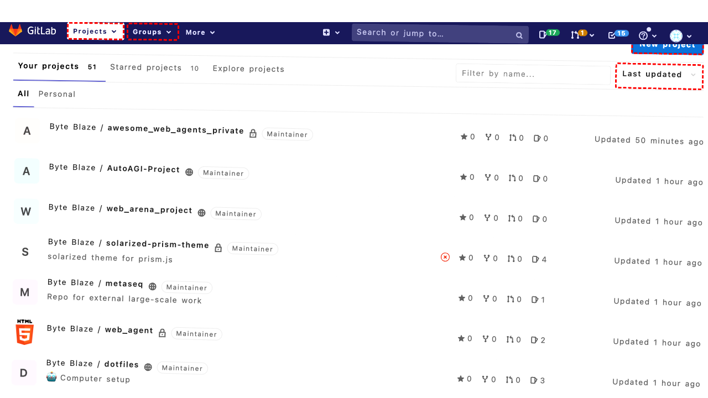
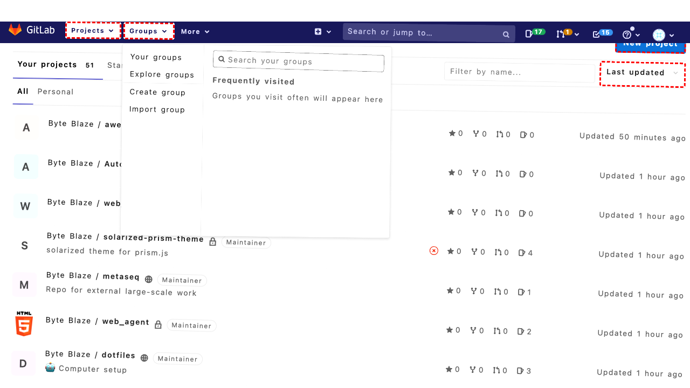
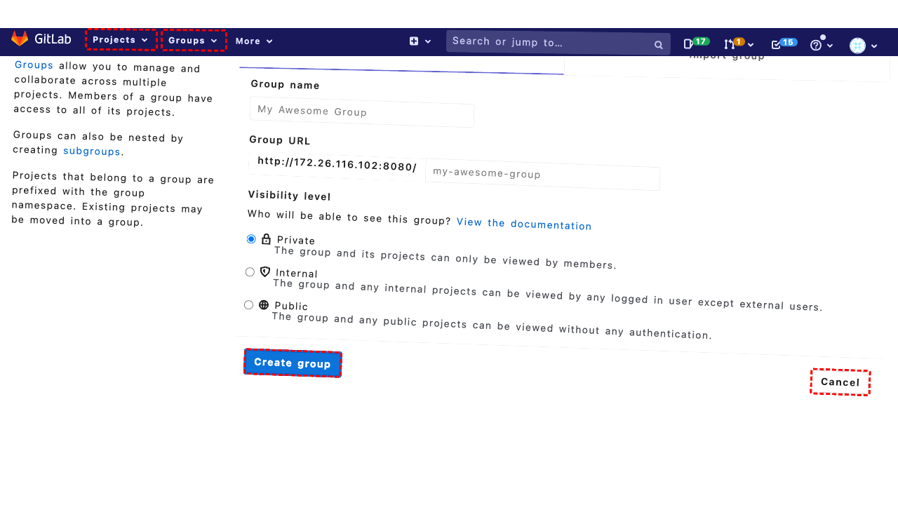
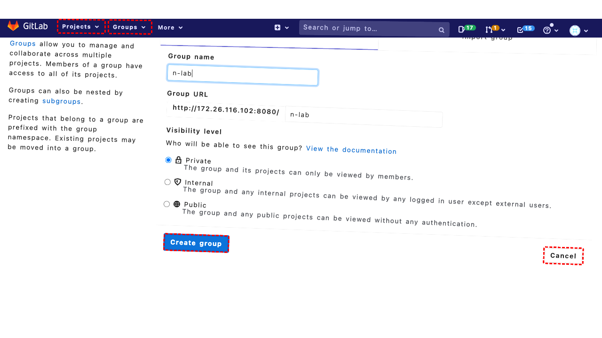
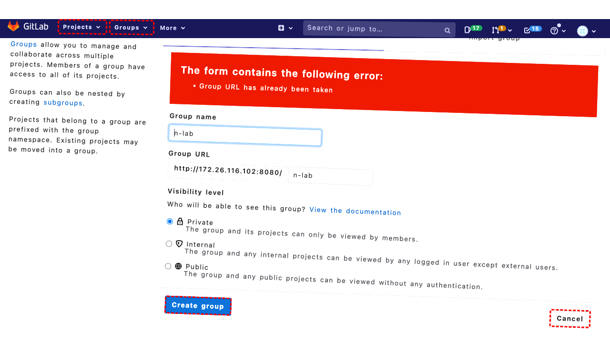
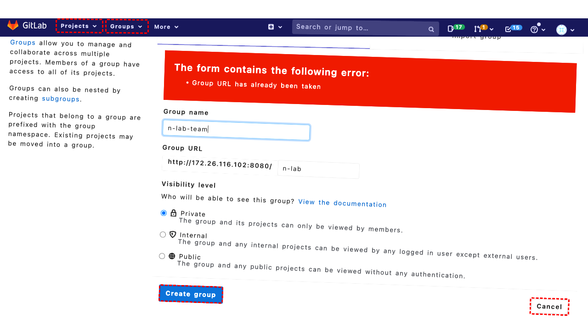
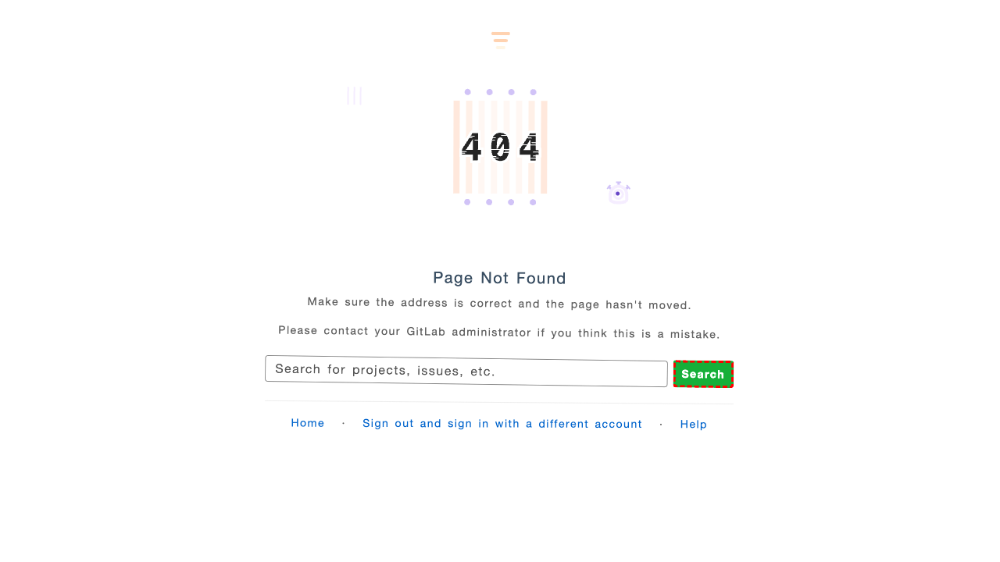

## Intent

create a new group "webagent" with members pandey2000, sayakpaul, sayakpaul

## RM

Thoughts: The user's intent is to create a new group named "webagent" with members pandey2000, sayakpaul, and sayakpaul (note: sayakpaul is listed twice, which may be a typo, but the agent should handle it as specified). The action history shows the agent filled the group name "webagent" and searched for "pandey2000", but only clicked on the search result (ID 449) without adding the user to the group or proceeding to add other members. The final state indicates the "Add to group" button is still disabled because no user has been selected, and the agent did not complete adding any members or finalize group creation. Since this is a content modification task, I examine the action history and final state: the group creation process is incomplete, and the group "webagent" with the specified members was not successfully created.

Status: failure

## Final Response 

## Captions

===============Looking at the goal to create a new group "webagent" with members pandey2000, sayakpaul, sayakpaul, I can see I'm currently on the GitLab dashboard page. To create a group, I need to navigate to the Groups section first. I can see a "Groups" button in the navigation menu with ID 77.

Let me click on the Groups button to navigate to the groups page where I can create a new group.
===============Looking at the current state, I can see I'm still on the GitLab dashboard page. I previously clicked the "Groups" button (ID 77) but I'm still on the same page. Let me check if there are any groups-related options available in the expanded Groups menu that appeared after clicking the Groups button.

I can see in the accessibility tree that after clicking the Groups button, there are now options for "Your groups" (ID 84) and "Explore groups" (ID 86). To create a new group, I should navigate to the groups management page first. Let me click on "Your groups" to get to the groups management interface where I can create a new group.
===============Looking at the current state, I can see I'm now on the Groups page (URL: http://172.26.116.102:8080/dashboard/groups) as evidenced by the page title "Groups · Dashboard · GitLab". I can see there's a "New group" link with ID 223 available on this page. Since the goal is to create a new group called "webagent", I should click this "New group" link to navigate to the group creation form.
===============Looking at the error message, I can see that the "New group" link (ID 223) is being intercepted by another element (the profile dropdown with ID 186) that's overlapping it. This is a common UI issue where elements can block clicks on other elements.

Since I'm already on the Groups page (http://172.26.116.102:8080/dashboard/groups) and need to create a new group, I should try a different approach. Let me look for alternative ways to create a group. I notice there's also a "New..." dropdown in the left navigation (ID 125) that might contain a "New group" option.

Let me try clicking the "New..." dropdown to see if it has a group creation option.
===============Looking at the current state, I can see that clicking the "New..." dropdown (ID 125) was successful since it's now expanded and showing options including "New group" (ID 133). Since my goal is to create a new group called "webagent", I should click on the "New group" option in this dropdown menu.
===============Looking at the current state, I can see I'm now on the "New Group" page (URL: http://172.26.116.102:8080/groups/new) as intended. The accessibility tree shows the group creation form with fields for "Group name" (ID 236), "Group URL" (ID 246), and other options.

Since the goal is to create a group named "webagent", I need to fill in the group name field first. The "Group name" textbox has ID 236 and is currently focused. I'll fill this field with "webagent".
===============Looking at the current state, I can see that the "Group name" field (ID 236) has already been filled with "webagent" as shown in the accessibility tree: `textbox 'Group name' value='webagent', focused, required`. The goal is to create a group with this name and add specific members. Since the group name is already set correctly, I should proceed to create the group first, then add the members afterward. The "Create group" button is visible with ID 288.
===============Looking at the current state, I can see the group "webagent" was successfully created as indicated by the success message: "Group 'webagent' was successfully created." The page now shows the group details page for the newly created "webagent" group.

Since the goal requires adding members (pandey2000, sayakpaul, sayakpaul) to this group, I need to navigate to the group members management section. I can see in the accessibility tree there's a "Members" link with ID 292 in the group navigation sidebar. This is where I can manage group members.
===============Looking at the current state, I can see I'm now on the group members page for the "webagent" group (URL: http://172.26.116.102:8080/groups/webagent/-/group_members). The accessibility tree shows the members management interface with a search field for adding new members (ID 361), a role dropdown (ID 368), and an "Add to group" button (ID 383).

The goal is to add members pandey2000, sayakpaul, sayakpaul to this group. I need to:
1. Search for each user in the search field
2. Select the appropriate role (default appears to be "Guest")
3. Click "Add to group"

Since the "Add to group" button is currently disabled, I need to first search for and select a user. Let me start by searching for "pandey2000" in the user search field.
===============Looking at the current state, I can see that after filling "pandey2000" in the search field (ID 361), the accessibility tree shows that the search results have appeared with an option for "Aman Pandey @pandey2000" (ID 449) in the dropdown list. This is the user I need to add to the group.

The "Add to group" button (ID 383) is currently disabled because no user has been selected yet. I need to click on the search result option to select the user "pandey2000" before I can add them to the group.

## Images












## Main Prompt

```md
User Intent: create a new group "webagent" with members pandey2000, sayakpaul, sayakpaul

Action History:
1: click("77")
2: click("84")
3: click("223")
4: click("125")
5: click("133")
6: fill("236", "webagent")
7: click("288")
8: click("292")
9: fill("361", "pandey2000")
10: click("449")


The detailed final state of the webpage:

```md
Looking at the current state, I can see that after filling "pandey2000" in the search field (ID 361), the accessibility tree shows that the search results have appeared with an option for "Aman Pandey @pandey2000" (ID 449) in the dropdown list. This is the user I need to add to the group.

The "Add to group" button (ID 383) is currently disabled because no user has been selected yet. I need to click on the search result option to select the user "pandey2000" before I can add them to the group.
```

Bot response to the user: None.
```
