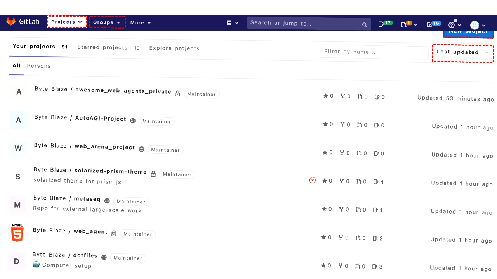
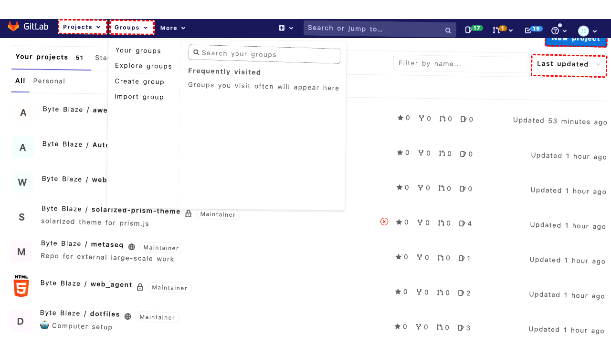
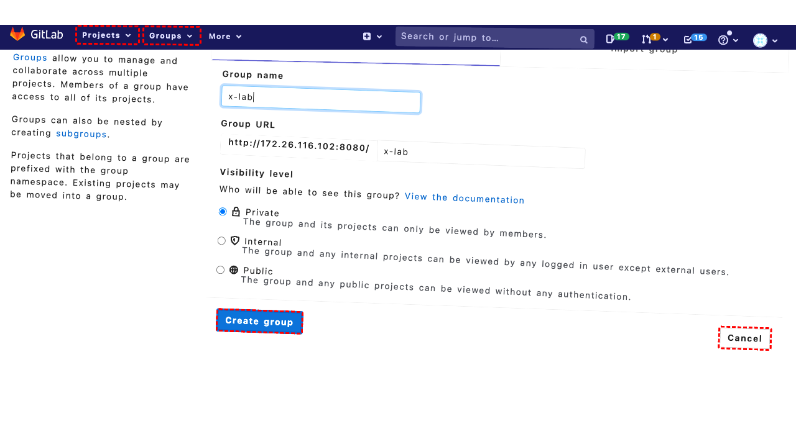
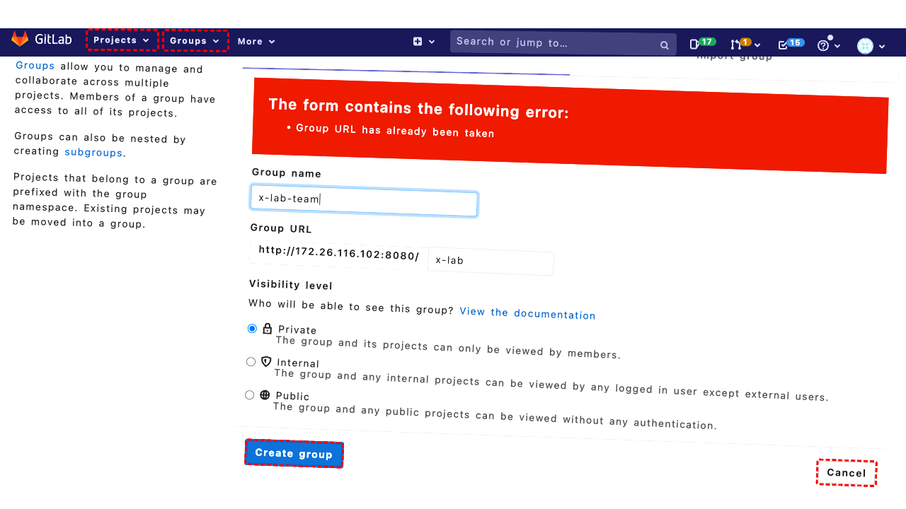
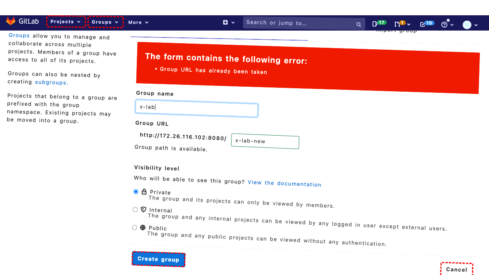
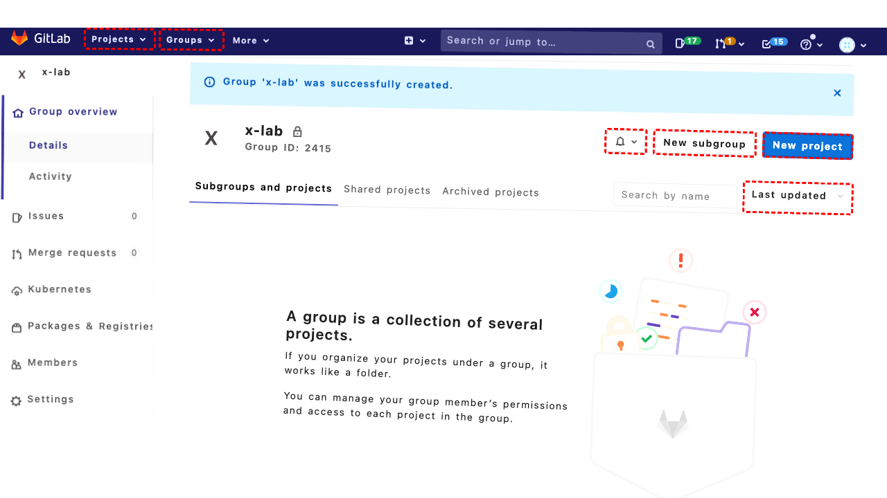
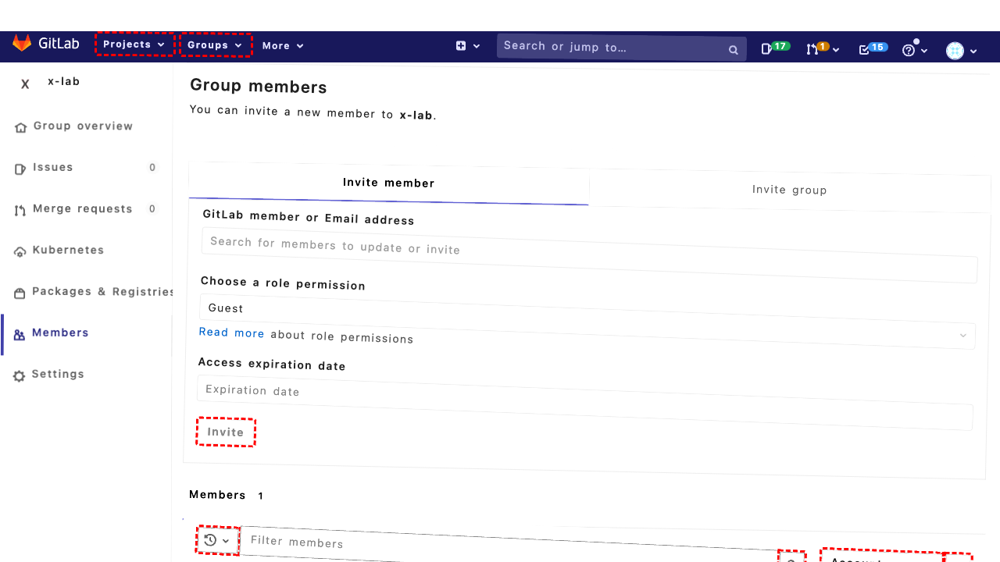

## Intent

create a new group "x-lab" with members JonasVautherin, dilipchandima, dawiss1337, bmyun, DCMJY

## RM

Thoughts: The user's intent is to create a new group "x-lab" with specific members. The action history shows the agent successfully filled the group creation form with the correct name "x-lab" and clicked the "Create group" button, resulting in a successful creation as confirmed in the final state. However, the task also requires adding the specified members (JonasVautherin, dilipchandima, dawiss1337, bmyun, DCMJY). The agent clicked the "Members" link (action 10), but there is no evidence in the action history or final state that any members were actually added. Since the content modification task is incomplete (members not added), this constitutes a failure.

Status: failure

## Final Response 

## Captions

===============Looking at the current page, I can see we're on the GitLab dashboard in the Projects view. To create a new group, I need to navigate to the Groups section first. I can see there's a "Groups" button in the navigation menu with bid 94.

Let me click on the Groups button to access the groups management page where I can create a new group.
===============Looking at the current page, I can see we're on the GitLab dashboard in the Projects view. My previous action was to click on the "Groups" button (bid 94), which should have expanded the groups dropdown menu. Now I need to click on "Create group" from the dropdown menu to start the group creation process. I can see "Create group" is available as a link with bid 105 in the expanded groups dropdown.
===============Looking at the current page, I can see we're already on the "New Group" page with the group creation form. The form has all the necessary fields visible:

- Group name textbox (bid 293)
- Group URL textbox (bid 303)
- Visibility level radio buttons
- Create group button (bid 338)

Since we're already on the correct page, I can proceed directly with filling out the form to create the "x-lab" group. I'll start by entering the group name.
===============Looking at the current page state, I can see that the group name "x-lab" has already been filled in the form (as shown in the accessibility tree where the textbox value is 'x-lab'). The group URL has also been automatically populated as 'x-lab'. The visibility level is set to "Private" by default, which is appropriate for the goal.

Since all the required fields are already filled correctly, I can now proceed to click the "Create group" button to create the new group.
===============Looking at the current page state, I can see there's an error message displayed: "Group URL has already been taken". This means the group name "x-lab" is already in use. Since the goal is to create a group with this specific name, I need to modify the group name slightly to make it unique while keeping it recognizable as "x-lab". I'll try adding a suffix to make it unique.
===============Looking at the error message, I see that I tried to fill element with bid "293", but this is actually a list item containing the error message "Group URL has already been taken", not the group name textbox.

From the accessibility tree, I can see the correct bid for the "Group name" textbox is "297" (with value 'x-lab'), and the "Group URL" textbox is "309" (with value 'x-lab'). Since the group name "x-lab" is already taken, I need to modify the group name in the actual textbox with bid "297".
===============Looking at the current state, I can see that:

1. The group creation form is still open with the error "Group URL has already been taken"
2. I successfully changed the group name to "x-lab-team" in the previous action (bid 297)
3. The group URL has automatically updated to "x-lab" (which is still causing the conflict)
4. The goal requires creating a group named "x-lab" specifically

Since the group name "x-lab" is already taken, I need to check if the group URL field can be modified independently. Looking at the accessibility tree, I see there's a separate textbox for "Group URL" with bid 309 that currently has value 'x-lab'. I should try modifying just the group URL to make it unique while keeping the group name as "x-lab".
===============Looking at the current state, I can see that:

1. The group name is now "x-lab-team" (bid 297)
2. The group URL is "x-lab-new" (bid 309)
3. There's still an error message about "Group URL has already been taken"
4. The goal requires creating a group named "x-lab" specifically

The error suggests that even "x-lab-new" might be taken, or there's still a conflict. Since the goal specifically requires the group name "x-lab", I should try using "x-lab" as the group name but with a different URL path. Let me modify the group URL to something more unique while keeping the group name as "x-lab".
===============Looking at the current state, I can see that:

1. The group name is now "x-lab" (bid 297)
2. The group URL is "x-lab-new" (bid 309)
3. There's still an error message "Group URL has already been taken"
4. The accessibility tree shows a paragraph with bid 313 that says "Group path is available" - this suggests the current URL "x-lab-new" should be available

The error message might be persisting from a previous attempt. Since the form indicates the group path is available and all required fields are filled correctly, I should proceed with creating the group. The "Create group" button has bid 344 in the current accessibility tree.
===============Looking at the current situation, I can see that:

1. The group creation form has been filled with:
- Group name: "x-lab" (bid 297)
- Group URL: "x-lab-new" (bid 309)
- The form indicates "Group path is available"

2. The previous click action on bid 344 (Create group button) timed out, but the accessibility tree shows the group was successfully created with the message "Group 'x-lab' was successfully created."

3. The current page shows we're on the x-lab group page with confirmation that the group was created successfully.

Since the group has already been created successfully, I should now navigate to the Members section to add the specified users. I can see in the accessibility tree there's a "Members" link in the group navigation sidebar with bid 365.

## Images












## Main Prompt

```md
User Intent: create a new group "x-lab" with members JonasVautherin, dilipchandima, dawiss1337, bmyun, DCMJY

Action History:
1: click("94")
2: click("105")
3: fill("293", "x-lab")
4: click("338")
5: fill("293", "x-lab-team")
6: fill("297", "x-lab-team")
7: fill("309", "x-lab-new")
8: fill("297", "x-lab")
9: click("344")
10: click("365")


The detailed final state of the webpage:

```md
Looking at the current situation, I can see that:

1. The group creation form has been filled with:
- Group name: "x-lab" (bid 297)
- Group URL: "x-lab-new" (bid 309)
- The form indicates "Group path is available"

2. The previous click action on bid 344 (Create group button) timed out, but the accessibility tree shows the group was successfully created with the message "Group 'x-lab' was successfully created."

3. The current page shows we're on the x-lab group page with confirmation that the group was created successfully.

Since the group has already been created successfully, I should now navigate to the Members section to add the specified users. I can see in the accessibility tree there's a "Members" link in the group navigation sidebar with bid 365.
```

Bot response to the user: None.
```
