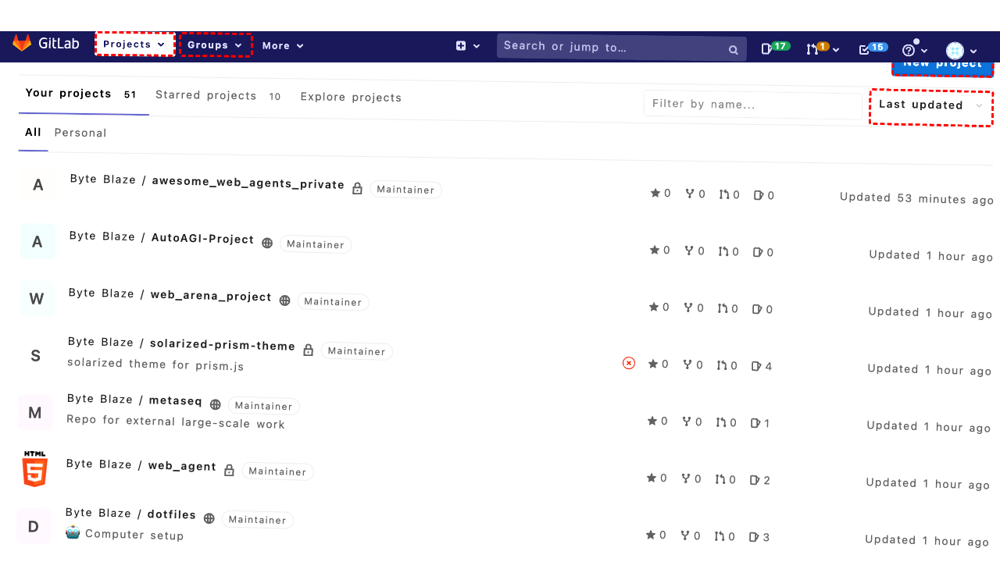
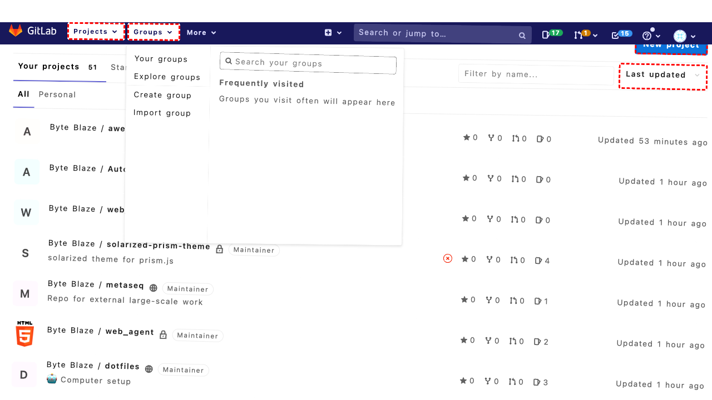
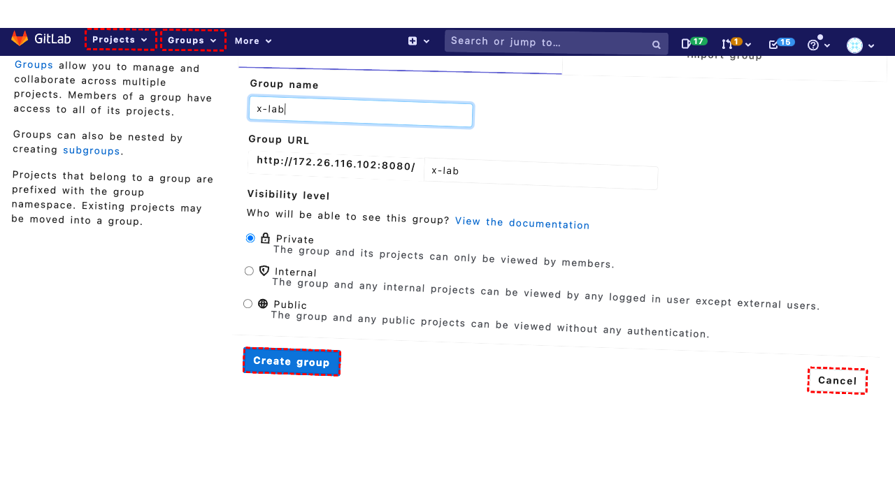
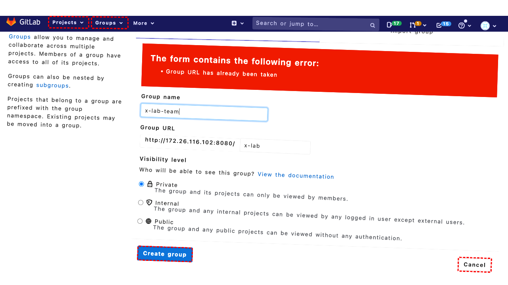
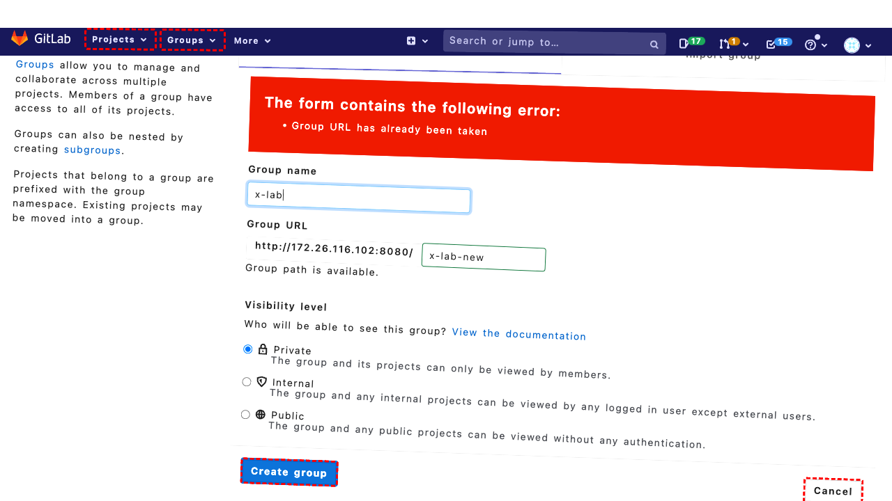
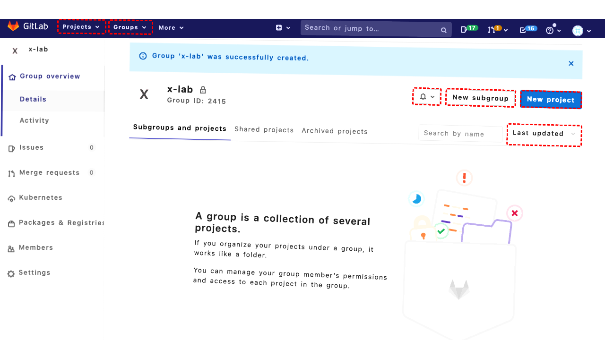
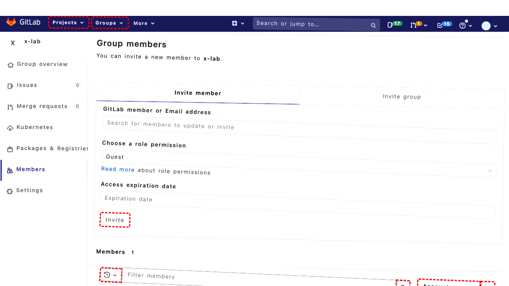

## Intent

Assign the issue regarding flash alerts to myself and primer.

## RM

Thoughts: The user's intent is to assign an issue regarding flash alerts to "myself and primer." The action history shows multiple clicks and fills, including filling "1049" with "primer" and clicking "1063" (which corresponds to "Primer @primer"). However, the final state indicates that the assignee dropdown is still open, and the bot is considering clicking "Primer @primer" again, suggesting the assignment was not completed. There is no indication that "myself" was assigned, and the bot's response is "None," which does not confirm success. Since this is a content modification task, I examine the action history and final state: the dropdown remains open, and no confirmation of assignment is evident, so the task is not successfully completed.

Status: failure

## Final Response 

## Captions

===============Looking at the current page, I can see we're on the GitLab dashboard showing projects. To assign an issue regarding flash alerts to myself and primer, I need to:

1. First find the specific issue about flash alerts
2. Navigate to that issue
3. Assign it to myself and primer

Since I don't see any issues listed on the current dashboard page, I should navigate to the issues page where I can search for and find the flash alerts issue. I can see there's an "Issues" link in the left navigation with a count of 13 assigned issues.
===============Looking at the current page, I can see we're on the Issues dashboard showing assigned issues to "Byte Blaze". I can see several issues listed, and one of them appears to be the flash alerts issue I need to assign - it's titled "Clarify usage of flash alert" from the primer/design repository (issue #10).

Since this issue is already visible in the list, I can click directly on it to open the issue page where I can then assign it to myself and primer.
===============Looking at the current page, I can see we're now on the specific issue page for "Clarify usage of flash alert" (#10) in the primer/design repository. I can see from the accessibility tree that the issue is already assigned to "@byteblaze" (me), as shown in the sidebar under "Assignee" with my avatar and username.

However, the goal is to assign the issue to both myself AND primer. Since I'm already assigned, I need to add "primer" as an additional assignee. Looking at the sidebar, I can see an "Edit" link next to the Assignee section that should allow me to modify the assignees.
===============Looking at the current state, I can see that I clicked the "Edit" link for the assignee section, and now there's an expanded assignee dropdown showing. I can see the search box is focused, and there's a list of assignee options including "Unassigned", myself ("Byte Blaze @byteblaze"), "Lukas Oppermann @lukasoppermann", and "Primer @primer".

Since the goal is to assign the issue to both myself and primer, and I'm already assigned, I need to add "primer" as an additional assignee. I can see "Primer @primer" is available in the list of assignees. I should click on "Primer @primer" to add them as an assignee.
===============Looking at the current state, I can see that after clicking the "Edit" link for assignees, the assignee dropdown is now open with a search box and a list of assignee options. The error occurred because I tried to click an element with bid "1063" which doesn't exist in the current accessibility tree.

From the goal, I need to assign the issue to both myself and primer. Since I'm already assigned, I need to add "primer" as an additional assignee. I can see in the accessibility tree that there's a search box (bid "1049") where I can search for users, and I should search for "primer" to find and select the primer user.
===============Looking at the current state, I can see that after clicking the "Edit" link for assignees, the assignee dropdown is now open. However, the accessibility tree shows a different structure than I expected. I can see there's a textbox element (bid "1048") that appears to be the search field for assignees, and there's a list of assignee options below it.

Since the goal is to assign the issue to both myself and primer, and I'm already assigned, I need to add "primer" as an additional assignee. I should search for "primer" in the assignee search box to find and select the primer user.
===============Looking at the current state, I can see that after clicking the "Edit" link for assignees, the assignee dropdown is now open. The accessibility tree shows a textbox element with bid "1049" that is the search field for assignees. I previously tried to fill "1048" but got an error because that element doesn't exist.

I need to search for "primer" in the assignee search box to find and select the primer user. The correct element ID appears to be "1049" based on the current accessibility tree.
===============Looking at the current accessibility tree, I can see that after clicking the "Edit" link for assignees, the assignee dropdown is now open. I can see there's a textbox element with bid "1048" that appears to be the search field for assignees, and there are several assignee options listed below it including "Unassigned", "Byte Blaze @byteblaze", "Lukas Oppermann @lukasoppermann", and "Primer @primer".

Since "Primer @primer" is already visible in the list of assignee options, I don't need to search for it. I can simply click on "Primer @primer" to add them as an assignee alongside myself.
===============Looking at the current accessibility tree, I can see the assignee dropdown is open with several options. I can see "Primer @primer" is listed as an option with bid "1052" (the link element containing "Primer @primer"). I should click on this element to add primer as an assignee.
===============Looking at the current accessibility tree, I can see the assignee dropdown is open with a search box (bid "1049") and a list of assignee options. The list includes "Primer @primer" which appears to be represented by a link element with bid "1063" (based on the earlier tree structure showing "1063" as the link for "Primer @primer").

Since the previous attempts to click specific bid numbers failed, let me try clicking on the "Primer @primer" option using the correct bid from the current tree structure.

## Images












## Main Prompt

```md
User Intent: Assign the issue regarding flash alerts to myself and primer.

Action History:
1: click("162")
2: click("662")
3: click("791")
4: click("1063")
5: fill("1049", "primer")
6: fill("1048", "primer")
7: fill("1049", "primer")
8: click("1053")
9: click("1052")
10: click("1063")


The detailed final state of the webpage:

```md
Looking at the current accessibility tree, I can see the assignee dropdown is open with a search box (bid "1049") and a list of assignee options. The list includes "Primer @primer" which appears to be represented by a link element with bid "1063" (based on the earlier tree structure showing "1063" as the link for "Primer @primer").

Since the previous attempts to click specific bid numbers failed, let me try clicking on the "Primer @primer" option using the correct bid from the current tree structure.
```

Bot response to the user: None.
```
