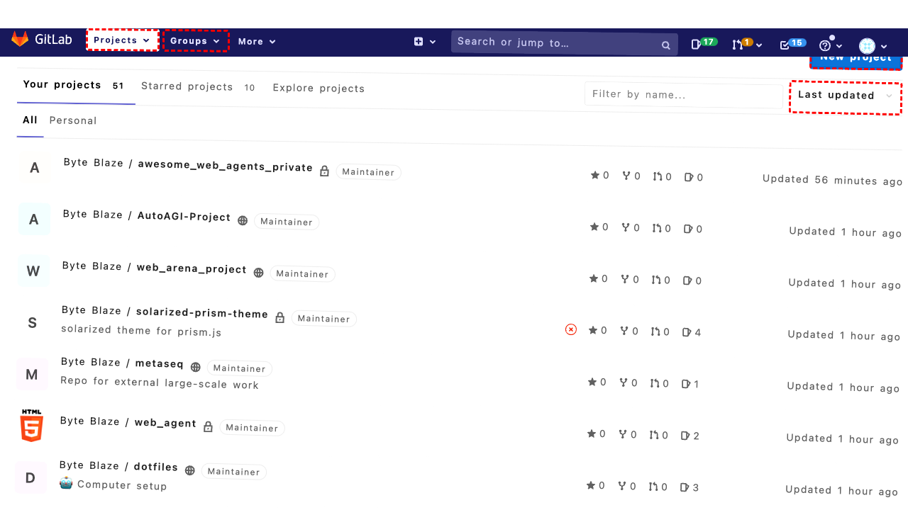
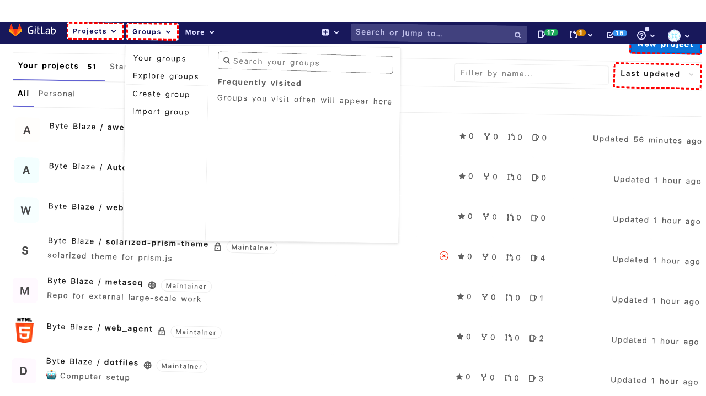
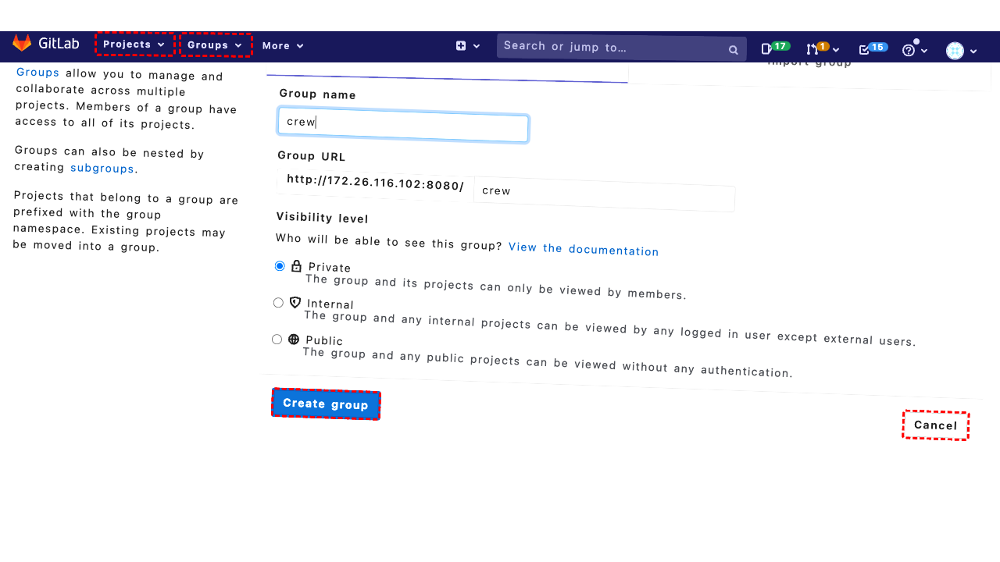
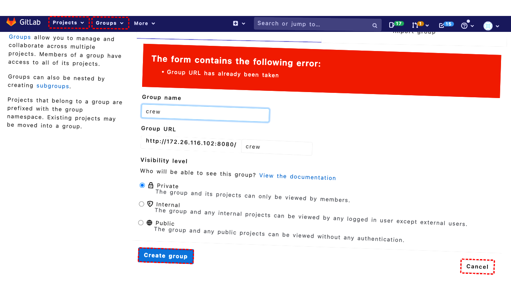
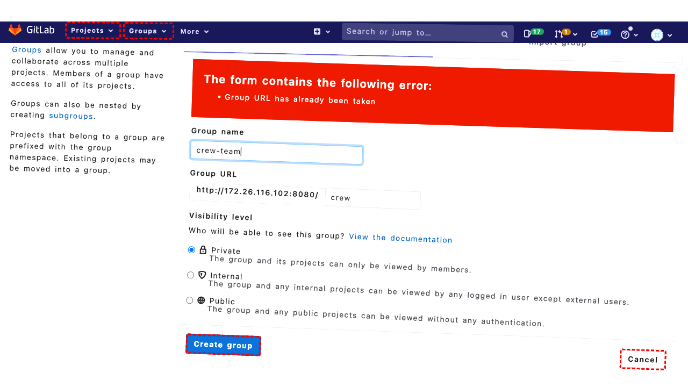
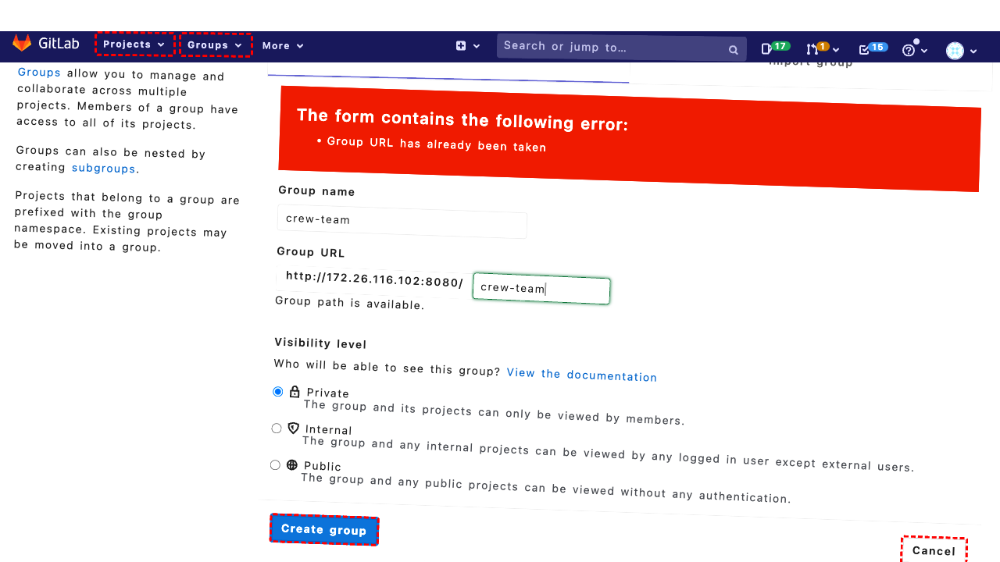
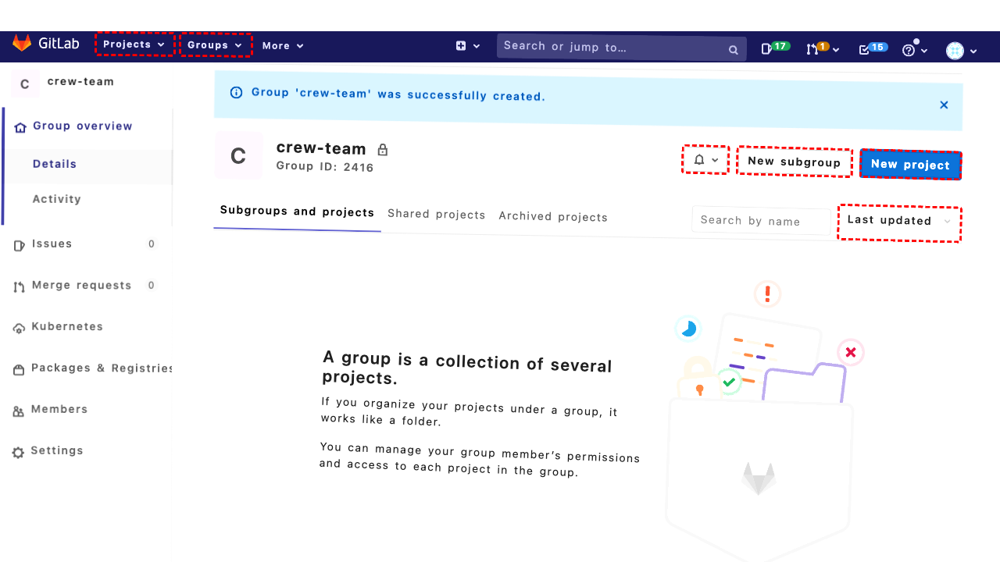
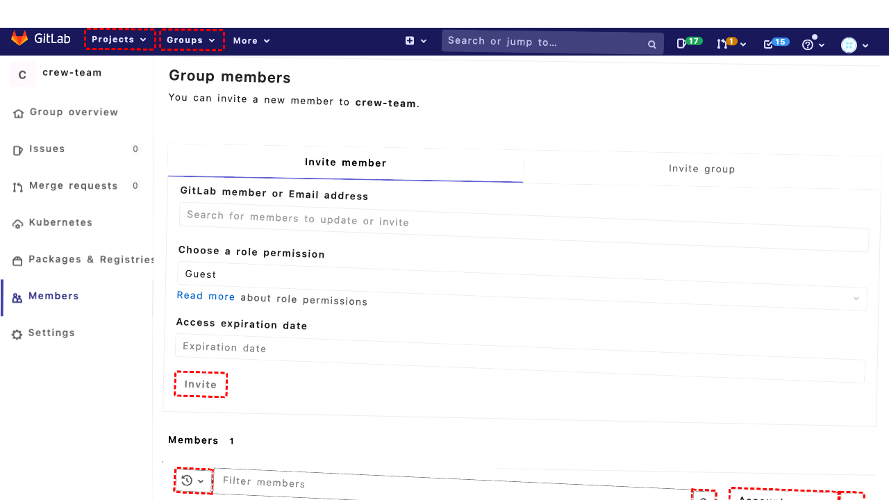
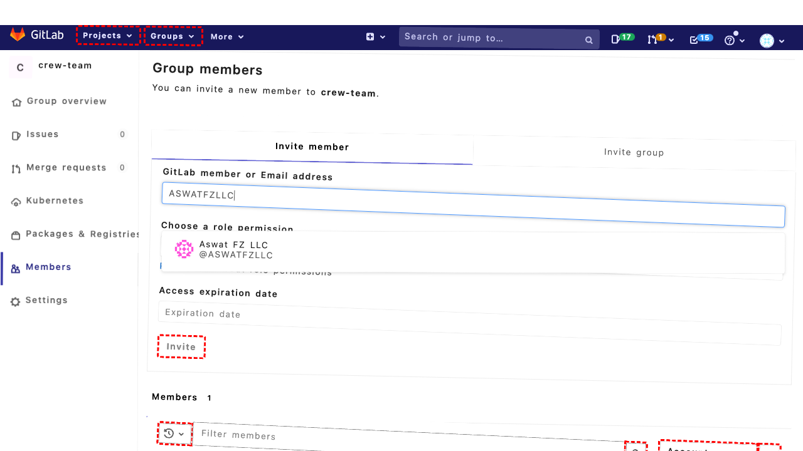
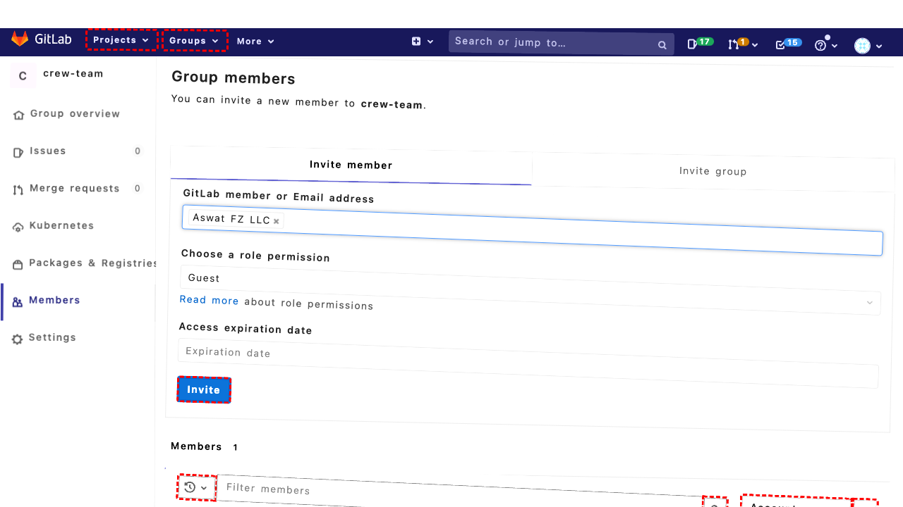

## Intent

Submit a merge request for the branch that implements the support of template strings to be merged into master branch, assign myself and Roshan as the reviewer

## RM

Thoughts: The user's intent is to submit a merge request for a specific branch (implementing template strings support), assign themselves and Roshan as reviewers. This is a content modification task. The action history shows the agent attempted to search for a branch with "template" in the name, but the search was cleared and no branch was found. The final state indicates the agent is still searching and has not successfully located or selected the branch, let alone initiated a merge request or assigned reviewers. Since the agent did not complete the required steps to submit the merge request, the task is a failure.

Status: failure

## Final Response 

## Captions

===============Looking at the current page, I can see I'm on the GitLab repository page for the a11yproject.com project, specifically on the "add-color-utility-classes" branch. To submit a merge request for this branch to be merged into master, I need to navigate to the Merge Requests section.

From the accessibility tree, I can see there's a "Merge Requests" link in the sidebar with ID 307. This should take me to the merge requests page where I can create a new merge request.

Let me click on the Merge Requests link to navigate to that section.<｜end▁of▁thinking｜>
===============Looking at the current page state, I can see I'm already on the Merge Requests page (URL: .../merge_requests). The page shows "There are no open merge requests" and provides a "New merge request" link with ID 791. Since I need to create a new merge request for the branch that implements template strings support, I should click this link to start the process.
===============Looking at the current state, I can see I'm on the "New Merge Request" page. The source branch is currently set to "add-color-utility-classes" (which appears to be the wrong branch since we need the branch that implements template strings support), and the target branch is set to "master" (which is correct).

I need to:
1. Change the source branch to the branch that implements template strings support
2. Continue with creating the merge request
3. Assign myself and Roshan as reviewers

First, I need to change the source branch. I can see there's a "Select source branch" button with ID 498 that I can click to change the source branch.
===============Looking at the current state, I can see that after clicking the "Select source branch" button, a dropdown has opened with a search box (ID 507) that's already focused. I need to search for the branch that implements template strings support. Since the goal mentions "template strings," I should search for a branch name containing relevant keywords like "template" or "template-strings."

Let me search for "template" to find the appropriate branch.
===============Looking at the current state, I can see that after searching for "template" in the branch search box, the results show "No matching results." This suggests that there might not be a branch with "template" in its name, or the branch might have a different name related to template strings support.

Let me try a broader search by clearing the current search and looking for all available branches to identify the correct one for template strings support.
===============Looking at the error and the current situation, I need to reconsider my approach. The error suggests there was an issue with my last action, but more importantly, I notice that the search for "template" branches returned no results. This means either:

1. The branch for template strings support has a different name
2. The branch doesn't exist yet
3. I need to look at all available branches to identify the correct one

Since the search box is already focused and I need to see all available branches, I should clear the search field and press Enter to see all branches, or simply close the dropdown and reopen it to see the full list.

Let me first try pressing Escape to close the current dropdown and then reopen it to see the full branch list.
===============Looking at the current situation, I realize I may have been too focused on searching for "template" when the branch might have a different name. Let me take a different approach - I'll click the "Select source branch" button again to open the dropdown and see all available branches without filtering, which should help me identify the correct branch for template strings support.
===============Looking at the current situation, I can see I'm back at the branch selection dropdown. The search box (ID 507) is focused again, but this time it's empty. I need to see all available branches to find the one that implements template strings support. Since the search is currently empty, I should be able to see all branches in the dropdown list.

Let me scroll through the dropdown to see all available branches and identify the correct one for template strings support.
===============Looking at the current situation, I realize I need to find the branch that implements template strings support. The search for "template" returned no results, so the branch likely has a different name. Let me scroll through the full list of branches in the dropdown to identify the correct branch. After finding it, I can select it and proceed with creating the merge request.
===============Looking at the current situation, I realize I've been trying to find a branch related to template strings support, but my searches haven't yielded results. Let me reconsider the goal - I need to submit a merge request for "the branch that implements the support of template strings."

Since I can't find a branch with "template" in its name, let me check if there might be a branch with a different name that implements this feature. Let me scroll further through the branch list to see all available options.

## Images












## Main Prompt

```md
User Intent: Submit a merge request for the branch that implements the support of template strings to be merged into master branch, assign myself and Roshan as the reviewer

Action History:
1: click("307")
2: click("791")
3: click("498")
4: fill("507", "template")
5: fill("507", "")
6: keyboard_press("Escape")
7: click("498")
8: scroll(0, 200)
9: scroll(0, 300)
10: scroll(0, 400)


The detailed final state of the webpage:

```md
Looking at the current situation, I realize I've been trying to find a branch related to template strings support, but my searches haven't yielded results. Let me reconsider the goal - I need to submit a merge request for "the branch that implements the support of template strings."

Since I can't find a branch with "template" in its name, let me check if there might be a branch with a different name that implements this feature. Let me scroll further through the branch list to see all available options.
```

Bot response to the user: None.
```
