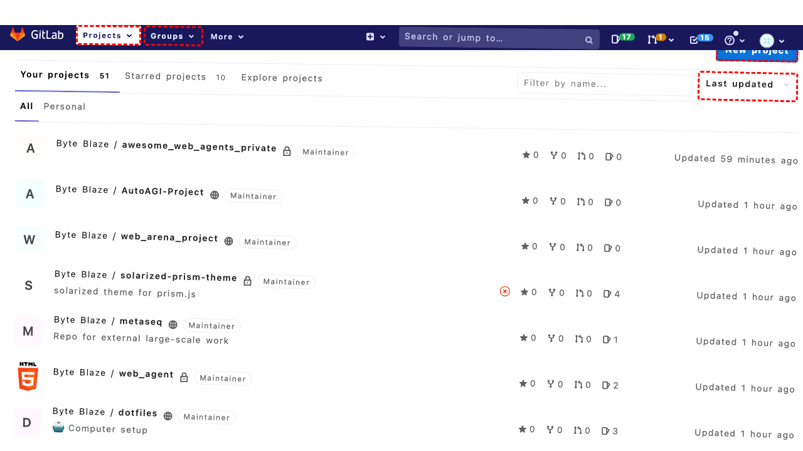
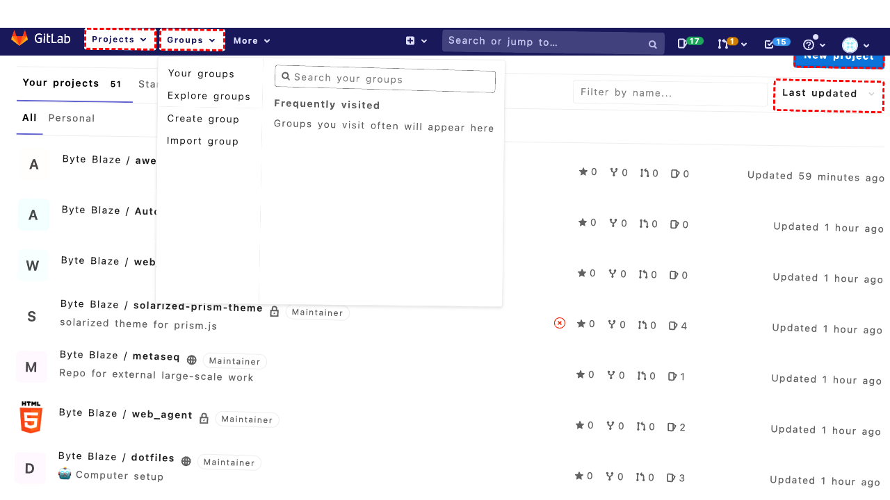
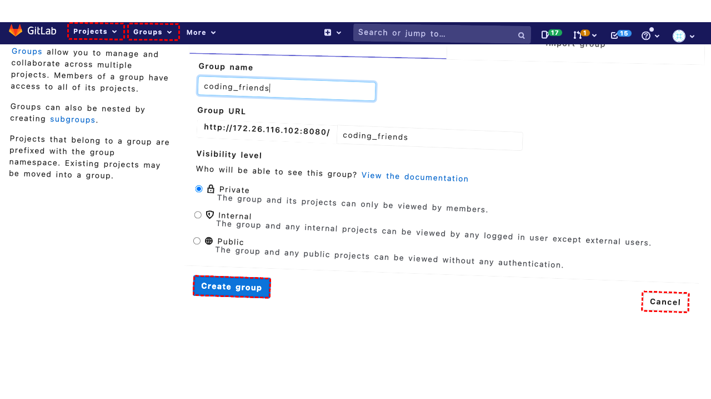
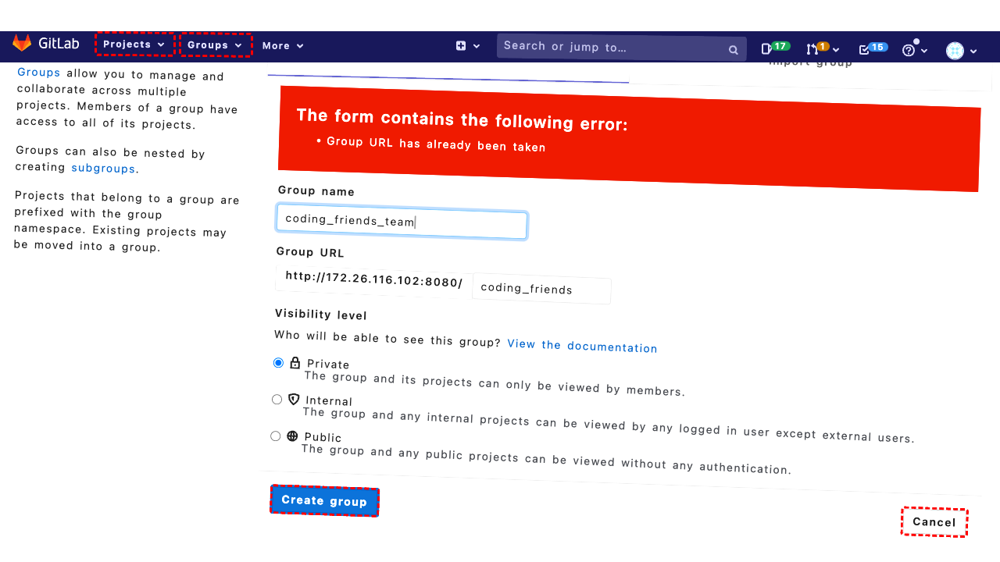
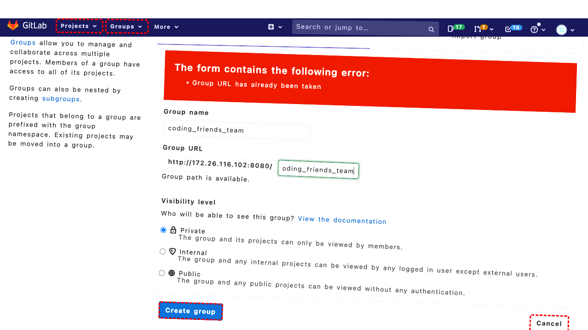
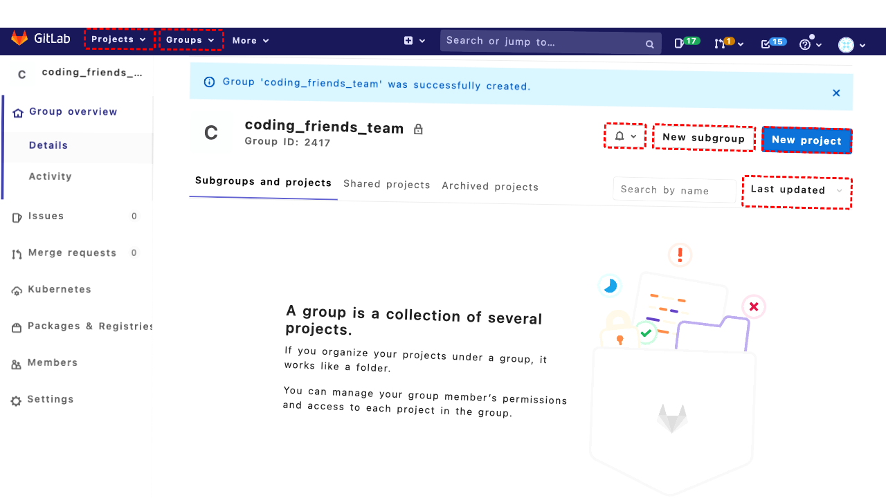
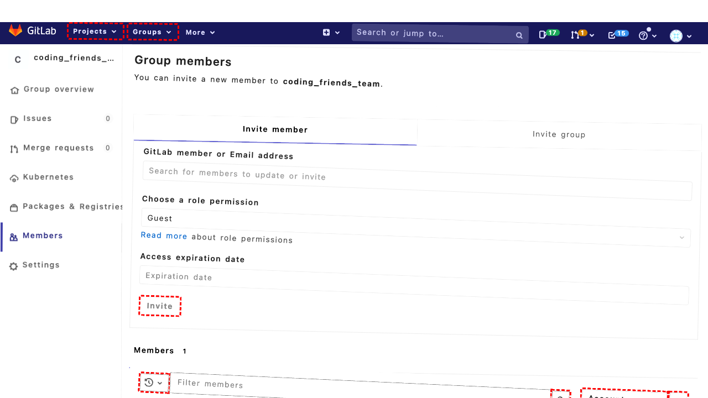
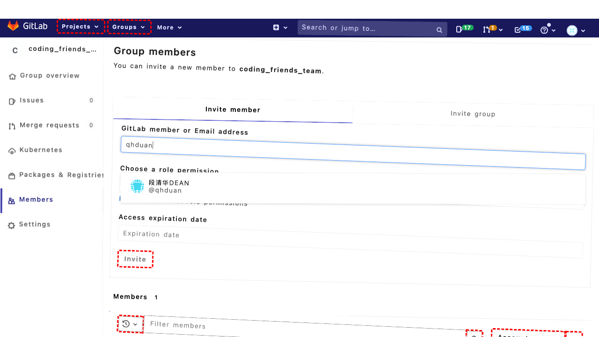
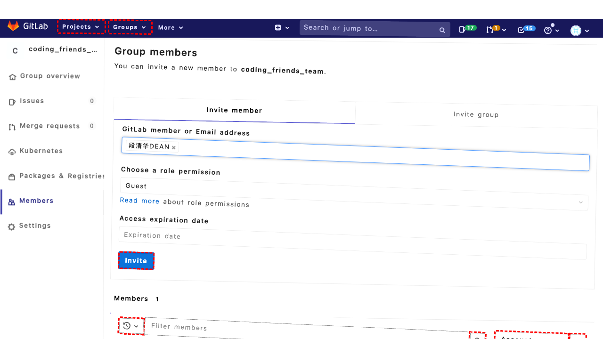

## Intent

Submit a merge request for a11yproject.com/redesign branch to be merged into markdown-figure-block branch, assign myself as the reviewer

## RM

Thoughts: The user's intent is to submit a merge request for the a11yproject.com/redesign branch to be merged into the markdown-figure-block branch and assign themselves as the reviewer. This is a content modification task, so I need to examine the action history and final state of the webpage to determine success. The action history shows a series of clicks, with the last action being click("766"), which corresponds to the user's own ID as seen in the final state. The final state indicates that the assignee dropdown is expanded and the user's ID is visible, but it does not confirm that the merge request was successfully submitted or that the user was assigned as the reviewer. The action history does not include any action to submit the merge request, only actions leading up to selecting the assignee. Without the submission step, the task is incomplete.

Status: failure

## Final Response 

## Captions

===============Looking at the goal and the current page state, I need to submit a merge request for the a11yproject.com repository from the "redesign" branch to the "markdown-figure-block" branch, and assign myself as the reviewer.

From the accessibility tree, I can see the a11yproject.com repository is listed as:
- "The A11Y Project / a11yproject.com" with link ID '700'

I need to navigate to this repository first, then find the merge requests section to create a new merge request.

Let me start by clicking on the a11yproject.com repository link.<｜end▁of▁thinking｜>I need to navigate to the a11yproject.com repository first to access its merge requests functionality. I can see it in the project list with the link ID '700'.
===============Looking at the current state, I can see I'm on the a11yproject.com repository page. I can see there's a "Merge Requests" section in the sidebar with ID '307' that shows there are currently 2 merge requests. To submit a new merge request from the "redesign" branch to the "markdown-figure-block" branch, I need to navigate to the merge requests section first.
===============Looking at the current state, I can see I'm on the Merge Requests page for the a11yproject.com repository. I can see there are existing merge requests listed, and there's a "New merge request" button with ID '489' that I need to click to create the new merge request from the redesign branch to the markdown-figure-block branch.
===============Looking at the current page, I can see I'm on the "New Merge Request" page. From the accessibility tree, I can see:

- Source branch selector with ID '499' (currently showing "Select source branch")
- Target branch selector with ID '542' (currently showing "add-color-utility-classes")

I need to:
1. Set the source branch to "redesign"
2. Set the target branch to "markdown-figure-block"
3. Then continue to the next step where I can assign myself as reviewer

Let me start by selecting the source branch dropdown to choose the "redesign" branch.
===============Looking at the current state after clicking the source branch dropdown, I can see the branch list is now expanded with various branches including "redesign" (ID '614'). I need to select the "redesign" branch as the source branch for this merge request.
===============Looking at the current state, I can see I've successfully selected "redesign" as the source branch. Now I need to set the target branch to "markdown-figure-block". I can see the target branch selector has ID '542' and is currently showing "add-color-utility-classes". I need to click this dropdown to select the "markdown-figure-block" branch.
===============Looking at the current state after clicking the target branch dropdown, I can see the branch list is expanded with various branches. I can see "feature/markdown-figure-block" listed with ID '641'. This appears to be the branch I need to select as the target branch for the merge request.
===============Looking at the current state, I can see I've successfully set both the source branch to "redesign" and the target branch to "feature/markdown-figure-block". Now I need to proceed to the next step where I can complete the merge request creation and assign myself as reviewer. I can see there's a "Compare branches and continue" button with ID '583' that I should click to proceed to the next step where I can set up the merge request details including assigning reviewers.
===============Looking at the current state, I can see I'm now on the merge request creation form. From the accessibility tree, I can see:

- The title field is pre-filled with "WIP: Redesign" (ID '485')
- There's an assignee dropdown with ID '577' currently showing "Unassigned"
- There's a "Submit merge request" button at the bottom (ID '745')

To accomplish the goal, I need to:
1. Assign myself as the reviewer by clicking the assignee dropdown and selecting myself
2. Submit the merge request

Let me start by clicking the assignee dropdown to assign myself as the reviewer.
===============Looking at the current state after clicking the assignee dropdown, I can see the assignee selection menu is now expanded. From the accessibility tree, I can see my user "Byte Blaze @byteblaze" is listed with ID '766'. I need to click on my user to assign myself as the reviewer for this merge request.

## Images












## Main Prompt

```md
User Intent: Submit a merge request for a11yproject.com/redesign branch to be merged into markdown-figure-block branch, assign myself as the reviewer

Action History:
1: click("700")
2: click("307")
3: click("489")
4: click("499")
5: click("614")
6: click("542")
7: click("641")
8: click("583")
9: click("577")
10: click("766")


The detailed final state of the webpage:

```md
Looking at the current state after clicking the assignee dropdown, I can see the assignee selection menu is now expanded. From the accessibility tree, I can see my user "Byte Blaze @byteblaze" is listed with ID '766'. I need to click on my user to assign myself as the reviewer for this merge request.
```

Bot response to the user: None.
```
