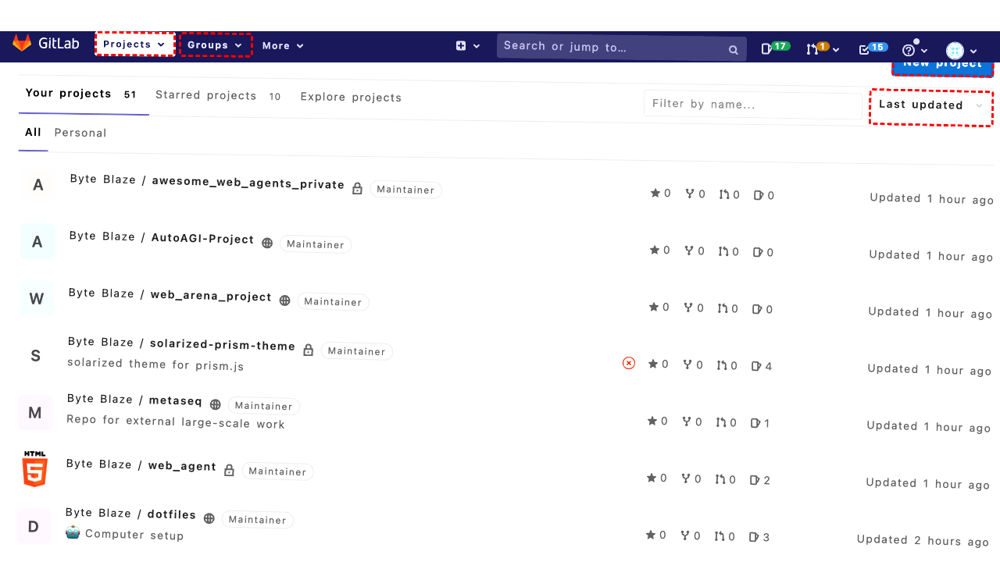
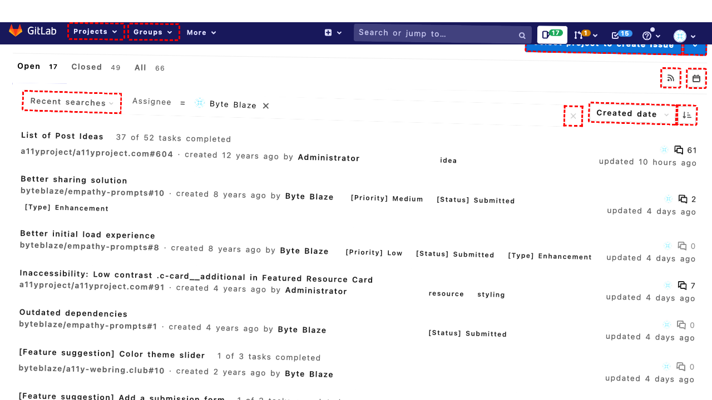
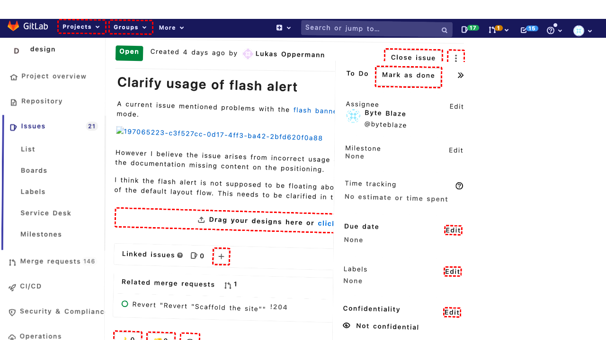
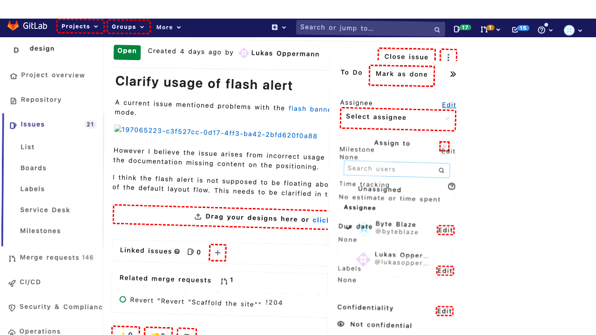
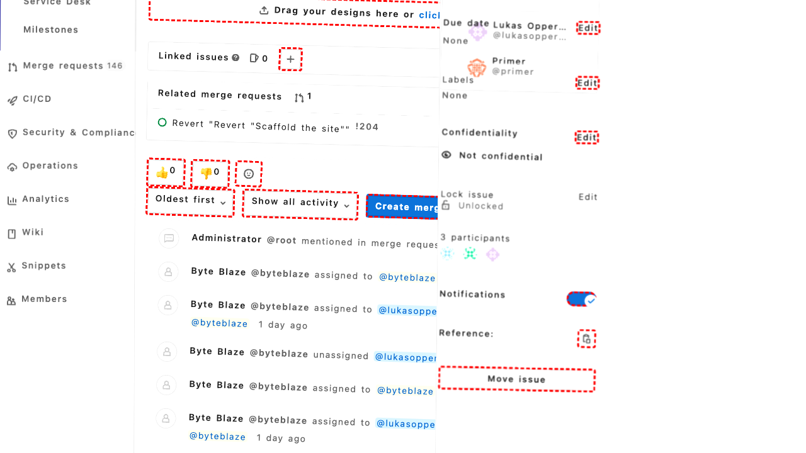
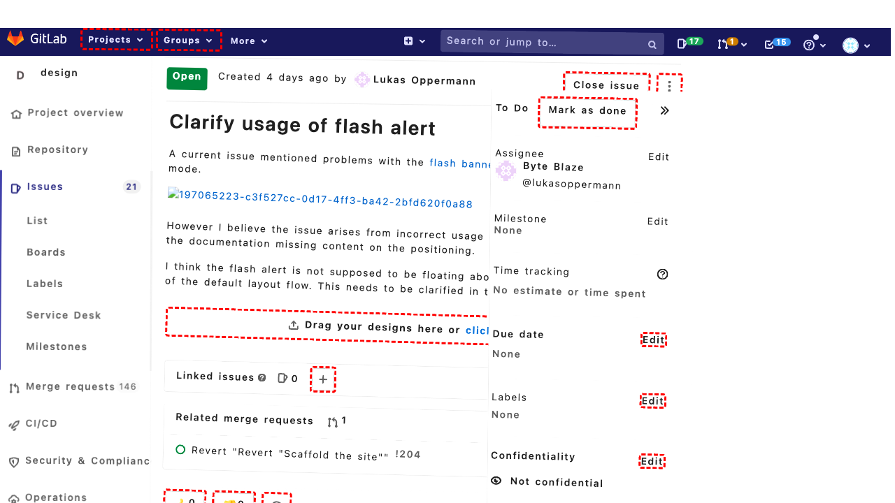
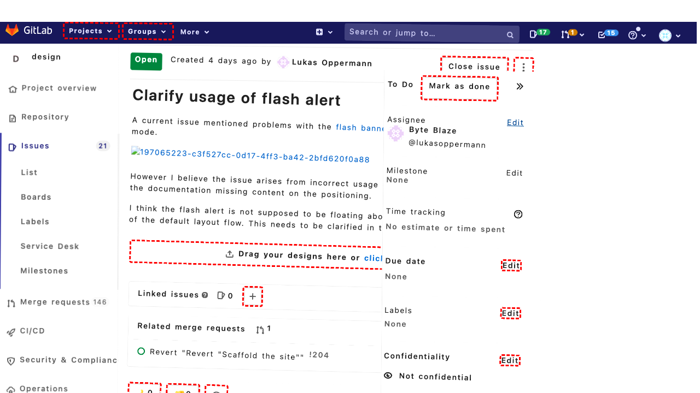
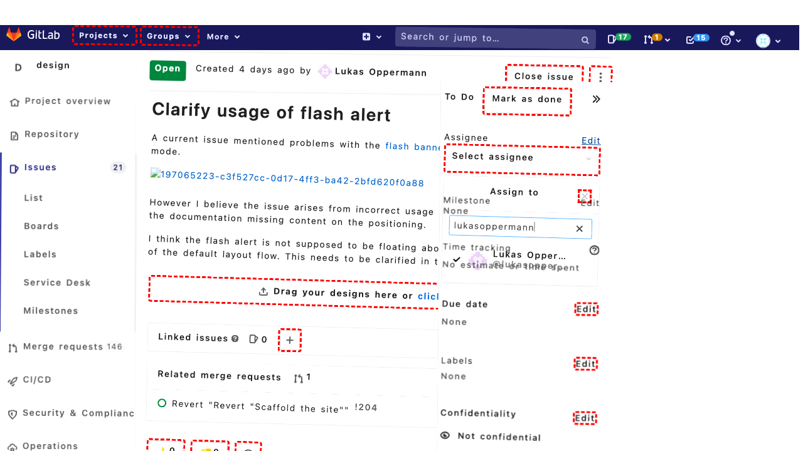

## Intent

Assign the issue regarding flash alerts to myself and primer.

## RM

Thoughts: The user's intent is to assign the issue to both "lukasoppermann" and "primer". The action history shows that the agent filled "lukasoppermann" and pressed Enter, then filled "primer" but did not press Enter or confirm the second assignment. The final state indicates that only "lukasoppermann" was successfully assigned, and the agent recognized the need to reopen the dropdown to add "primer" but did not complete the action. Since the task is a content modification and the final state does not show both assignees added, the execution is incomplete and unsuccessful.

Status: failure

## Final Response 

## Captions

===============Looking at the current page, I'm on the GitLab dashboard showing projects. To assign an issue regarding flash alerts to myself and primer, I need to:

1. First navigate to the issues page since that's where I can find and manage issues
2. Then locate the specific issue about flash alerts
3. Assign it to myself and primer

The most logical first step is to navigate to the issues page. I can see there's an "Issues" link in the navigation with a badge showing "17" issues, which suggests there are active issues to manage.
===============Looking at the current page, I can see I'm already on the Issues dashboard (Tab 0 shows "Issues · Dashboard · GitLab" as the title). The page is displaying a list of issues, and I can see one titled "Clarify usage of flash alert" which appears to be the issue I need to assign. This issue is from the "primer/design" repository, which matches the "primer" part of the goal.

Since I'm already on the correct page and can see the target issue, I should click on the "Clarify usage of flash alert" issue link to open it and access the assignment options.
===============Looking at the current page, I can see I'm already on the specific issue page for "Clarify usage of flash alert" (#10) in the primer/design repository. The goal is to assign this issue to myself and primer.

From the accessibility tree, I can see there's an "Assignee" section in the sidebar with an "Edit" link next to it. Currently, it shows "Byte Blaze" is assigned. To assign the issue to myself and primer, I need to click the "Edit" link next to "Assignee" to open the assignment interface.
===============Looking at the current page state, I can see that after clicking the "Edit" link for the assignee, the assignee dropdown has opened (expanded=True). The search box for "Search users" is focused, and I can see a list of assignee options including "Unassigned", "Byte Blaze @byteblaze", "Lukas Oppermann @lukasoppermann", and "Primer @primer".

Since the goal is to assign the issue to myself and primer, I need to:
1. First select myself (Lukas Oppermann) from the list
2. Then also select primer from the list

I can see both options are available in the dropdown list. I should click on "Lukas Oppermann @lukasoppermann" first to assign myself to the issue.
===============Looking at the error message, I can see that there's an element intercepting pointer events that's preventing the click on the "Lukas Oppermann" assignee option. The assignee dropdown is open and visible, but some overlay or modal is blocking the interaction.

Since the search box for "Search users" is focused (as mentioned in the accessibility tree), I should try a different approach. Instead of clicking directly on the list item, I can use the search functionality to find and select both assignees. I'll first search for "lukasoppermann" and select myself, then search for "primer" to add the second assignee.

Let me try searching for "lukasoppermann" in the focused search box to select myself as an assignee.
===============Looking at the current state, I can see that the assignee dropdown is open with the search box already focused and containing "lukasoppermann" as the current value. Since I just filled the search box with "lukasoppermann", the search results should now show the matching user. I can see in the accessibility tree that there's a list item for "Lukas Oppermann @lukasoppermann" (bid 1442) that should be selectable now.

I should press Enter to select the currently highlighted/filtered user (myself) from the search results.
===============Looking at the current state, I can see that after pressing Enter to select "lukasoppermann" as an assignee, the assignee dropdown is still open and the search box is now empty. The goal requires assigning the issue to both myself (Lukas Oppermann) and primer. Since I've successfully added myself as an assignee, I now need to add "primer" as the second assignee.

I can see the search box is still focused and ready for input. I should search for "primer" to find and select the primer user/team as the second assignee.
===============Looking at the error message, it appears the search box element (bid 1198) is not currently visible or stable, which is preventing the fill action. The assignee dropdown might have closed or there might be some overlay interfering.

Let me check the current state - I successfully added myself as an assignee, but now need to add "primer" as the second assignee. Since the search box isn't accessible, I should try reopening the assignee dropdown to continue adding the second assignee.

I can see from the accessibility tree that there's still an "Edit" link next to the Assignee section (bid 1171). I should click this again to reopen the assignee dropdown interface.
===============Looking at the current state, I can see that after successfully adding myself (Lukas Oppermann) as an assignee, I need to add "primer" as the second assignee. The assignee dropdown appears to have closed after I selected myself, so I need to reopen it to add the second assignee.

I can see the "Edit" link (bid 1171) is still available next to the Assignee section in the sidebar. Clicking this should reopen the assignee dropdown interface where I can search for and add "primer" as the second assignee.
===============Looking at the current state, I can see that I successfully added myself (Lukas Oppermann) as an assignee, but the goal requires assigning the issue to both myself and primer. The assignee dropdown closed after I selected myself, so I need to reopen it to add the second assignee.

The "Edit" link (bid 1171) next to the Assignee section is still available. I should click it to reopen the assignee dropdown interface where I can search for and add "primer" as the second assignee.

## Images












## Main Prompt

```md
User Intent: Assign the issue regarding flash alerts to myself and primer.

Action History:
1: click("178")
2: click("814")
3: click("1171")
4: click("1422")
5: fill("1198", "lukasoppermann")
6: keyboard_press("Enter")
7: fill("1198", "primer")
8: click("1171")
9: click("1171")
10: click("1171")


The detailed final state of the webpage:

```md
Looking at the current state, I can see that I successfully added myself (Lukas Oppermann) as an assignee, but the goal requires assigning the issue to both myself and primer. The assignee dropdown closed after I selected myself, so I need to reopen it to add the second assignee.

The "Edit" link (bid 1171) next to the Assignee section is still available. I should click it to reopen the assignee dropdown interface where I can search for and add "primer" as the second assignee.
```

Bot response to the user: None.
```
