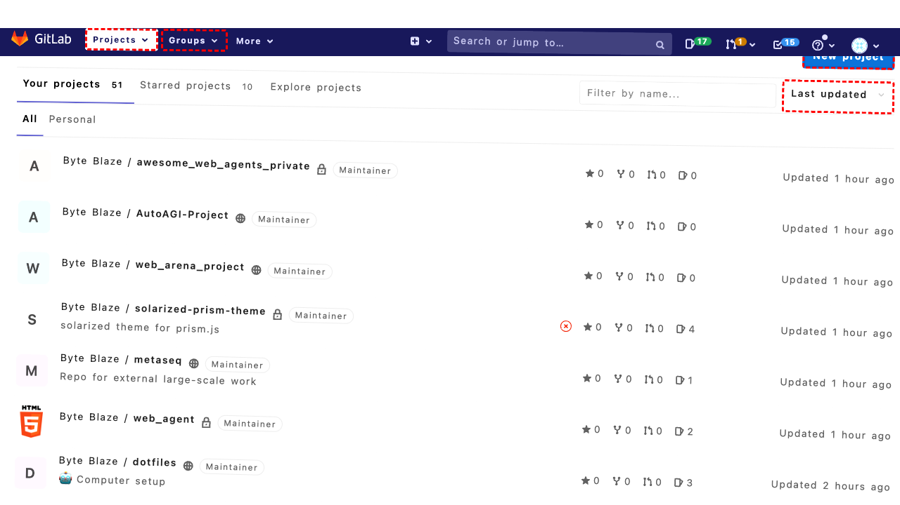
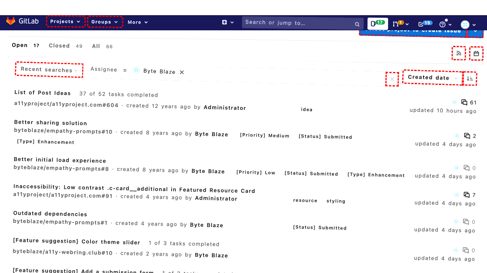
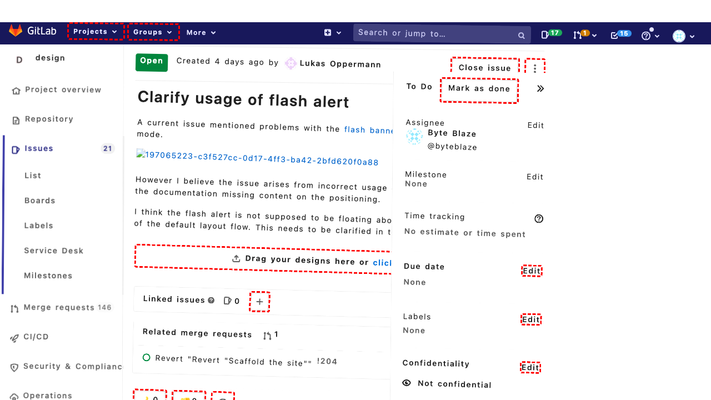
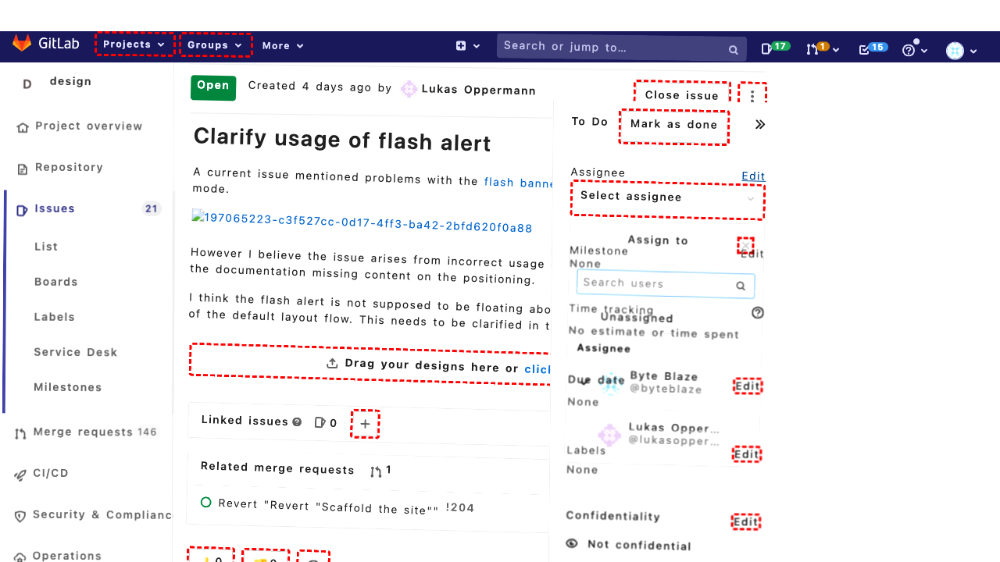
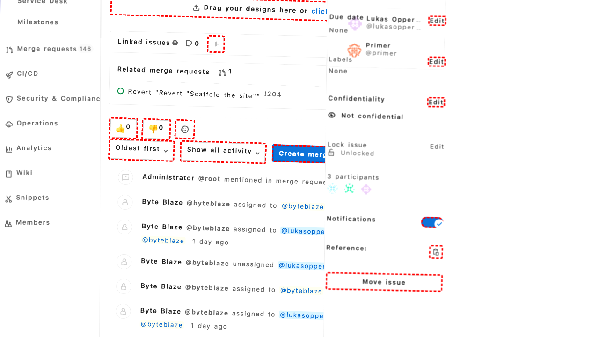
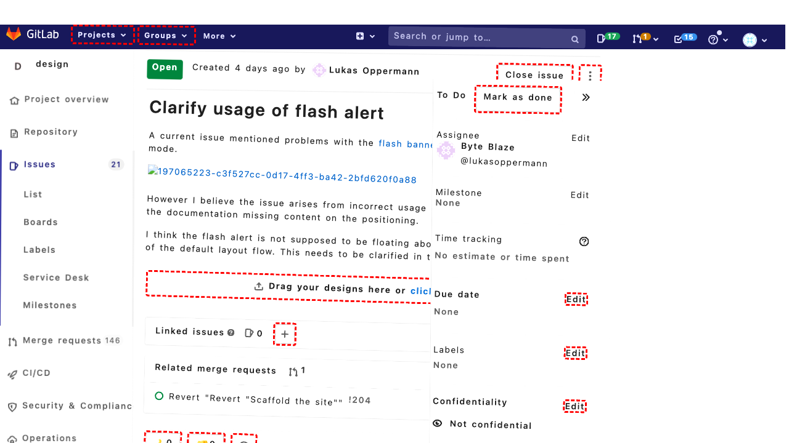
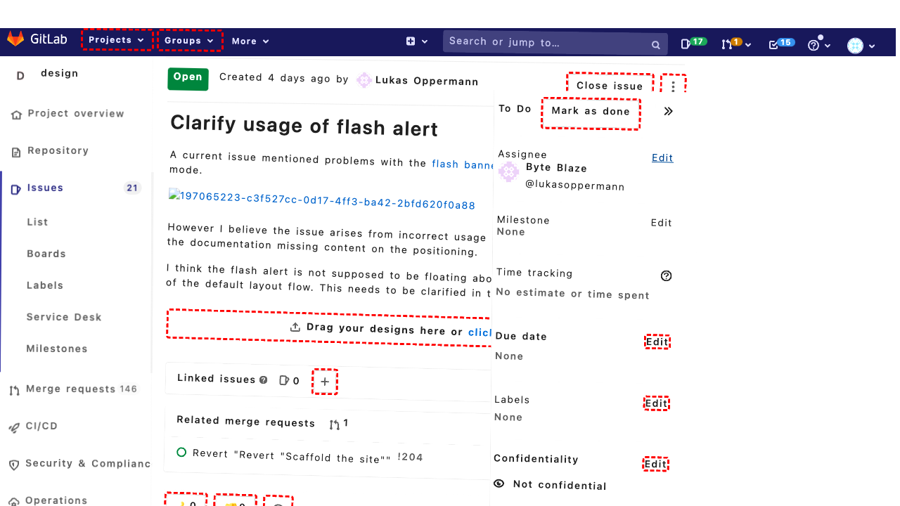
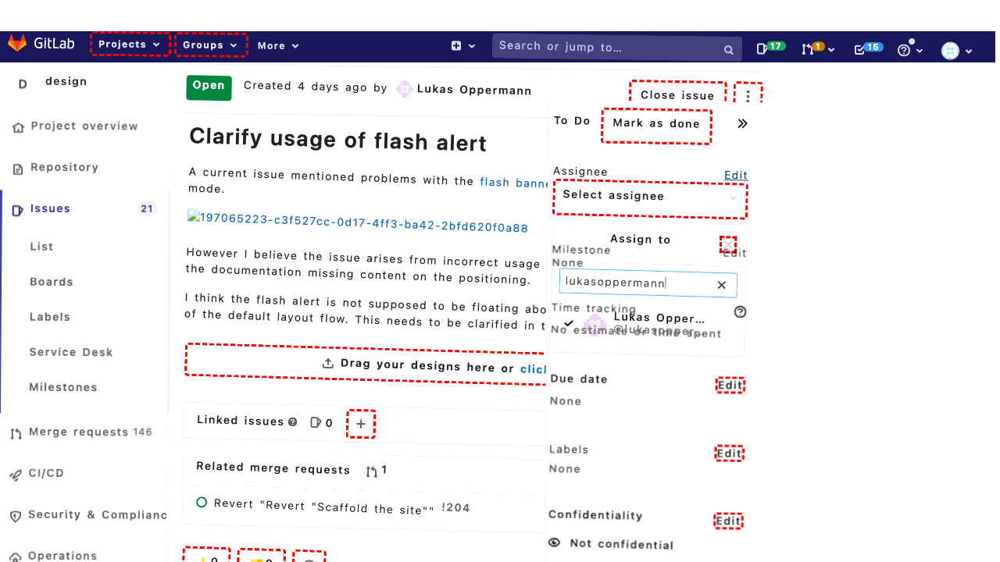

## Intent

Create an issue in cloud-to-butt repo with title "Let's keep the project alive". Assign the issue to myself. Set due date to be the end of Q1 2033

## RM

Thoughts: This is a content modification task where the user wants to create an issue with specific details. The action history shows the agent performed steps to create the issue, set the title, assign it to the user, and set the due date to 2033-03-31 (end of Q1 2033). The final state confirms the issue was created with all requested details: correct title, assignee, and due date. The bot's response to the user also confirms success, though it cuts off mid-sentence ("Byte Blaze." instead of "Byte Blaze"), but since this is a content modification task, the bot's response does not need to be considered for success. The key actions and final state confirm the task was completed successfully.

Status: success

## Final Response "Successfully created issue 'Let's keep the project alive' in the cloud-to-butt repository. The issue has been assigned to you (Byte Blaze

## Captions

===============Looking at the current page, I can see I'm on the GitLab dashboard showing a list of projects. I need to find the "cloud-to-butt" repository first, then navigate to its issues page to create a new issue with the specified title, assign it to myself, and set the due date to end of Q1 2033.

Let me start by searching for the "cloud-to-butt" repository using the search functionality.
===============I need to search for the "cloud-to-butt" repository. I just clicked on the search box (bid 143), so now I should fill it with the repository name.
===============I can see from the accessibility tree that the search box (bid 143) already has "cloud-to-butt" as its value, and there are search results showing below it. I can see a specific result for "Byte Blaze / cloud-to-butt" with bid 923. Since the repository I'm looking for is already visible in the search results, I should click on that result to navigate to the cloud-to-butt repository page.
===============Looking at the current state, I can see that I successfully searched for "cloud-to-butt" and clicked on the repository result (bid 923). Now I should be on the cloud-to-butt repository page. To create an issue, I need to navigate to the issues section and then to the new issue creation form.

From the accessibility tree, I can see that there are issue links available for each repository (e.g., bid 306, 335, 364, etc. for different repositories). I need to find the issues link specifically for the cloud-to-butt repository. Since I'm now on the repository page, I should look for the issues tab or link to navigate to the issues section.
===============Looking at the current state, I can see I'm on the cloud-to-butt repository page after successfully navigating from search. I clicked on the issues link (bid 306), which should have taken me to the issues page. Now I need to create a new issue with the specified title, assign it to myself, and set the due date.

From the accessibility tree, I can see there's a "New issue" link (bid 439) available on the issues page. I should click this to start creating the issue.
===============Looking at the current state, I can see I'm now on the "New Issue" page for the cloud-to-butt repository. The page shows the issue creation form with fields for title, description, assignee, milestone, labels, and due date.

I need to:
1. Fill in the title "Let's keep the project alive"
2. Assign the issue to myself
3. Set the due date to the end of Q1 2033 (which would be March 31, 2033)

From the accessibility tree, I can see:
- Title field has bid 441 and is focused
- Assignee dropdown has bid 534 with an "Assign to me" link at bid 549
- Due date field has bid 650

Let me start by filling in the title field first.
===============Looking at the current state, I can see that the title field (bid 441) already has the value "Let's keep the project alive" filled in from my previous action. Now I need to assign the issue to myself. I can see there's an "Assign to me" link (bid 549) available in the assignee section, which is exactly what I need.
===============Looking at the current state, I can see that I've successfully filled the issue title and assigned the issue to myself using the "Assign to me" link. Now I need to set the due date to the end of Q1 2033, which is March 31, 2033. I can see the due date field has bid 650 and is currently empty.
===============Looking at the current state, I can see that the due date field (bid 650) already has the value "2033-03-31" filled in from my previous action. The issue creation form now has:
- Title: "Let's keep the project alive" ✓
- Assignee: Set to myself ✓
- Due date: "2033-03-31" ✓

All the required fields have been filled according to the goal. Now I need to submit the issue to complete the creation process. I can see there's a "Submit issue" button with bid 656 available.
===============Looking at the current state, I can see that I've successfully:

1. Navigated to the cloud-to-butt repository
2. Created a new issue with the title "Let's keep the project alive"
3. Assigned the issue to myself using the "Assign to me" link
4. Set the due date to March 31, 2033 (end of Q1 2033)
5. Submitted the issue by clicking the "Submit issue" button

The issue creation process appears to be complete. The current page shows the newly created issue with all the specified details:
- Title: "Let's keep the project alive"
- Assignee: Byte Blaze (myself)
- Due date: Mar 31, 2033

All the requirements from the goal have been successfully accomplished. I should now send a confirmation message to the user.

## Images












## Main Prompt

```md
User Intent: Create an issue in cloud-to-butt repo with title "Let's keep the project alive". Assign the issue to myself. Set due date to be the end of Q1 2033

Action History:
1: click("143")
2: fill("143", "cloud-to-butt")
3: click("923")
4: click("306")
5: click("439")
6: fill("441", "Let's keep the project alive")
7: click("549")
8: fill("650", "2033-03-31")
9: click("656")
10: send_msg_to_user("Successfully created issue 'Let's keep the project alive' in the cloud-to-butt repository. The issue has been assigned to you (Byte Blaze) with a due date set to March 31, 2033 (end of Q1 2033).")


The detailed final state of the webpage:

```md
Looking at the current state, I can see that I've successfully:

1. Navigated to the cloud-to-butt repository
2. Created a new issue with the title "Let's keep the project alive"
3. Assigned the issue to myself using the "Assign to me" link
4. Set the due date to March 31, 2033 (end of Q1 2033)
5. Submitted the issue by clicking the "Submit issue" button

The issue creation process appears to be complete. The current page shows the newly created issue with all the specified details:
- Title: "Let's keep the project alive"
- Assignee: Byte Blaze (myself)
- Due date: Mar 31, 2033

All the requirements from the goal have been successfully accomplished. I should now send a confirmation message to the user.
```

Bot response to the user: "Successfully created issue 'Let's keep the project alive' in the cloud-to-butt repository. The issue has been assigned to you (Byte Blaze.
```
