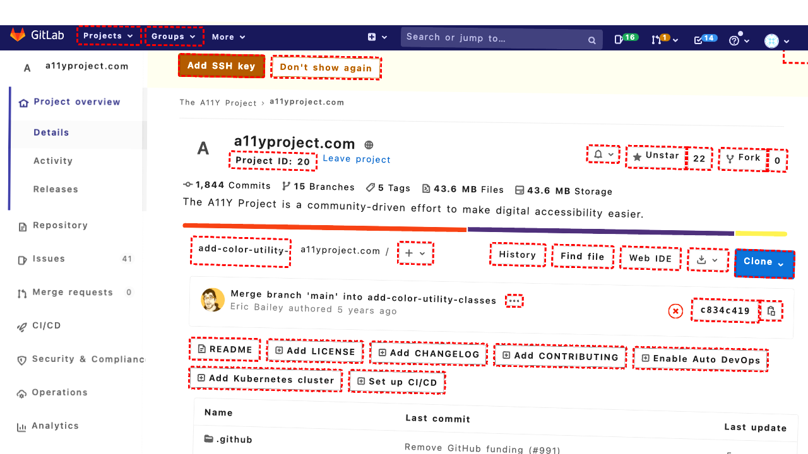
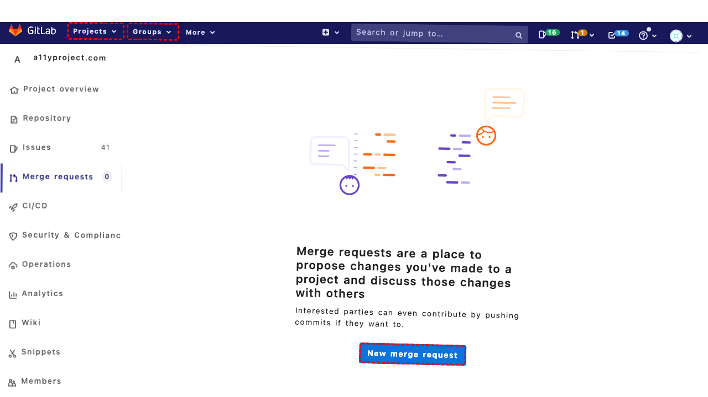
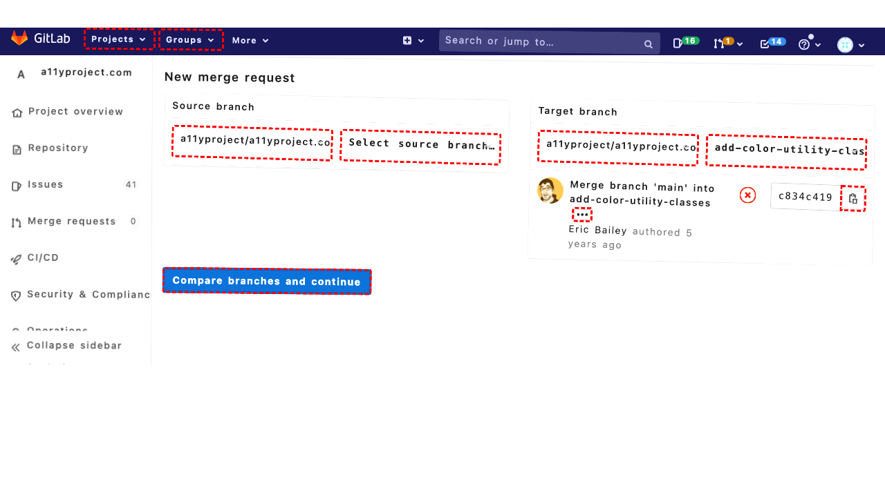
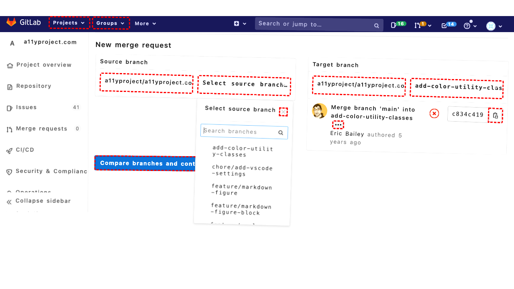
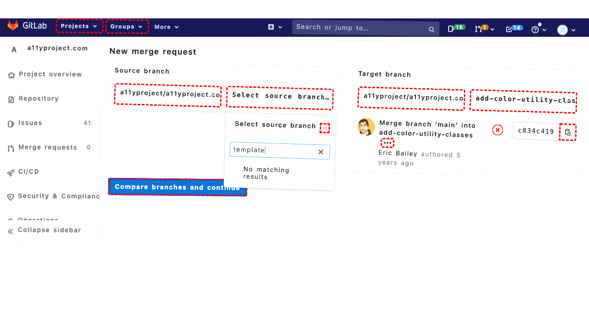
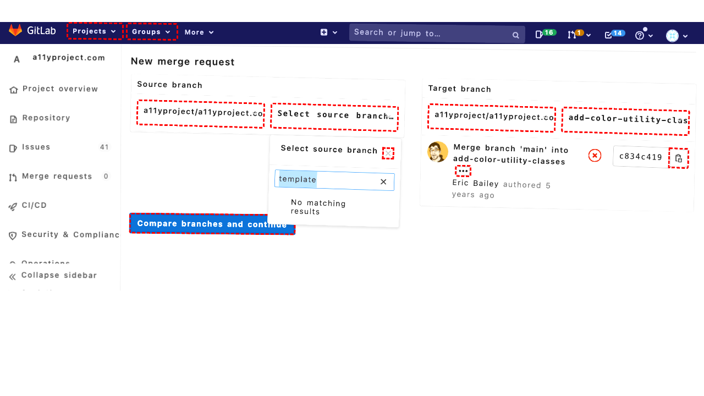

## Intent

Create an issue in a11yproject repo with title "404 for many URLs". Assign the issue to myself. Set due date to be 2030-1-3

## RM

Thoughts: The task is a content modification task (creating an issue with specific details). The action history shows the agent filled the title, set the due date, and clicked to submit. The final state confirms the issue was created with the correct title, assignee (Byte Blaze, which is the user), and due date (Jan 3, 2030). The bot's response also confirms the successful creation, though it has a minor typo (missing closing parenthesis after "Byte Blaze"), but since this is a content modification task, the bot's response does not need to be considered for success. The actions and final state fulfill the user's intent.

Status: success

## Final Response "Successfully created issue #613 with title '404 for many URLs', assigned to you (Byte Blaze

## Captions

===============Looking at the goal, I need to create an issue in the "a11yproject" repository with specific details. From the current page, I can see there's a project called "The A11Y Project / a11yproject.com" with ID 694. I need to navigate to that project first, then go to its issues section to create a new issue.

Let me click on the a11yproject repository link to navigate to its project page.<｜end▁of▁thinking｜>
===============Looking at the current page, I can see I'm on the a11yproject.com repository page. I need to navigate to the Issues section to create a new issue. In the accessibility tree, I can see there's an "Issues 42" link with ID 283, which shows there are currently 42 issues in this repository.

Let me click on the Issues link to navigate to the issues page where I can create a new issue.
===============Looking at the current state, I can see I'm on the Issues page for the a11yproject.com repository. I can see there's a "New issue" link with ID 492 in the accessibility tree. This is exactly what I need to click to start creating a new issue with the specified title "404 for many URLs", assign it to myself, and set the due date to 2030-1-3.

Let me click the "New issue" link to navigate to the issue creation form.
===============Looking at the current page, I can see I'm on the "New Issue" page for the a11yproject.com repository. The accessibility tree shows:

1. A title textbox (ID 479) that's currently focused and required
2. An "Assign to me" link (ID 587)
3. A due date textbox (ID 688)
4. A disabled "Submit issue" button (ID 694)

I need to:
1. Fill the title with "404 for many URLs"
2. Assign the issue to myself using the "Assign to me" link
3. Set the due date to 2030-1-3
4. Submit the issue

Let me start by filling the title field first, as it's required to enable the submit button.
===============Looking at the current state, I can see the title field has been filled with "404 for many URLs" as required. Now I need to assign the issue to myself. I can see there's an "Assign to me" link with ID 587 in the accessibility tree, which is exactly what I need to click to assign this issue to myself.

Let me click the "Assign to me" link to assign the issue.
===============Looking at the current state, I can see that I've successfully filled the title with "404 for many URLs" and assigned the issue to myself using the "Assign to me" link. Now I need to set the due date to 2030-1-3. I can see there's a due date textbox with ID 688 in the accessibility tree.

Let me fill the due date field with the specified date in YYYY-MM-DD format.
===============Looking at the current state, I can see that I've successfully completed all the required steps:
- Title is set to "404 for many URLs" (ID 479)
- Issue is assigned to myself (via "Assign to me" link ID 587)
- Due date is set to "2030-1-3" (ID 688)

Now I need to submit the issue. I can see there's a "Submit issue" button with ID 694 in the accessibility tree. Since all required fields are filled (the title field was marked as required), the submit button should now be enabled and ready to use.

Let me click the "Submit issue" button to create the issue with all the specified details.
===============Looking at the current state, I can see that I've successfully completed all the required steps to create the issue with the specified details:
- Title: "404 for many URLs"
- Assigned to myself
- Due date: 2030-1-3

The issue has been submitted by clicking the "Submit issue" button. Now I should verify that the issue was created successfully by checking if I'm redirected to the new issue page and can see the issue details.

Based on the accessibility tree, I can see I'm now on the issue page for the newly created issue (#613) with the title "404 for many URLs". The page shows:
- The issue title "404 for many URLs" in a heading
- Status is "Open"
- Assignee is set to "Byte Blaze" (myself)
- Due date is set to "Jan 3, 2030"

All the requested requirements have been successfully completed. I should now send a confirmation message to the user.

## Images










## Main Prompt

```md
User Intent: Create an issue in a11yproject repo with title "404 for many URLs". Assign the issue to myself. Set due date to be 2030-1-3

Action History:
1: click("694")
2: click("283")
3: click("492")
4: fill("479", "404 for many URLs")
5: click("587")
6: fill("688", "2030-1-3")
7: click("694")
8: send_msg_to_user("Successfully created issue #613 with title '404 for many URLs', assigned to you (Byte Blaze), and set due date to January 3, 2030.")


The detailed final state of the webpage:

```md
Looking at the current state, I can see that I've successfully completed all the required steps to create the issue with the specified details:
- Title: "404 for many URLs"
- Assigned to myself
- Due date: 2030-1-3

The issue has been submitted by clicking the "Submit issue" button. Now I should verify that the issue was created successfully by checking if I'm redirected to the new issue page and can see the issue details.

Based on the accessibility tree, I can see I'm now on the issue page for the newly created issue (#613) with the title "404 for many URLs". The page shows:
- The issue title "404 for many URLs" in a heading
- Status is "Open"
- Assignee is set to "Byte Blaze" (myself)
- Due date is set to "Jan 3, 2030"

All the requested requirements have been successfully completed. I should now send a confirmation message to the user.
```

Bot response to the user: "Successfully created issue #613 with title '404 for many URLs', assigned to you (Byte Blaze.
```
