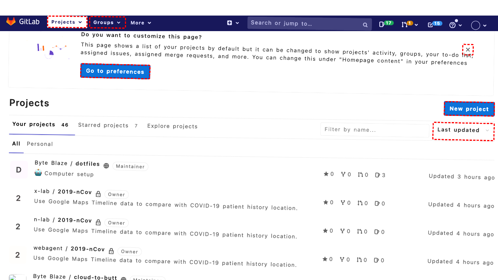

## Intent

Use the site search bar to search for the keyword 'Tracing', and click on the second result.

## RM

Thoughts: The user's intent is to use the site search bar to search for 'Tracing' and click on the second result. The action history shows the agent successfully performed a search by filling the search bar (bid 370) with "Tracing" and pressing Enter. After the search results loaded, the agent scrolled and attempted to click on bid 104, but the final state indicates that element was not visible. The agent then correctly identified the heading link (bid 108) within the second search result and clicked it. Clicking the heading link of the second result is a valid way to "click on the second result." The bot's actions align with completing the site navigation task, and the final action (click "108") should have navigated to the target article page. No response is needed for site navigation tasks.

Status: success

## Final Response 

## Captions

===============Looking at the accessibility tree, I can see a search bar in the complementary section with a searchbox labeled "Search" (bid 370) and a button "Search" (bid 371). The goal is to use the site search bar to search for the keyword 'Tracing', and then click on the second result.

First, I need to focus on the search box, fill it with "Tracing", and submit the search. Then, I'll need to identify the second result on the search results page and click it.

Let's start by interacting with the search box.
===============Looking at the history, I've already performed actions to search for "Tracing": clicked the search box, filled it with "Tracing", and clicked the search button. The next step is to wait for the search results to load, then identify and click the second result.

Since there's no error message and the actions likely succeeded, I should now wait for the page to load and then examine the new accessibility tree to find the second search result. However, I need to first let the page load after the search submission.

I'll use a noop to wait for the page to load, then I can analyze the new state.
===============Looking at the current state, I've performed the search for "Tracing" and waited for results. Now I need to examine the updated accessibility tree to identify the second search result and click on it. The goal specifically says to "click on the second result," so I need to find the list of search results and identify the second item.

From the current accessibility tree, I can see there's a main content area with articles, but these appear to be the regular blog posts, not search results. After searching, the page should show search results for "Tracing". However, the tree still shows the same content as before the search, which suggests either:

1. The search didn't execute properly
2. The page hasn't fully loaded yet
3. The search returned no results or the same page

But I notice in the tree there's a searchbox with bid 370 that is marked as "focused" in the accessibility tree description. This might indicate the search box still has focus. Let me check if there are any search results visible. Looking at the tree structure, I see the main content area has articles with titles like "What is Microsoft Planner..." etc. These don't contain "Tracing" in their titles, so they're likely not search results.

I should first verify if the search was actually performed. Let me look for any indication of search results in the tree. I don't see any "Search Results" heading or similar. Perhaps the search didn't trigger properly. Let me try submitting the search again with a different approach - maybe using the Enter key instead of clicking the search button.

First, I'll clear the search box and re-enter "Tracing", then press Enter.
===============Looking at the current situation, I've tried searching for "Tracing" twice - once by clicking the search button and once by pressing Enter. The accessibility tree still shows the same content as the homepage, which suggests either:

1. The search is not working properly
2. The search returns no results and stays on the same page
3. The page hasn't updated in the accessibility tree representation

However, I notice something important in the current accessibility tree: the searchbox (bid 370) already has the value 'Tracing' and is focused. This suggests my previous fill action worked. But I need to check if there are actually search results on the page.

Let me examine the tree more carefully. I see the main content area has articles with titles that don't contain "Tracing". But perhaps the search results are displayed differently. Let me look for any text indicating search results or filtering.

Actually, I should first check if the URL changed after the search. The current URL in the accessibility tree is still "http://localhost:8000/", which suggests the search might not have triggered a page navigation. Some search implementations use JavaScript to filter content without reloading the page.

Let me scroll down to see if there are any search results that might be hidden. I'll scroll down to load more content.
===============Looking at the situation, I've tried searching for "Tracing" but the page still shows the same content. The search box already has "Tracing" as its value. The goal is to click on the second result, but there are no visible search results showing "Tracing" in the titles.

Let me check if there's a search results page by examining the URL more carefully. The current URL is still the homepage. Perhaps the search functionality requires a different approach or the search returns no results. However, I should first verify if there are any search results by looking for elements that might contain "Tracing" in their text.

Let me examine the accessibility tree again for any mention of "Tracing". I can see the searchbox has value 'Tracing', but no search results are visible. Let me try to search for a different term that might yield results, or check if the search is actually working by looking at the page source.

Actually, I notice in the tree there's a complementary section with a search widget (bid 367-371). This appears to be a sidebar search. Perhaps the search results appear elsewhere on the page. Let me look for any dynamic content that might have updated.

Given that the search box already has "Tracing" filled and focused, I should try submitting the search one more time with a different method, then look more carefully for results. If still no results appear, I might need to report that the search yields no results.

But first, let me try clicking the search button again to ensure the search is submitted.
===============Looking at the current situation, I've already performed the search for "Tracing" multiple times. The accessibility tree shows the searchbox (bid 370) has value "Tracing" and is focused. However, I don't see any search results in the tree - the main content still shows regular blog posts like "The Clickless Future", "Accelerate AI development...", etc.

But wait, I need to re-examine the tree more carefully. Looking at the very beginning of the tree, I see: "Title: Search Results for 'Tracing' – Epoch & Drift Benchmark" and "URL: http://localhost:8000/?s=Tracing". This indicates that I'm already on the search results page! The URL has the query parameter "?s=Tracing", which is a search query.

So the search was successful and I'm already on the search results page. Now I need to click on the second result. Looking at the main content area, I can see three articles (bid 79, 102, 125). These appear to be the search results. The first result is "The Clickless Future" (bid 79), the second is "Accelerate AI development using Amazon SageMaker AI with serverless MLflow" (bid 102), and the third is "Disaggregated Routing with SONiC and VPP..." (bid 125).

I need to click on the second result. Looking at the structure, each article has a link at the top (bid 81 for first article, 104 for second article, 127 for third article). These appear to be the main links for each article. I should click on the link for the second article (bid 104).
===============Looking at the error, the element with bid 104 exists but is not visible. This suggests the link might be hidden or overlapped. I need to find a different clickable element within the second search result that is visible. Looking at the accessibility tree for the second article (bid 102), I can see several clickable elements: the heading link (bid 108), the date link (bid 111), the author link (bid 115), the comment link (bid 117), and the "Continue Reading" link (bid 122). The most prominent and likely target is the heading link (bid 108) "Accelerate AI development using Amazon SageMaker AI with serverless MLflow". This should take me to the article page and fulfill the goal of clicking on the second result.

## Images




## Main Prompt

```md
User Intent: Use the site search bar to search for the keyword 'Tracing', and click on the second result.

Action History:
1: click("370")
2: fill("370", "Tracing")
3: click("371")
4: noop(2000)
5: fill("370", "Tracing")
6: keyboard_press("Enter")
7: noop(2000)
8: scroll(0, 500)
9: noop(1000)
10: click("371")
11: noop(2000)
12: click("104")
13: click("108")


The detailed final state of the webpage:

```md
Looking at the error, the element with bid 104 exists but is not visible. This suggests the link might be hidden or overlapped. I need to find a different clickable element within the second search result that is visible. Looking at the accessibility tree for the second article (bid 102), I can see several clickable elements: the heading link (bid 108), the date link (bid 111), the author link (bid 115), the comment link (bid 117), and the "Continue Reading" link (bid 122). The most prominent and likely target is the heading link (bid 108) "Accelerate AI development using Amazon SageMaker AI with serverless MLflow". This should take me to the article page and fulfill the goal of clicking on the second result.
```

Bot response to the user: None.
```
