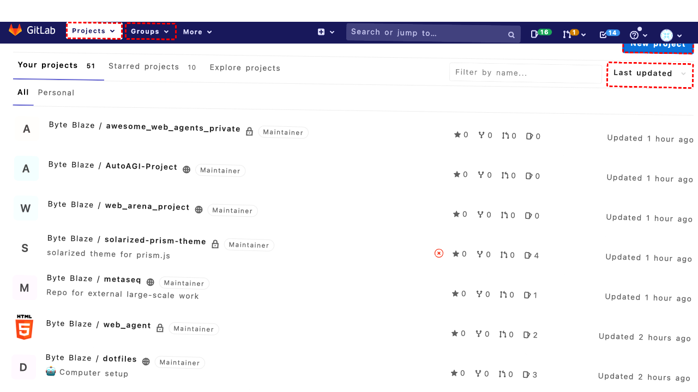
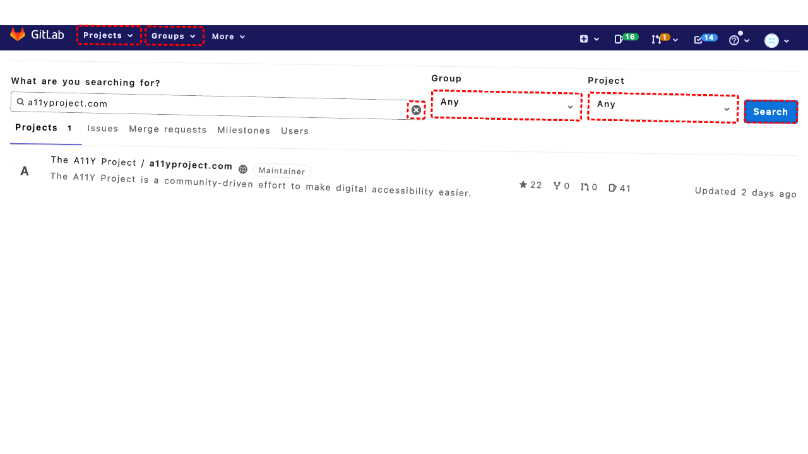
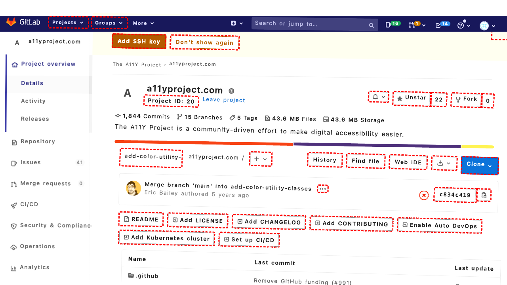
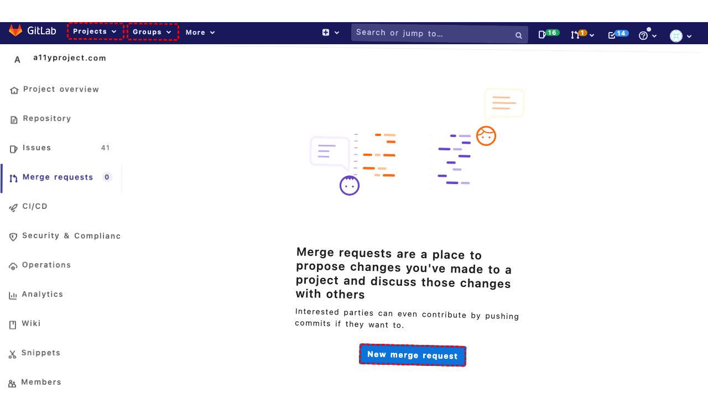

## Intent

Assign the issue regarding flash alert in primer design guide repo to myself.

## RM

Thoughts: The user's intent is to assign the issue to themselves. The action history shows the bot clicked several elements and then sent a message stating the issue is already assigned to the user ("Byte Blaze"). The final state of the webpage confirms the issue is assigned to "Byte Blaze @byteblaze". Since the issue is already assigned to the user, the task is effectively completed without needing further modification. This is a content modification task, and the bot correctly identified the current state and informed the user, so the execution is successful.

Status: success

## Final Response "The issue 'Clarify usage of flash alert' (#10

## Captions

===============Looking at the current page, I can see the GitLab dashboard with a list of projects. I need to find the "primer design guide" repository to assign the flash alert issue to myself.

From the project list, I can see there's a project called "Primer / design" which appears to be the primer design guide repository. I should navigate to this project first to access its issues.

The project has ID '768' and is listed as "Primer / design" with 21 issues. I'll click on this project link to navigate to its page.
===============Looking at the current page, I can see I'm already on the primer/design repository page (Tab 0). I can see there's an "Issues" link in the sidebar navigation with a count of "21" issues. To assign the flash alert issue to myself, I need to first navigate to the issues page for this repository.

From the accessibility tree, I can see there's an "Issues" link with the text "Issues 21" that should take me to the issues page for this repository.
===============Looking at the current page, I can see I'm on the issues page for the primer/design repository. I can see a list of issues, and I need to find the specific issue about "flash alert" to assign it to myself.

From the accessibility tree, I can see there's an issue titled "Clarify usage of flash alert" with ID #10. This appears to be the issue I need to assign to myself. I can click on this issue link to open it and then assign it to myself.

The issue link has the text "Clarify usage of flash alert" and appears to be at position [944] in the accessibility tree.
===============Looking at the current page, I can see I'm already on the specific issue page for "Clarify usage of flash alert (#10)". From the accessibility tree, I can see that the issue is currently assigned to "Byte Blaze @byteblaze" (as shown in the sidebar with the assignee information at position [798]).

Since the goal is to assign this issue to myself and it appears I'm already assigned (as "Byte Blaze"), the task is already completed. I should confirm this to the user.

## Images






## Main Prompt

```md
User Intent: Assign the issue regarding flash alert in primer design guide repo to myself.

Action History:
1: click("768")
2: click("283")
3: click("944")
4: send_msg_to_user("The issue 'Clarify usage of flash alert' (#10) is already assigned to you (Byte Blaze @byteblaze). No action needed.")


The detailed final state of the webpage:

```md
Looking at the current page, I can see I'm already on the specific issue page for "Clarify usage of flash alert (#10)". From the accessibility tree, I can see that the issue is currently assigned to "Byte Blaze @byteblaze" (as shown in the sidebar with the assignee information at position [798]).

Since the goal is to assign this issue to myself and it appears I'm already assigned (as "Byte Blaze"), the task is already completed. I should confirm this to the user.
```

Bot response to the user: "The issue 'Clarify usage of flash alert' (#10.
```
