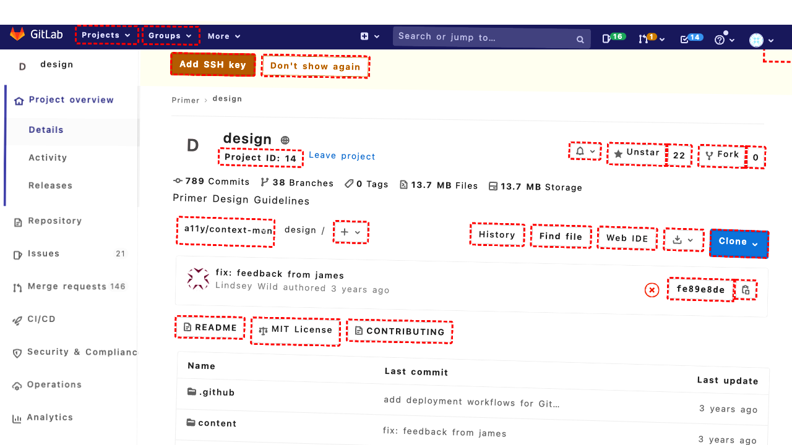
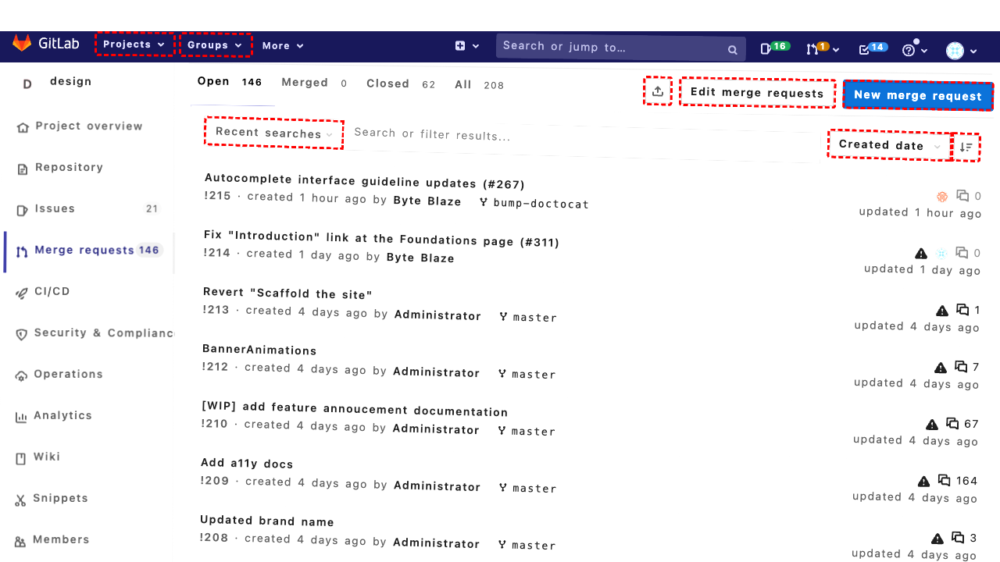
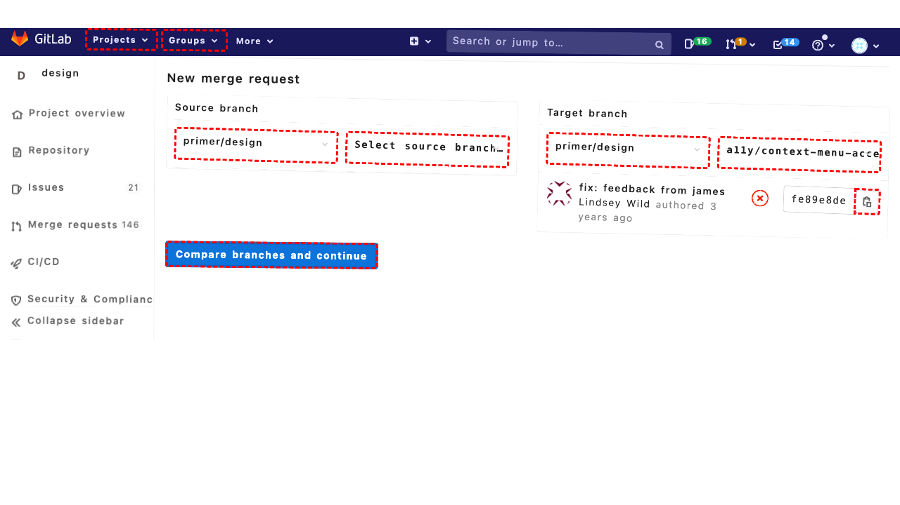
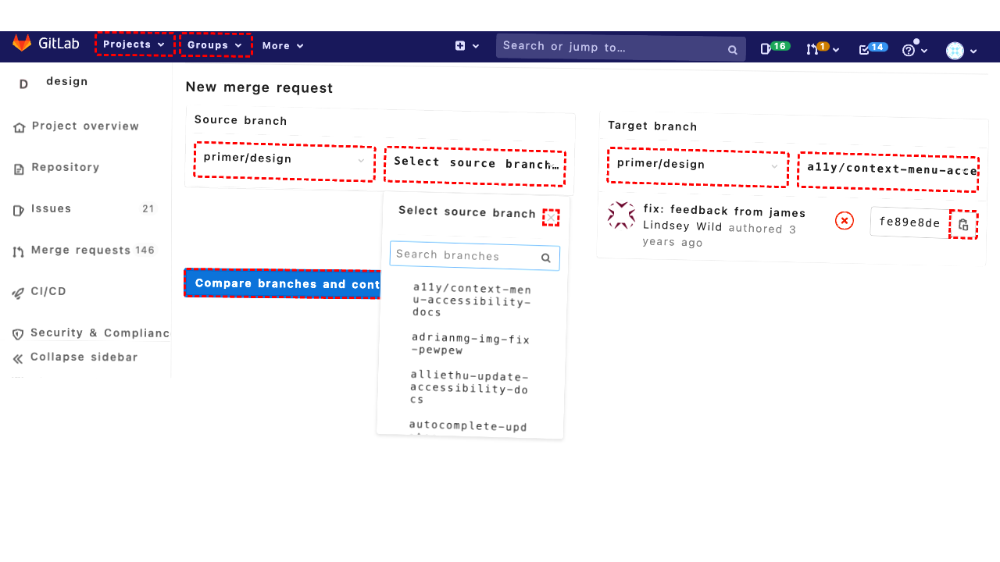
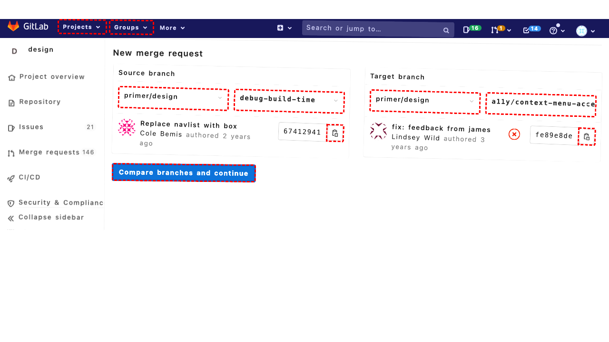
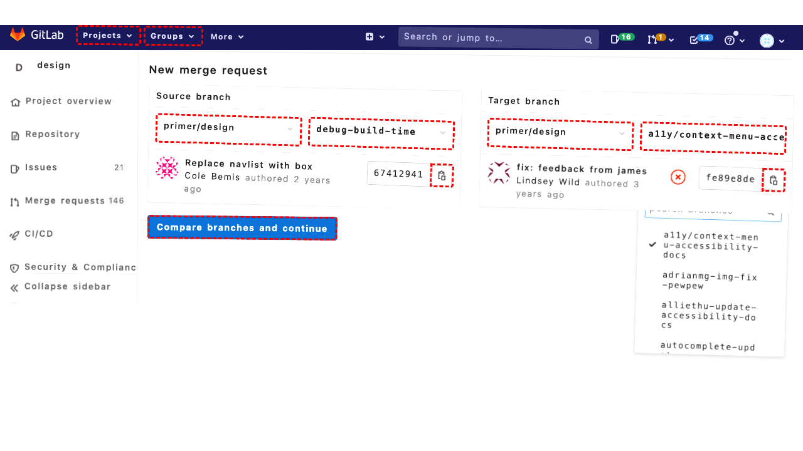
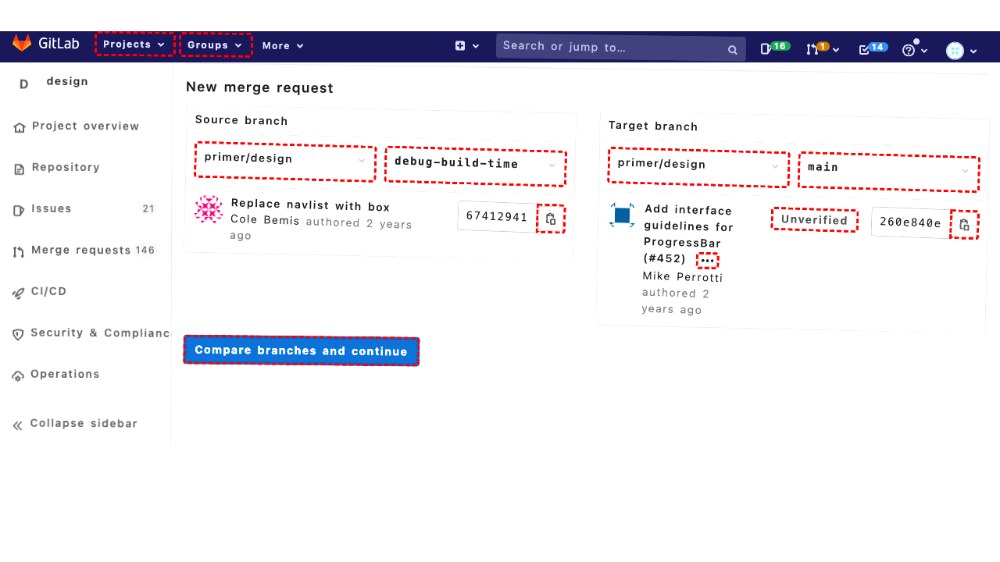
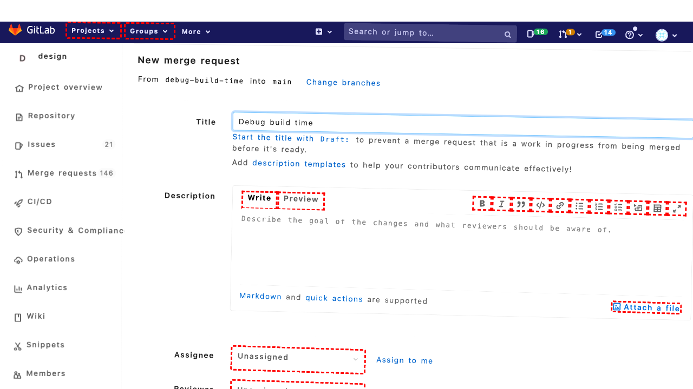
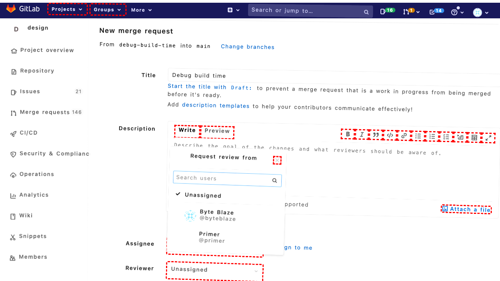
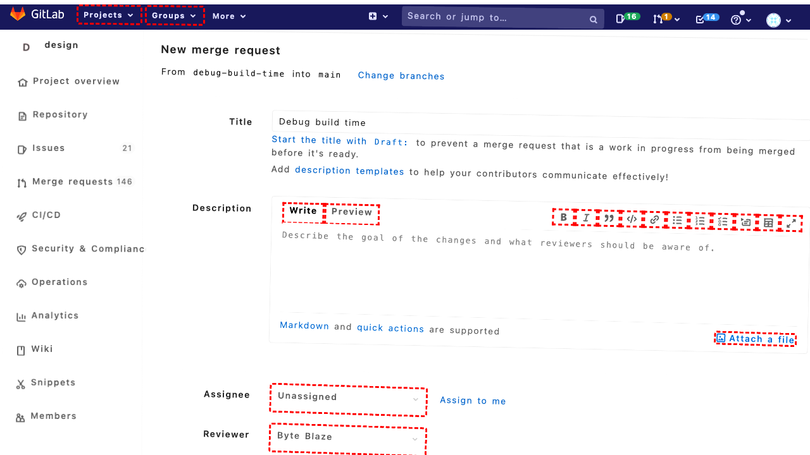

## Intent

Assign the issue regarding 404 in a11yproject to myself.

## RM

Thoughts: The user's intent is to assign an issue to themselves, which is a content modification task. The action history shows multiple clicks including "assign yourself" and "Assignee" elements, but the final state of the webpage indicates the agent is still trying to figure out how to assign the issue and hasn't successfully completed the assignment. The agent mentions needing to find a different approach and speculates about clicking an edit button (ID "1402"), but there's no confirmation that the issue was actually assigned to the user. Since the final state shows the task is incomplete and the agent is still exploring, the execution has failed.

Status: failure

## Final Response 

## Captions

===============Looking at the goal to assign an issue regarding 404 in a11yproject to myself, I need to first navigate to the a11yproject repository, then find the specific issue about 404 errors.

From the accessibility tree, I can see there's a project called "The A11Y Project / a11yproject.com" with ID 694. This appears to be the a11yproject repository I need to access. I should click on this project link to navigate to its page where I can then find and manage issues.
===============Looking at the current page, I can see I'm already on the a11yproject.com repository page (Tab 0). I can see there's an "Issues" link in the sidebar with a count of "42" issues. To find and assign the 404-related issue to myself, I need to navigate to the issues page first.

From the accessibility tree, I can see the Issues link has ID 283 and contains the text "Issues 42". This is the link I should click to view all issues for this repository.
===============Looking at the current state, I can see I'm on the issues page for the a11yproject.com repository. I need to find the specific issue about 404 errors. From the accessibility tree, I can see there's an issue titled "[Bug] 404s, bad host, timeouts, bad urls for URLs linked from website" with ID 1223. This appears to be the 404-related issue mentioned in the goal.

To assign this issue to myself, I need to click on this specific issue link to open it, then I can assign it to myself from the issue details page.
===============Looking at the current state, I can see I'm already on the specific issue page for "[Bug] 404s, bad host, timeouts, bad urls for URLs linked from website" (issue #15). The goal is to assign this issue to myself.

From the accessibility tree, I can see in the sidebar section that there's an "Assignee" field showing "None -" with a button to "assign yourself" (ID 1403). This is exactly what I need to click to assign this issue to myself.
===============Looking at the error, the element with bid "1403" wasn't found. I need to find the correct element to assign the issue to myself. From the accessibility tree, I can see there's an "Assignee" section in the sidebar. Let me look for the "assign yourself" link or button more carefully.

In the accessibility tree, I can see:
- There's an "Assignee" section with text "None - assign yourself"
- The actual clickable element appears to be a link or button that says "assign yourself"

Let me search for the correct element ID by looking for "assign yourself" in the tree. I can see there's a link with the text "assign yourself" that should allow me to assign this issue to myself.
===============Looking at the error and the current state, I need to find the correct element ID for the "assign yourself" functionality. From the accessibility tree, I can see there's an "Assignee" section with the text "None - assign yourself" but I need to identify the specific clickable element.

Let me examine the tree more carefully. I can see there's a group element containing the assignee information, and within it there should be a clickable link or button for "assign yourself". Let me look for the actual element ID by searching for the pattern in the tree.

From the tree structure, I can see there's a link element with the text "assign yourself" that should have a specific bid. Let me try to find it by looking at the structure around line where "assign yourself" appears in the tree.
===============Looking at the current situation, I need to find the correct element to assign the issue to myself. From the accessibility tree, I can see there's an "Assignee" section with the text "None - assign yourself". The issue is that I've been trying incorrect element IDs.

Let me examine the tree more carefully. I can see there's a structure around the assignee section:
- There's a "sidebar" section containing issue metadata
- Within it, there's an "Assignee" field showing "None - assign yourself"
- The clickable element should be the "assign yourself" text/link

Looking at the tree structure, I can see there's a link element with the exact text "assign yourself" that should allow me to assign the issue to myself. Let me click on this specific text element.
===============Looking at the current situation, I need to find the correct way to assign this issue to myself. I can see from the accessibility tree that I'm on the specific issue page for "[Bug] 404s, bad host, timeouts, bad urls for URLs linked from website" (issue #15). The goal is to assign this issue to myself.

From the tree, I can see there's an "Assignee" section in the sidebar showing "None - assign yourself". However, I've been unable to find the correct element ID for the "assign yourself" functionality. Let me try a different approach.

Looking more carefully at the tree structure, I notice there are several sidebar elements related to issue management. Let me try clicking on the "Assignee" label or the area around it to see if that reveals the assignment options. The "Assignee" text appears to be part of a button or interactive element that might expand to show assignment options.
===============Looking at the current situation, I can see I'm on the specific issue page for the 404-related issue in the a11yproject repository. I've been trying to find the correct element to assign the issue to myself but haven't been successful with the element IDs I've tried.

From the accessibility tree, I can see there's an "Assignee" section in the sidebar that shows "None - assign yourself". The issue is that I need to find the exact element ID for the clickable "assign yourself" functionality.

Let me examine the tree more systematically. I notice there are several sidebar elements with IDs in the 1300-1400 range that are related to issue metadata. Let me try clicking on the general area where the assignee information is displayed, specifically looking for an element that contains the assignee functionality.

Looking at the tree structure, I can see there's a group element with ID "1399" that contains the assignee information. This might be the container for the assignee functionality that I can interact with.
===============Looking at the current situation, I need to find a different approach to assign this issue to myself. I can see from the accessibility tree that I'm on the specific issue page for the 404-related issue in the a11yproject repository. The "assign yourself" functionality is clearly visible in the sidebar but I haven't been able to find the correct element ID.

Let me try a different strategy. From the tree, I can see there are several sidebar options and the assignee section appears to be interactive. Let me look for the "Edit" button or pencil icon that typically appears next to the assignee field in GitLab, which might allow me to change the assignment.

Looking at the tree, I can see there's a button with ID "1402" that contains a pencil icon (likely an edit button) near the assignee section. This might be the element I need to click to access the assignment options.

## Images












## Main Prompt

```md
User Intent: Assign the issue regarding 404 in a11yproject to myself.

Action History:
1: click("694")
2: click("283")
3: click("1223")
4: click("1403")
5: click("assign yourself")
6: click("1404")
7: click("assign yourself")
8: click("Assignee")
9: click("1399")
10: click("1402")


The detailed final state of the webpage:

```md
Looking at the current situation, I need to find a different approach to assign this issue to myself. I can see from the accessibility tree that I'm on the specific issue page for the 404-related issue in the a11yproject repository. The "assign yourself" functionality is clearly visible in the sidebar but I haven't been able to find the correct element ID.

Let me try a different strategy. From the tree, I can see there are several sidebar options and the assignee section appears to be interactive. Let me look for the "Edit" button or pencil icon that typically appears next to the assignee field in GitLab, which might allow me to change the assignment.

Looking at the tree, I can see there's a button with ID "1402" that contains a pencil icon (likely an edit button) near the assignee section. This might be the element I need to click to access the assignment options.
```

Bot response to the user: None.
```
