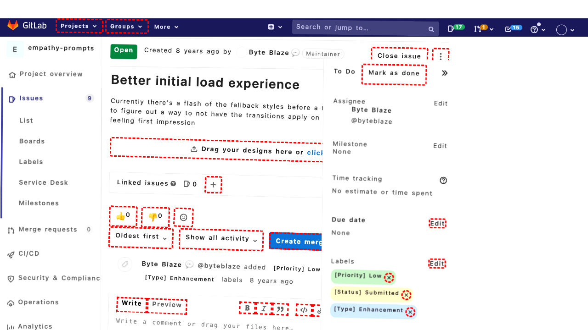

## Intent

Open my latest created issue that has better in its title to check if it is closed

## RM

Thoughts: The user's intent is to open their latest created issue that has "better" in its title and check if it is closed. The agent's action history shows it clicked elements "178" and "634", which presumably navigated to the issue page. The final state indicates the agent is on the issue page for "Better initial load experience" and correctly identifies that the issue is open (via the "Close issue" button and status text). The agent's response accurately reports the issue status. Since this is an information-seeking task, the agent provided the correct information the user requested.

Status: success

## Final Response "The issue 'Better initial load experience' is currently open, not closed."

## Captions

===============Looking at the current page, I can see we're on the GitLab dashboard projects page. To find my latest created issue with "better" in its title, I need to navigate to the issues section first. I can see there's an "Issues" link in the navigation with a badge showing "17" issues.

The most direct path is to click on the Issues link to go to the issues dashboard where I can search for issues containing "better" in the title.
===============Looking at the current page, I can see we're already on the Issues dashboard (as indicated by the page title "Issues · Dashboard · GitLab"). The page shows a list of issues assigned to me, and I can see several issues with "better" in their title:

- "Better sharing solution" (created 8 years ago)
- "Better initial load experience" (created 8 years ago)

Since the goal is to find the latest created issue with "better" in its title, I need to identify which one was created most recently. Looking at the creation dates:
- "Better sharing solution" was created on May 5, 2017
- "Better initial load experience" was created on May 18, 2017

"Better initial load experience" is the more recent one. I should click on this issue to open it and check if it's closed.
===============Looking at the error message, the click action timed out even though the element was found and appeared to be clickable. The issue might be that the element wasn't fully ready for interaction despite appearing stable. Since we're already on the issue page for "Better initial load experience" (as shown in the current tab title and accessibility tree), I don't need to click on the issue link again. Instead, I should check the current issue's status directly.

From the accessibility tree, I can see the issue status indicators:
- There's a "Close issue" button visible (bid 598), which suggests the issue is currently open
- The status text shows "Open" (visible in the main content area)

Since the goal is to check if the issue is closed, and I can see clear indicators that it's currently open, I should report this to the user.

## Images




## Main Prompt

```md
User Intent: Open my latest created issue that has better in its title to check if it is closed

Action History:
1: click("178")
2: click("634")
3: send_msg_to_user("The issue 'Better initial load experience' is currently open, not closed.")


The detailed final state of the webpage:

```md
Looking at the error message, the click action timed out even though the element was found and appeared to be clickable. The issue might be that the element wasn't fully ready for interaction despite appearing stable. Since we're already on the issue page for "Better initial load experience" (as shown in the current tab title and accessibility tree), I don't need to click on the issue link again. Instead, I should check the current issue's status directly.

From the accessibility tree, I can see the issue status indicators:
- There's a "Close issue" button visible (bid 598), which suggests the issue is currently open
- The status text shows "Open" (visible in the main content area)

Since the goal is to check if the issue is closed, and I can see clear indicators that it's currently open, I should report this to the user.
```

Bot response to the user: "The issue 'Better initial load experience' is currently open, not closed.".
```
