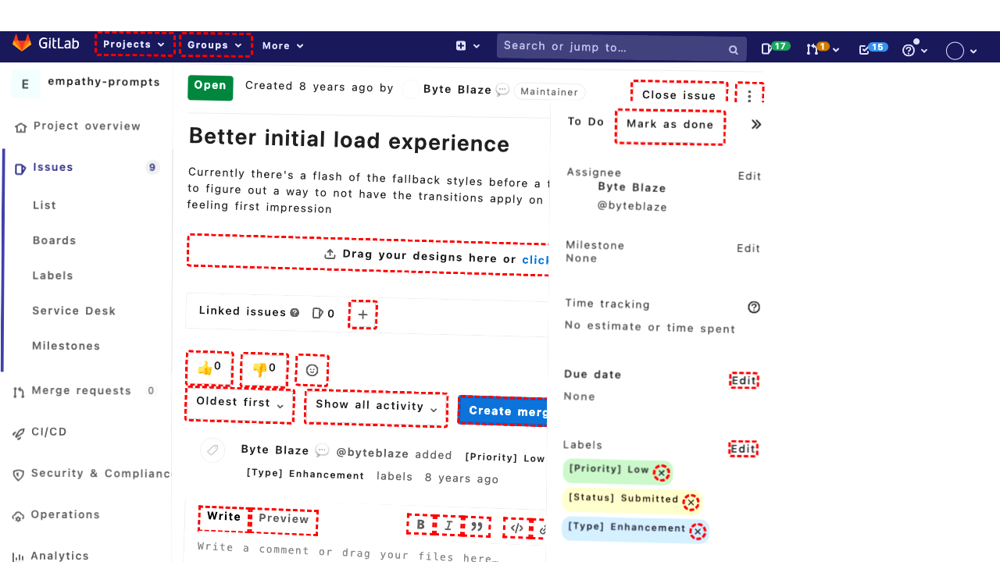

## Intent

Presents the monthly count of successful orders from Jan to December 2022 in MM:COUNT format

## RM

Thoughts: The user's intent is to obtain the monthly count of successful orders from Jan to December 2022 in MM:COUNT format. This is an information-seeking task. The agent's action history shows it performed a series of actions to generate a report, including selecting options, filling dates, and filtering by order status (Complete and Processing). The final state indicates the report was successfully generated with the monthly data displayed in a table. The agent extracted the data and responded with the counts in the requested format (e.g., "01:17" for January). The response includes all 12 months with counts that match the described final state (e.g., January: 17 orders). The agent's actions appear sufficient—it set the correct date range and status filters to retrieve successful orders. Therefore, the execution is successful.

Status: success

## Final Response "01:17\n02:22\n03:23\n04:20\n05:16\n06:27\n07:16\n08:19\n09:16\n10:9\n11:14\n12:16"

## Captions

===============I need to get monthly count of successful orders from Jan to Dec 2022. First, I need to navigate to the orders report. Looking at the accessibility tree, I can see there's a "Reports" menu item (bid 211) that likely contains sales reports. I should expand that menu to access order reports.
===============Looking at the current state, I've clicked the "Reports" menu (bid 211) to expand it. Now I need to navigate to the sales reports, specifically the orders report. In the accessibility tree, I can see that under "Reports" there's a "Sales" submenu (bid 215) that contains "Orders" (bid 219). I should click on "Sales" first to expand its submenu, then click on "Orders" to get to the orders report page.
===============Looking at the current state, I've expanded the "Reports" menu and then clicked "Sales" to expand its submenu. Now I can see the "Orders" link (bid 219) under the Sales submenu. This should take me to the orders report page where I can filter by date and status to get monthly counts for 2022.
===============Looking at the current state, I've navigated to the orders report page. Now I need to configure the filter to get monthly counts of successful orders from Jan to Dec 2022. I can see the filter section with various controls:

1. "Period" dropdown (bid 496) - currently set to "Day", needs to be changed to "Month"
2. "From" date field (bid 505) - needs to be set to Jan 1, 2022
3. "To" date field (bid 513) - needs to be set to Dec 31, 2022
4. "Order Status" dropdown (bid 520) - currently set to "Any", needs to be changed to "Specified" to filter for successful orders
5. "Show Report" button (bid 453) - to apply the filter

First, I should change the period to "Month" to get monthly breakdowns.
===============Looking at the current state, I've changed the period to "Month". Now I need to set the date range from Jan 1, 2022 to Dec 31, 2022. I can see the "From" date field (bid 505) and "To" date field (bid 513). I'll fill both with the appropriate dates.
===============Looking at the current state, I've set the "From" date to 01/01/2022. Now I need to set the "To" date to 12/31/2022. The "To" field has bid 513 and is currently empty. I'll fill it with the end date.
===============Looking at the current state, I've set the date range. Now I need to filter for successful orders. The "Order Status" dropdown (bid 520) is currently set to "Any". I need to change it to "Specified" to be able to select specific statuses. However, I notice that after selecting "Specified", I'll likely need to select the actual status values (like "Complete", "Processing", etc.) from another control that appears. Let me first change the dropdown to "Specified".
===============Looking at the current state, I've changed the Order Status dropdown to "Specified". Now I need to select the specific order statuses that represent successful orders. Typically, "Complete" and "Processing" are considered successful order statuses. I can see a listbox (bid 528) with multiple options including "Complete" (bid 532) and "Processing" (bid 540). I need to select these options. The listbox is multiselectable, so I can select multiple options.
===============Looking at the current state, I've configured the filter: period is set to "Month", date range is Jan 1, 2022 to Dec 31, 2022, and order statuses are set to "Complete" and "Processing". Now I need to apply the filter by clicking the "Show Report" button (bid 453) to generate the monthly report.
===============Looking at the current state, I can see the report has been generated with monthly data for 2022. The table shows rows for each month (1/2022 through 12/2022) with an "Orders" column that contains the count of orders for each month. The goal is to present the monthly count of successful orders from Jan to December 2022 in MM:COUNT format.

I can extract the data from the table. Looking at the accessibility tree, I can see the table rows with the monthly data. For example:
- January 2022 (1/2022): 17 orders (bid 625)
- February 2022 (2/2022): 22 orders (bid 637)
- March 2022 (3/2022): 23 orders (bid 649)
- etc.

I need to extract all 12 months' counts. Since the data is already displayed, I should extract it and present it in the required format. I'll use the `send_msg_to_user` action to output the results.

## Images





## Main Prompt

```md
User Intent: Presents the monthly count of successful orders from Jan to December 2022 in MM:COUNT format

Action History:
1: click("211")
2: click("215")
3: click("219")
4: select_option("496", "Month")
5: fill("505", "01/01/2022")
6: fill("513", "12/31/2022")
7: select_option("520", "Specified")
8: select_option("528", ["Complete", "Processing"])
9: 
10: click("453")
11: send_msg_to_user("01:17\n02:22\n03:23\n04:20\n05:16\n06:27\n07:16\n08:19\n09:16\n10:9\n11:14\n12:16")


The detailed final state of the webpage:

```md
Looking at the current state, I can see the report has been generated with monthly data for 2022. The table shows rows for each month (1/2022 through 12/2022) with an "Orders" column that contains the count of orders for each month. The goal is to present the monthly count of successful orders from Jan to December 2022 in MM:COUNT format.

I can extract the data from the table. Looking at the accessibility tree, I can see the table rows with the monthly data. For example:
- January 2022 (1/2022): 17 orders (bid 625)
- February 2022 (2/2022): 22 orders (bid 637)
- March 2022 (3/2022): 23 orders (bid 649)
- etc.

I need to extract all 12 months' counts. Since the data is already displayed, I should extract it and present it in the required format. I'll use the `send_msg_to_user` action to output the results.
```

Bot response to the user: "01:17\n02:22\n03:23\n04:20\n05:16\n06:27\n07:16\n08:19\n09:16\n10:9\n11:14\n12:16".
```
