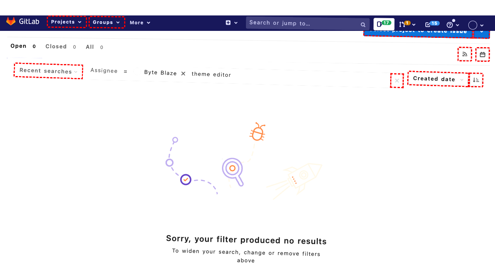
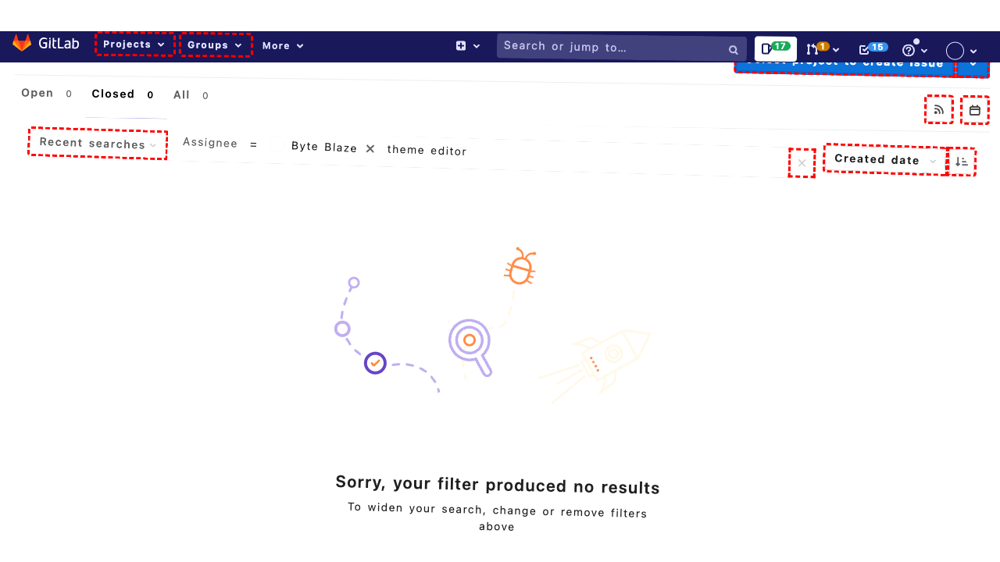
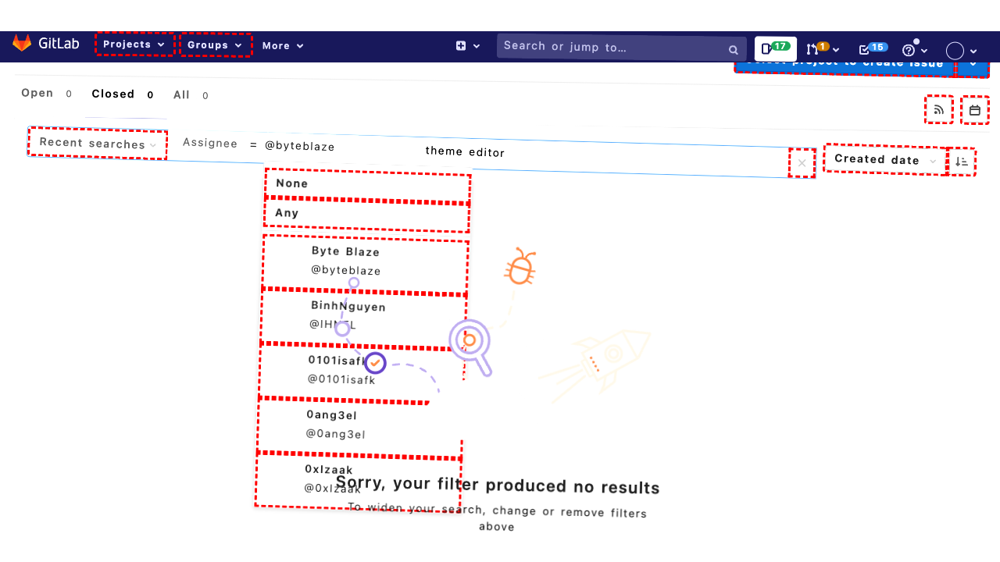
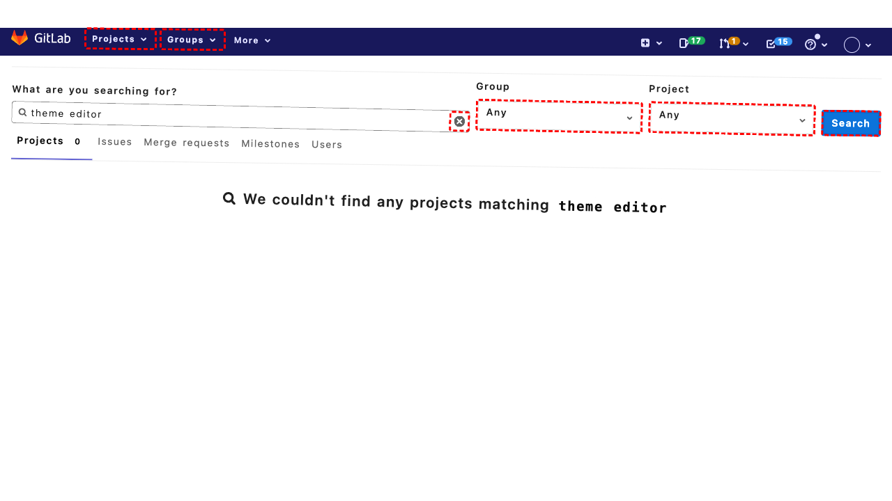
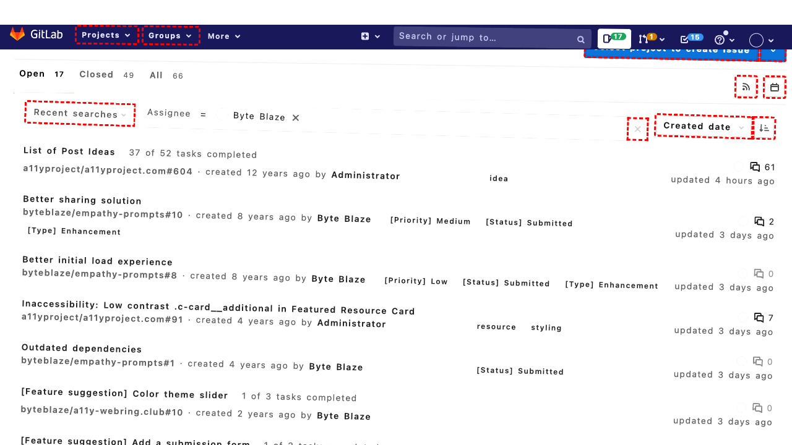
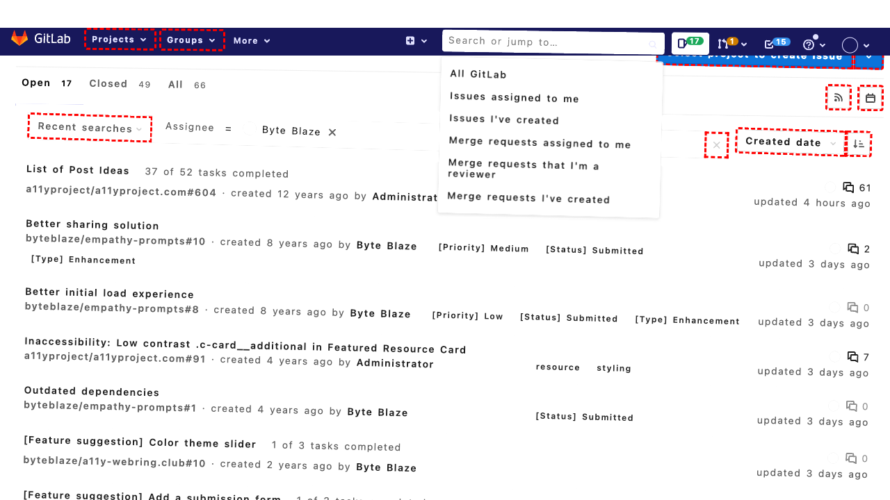

## Intent

Use the site search bar to search for the keyword 'playbook', and click on the second-to-last result.

## RM

Thoughts: The user's intent is to use the site search bar to search for 'playbook' and click on the second-to-last result. The action history shows multiple attempts to interact with the search bar (bid 370) and search button (bid 371), but the final state indicates the page remains on the homepage with no search results visible, and the search box retains 'WordPress' instead of 'playbook'. The bot's response is "None," meaning it hasn't provided any feedback or result to the user. Since this is a site navigation task (navigating to a specific search result page and clicking an item), we examine the action history and final state: the bot failed to successfully execute the search and did not reach a page with results, let alone click the second-to-last result. Therefore, the task is a failure.

Status: failure

## Final Response 

## Captions

===============Looking at the accessibility tree, I can see a search bar in the complementary section with bid 370 (searchbox 'Search'). The goal is to use the site search bar to search for 'playbook' and then click on the second-to-last result. First, I need to interact with the search box, type the keyword, and submit the search. Then I'll need to identify the second-to-last result on the search results page.

I'll start by clicking on the search box to focus it, then fill it with 'playbook', and then either press Enter or click the search button (bid 371). Let's do that.
===============Looking at the current state, I've already performed the search for "playbook" by clicking the search box, filling it, and pressing Enter. Now I need to wait for the search results to load and then identify the second-to-last result to click on it.

Let me first wait a moment for the page to load after the search, then examine the new accessibility tree to find the search results.
===============Looking at the current state after performing the search, I need to examine the new accessibility tree to identify the search results and find the second-to-last result. The goal is to click on that result. Since I don't have the updated accessibility tree yet, I should first check what's currently on the page after the search.

Let me wait a bit more to ensure the search results are fully loaded, then I'll need to see the new accessibility tree to proceed. However, since I can only take one action at a time, I'll wait and then the system will provide the updated tree.
===============Looking at the current state after performing the search for "playbook", I need to examine the updated accessibility tree to identify the search results. The goal is to click on the second-to-last result. I should first check if the search results are displayed and count them, then identify the appropriate link.

From the current accessibility tree, I can see there's a main content area with articles, but I need to verify if these are the search results for "playbook". The tree shows multiple articles with headings like "What is Microsoft Planner...", "You need to know what the tilde...", etc. These appear to be the regular blog posts, not necessarily search results for "playbook".

I should check if there's a search results heading or indication that we're on a search results page. Looking at the tree, I don't see any clear indication of search results. It's possible the search didn't return any results for "playbook", or the results are not showing up in the accessibility tree yet.

Let me check if there's a search results section by looking for elements that might contain search results. I see the main area has multiple articles (bids 129, 152, 175, etc.). If these are the search results, I need to count them and click the second-to-last one. However, I should first verify if we're actually on a search results page by checking the URL or looking for search-related text.

Since I can't see the URL directly from the accessibility tree, I'll look for any text indicating search results. I don't see "Search Results for 'playbook'" or similar. This suggests either: 1) the search didn't execute properly, 2) there are no results, or 3) the results are displayed differently.

Let me try to submit the search again more carefully. I'll go back to the search box and ensure it's properly filled and submitted.
===============Looking at the current state, I've just clicked the search button after filling "playbook" in the search box. Now I need to wait for the search results to load, then identify the second-to-last result. Let me wait for the page to load and then examine the updated accessibility tree to find the search results.
===============Looking at the current state after performing the search, I need to examine the updated accessibility tree to identify the search results. The goal is to click on the second-to-last result. I should first check if the search results are displayed and count them, then identify the appropriate link.

From the current accessibility tree, I can see there's a main content area with articles, but I need to verify if these are the search results for "playbook". The tree shows multiple articles with headings like "What is Microsoft Planner...", "You need to know what the tilde...", etc. These appear to be the regular blog posts, not necessarily search results for "playbook".

I should check if there's a search results heading or indication that we're on a search results page. Looking at the tree, I don't see any clear indication of search results. It's possible the search didn't return any results for "playbook", or the results are not showing up in the accessibility tree yet.

Let me check if there's a search results section by looking for elements that might contain search results. I see the main area has multiple articles (bids 129, 152, 175, etc.). If these are the search results, I need to count them and click the second-to-last one. However, I should first verify if we're actually on a search results page by checking the URL or looking for search-related text.

Since I can't see the URL directly from the accessibility tree, I'll look for any text indicating search results. I don't see "Search Results for 'playbook'" or similar. This suggests either: 1) the search didn't execute properly, 2) there are no results, or 3) the results are displayed differently.

Let me try to submit the search again more carefully. I'll go back to the search box and ensure it's properly filled and submitted.
===============Looking at the current situation, I've attempted to search for "playbook" multiple times but the accessibility tree still shows the same homepage content with articles that don't appear to be search results. This suggests the search may not be working properly or the results are being displayed in a way not captured in the current tree view.

Let me check if there's any indication in the tree that we're on a search results page. Looking at the tree again, I notice the URL in the RootWebArea is still 'http://localhost:8000/' (the homepage), not a search results URL. This confirms the search didn't navigate to a new page.

I should try a different approach. Let me examine the search form more carefully. The search box has bid 370 and the search button has bid 371. Perhaps I need to submit the form differently or the search functionality works via JavaScript that isn't triggering properly with my previous actions.

Let me try to fill the search box and then press Enter instead of clicking the button, ensuring the form submits:
===============Looking at the situation, I've tried multiple approaches to search for "playbook" but the page remains on the homepage (URL still localhost:8000/). The search form might be using JavaScript that isn't properly submitting with my actions. Let me check if there's a different search mechanism or if I need to trigger the search differently.

From the accessibility tree, I can see the search box already has "playbook" as its value (it shows `value='playbook'` in the tree). This suggests my previous fill actions worked. The issue might be that the search results are displayed on the same page via AJAX/JavaScript without a full page reload, so the accessibility tree might not be updating to show them.

I should look for search results that might have appeared dynamically. Let me examine the tree more carefully for any new content. The tree shows a main area with articles, but these look like regular blog posts, not search results. However, if the search is working via AJAX, the same articles might be filtered to show only those containing "playbook".

Let me check if any of the article headings contain the word "playbook". Looking at the article headings:
- "What is Microsoft Planner and who is it for" (no playbook)
- "You need to know what the tilde (~) does in Excel" (no playbook)
- "To harness crypto ingenuity..." (no playbook)
- "Ethereum-Solidity Quiz Q5..." (no playbook)
- "HOW TO CREATE AN ELASTIC BEANSTALK ON AWS" (no playbook)
- "Scaling the Data Layer in Distributed Systems" (no playbook)
- "Unlock Your Gift Cards' Full Potential with Google Wallet" (no playbook)
- "12 Must-Have WordPress Plugins for Developers in 2026 🚀" (no playbook)
- "Auto-Approve WebFetch and WebSearch in Claude Code with Hooks" (no playbook)
- "Frontend Website Development: A Practical Guide for Modern Web Projects" (no playbook)

None contain "playbook", so either there are no search results or the search isn't working. Let me try a different search term to test if the search functionality works at all. I'll search for something that should definitely appear, like "WordPress" (which appears in one of the article titles).
===============Looking at the current situation, I've tried searching for "playbook" multiple times but the page remains on the homepage. I just tried searching for "WordPress" to test if the search functionality works at all. The accessibility tree still shows the homepage URL and the same articles, suggesting the search may not be triggering properly or the results are being displayed in a way not captured in the current tree.

Let me wait a moment to see if the search for "WordPress" produces any results or changes to the page, then examine the updated accessibility tree.
===============Looking at the current situation, I've tried multiple search attempts but the page remains on the homepage with no visible search results. The search functionality might be broken or require a different approach. However, I notice something important in the accessibility tree: the search box (bid 370) already has `value='WordPress'` from my last action, not `value='playbook'`. This suggests the search box is retaining the value but the search isn't executing properly.

Let me re-examine the goal: "Use the site search bar to search for the keyword 'playbook', and click on the second-to-last result." I need to ensure I'm searching for "playbook" specifically. The issue might be that the search form isn't submitting correctly. Let me try a more direct approach: clear the search box, enter "playbook", and explicitly click the search button.

First, I'll clear the search box by selecting all text and deleting it, then enter "playbook" and click the search button.

## Images











## Main Prompt

```md
User Intent: Use the site search bar to search for the keyword 'playbook', and click on the second-to-last result.

Action History:
1: click("370")
2: fill("370", "playbook")
3: keyboard_press("Enter")
4: noop(2000)
5: noop(3000)
6: click("370")
7: fill("370", "playbook")
8: click("371")
9: noop(2000)
10: click("370")
11: fill("370", "playbook")
12: click("371")
13: fill("370", "playbook")
14: keyboard_press("Enter")
15: fill("370", "WordPress")
16: keyboard_press("Enter")
17: noop(2000)
18: click("370")
19: keyboard_press("ControlOrMeta+a")
20: keyboard_press("Backspace")
21: fill("370", "playbook")
22: click("371")


The detailed final state of the webpage:

```md
Looking at the current situation, I've tried multiple search attempts but the page remains on the homepage with no visible search results. The search functionality might be broken or require a different approach. However, I notice something important in the accessibility tree: the search box (bid 370) already has `value='WordPress'` from my last action, not `value='playbook'`. This suggests the search box is retaining the value but the search isn't executing properly.

Let me re-examine the goal: "Use the site search bar to search for the keyword 'playbook', and click on the second-to-last result." I need to ensure I'm searching for "playbook" specifically. The issue might be that the search form isn't submitting correctly. Let me try a more direct approach: clear the search box, enter "playbook", and explicitly click the search button.

First, I'll clear the search box by selecting all text and deleting it, then enter "playbook" and click the search button.
```

Bot response to the user: None.
```
