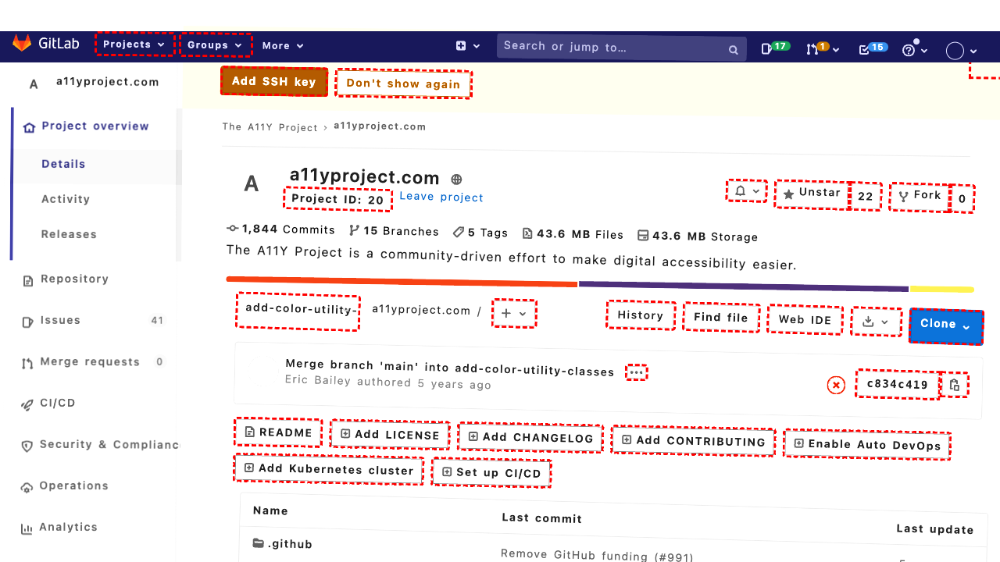
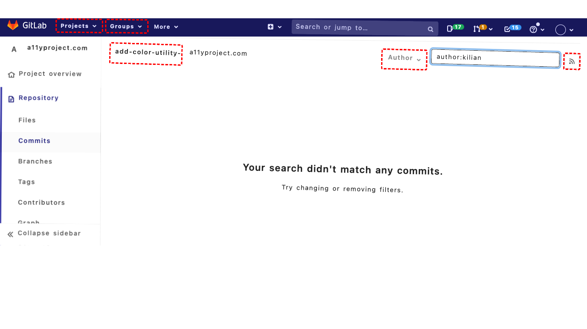
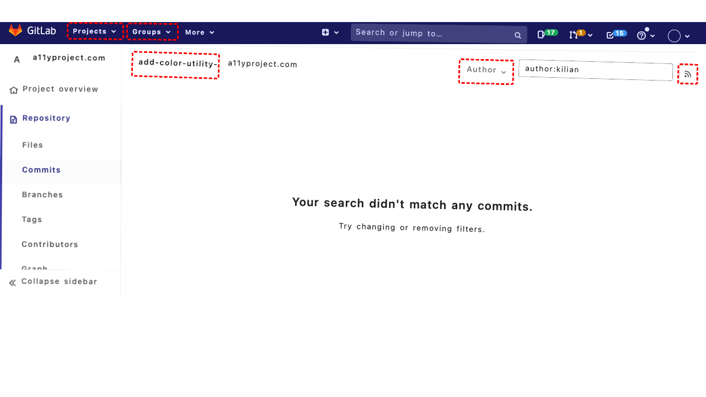
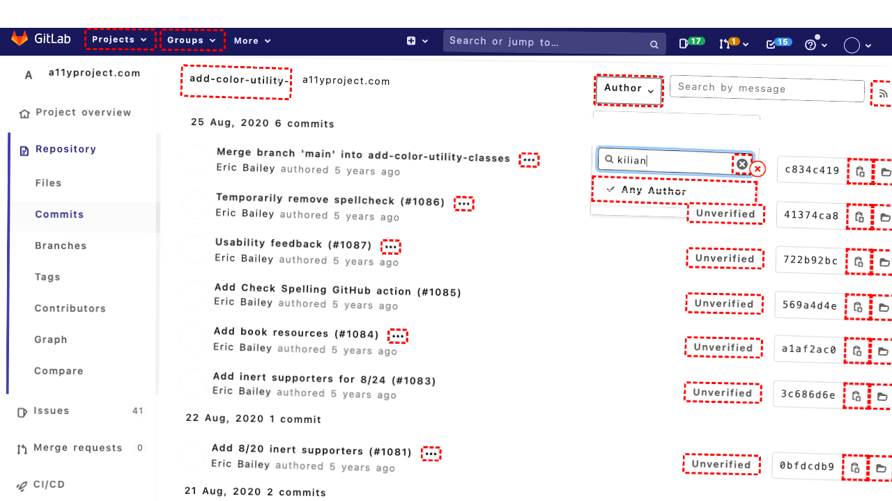

## Intent

Presents the monthly count of successful orders from Feb to Nov 2022 in MM:COUNT format

## RM

Thoughts: The user intent is to obtain monthly counts of successful orders from Feb to Nov 2022 in MM:COUNT format, which is an information-seeking task. The bot's action history shows it performed several actions, including setting filters (selecting "Complete" status, filling date range from 02/01/2022 to 11/30/2022, selecting "200" items per page) and clicking navigation elements. However, the final state of the webpage indicates the bot is still in the process of navigating to the "Orders" report page (it mentions needing to click bid 219), and the bot response is "None." This suggests the bot did not complete the task—it did not retrieve or present the requested data, nor did it provide a response indicating the information is unavailable. The actions are insufficient as the bot hasn't reached the point of extracting or displaying the monthly counts.

Status: failure

## Final Response 

## Captions

===============I need to get monthly counts of successful orders from Feb to Nov 2022. First, I should navigate to the Orders page to access order data. Looking at the current page, I can see the Sales menu (bid 66) in the sidebar. I need to click it to expand and then click Orders (bid 70).
===============I can see the Sales menu is now expanded (since I clicked it). I can see the Orders link (bid 70) in the submenu. I need to click it to go to the orders listing page.
===============Looking at the current page, I can see I'm already on the Orders page (URL: /admin/sales_order/). The goal is to get monthly counts of successful orders from Feb to Nov 2022. I need to filter orders by status "Complete" (successful) and by date range from Feb 1, 2022 to Nov 30, 2022. Then I need to extract counts per month.

First, I should set the status filter to "Complete". I can see the Status dropdown with bid 638. I'll select "Complete" option.
===============Looking at the current page, I can see the Status dropdown is now set to "Complete" (I just selected it). Next, I need to set the date range filter for "Purchased On" to cover Feb 1, 2022 to Nov 30, 2022. I can see the "Purchased On" filter section has two text inputs for "From:" and "To:" with associated date picker images. Based on the accessibility tree, the "From:" input has bid 607 and the "To:" input has bid 611. I need to fill these with the appropriate dates in the format the system expects (likely MM/DD/YYYY or similar). I'll fill them with "02/01/2022" and "11/30/2022".
===============Looking at the current page, I've set the "From" date to 02/01/2022. Now I need to set the "To" date to 11/30/2022 to cover the period from February to November 2022. I can see the "To" input field has bid 611. I'll fill it with "11/30/2022".
===============Looking at the current page, I've set the status filter to "Complete" and the date range from Feb 1, 2022 to Nov 30, 2022. Now I need to apply these filters by clicking the Search button to see the filtered orders. I can see the Search button with bid 483 in the accessibility tree. After clicking Search, I'll get the filtered results and then need to extract monthly counts.
===============Looking at the current page after applying the filters, I can see the table shows 20 orders (the default view). The goal is to get monthly counts from Feb to Nov 2022. I need to extract the count of orders per month from the filtered results. However, the current view only shows 20 orders per page, and I need to see all orders in the date range to count them by month.

First, I should change the "View per page" dropdown to show more orders, perhaps 200, to see all orders at once. I can see the combobox with bid 1098 that controls the number of items per page. I'll select "200" to display all orders on one page.
===============Looking at the current page after changing the items per page to 200, I can see the table now shows more rows. I need to extract the monthly counts of successful orders from Feb to Nov 2022. The orders are displayed in the table with "Purchased On" dates in the format like "Nov 30, 2022 1:00:41 AM". I need to count how many orders fall in each month from February through November 2022.

Since I can't directly extract aggregated counts from the UI, I need to parse the table data. However, the accessibility tree shows the table structure with rows containing date cells. I can see there are many rows (likely all 182 records mentioned in the page info). I need to programmatically count orders by month.

I should extract the date information from each row and tally counts per month. I can do this by examining the table rows in the accessibility tree. Let me first check if there's a way to get all the data at once. The table has a rowgroup with multiple rows, each containing a date cell (e.g., bid 1306 for the first row). I need to iterate through all rows and extract the month from the "Purchased On" column.

Since I can't run custom JavaScript in this environment, I need to use available actions. However, there's no built-in function to extract and aggregate data by month. I need to think differently.

Actually, looking at the goal: "Presents the monthly count of successful orders from Feb to Nov 2022 in MM:COUNT format". This suggests I need to output something like "02:15, 03:22, ..." etc. I have the filtered data, but I need to count per month.

I could try to use the export functionality to get the data in CSV format, then parse it. I see there's an "Export to: CSV" dropdown with bid 1110 and an "Export" button with bid 1113. If I export the filtered data to CSV, I could potentially parse it. However, I don't have a way to read the exported file in this environment.

Alternatively, I could try to use the pagination to go through all pages and count manually, but that would be inefficient.

Wait, I notice the page says "Total 182 records found". That's the total count of orders matching my filters. But I need monthly breakdowns.

Let me check if there's a reports section that might provide monthly summaries. Looking at the sidebar, there's a "Reports" menu (bid 211) with "Sales" submenu (bid 215) that contains "Orders" report (bid 219). That might give me aggregated data by month. That's probably a better approach than trying to parse the raw orders table.

I should navigate to the Reports > Sales > Orders page, which likely provides sales reports by period including monthly breakdowns. From there, I can filter by date range and status to get the monthly counts.

Let me first click on the Reports menu to expand it.
===============Looking at the current page, I can see the Reports menu is now expanded (I clicked it). I need to navigate to the Sales reports, specifically the Orders report. I can see the "Sales" link (bid 215) under Reports. I'll click that to expand the Sales submenu.
===============Looking at the current page, I can see the Reports > Sales submenu is now expanded. I need to click on the "Orders" report link (bid 219) to navigate to the sales orders report page, which should provide aggregated data including monthly counts.

## Images








## Main Prompt

```md
User Intent: Presents the monthly count of successful orders from Feb to Nov 2022 in MM:COUNT format

Action History:
1: click("66")
2: click("70")
3: select_option("638", "Complete")
4: fill("607", "02/01/2022")
5: fill("611", "11/30/2022")
6: click("483")
7: select_option("1098", "200")
8: click("211")
9: click("215")
10: click("219")


The detailed final state of the webpage:

```md
Looking at the current page, I can see the Reports > Sales submenu is now expanded. I need to click on the "Orders" report link (bid 219) to navigate to the sales orders report page, which should provide aggregated data including monthly counts.
```

Bot response to the user: None.
```
