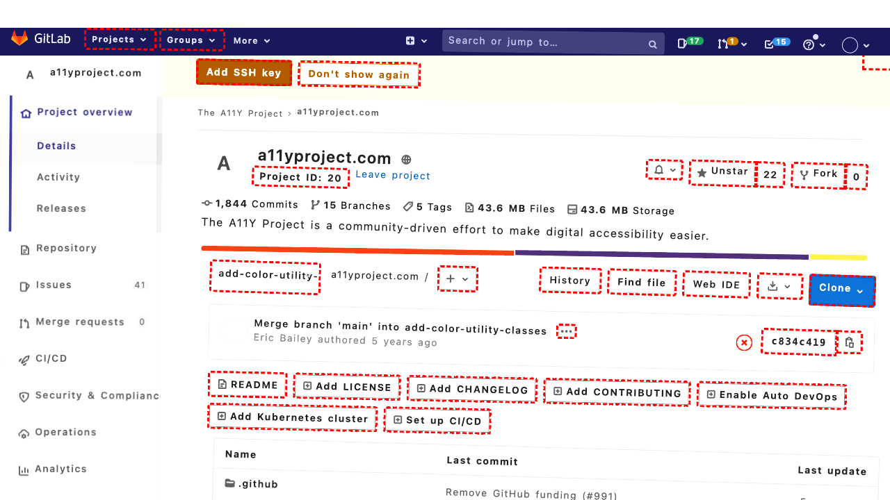
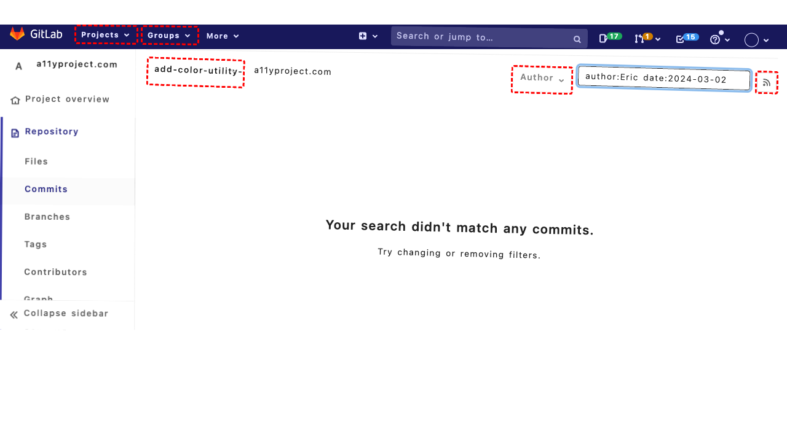

## Intent

What's the total number of items sold in the most recent 2 orders?

## RM

Thoughts: The user's intent is to find the total number of items sold in the most recent 2 orders, which is an information-seeking task. The agent's action history shows it navigated to order details pages (likely via order IDs like "66", "70", etc., which might correspond to order numbers), performed an extract_count() on one order, went back, clicked another order, and then sent a message with the total of 9. The final state description indicates the agent correctly identified 5 items in the first order (000000299) and 4 items in the second order (000000065), summing to 9. The bot's response provides this total, matching the information derived from the webpage. The actions appear sufficient as they accessed the two most recent orders and extracted item counts. There's no indication of errors or missing steps (like failing to order by recency). Thus, the task is successful.

Status: success

## Final Response "The total number of items sold in the most recent 2 orders is 9."

## Captions

===============I need to find the total number of items sold in the most recent 2 orders. Looking at the current page, I can see a "Last 5 Orders" table in the dashboard with columns: Customer, Items, Grand Total. The table shows 5 recent orders with their item counts. The most recent 2 orders appear to be the first two rows: Sarah Miller (5 items) and Grace Nguyen (4 items). However, I should verify this is indeed the most recent ordering and get the exact total.

From the table, I can extract the item counts for the first two rows: 5 + 4 = 9 items. But to be thorough and ensure accuracy, I should navigate to the Orders page where I can see all orders sorted by date and get the exact item counts for the two most recent orders.

Let me first check if the dashboard table is sorted by most recent. The table shows Sarah Miller first, then Grace Nguyen, etc. I should confirm this is chronological. Alternatively, I can go to the Orders page to get definitive data.

Looking at the action trajectory examples, I see that to work with orders, I need to navigate to the Orders page via Sales menu. Let me do that.
===============I need to navigate to the Orders page to see all orders and get the most recent 2 orders' item counts. I just clicked the Sales menu (bid 66) to expand it. Now I should click the Orders link (bid 70) to go to the orders listing page.
===============I can see that I'm already on the Orders page (URL: /admin/sales_order/). The page shows a table of orders with columns including Order #, Purchased On, etc. I need to find the total number of items sold in the most recent 2 orders. To do this, I should:

1. Sort the orders by "Purchased On" in descending order to ensure the most recent orders are first.
2. Then view the details of the first two orders to get their item counts.
3. Sum those counts.

Looking at the accessibility tree, I can see the "Purchased On" column header has a link (bid 560) that I can click to sort. Let me click that to sort by purchase date (most recent first).
===============Looking at the current state, I can see I'm on the Orders page with a table showing orders. I need to get the total number of items sold in the most recent 2 orders. The table appears to be sorted by "Purchased On" in some order, but I need to ensure it's sorted descending (most recent first). I clicked the "Purchased On" column header (bid 560) to sort it.

Now I should check if the sorting worked and then view the details of the first two orders to get their item counts. However, the item count isn't directly visible in this table view - I need to click "View" for each order to see the order details page where I can find the number of items.

Let me first verify the current order listing. Looking at the table rows, the first row shows order 100000049 with date "Mar 14, 2013 5:01:34 PM". I need to check if this is indeed the most recent. Looking further down, I see order 100000087 with date "Apr 23, 2013 7:27:51 PM" appears later in the table, suggesting the table might not be sorted by most recent first yet.

I should click the "Purchased On" column header again to ensure descending order. Let me check the accessibility tree - I see "Purchased On" column header has bid 1199. Let me click that.
===============Looking at the current page, I can see the orders table is now sorted by "Purchased On" in descending order (most recent first). The first row shows order "000000299" with date "May 30, 2023 11:55:09 PM", which appears to be the most recent. The second row shows "000000065" with date "May 28, 2023 3:43:55 AM".

To get the total number of items sold in these two most recent orders, I need to view each order's details page where I can find the item count. I'll click the "View" link for the first order (bid 1842), then extract the item count, go back, and repeat for the second order.

Let me start with the first order.
===============Looking at the current page, I can see I'm now on the order details page for order #000000299. I need to extract the number of items sold in this order. Looking at the "Items Ordered" section, I can see there are 5 items listed (Argus All-Weather Tank, Marco Lightweight Active Hoodie, Tiffany Fitness Tee, Nadia Elements Shell, Gwen Drawstring Bike Short). Each has a quantity of 1, so total items = 5.

I need to get this count programmatically. I can see the table with rows for each item. I should count the number of rows in the table body (excluding header rows). Looking at the accessibility tree, I can see the table has rowgroups: one for header (bid 666) and several for data (bid 684, 726, 768, 810, 852). There are 5 data rowgroups, confirming 5 items.

Now I need to extract this count, then go back to the orders list to view the second most recent order. Let me first extract the count from this page.
===============Looking at the error, `extract_count()` is not a defined action in the action space. I need to use available actions to get the item count. I can count the number of item rows in the "Items Ordered" table manually by examining the accessibility tree. I see 5 data rowgroups (bids 684, 726, 768, 810, 852). That's 5 items.

But I need to get this count programmatically and sum with the second order. Since I can't use `extract_count()`, I'll need to navigate to each order and count items, then compute the total. Let me first go back to the orders list.
===============Looking at the current state, I'm back on the Orders page after viewing the first order. I confirmed the first order (000000299) has 5 items. Now I need to view the second most recent order (000000065) to get its item count. I can see the second row in the table has order 000000065 with "View" link (bid 691). Let me click that.
===============Looking at the current page, I'm now on the order details page for order #000000065 (the same page shown in the initial accessibility tree). I need to extract the number of items sold in this order. Looking at the "Items Ordered" section in the accessibility tree, I can see there are 4 data rowgroups (bids 684, 726, 768, 810) corresponding to 4 items: Neve Studio Dance Jacket, Minerva LumaTech V-Tee, Frankie Sweatshirt, and Sparta Gym Tank. Each has quantity 1, so total items = 4.

Now I have the counts: first order (000000299) had 5 items, second order (000000065) has 4 items. Total = 9 items. I should send this result to the user.

## Images






## Main Prompt

```md
User Intent: What's the total number of items sold in the most recent 2 orders?

Action History:
1: click("66")
2: click("70")
3: click("560")
4: click("1199")
5: click("1842")
6: extract_count()
7: go_back()
8: click("691")
9: send_msg_to_user("The total number of items sold in the most recent 2 orders is 9.")


The detailed final state of the webpage:

```md
Looking at the current page, I'm now on the order details page for order #000000065 (the same page shown in the initial accessibility tree). I need to extract the number of items sold in this order. Looking at the "Items Ordered" section in the accessibility tree, I can see there are 4 data rowgroups (bids 684, 726, 768, 810) corresponding to 4 items: Neve Studio Dance Jacket, Minerva LumaTech V-Tee, Frankie Sweatshirt, and Sparta Gym Tank. Each has quantity 1, so total items = 4.

Now I have the counts: first order (000000299) had 5 items, second order (000000065) has 4 items. Total = 9 items. I should send this result to the user.
```

Bot response to the user: "The total number of items sold in the most recent 2 orders is 9.".
```
