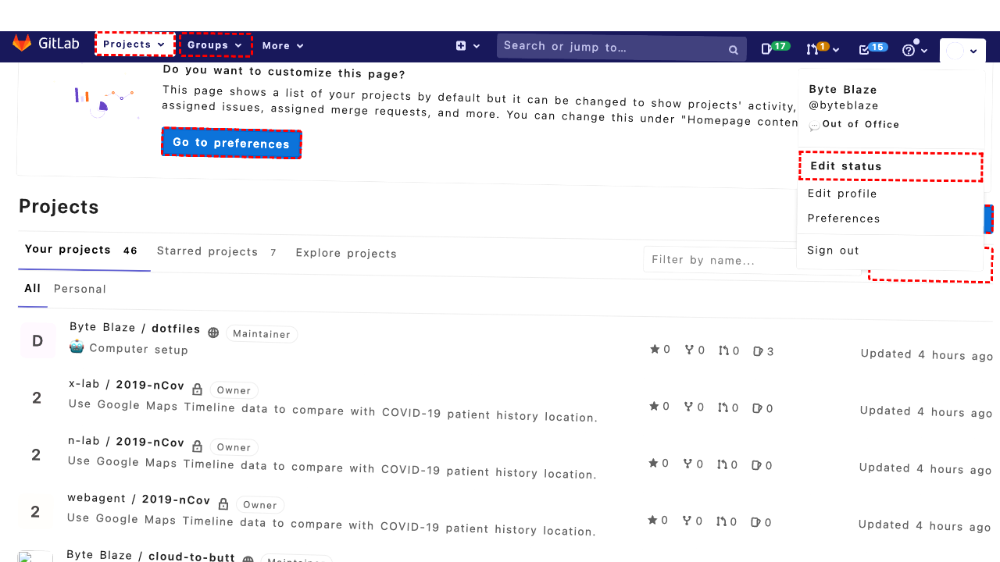
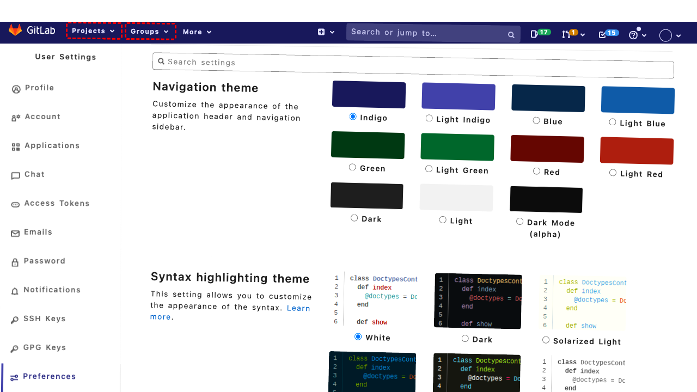
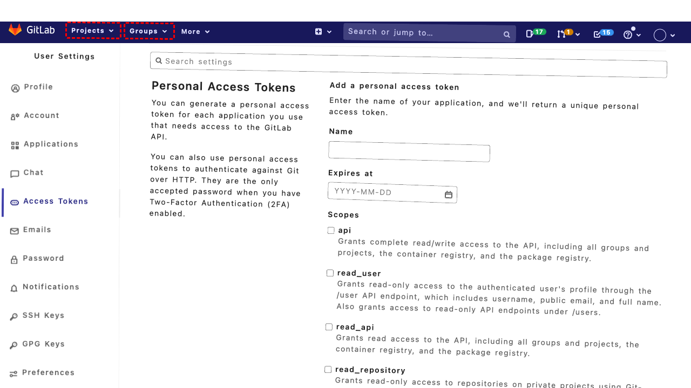

## Intent

Get me my RSS feed token

## RM

Thoughts: The user's intent is to obtain their RSS feed token, which is an information-seeking task. The agent's action history shows a series of clicks that led to the "Personal Access Tokens" page, where the RSS feed token is displayed. The final state confirms the token value "WGSbhmKxvxTLvfeB52B1" is visible and correctly identified. The agent then sends this exact token value to the user in its response, fulfilling the user's request.

Status: success

## Final Response "Your RSS feed token is: WGSbhmKxvxTLvfeB52B1"

## Captions

===============Looking at the current page, I'm on the GitLab dashboard showing projects. To get an RSS feed token, I need to navigate to user settings where RSS tokens are typically managed. In GitLab, this is usually found in the user profile/settings area.

I can see there's a user avatar/link in the top right corner (the "Byte Blaze" link with ID 225). Clicking this should open a dropdown menu where I can access user settings.
===============Looking at the dropdown menu that appeared after clicking the user avatar, I can see several options including "Preferences" and "Edit profile". RSS feed tokens are typically found in the user preferences or settings area. I should click on "Preferences" to access the settings where RSS tokens are managed.
===============Looking at the current page, I can see I'm already in the "Preferences" section of User Settings. However, RSS feed tokens are typically managed under "Access Tokens" in GitLab, not in the Preferences section. I can see in the sidebar there's an "Access Tokens" link with ID 314 that should lead me to where I can generate or view my RSS feed token.
===============Looking at the current page, I can see I'm now on the "Personal Access Tokens" page. The goal is to get the RSS feed token, which is specifically mentioned in the accessibility tree under the "Feed token" section. I can see there's a textbox with the value "WGSbhmKxvxTLvfeB52B1" that contains the feed token. This is exactly what the user is looking for. I should send this token value to the user.

## Images






## Main Prompt

```md
User Intent: Get me my RSS feed token

Action History:
1: click("225")
2: click("241")
3: click("314")
4: send_msg_to_user("Your RSS feed token is: WGSbhmKxvxTLvfeB52B1")


The detailed final state of the webpage:

```md
Looking at the current page, I can see I'm now on the "Personal Access Tokens" page. The goal is to get the RSS feed token, which is specifically mentioned in the accessibility tree under the "Feed token" section. I can see there's a textbox with the value "WGSbhmKxvxTLvfeB52B1" that contains the feed token. This is exactly what the user is looking for. I should send this token value to the user.
```

Bot response to the user: "Your RSS feed token is: WGSbhmKxvxTLvfeB52B1".
```
