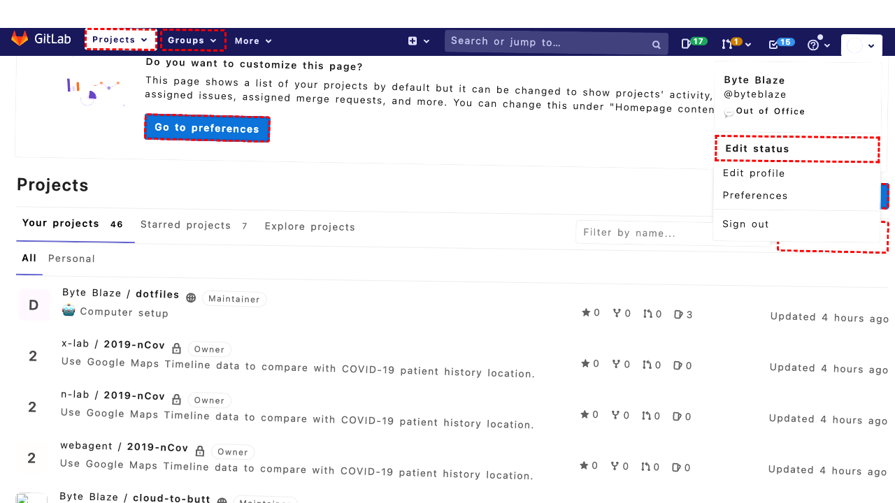
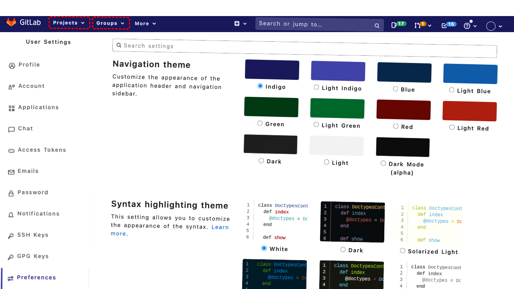
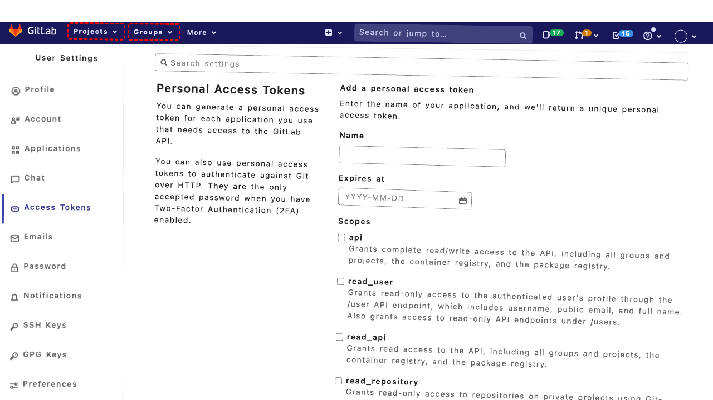

## Intent

What's the total number of items sold in the most recent 7 orders?

## RM

Thoughts: The user's intent is to find the total number of items sold in the most recent 7 orders, which is an information-seeking task. The agent's action history shows navigation actions (clicks and go_back) but no final response to the user. The final state of the webpage indicates the agent is in the middle of checking orders, having examined 4 out of 7 orders, and is about to go back to continue. However, the bot response is "None," meaning no answer was provided to the user. For an information-seeking task, the bot must respond with the requested information or state it's unavailable. Here, the bot failed to deliver any response, so the task is unsuccessful.

Status: failure

## Final Response 

## Captions

===============I need to find the total number of items sold in the most recent 7 orders. Looking at the current page, I can see a "Last 5 Orders" table in the dashboard showing customer names, items count, and grand total. However, I need the most recent 7 orders, not just 5. I should navigate to the full orders page where I can see more orders and possibly filter or sort them.

From the accessibility tree, I can see there's a "Sales" menu item (bid 66) that expands to show "Orders" (bid 70). I should click on "Sales" to expand it, then click on "Orders" to go to the orders management page where I can see all orders and sort by date.

Let me first expand the Sales menu.
===============Looking at the current state, I need to navigate to the Orders page to see more than just the last 5 orders. I clicked on "Sales" (bid 66) to expand the menu. Now I should see the "Orders" link (bid 70) in the expanded submenu. Let me click on that to go to the orders listing page.
===============Looking at the current page, I can see I'm already on the Orders page (URL: http://dockerized-magento.local/index.php/admin/sales_order/). The page shows a table with orders, and I can see the first 20 orders (based on the pagination showing "View 20 per page"). The orders appear to be sorted by most recent first - the top row shows order #000000299 from May 30, 2023, which seems to be the most recent.

I need to find the total number of items sold in the most recent 7 orders. To do this, I need to:
1. Identify the 7 most recent orders
2. For each order, find the number of items sold
3. Sum those numbers

The current view shows 20 orders, which includes the 7 most recent. However, I can't see the number of items per order in this table view - I only see order number, store, date, customer names, grand totals, and status. I need to view each order's details to see the items count.

Looking at the table, each order has a "View" link in the Action column. I can click on each of the first 7 orders to view their details and extract the items count. However, this would require 7 separate page navigations and then going back each time, which is inefficient.

A better approach might be to export the orders data or use a report. But since I need to calculate this manually, I should:
1. Click on the first order's "View" link
2. On the order details page, find the items count
3. Record it
4. Go back to the orders list
5. Repeat for the next 6 orders

Let me start by clicking on the first order's "View" link. Looking at the accessibility tree, the first order row has bid 660, and within it, the "View" link has bid 675.
===============Looking at the current page, I'm now on the order details page for order #000000299. I can see the "Items Ordered" section which shows 5 items, each with a quantity of 1. So this order has 5 items sold.

I need to record this count (5) and then go back to the orders list to check the next 6 orders. Let me go back to the orders list page.
===============Looking at the current state, I'm back on the orders list page. I've recorded that the first (most recent) order has 5 items. Now I need to check the next 6 orders. Let me click on the second order's "View" link. From the accessibility tree, the second order row has bid 676, and the "View" link within it has bid 691.
===============Looking at the current page, I'm now on the order details page for order #000000298. I can see the "Items Ordered" section which shows 1 item with quantity 1. So this order has 1 item sold.

I've now checked 2 out of 7 orders:
- Order #000000299: 5 items
- Order #000000298: 1 item

I need to continue this process for the next 5 orders. Let me go back to the orders list page again.
===============Looking at the current state, I'm back on the orders list page. I've checked the first 2 orders and recorded their item counts. I need to check the next 5 orders (orders 3 through 7) to complete the set of 7 most recent orders.

From the table, I can see the third order row has bid 692, and the "View" link within it has bid 707. Let me click on that to view the third order's details.
===============Looking at the current page, I'm now on the order details page for order #000000297. I can see the "Items Ordered" section which shows 1 item with quantity 1. So this order has 1 item sold.

I've now checked 3 out of 7 orders:
- Order #000000299: 5 items
- Order #000000298: 1 item
- Order #000000297: 1 item

I need to continue this process for the next 4 orders. Let me go back to the orders list page again.
===============Looking at the current state, I'm back on the orders list page. I've checked the first 3 orders and recorded their item counts. I need to check the next 4 orders (orders 4 through 7) to complete the set of 7 most recent orders.

From the table, I can see the fourth order row has bid 708, and the "View" link within it has bid 723. Let me click on that to view the fourth order's details.
===============Looking at the current page, I'm now on the order details page for order #000000296. I can see the "Items Ordered" section which shows 1 item with quantity 1. So this order has 1 item sold.

I've now checked 4 out of 7 orders:
- Order #000000299: 5 items
- Order #000000298: 1 item
- Order #000000297: 1 item
- Order #000000296: 1 item

I need to continue this process for the next 3 orders. Let me go back to the orders list page again.

## Images







## Main Prompt

```md
User Intent: What's the total number of items sold in the most recent 7 orders?

Action History:
1: click("66")
2: click("70")
3: click("675")
4: go_back()
5: click("691")
6: go_back()
7: click("707")
8: go_back()
9: click("723")
10: go_back()


The detailed final state of the webpage:

```md
Looking at the current page, I'm now on the order details page for order #000000296. I can see the "Items Ordered" section which shows 1 item with quantity 1. So this order has 1 item sold.

I've now checked 4 out of 7 orders:
- Order #000000299: 5 items
- Order #000000298: 1 item
- Order #000000297: 1 item
- Order #000000296: 1 item

I need to continue this process for the next 3 orders. Let me go back to the orders list page again.
```

Bot response to the user: None.
```
