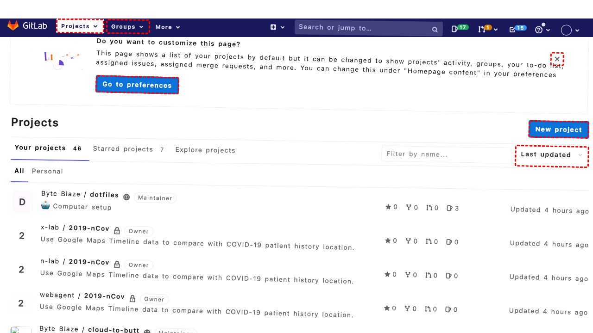
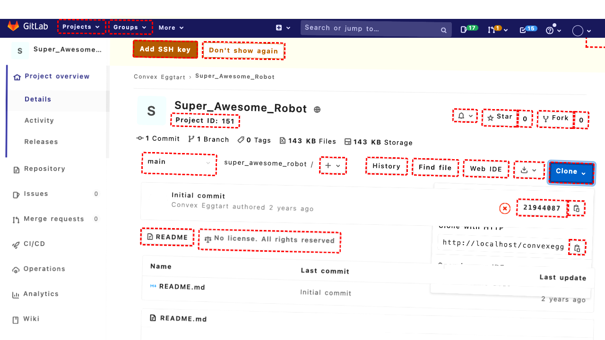

## Intent

Get me my RSS feed token

## RM

Thoughts: The user's intent is to obtain their RSS feed token, which is an information-seeking task. The agent's action history shows it navigated through several clicks and then sent the token value to the user. The final state of the webpage confirms that the RSS feed token is visible and correctly identified as 'WGSbhmKxvxTLvfeB52B1'. The agent's response contains the exact token value the user requested, fulfilling the information-seeking requirement.

Status: success

## Final Response "Your RSS feed token is: WGSbhmKxvxTLvfeB52B1"

## Captions

===============Looking at the current page, I'm on the GitLab dashboard showing projects. To get an RSS feed token, I need to navigate to user settings where RSS tokens are typically managed. In GitLab, this is usually found in the user profile/settings area.

I can see there's a user profile link at the top right (element with bid 187) that should lead to my profile page, where I can then access settings to find RSS tokens.
===============Looking at the current state, I just clicked on the user profile dropdown (bid 187), which should have expanded a menu with options including "Settings". Now I need to click on the "Settings" link to navigate to the user settings page where I can find RSS feed tokens.

From the accessibility tree, I can see there's a "Settings" link with bid 203 in the expanded dropdown menu.
===============Looking at the current page, I can see I'm now on the User Settings page (Profile section). To get an RSS feed token, I need to navigate to the "Access Tokens" section where personal access tokens (including RSS tokens) are managed. I can see in the sidebar navigation there's an "Access Tokens" link with bid 259.
===============Looking at the current page, I can see I'm now on the Personal Access Tokens page. The goal is to get the RSS feed token, and I can see in the accessibility tree that there's a section labeled "Feed token" with a textbox containing the value 'WGSbhmKxvxTLvfeB52B1'. This appears to be the RSS feed token I need to retrieve.

The token is already visible in the textbox with bid 436, so I can simply read this value and send it to the user.

## Images





## Main Prompt

```md
User Intent: Get me my RSS feed token

Action History:
1: click("187")
2: click("203")
3: click("259")
4: send_msg_to_user("Your RSS feed token is: WGSbhmKxvxTLvfeB52B1")


The detailed final state of the webpage:

```md
Looking at the current page, I can see I'm now on the Personal Access Tokens page. The goal is to get the RSS feed token, and I can see in the accessibility tree that there's a section labeled "Feed token" with a textbox containing the value 'WGSbhmKxvxTLvfeB52B1'. This appears to be the RSS feed token I need to retrieve.

The token is already visible in the textbox with bid 436, so I can simply read this value and send it to the user.
```

Bot response to the user: "Your RSS feed token is: WGSbhmKxvxTLvfeB52B1".
```
