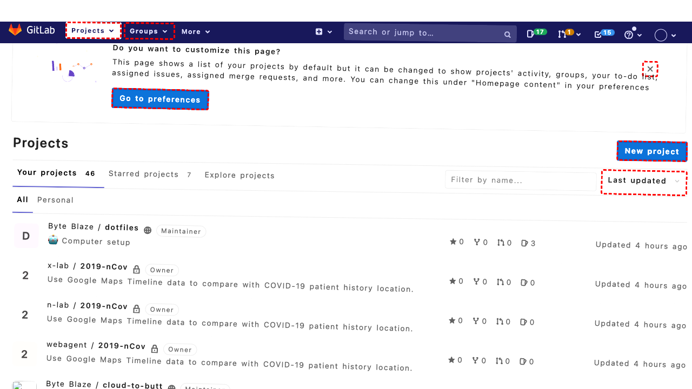
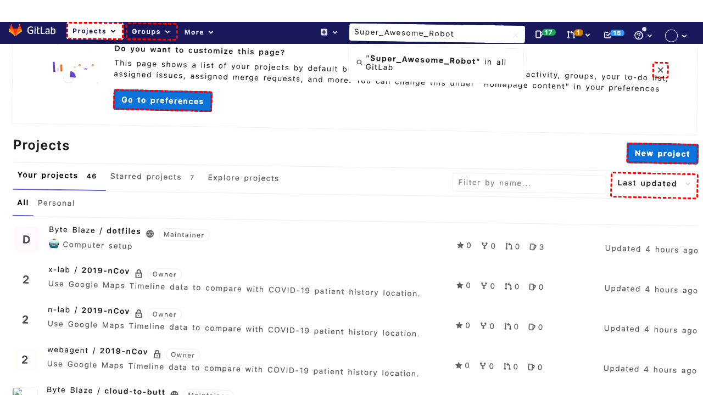
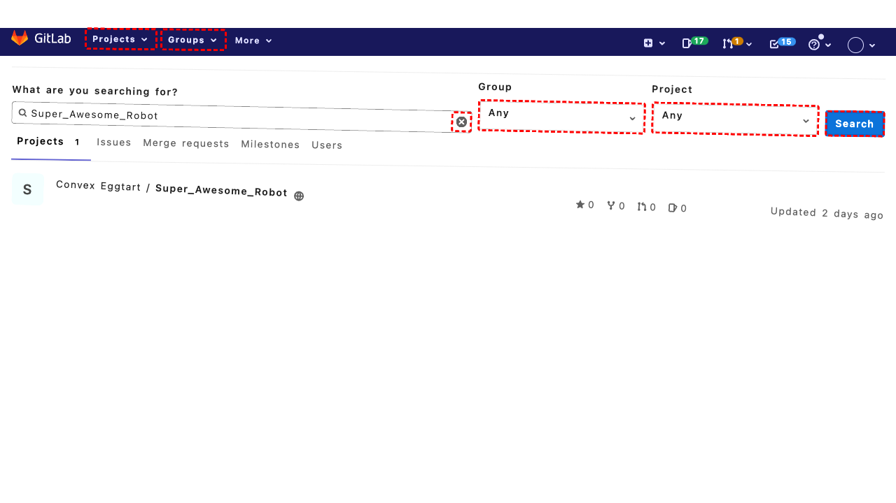
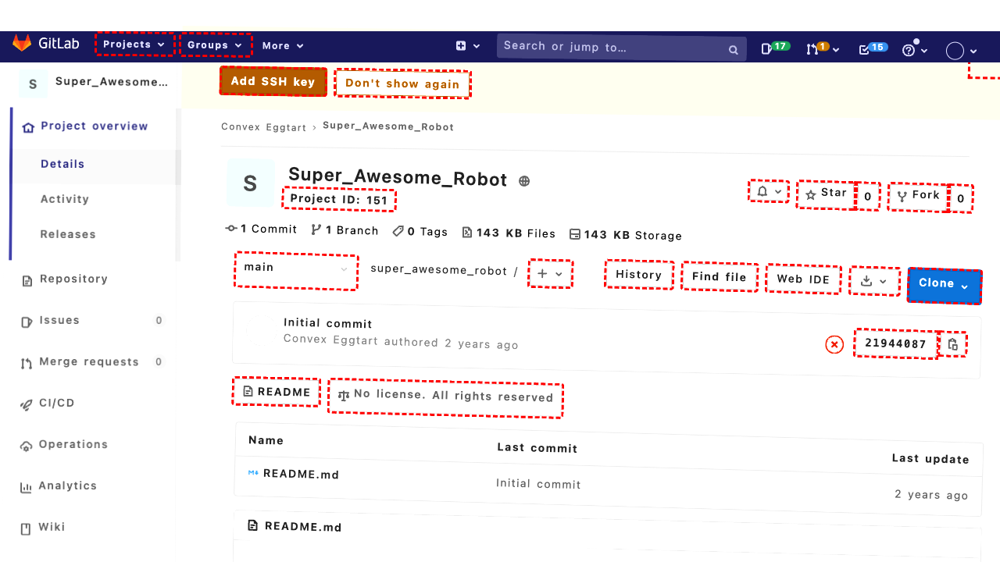

## Intent

Get me my RSS feed token

## RM

Thoughts: The user's intent is to obtain their RSS feed token, which is an information-seeking task. The agent successfully navigated to the Personal Access Tokens page, located the token value in a textbox, and provided the correct token "WGSbhmKxvxTLvfeB52B1" in the response. The final state confirms the token is visible and correctly identified, and the agent's response contains the requested information without errors.

Status: success

## Final Response "Your RSS feed token is: WGSbhmKxvxTLvfeB52B1"

## Captions

===============
===============Looking at the accessibility tree, I can see that the "Access Tokens" link is actually at position [259] in the tree, but the error suggests the element with bid "259" couldn't be found. This might be because the element IDs are dynamic or the navigation function is using the wrong approach.

Let me look for the "Access Tokens" link directly in the sidebar navigation. I can see it's clearly listed in the navigation menu under the "User Settings" section. I'll click it directly using its bid.
===============Looking at the current page, I can see we're already on the Personal Access Tokens page (as indicated by the URL and page title). The goal is to get the RSS feed token, which I can see is displayed in a textbox with the value 'WGSbhmKxvxTLvfeB52B1' at position [436] in the accessibility tree.

Since we're already on the correct page and the RSS feed token is visible, I can simply read and report this value to the user.

## Images





## Main Prompt

```md
User Intent: Get me my RSS feed token

Action History:
1: navigate_to_access_tokens('187', '203', '259')
2: click("259")
3: send_msg_to_user("Your RSS feed token is: WGSbhmKxvxTLvfeB52B1")


The detailed final state of the webpage:

```md
Looking at the current page, I can see we're already on the Personal Access Tokens page (as indicated by the URL and page title). The goal is to get the RSS feed token, which I can see is displayed in a textbox with the value 'WGSbhmKxvxTLvfeB52B1' at position [436] in the accessibility tree.

Since we're already on the correct page and the RSS feed token is visible, I can simply read and report this value to the user.
```

Bot response to the user: "Your RSS feed token is: WGSbhmKxvxTLvfeB52B1".
```
