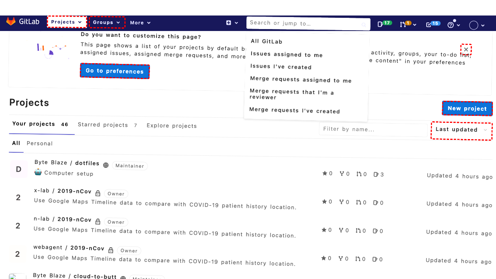
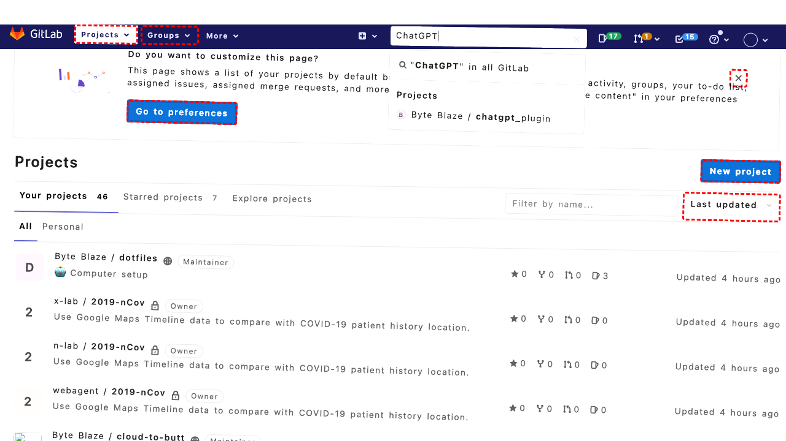
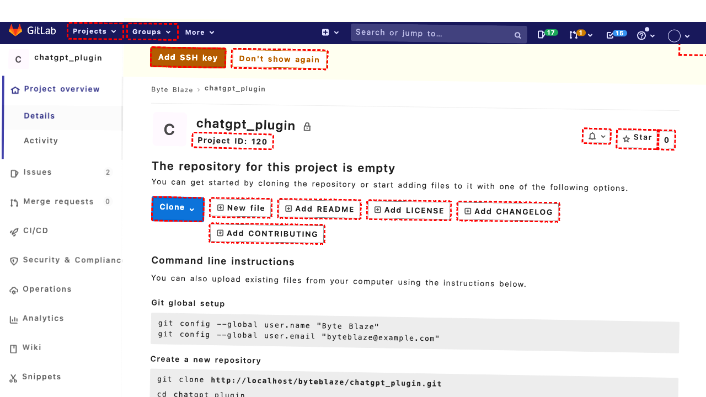
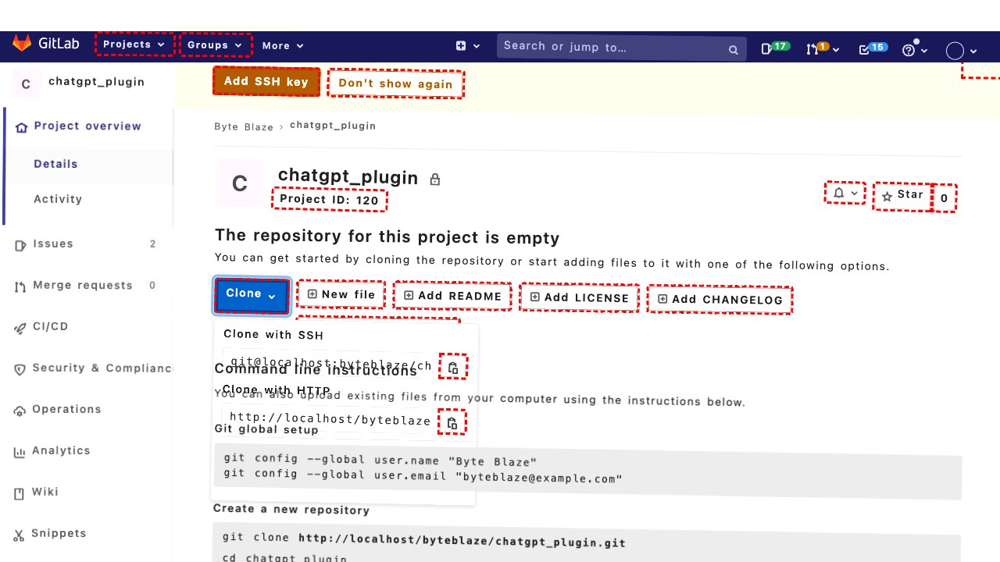

## Intent

Give me the brand of the products that have 3 units left

## RM

Thoughts: The user's intent is to obtain the brand of products that have exactly 3 units left, which is an information-seeking task. The agent's action history shows it performed various actions including filtering products by quantity (actions 5-7) and navigating to product pages, but it never successfully retrieved or displayed the brand information. The final state description indicates the agent is still exploring the interface, noting that "Brand" is not visible and considering alternative approaches like customizing columns or exporting data. The bot's response to the user is "None," meaning it did not provide the requested brand information or state that it is unavailable. Since the agent failed to deliver the required information and its actions were insufficient to complete the task (it did not find or report the brands), the execution is unsuccessful.

Status: failure

## Final Response 

## Captions

===============I need to find products with 3 units left. Currently I'm on the dashboard. I should navigate to the product management section where I can view inventory. Looking at the accessibility tree, under "Catalog" there's a "Manage Products" link. That's likely where I can see product inventory. Let's click that.

First, I need to locate the "Manage Products" link. From the tree, I see it's at index [117] link 'Manage Products', url='http://dockerized-magento.local/index.php/admin/catalog_product/'. I'll click that.
===============The click timed out because the element is outside the viewport. I should scroll to make it visible first. The "Manage Products" link is in the left navigation menu. I'll scroll down a bit to bring it into view, then click.
===============Looking at the current state, I've scrolled but I'm still on the dashboard. I need to click the "Manage Products" link to get to the product listing where I can check inventory quantities. The link should now be more visible after scrolling. Let me click it.
===============Looking at the error, the element is still outside the viewport even after scrolling. The navigation menu might be fixed or require more specific scrolling. Let me try a different approach: I can navigate directly to the Manage Products URL using the goto action since I know the URL from the accessibility tree: `http://dockerized-magento.local/index.php/admin/catalog_product/`. This will be more reliable than trying to click the menu item.
===============Looking at the current page, I can see I'm already on the Manage Products page (URL matches). The page shows a table of products with columns including "Qty" (quantity). I need to find products with exactly 3 units left. The table shows 20 products per page (as indicated by the combobox with value '20'), and there are 2485 total records across 125 pages.

I need to filter the products to show only those with Qty = 3. I can see in the table header row (index [598]) there's a filter row with input fields for each column. For the "Qty" column (column header index [655]), there are "From:" and "To:" textboxes. I can set both to "3" to filter for products with exactly 3 units.

First, I need to locate the textboxes for Qty filtering. Looking at the accessibility tree:
- At index [655] columnheader 'From: . To : .'
- Contains StaticText 'From:' (InlineTextBox 'From:')
- Then textbox at index [659]
- Then StaticText '.'
- Then StaticText 'To :' (InlineTextBox 'To :')
- Then textbox at index [662]
- Then StaticText '.'

So the "From" textbox has bid 659 and "To" textbox has bid 662. I'll fill both with "3" and then click the "Search" button to apply the filter.

Let me fill the Qty filter fields:
===============Looking at the current state, I've filled the "From" field for Qty with "3". Now I need to fill the "To" field with "3" as well to filter for exactly 3 units. Then I'll click the "Search" button to apply the filter.
===============Looking at the current page, I've filled both Qty filter fields with "3". Now I need to apply the filter by clicking the "Search" button. I can see the "Search" button at index [488] button 'Search'. Let me click it to filter the products.
===============Looking at the current page after applying the filter, I can see the product table now shows 2 records (down from 2485). Both products have Qty = 3. I need to extract the brand of these products. However, the current table view doesn't show a "Brand" column. I need to check if brand information is available elsewhere or if I need to view product details.

Looking at the table columns: ID, Name, Type, Attrib. Set Name, SKU, Price, Qty, Visibility, Status, Websites, Action. No brand column. Brand might be an attribute that's not displayed by default. I could either:
1. Check if there's a way to add "Brand" column to the view
2. Click into each product's edit page to see brand information
3. Export the data with brand information

Given the goal is simple (get brand for products with 3 units left), and there are only 2 products, I can click into each product's edit page to find the brand. Looking at the table rows:
- First product: "Minerva LumaTech™ V-Tee-XS-Blue" with Edit link at index [1320]
- Second product: "Eos V-Neck Hoodie-S-Blue" with Edit link at index [1335]

I'll click the first product's Edit link to view its details and find the brand.
===============Looking at the current page, I'm now on the product edit page for "Minerva LumaTech™ V-Tee-XS-Blue". I need to find the brand information for this product. The brand might be displayed as an attribute in the product information. Looking at the accessibility tree, I can see various attributes like "Name", "Description", "SKU", etc., but I don't see "Brand" in the General section.

I should check if there's a "Brand" attribute elsewhere. The product edit page has multiple tabs: General, Prices, Meta Information, Images, etc. Brand might be in a custom attribute section or under "Attributes". However, I notice in the tree there's a "Create New Attribute" button but no obvious brand field.

Let me scroll down to see more of the product attributes. The tree shows many rows in a table layout. I should look for "Brand" specifically. I can use the browser's find function (Ctrl+F) but that's not available as an action. Instead, I'll scroll through the page to see more attributes.
===============Looking at the current page after scrolling, I can see more product attributes but still don't see "Brand". The brand might be stored as a custom attribute that's not displayed in the default view. I need to check if there's an "Attributes" tab or section where brand might be located. Looking back at the accessibility tree earlier, there was a list of tabs at index [471] including "General", "Prices", "Meta Information", etc. I don't see a specific "Attributes" tab, but there is "Inventory", "Websites", etc.

Actually, I should check if "Brand" is displayed as one of the attributes in the General section. Looking more carefully at the tree, I see attributes like "Country of Manufacture" but not "Brand". Since I need to get the brand for both products, and there are only 2, I could:
1. Go back to the product list
2. Check if I can add "Brand" as a column in the grid view
3. Or export the data with brand information

But a simpler approach: I can check the second product first, then maybe the brand is visible in the product listing if I customize the columns. Let me go back to the product list using the "Back" button (index [565]) or by navigating to the Manage Products URL again.

I'll use the "Back" button to return to the filtered list.

## Images








## Main Prompt

```md
User Intent: Give me the brand of the products that have 3 units left

Action History:
1: click("117")
2: scroll(0, 200)
3: click("117")
4: goto("http://dockerized-magento.local/index.php/admin/catalog_product/")
5: fill("659", "3")
6: fill("662", "3")
7: click("488")
8: click("1320")
9: scroll(0, 300)
10: click("565")
11: 


The detailed final state of the webpage:

```md
Looking at the current page after scrolling, I can see more product attributes but still don't see "Brand". The brand might be stored as a custom attribute that's not displayed in the default view. I need to check if there's an "Attributes" tab or section where brand might be located. Looking back at the accessibility tree earlier, there was a list of tabs at index [471] including "General", "Prices", "Meta Information", etc. I don't see a specific "Attributes" tab, but there is "Inventory", "Websites", etc.

Actually, I should check if "Brand" is displayed as one of the attributes in the General section. Looking more carefully at the tree, I see attributes like "Country of Manufacture" but not "Brand". Since I need to get the brand for both products, and there are only 2, I could:
1. Go back to the product list
2. Check if I can add "Brand" as a column in the grid view
3. Or export the data with brand information

But a simpler approach: I can check the second product first, then maybe the brand is visible in the product listing if I customize the columns. Let me go back to the product list using the "Back" button (index [565]) or by navigating to the Manage Products URL again.

I'll use the "Back" button to return to the filtered list.
```

Bot response to the user: None.
```
