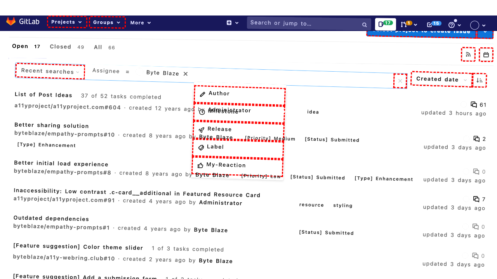
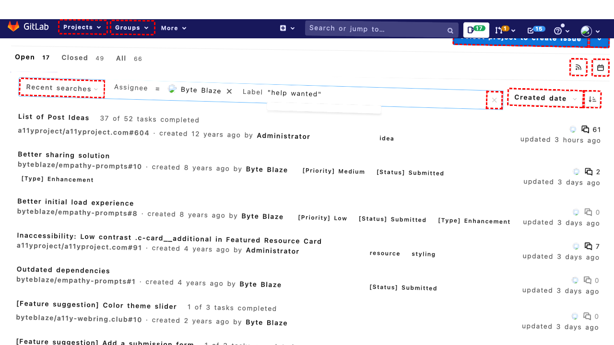

## Intent

What are the top-2 best-selling product in 2022

## RM

Thoughts: The user's intent is to find the top-2 best-selling products in 2022, which is an information-seeking task. The agent's action history shows attempts to generate a report by setting the date range to 2022 and clicking "Show Report". However, the final state of the webpage indicates that the agent is still in the process of updating dates and planning to click "Show Report" again—it hasn't actually displayed the report results. The bot's response to the user is "None", meaning no information was provided. Since the agent did not retrieve or convey the requested information, the task fails.

Status: failure

## Final Response 

## Captions

===============I need to find the top-2 best-selling products in 2022. Currently, I'm on the Magento Admin dashboard. To get sales reports, I should navigate to the Reports section. Looking at the accessibility tree, I can see a "Reports" menu item in the navigation. I need to expand it and find the "Products" submenu, then "Bestsellers" or "Products Ordered" which might show sales data.

First, I'll click on the "Reports" link to expand its submenu.

From the tree, I can see the "Reports" link has bid 211. Let me click it.
===============Looking at the accessibility tree, after clicking "Reports" (bid 211), I should now see the expanded submenu. I need to navigate to the product sales report. Under "Reports" → "Products", there is a "Bestsellers" link (bid 254) and "Products Ordered" (bid 257). Since the goal is to find best-selling products, "Bestsellers" is the most appropriate. I'll click that.
===============The error indicates the element is outside the viewport, meaning it's not currently visible on screen. The "Bestsellers" link is likely inside a collapsed submenu that didn't open properly. I need to first ensure the "Reports" menu is expanded, then navigate to "Products" submenu, then click "Bestsellers".

Looking at the tree, after clicking "Reports" (bid 211), I should see its submenu items. But maybe the menu requires hovering or the click didn't properly expand. Let me check the current state: The tree shows "Reports" is focused (has `focused` attribute), but I don't see the expanded submenu items in the provided tree snippet. Actually, the tree shows the full structure including all submenus (like "Sales", "Shopping Cart", "Products", etc.) under "Reports" - but these might be hidden in the DOM but still present in the accessibility tree. The click timeout suggests the element wasn't reachable.

I should try a different approach: navigate directly to the bestsellers report URL. From the tree, the "Bestsellers" link has URL: `http://dockerized-magento.local/index.php/admin/report_sales/bestsellers/`. I can use `goto()` to navigate directly there.
===============Looking at the current page, I'm already on the Bestsellers report page (URL matches). The page shows "No records found" in the table. To get data for 2022, I need to set the filter parameters. I can see filter controls for Period, From date, To date, and Empty Rows. I need to set the period to "Year" or appropriate range covering 2022, then click "Show Report".

First, I'll set the Period combobox to "Year" (bid 487). Then set From date to 2022-01-01 and To date to 2022-12-31. Then click the "Show Report" button (bid 453).

Let me start by changing the Period from "Day" to "Year".
===============Looking at the current state, I've already set the Period to "Year". Now I need to set the From and To dates to cover 2022. I can see the From date textbox (bid 496) and To date textbox (bid 504). I'll fill them with the appropriate dates.

First, fill the From date with "2022-01-01":
===============Looking at the page, I've set the Period to "Year" and filled the From date as "2022-01-01". Now I need to fill the To date with "2022-12-31" and then click the "Show Report" button to generate the report for 2022.

The To date textbox has bid 504. I'll fill it with the end date of 2022.
===============Looking at the current state, I've set the filter parameters: Period = Year, From = 2022-01-01, To = 2022-12-31. Now I need to apply these filters by clicking the "Show Report" button (bid 453) to generate the bestsellers report for 2022.
===============Looking at the current page after clicking "Show Report", I can see the table still shows "No records found." However, I notice the dates in the filter appear as "1/1/0022" and "12/31/0022" in the accessibility tree, which suggests the date format might be misinterpreted. The actual filled values might not have been accepted correctly. Let me check the current filter values more carefully.

From the accessibility tree, I can see:
- From date textbox shows "1/1/0022" (bid 496)
- To date textbox shows "12/31/0022" (bid 504)

This indicates the dates were entered as "0022" instead of "2022". The date picker might be using a 2-digit year format that got misinterpreted. I should clear and re-enter the dates with the correct 4-digit year format, or use the date picker.

Let me first clear the From date and enter it properly:
===============Looking at the current state, I've updated the From date to "01/01/2022". Now I need to update the To date to "12/31/2022" and then click "Show Report" again.
===============Looking at the current state, I've updated both dates to the correct format for 2022. Now I need to click the "Show Report" button again to generate the report with the corrected dates.

## Images






## Main Prompt

```md
User Intent: What are the top-2 best-selling product in 2022

Action History:
1: click("211")
2: click("254")
3: goto("http://dockerized-magento.local/index.php/admin/report_sales/bestsellers/")
4: select_option("487", "Year")
5: fill("496", "2022-01-01")
6: fill("504", "2022-12-31")
7: click("453")
8: fill("496", "01/01/2022")
9: fill("504", "12/31/2022")
10: click("453")


The detailed final state of the webpage:

```md
Looking at the current state, I've updated both dates to the correct format for 2022. Now I need to click the "Show Report" button again to generate the report with the corrected dates.
```

Bot response to the user: None.
```
