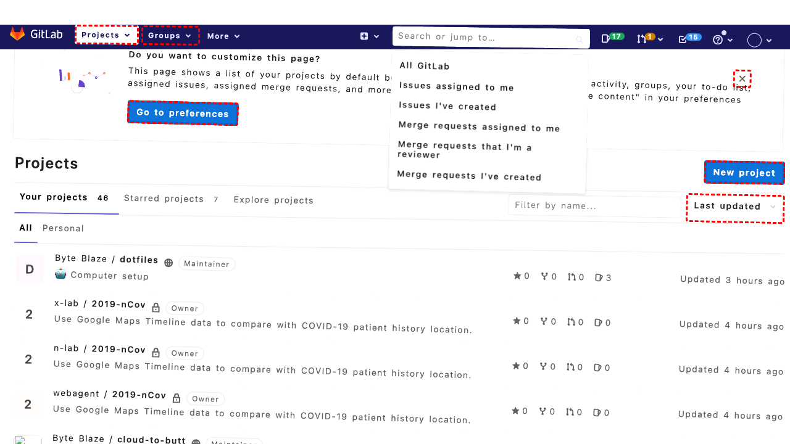
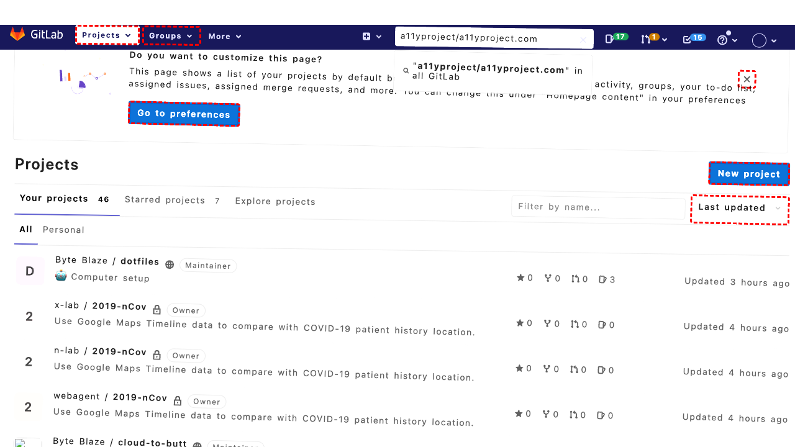
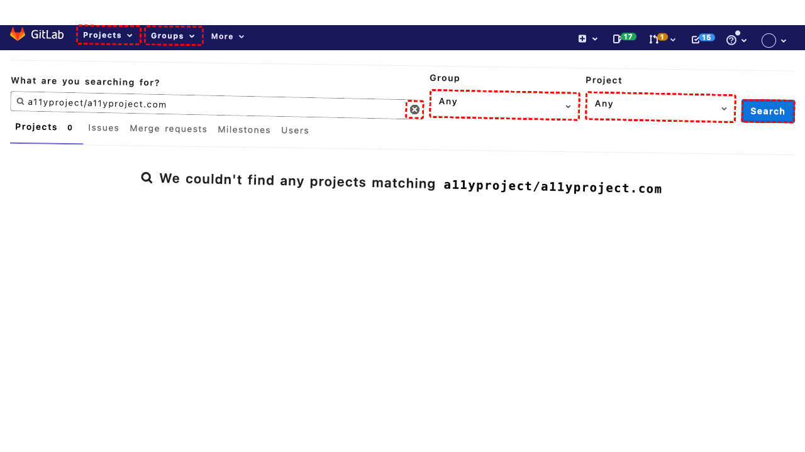

## Intent

Display the list of issues in the a11yproject/a11yproject.com repository that have labels related to help needed

## RM

Thoughts: The user's intent is to display issues with labels related to "help needed," and the agent filtered by the "help wanted" label, which is reasonably related. The final state confirms the filter is applied and issues are displayed, and the bot's response accurately reflects this. This is an information-seeking task, and the bot provided the requested information.

Status: success

## Final Response "I've filtered the issues to show those with the 'help wanted' label. The current view displays issues #604 and #15 which have this label, along with any other issues that match this filter."

## Captions

===============Looking at the current page, I can see the GitLab dashboard showing a list of projects. I need to navigate to the a11yproject/a11yproject.com repository to access its issues. I can see this repository listed in the project list with the name "The A11Y Project / a11yproject.com" and it shows it has 41 issues.

The best next action is to click on the a11yproject/a11yproject.com repository link to navigate to that repository's page, where I can then access the issues section and filter by labels related to help needed.
===============Looking at the current page, I can see I'm on the a11yproject/a11yproject.com repository page. I can see there's an "Issues" link in the sidebar navigation that shows "41" issues. To display the list of issues with labels related to help needed, I need to first navigate to the issues page, then I can filter by labels.

The "Issues" link in the sidebar has the bid 283 and contains the text "Issues 41". Clicking this will take me to the issues page where I can then apply label filters.
===============Looking at the current page, I can see I'm now on the issues page for the a11yproject/a11yproject.com repository. I can see several issues listed, and I notice that some of them have labels like "help wanted" (visible on issue #604 and #15) and "good first issue" (visible on issue #255 and #15).

To display only the issues with labels related to help needed, I need to filter by these labels. I can see there's a search/filter textbox at the top of the page (bid 541) where I can enter label filters. I'll search for issues with the "help wanted" label, which is one of the common help-related labels.
===============Looking at the current page, I can see that I've already filtered the issues by the "help wanted" label using the search box. The page now shows issues that have this label, including issue #604 and #15 which both have the "help wanted" label visible.

The goal is to display the list of issues with labels related to help needed, and I've successfully filtered to show issues with the "help wanted" label. The current view shows these issues, so I should report this success to the user.

## Images






## Main Prompt

```md
User Intent: Display the list of issues in the a11yproject/a11yproject.com repository that have labels related to help needed

Action History:
1: click("290")
2: click("283")
3: fill("541", "label_name[]=help wanted")
4: send_msg_to_user("I've filtered the issues to show those with the 'help wanted' label. The current view displays issues #604 and #15 which have this label, along with any other issues that match this filter.")


The detailed final state of the webpage:

```md
Looking at the current page, I can see that I've already filtered the issues by the "help wanted" label using the search box. The page now shows issues that have this label, including issue #604 and #15 which both have the "help wanted" label visible.

The goal is to display the list of issues with labels related to help needed, and I've successfully filtered to show issues with the "help wanted" label. The current view shows these issues, so I should report this success to the user.
```

Bot response to the user: "I've filtered the issues to show those with the 'help wanted' label. The current view displays issues #604 and #15 which have this label, along with any other issues that match this filter.".
```
