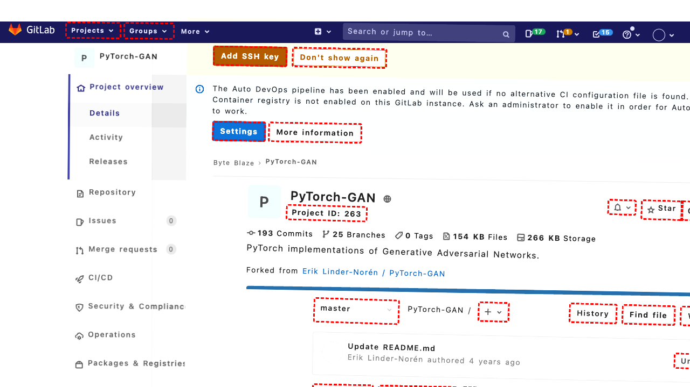
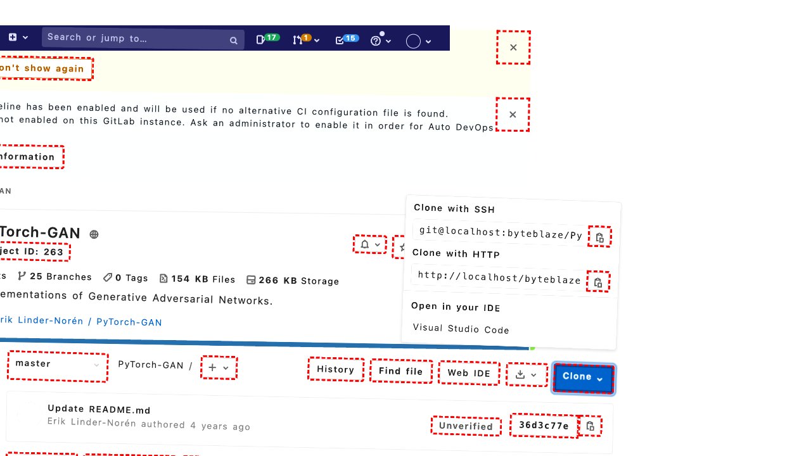

## Intent

Show me the command to clone metaseq with SSH.

## RM

Thoughts: This is an information seeking task where the user wants the command to clone a repository using SSH. The agent's action history shows it searched for the repository, clicked relevant elements, and then provided the correct command in its response. The final state confirms the SSH clone URL is visible and matches the command given. The agent successfully retrieved and conveyed the requested information.

Status: success

## Final Response "The command to clone metaseq with SSH is: git clone git@localhost:root/metaseq.git"

## Captions

===============Looking at the current page, I can see I'm on a GitLab dashboard showing various projects. The user wants to see the command to clone "metaseq" with SSH. First, I need to find the metaseq repository in this GitLab instance. I can see there's a search box available in the navigation (element with bid 143), so I'll use that to search for the metaseq repository.
===============Looking at the current page state, I can see that the search has already been performed for "metaseq" and there's a search result showing the metaseq repository. The repository link is visible with the text "Administrator / metaseq" and has bid 285. I should click on this repository link to navigate to the repository page where I can find the SSH clone command.
===============Looking at the current page, I can see I'm already on the metaseq repository page. The page shows the repository details, and I can see there's a "Clone" button/link with bid 497. On GitLab, clicking the "Clone" button typically reveals the clone URLs including SSH and HTTPS options. I should click this button to reveal the SSH clone command.
===============Looking at the current page state, I can see that the "Clone" button has already been clicked and is expanded (expanded=True). The accessibility tree shows that the SSH clone URL is already visible in a textbox with the value "git@localhost:root/metaseq.git" and has bid 504. The user wants to see the command to clone metaseq with SSH, which would be "git clone git@localhost:root/metaseq.git". Since the SSH clone URL is already visible on the page, I can simply send this information to the user.

## Images






## Main Prompt

```md
User Intent: Show me the command to clone metaseq with SSH.

Action History:
1: search_repository('143', 'metaseq')
2: click('285')
3: click('497')
4: send_msg_to_user("The command to clone metaseq with SSH is: git clone git@localhost:root/metaseq.git")


The detailed final state of the webpage:

```md
Looking at the current page state, I can see that the "Clone" button has already been clicked and is expanded (expanded=True). The accessibility tree shows that the SSH clone URL is already visible in a textbox with the value "git@localhost:root/metaseq.git" and has bid 504. The user wants to see the command to clone metaseq with SSH, which would be "git clone git@localhost:root/metaseq.git". Since the SSH clone URL is already visible on the page, I can simply send this information to the user.
```

Bot response to the user: "The command to clone metaseq with SSH is: git clone git@localhost:root/metaseq.git".
```
