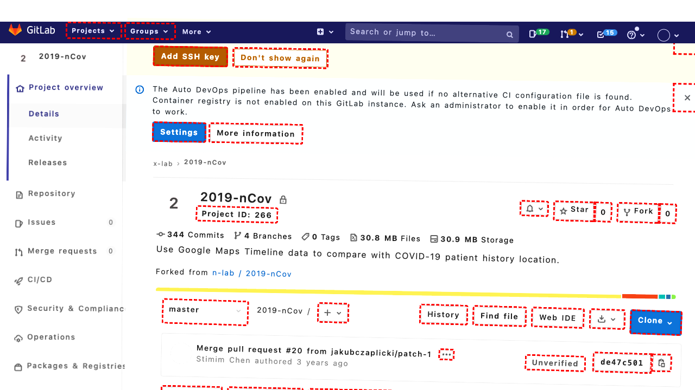
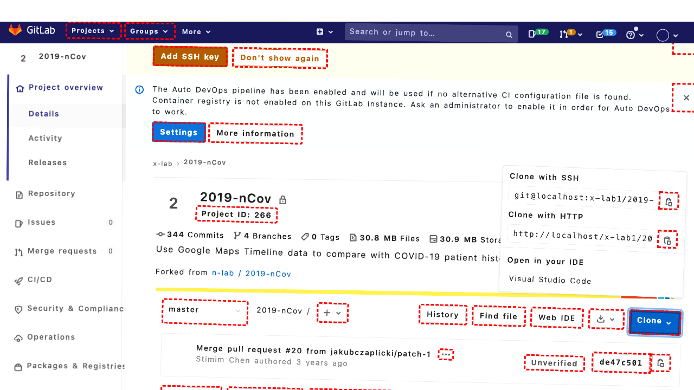

## Intent

Show me the command to clone the best GAN python implementation with SSH.

## RM

Thoughts: The user's intent is to obtain the command to clone the best GAN Python implementation with SSH, which is an information-seeking task. The agent's response provides the exact SSH clone command as requested, matching the URL visible in the final webpage state. The agent successfully located and conveyed the necessary information without errors or omissions.

Status: "success"

## Final Response "To clone the PyTorch-GAN repository using SSH, use this command:\n\ngit clone git@localhost:eriklindernoren/PyTorch-GAN.git"

## Captions

===============Looking at the current page, I can see we're on a GitLab dashboard showing various projects. The user wants to clone the best GAN Python implementation using SSH.

First, I need to search for GAN-related repositories. I can see there's a search box available in the accessibility tree with ID 143 (searchbox 'Search or jump to…'). I'll use this to search for GAN repositories.
===============Looking at the current page state, I can see we're already on a GitLab search results page for "GAN". The search has already been performed and shows 2 projects in the results:

1. "Learn Anything / learn-anything" - which appears to be about organizing knowledge
2. "Erik Linder-Norén / PyTorch-GAN" - which has the description "PyTorch implementations of Generative Adversarial Networks"

The second project "PyTorch-GAN" by Erik Linder-Norén appears to be exactly what the user is looking for - it's a GAN implementation in Python using PyTorch. This is likely the "best GAN python implementation" the user wants to clone.

I should click on this project to navigate to its repository page where I can find the SSH clone URL.
===============Looking at the current page, I can see we're now on the PyTorch-GAN repository page. The user wants to clone this repository using SSH. I need to find the SSH clone URL.

In the accessibility tree, I can see there's a "Clone" button/link with ID 497. When I click this, it should reveal the clone options including the SSH URL. Let me click on the Clone button to reveal the clone URLs.
===============Looking at the current page state, I can see that after clicking the "Clone" button (ID 497), a dropdown list has appeared showing the clone options. I can see two options in the accessibility tree:

1. "Clone with SSH" with a textbox containing the SSH URL: `git@localhost:eriklindernoren/PyTorch-GAN.git`
2. "Clone with HTTP" with a textbox containing the HTTP URL

The SSH clone URL is clearly visible in the textbox with ID 504. Now I need to copy this SSH URL and provide it to the user as the command to clone the repository.

The command to clone using SSH would be: `git clone git@localhost:eriklindernoren/PyTorch-GAN.git`

I'll send this command to the user so they can use it to clone the repository.

## Images






## Main Prompt

```md
User Intent: Show me the command to clone the best GAN python implementation with SSH.

Action History:
1: search_repository('143', 'GAN')
2: click('314')
3: click('497')
4: send_msg_to_user("To clone the PyTorch-GAN repository using SSH, use this command:\n\ngit clone git@localhost:eriklindernoren/PyTorch-GAN.git")


The detailed final state of the webpage:

```md
Looking at the current page state, I can see that after clicking the "Clone" button (ID 497), a dropdown list has appeared showing the clone options. I can see two options in the accessibility tree:

1. "Clone with SSH" with a textbox containing the SSH URL: `git@localhost:eriklindernoren/PyTorch-GAN.git`
2. "Clone with HTTP" with a textbox containing the HTTP URL

The SSH clone URL is clearly visible in the textbox with ID 504. Now I need to copy this SSH URL and provide it to the user as the command to clone the repository.

The command to clone using SSH would be: `git clone git@localhost:eriklindernoren/PyTorch-GAN.git`

I'll send this command to the user so they can use it to clone the repository.
```

Bot response to the user: "To clone the PyTorch-GAN repository using SSH, use this command:\n\ngit clone git@localhost:eriklindernoren/PyTorch-GAN.git".
```
