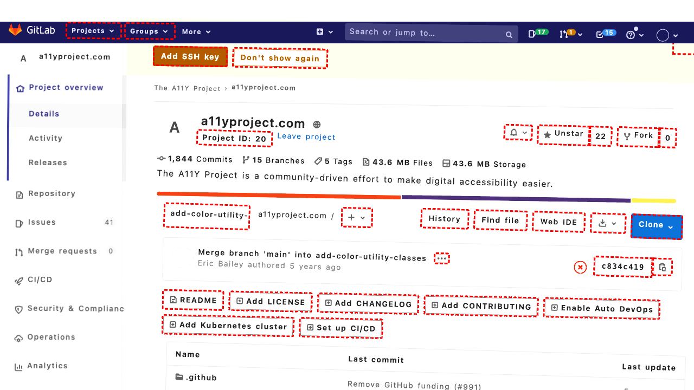
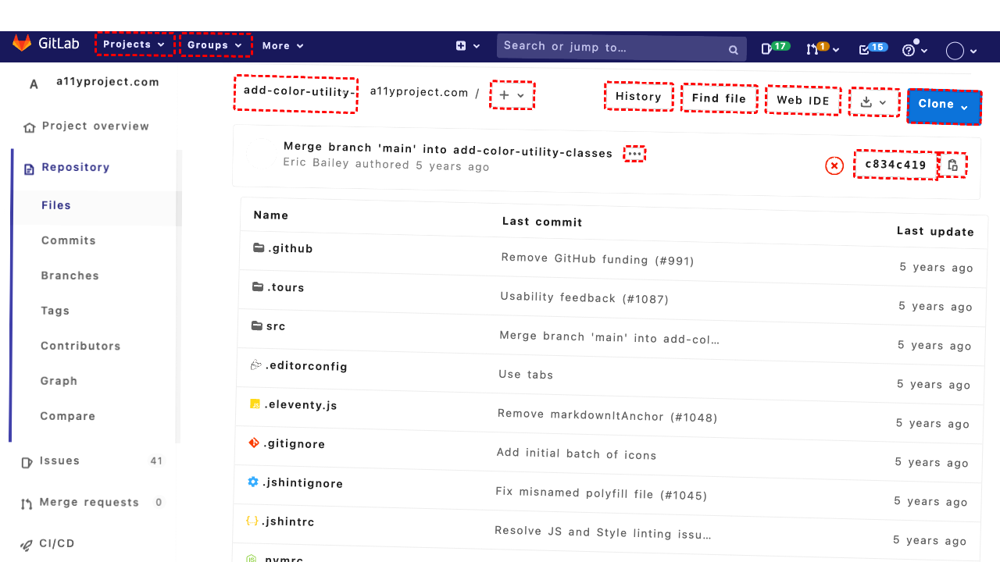
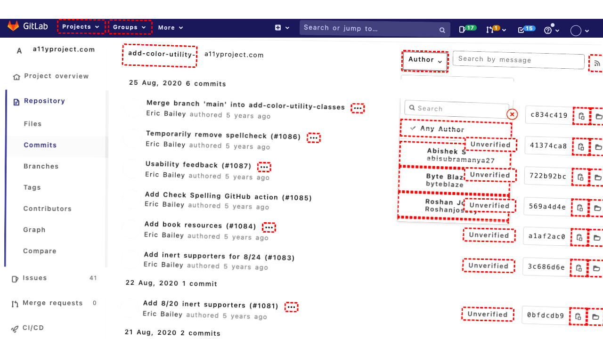
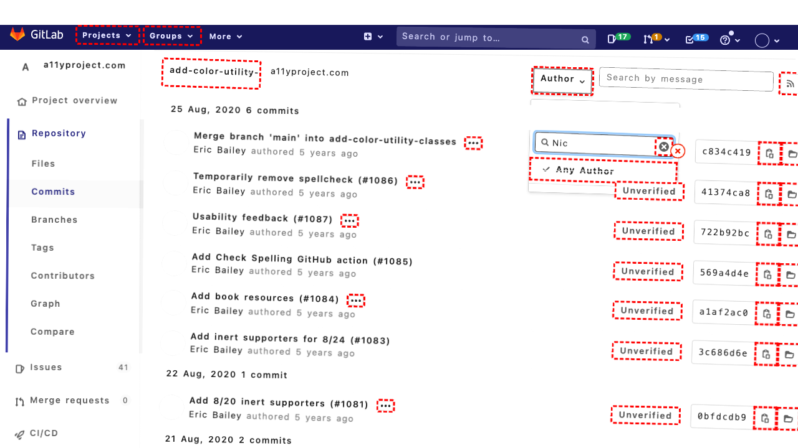
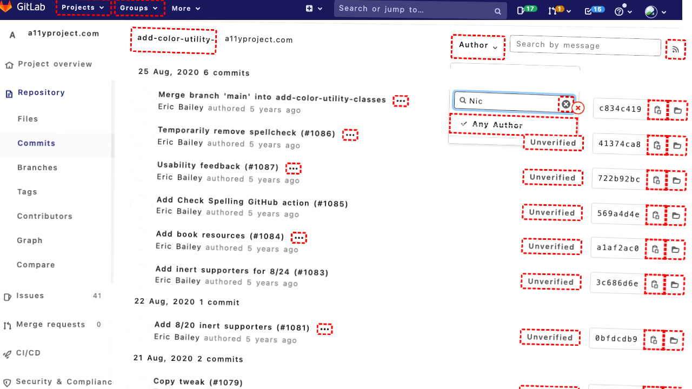
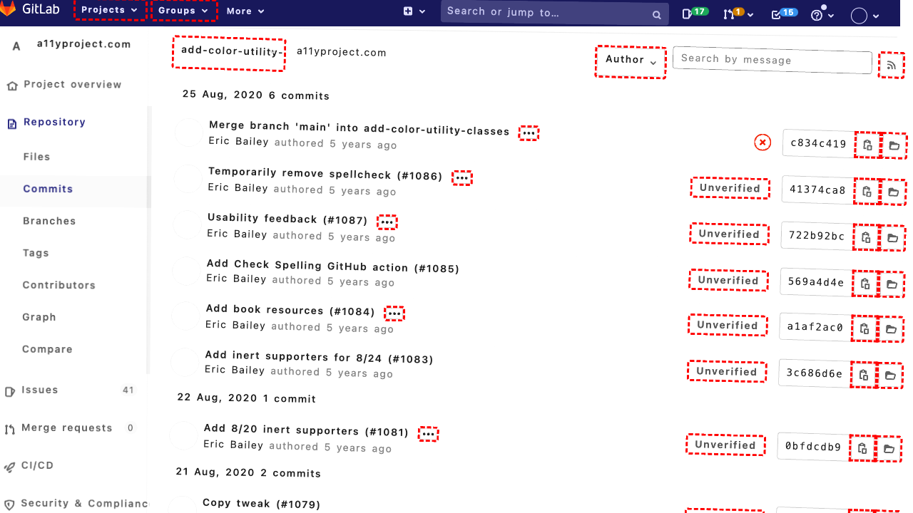
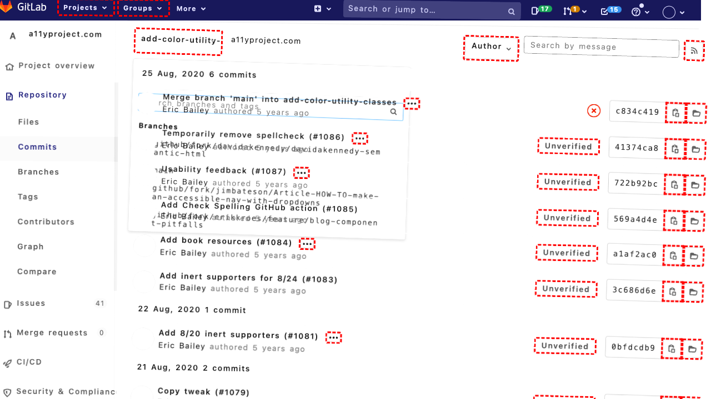

## Intent

How many commits did Nic make in April 2021?

## RM

Thoughts: The user's intent is information seeking, specifically asking for the number of commits Nic made in April 2021. The agent's action history shows attempts to search and navigate, but the final state indicates the agent is stuck on a branch commit history page showing only August 2020 commits, and the search for "Nic" yielded no results. The agent did not provide any response to the user, and the required information was not obtained or stated as unavailable. Therefore, the task fails.

Status: failure

## Final Response 

## Captions

===============Looking at the current page, I can see we're on a GitLab repository page for "a11yproject.com". The goal is to find how many commits Nic made in April 2021.

I can see there's a "Repository" section in the sidebar navigation, and within that there should be access to commit history. I need to navigate to the commit history to filter by author and date. Let me click on the "Repository" link first to access the commit-related features.
===============Looking at the accessibility tree, I can see that after clicking the Repository link, I should now be able to access the Commits section. I need to navigate to the commit history where I can filter commits by author and date. In the Repository section, there's a "Commits" link that should take me to the commit history page.
===============Looking at the current state, I can see we're on a commit history page for the "add-color-utility-classes" branch. The commits shown are all from August 2020, which is much earlier than April 2021. I need to filter the commits to find Nic's commits from April 2021.

I can see there's an "Author" filter button (bid 604) that I can use to filter by author, and there's also a search box (bid 659) where I can search by commit message. However, to find commits from a specific date range, I'll likely need to use the search functionality or navigate to a different view.

Let me first try filtering by author to see if I can find Nic's commits, then I can look for April 2021 commits.
===============Looking at the current state, I can see the Author dropdown menu is open (expanded=True) and focused. I need to find Nic in the list of authors. Scanning through the menu items, I see several authors but none named "Nic" - I see Abishek S, Byte Blaze, Roshan Jossy, The A11Y Project, and Vinta Chen.

Since Nic doesn't appear to be in this list, I should search for Nic using the search box within the Author dropdown. I can see there's a textbox with bid 616 labeled "Search" where I can search for authors.
===============Looking at the current state, I can see I've searched for "Nic" in the Author dropdown, but the search results haven't appeared yet in the accessibility tree. The search box (bid 616) is focused and contains "Nic", but I don't see any matching authors listed in the current tree.

Since the search has been performed but no results are visible, I should wait a moment for the search results to load, then check if Nic appears in the filtered list. If Nic doesn't appear, it might mean there are no commits by Nic in this repository, or I might need to use a different approach to find Nic's commits.

Let me wait briefly for the search results to load.
===============Looking at the current state, I've searched for "Nic" in the Author dropdown but no matching authors appear in the accessibility tree. This suggests either:

1. There are no commits by Nic in this repository
2. Nic might be listed under a different name
3. I need to check the main repository instead of just the "add-color-utility-classes" branch

Since I'm currently viewing commits only for the "add-color-utility-classes" branch, I should navigate to the main repository's commit history to see all commits, which might include Nic's commits from April 2021.

Let me navigate back to the main repository commits by clicking on the repository name link in the breadcrumbs.
===============Looking at the error, I see that the click on the repository link (bid 563) failed because a header element is intercepting pointer events. This suggests the element might be covered by an overlay or the page hasn't fully loaded.

Let me try a different approach. Since I'm currently on the "add-color-utility-classes" branch commit history, I should first navigate to the main repository's commit history. I can see in the sidebar navigation there's a "Repository" section with a "Commits" link that should take me to the main repository commits.

Let me click on the main "Commits" link in the Repository section to view all commits in the repository, not just for this specific branch.
===============Looking at the current situation, I can see I'm still on the "add-color-utility-classes" branch commit history page, and my previous attempts to filter by author "Nic" didn't yield results. The commits shown are all from August 2020, which is before April 2021.

Since I need to find Nic's commits from April 2021, I should:

1. First navigate to the main repository's commit history (not just this branch)
2. Then use search/filter functionality to find commits by Nic from April 2021

I can see in the sidebar there's a "Repository" section with a "Commits" link (bid 320) that should take me to the main repository's commit history. Let me click that to view all commits across all branches.
===============Looking at the current situation, I can see I'm still on the "add-color-utility-classes" branch commit history page, and my previous attempts to navigate to the main repository commits haven't worked as expected. The commits shown are all from August 2020, which is before April 2021.

I notice that in the breadcrumbs navigation (bid 552), there's a link for "a11yproject.com" (bid 563) that should take me to the main project page. From there, I can navigate to the repository and then to the main commits page. Let me try clicking this project link to get to the main project view.
===============Looking at the current situation, I'm having difficulty navigating away from the "add-color-utility-classes" branch commit history page due to UI elements intercepting clicks. The commits shown are all from August 2020, which is before April 2021, and my search for "Nic" as an author didn't yield results.

Since I'm stuck on this specific branch's commit history, I should try a different approach. I notice there's a branch selector button at the top of the page (bid 582) that shows "add-color-utility-classes". I can click this to change to a different branch, possibly the main branch where I might find Nic's commits from April 2021.

Let me click the branch selector to see if I can switch to the main branch or access a branch selection menu.

## Images












## Main Prompt

```md
User Intent: How many commits did Nic make in April 2021?

Action History:
1: click("319")
2: click("331")
3: click("604")
4: fill("616", "Nic")
5: noop(1000)
6: click("563")
7: click("320")
8: click("320")
9: click("563")
10: click("582")


The detailed final state of the webpage:

```md
Looking at the current situation, I'm having difficulty navigating away from the "add-color-utility-classes" branch commit history page due to UI elements intercepting clicks. The commits shown are all from August 2020, which is before April 2021, and my search for "Nic" as an author didn't yield results.

Since I'm stuck on this specific branch's commit history, I should try a different approach. I notice there's a branch selector button at the top of the page (bid 582) that shows "add-color-utility-classes". I can click this to change to a different branch, possibly the main branch where I might find Nic's commits from April 2021.

Let me click the branch selector to see if I can switch to the main branch or access a branch selection menu.
```

Bot response to the user: None.
```
