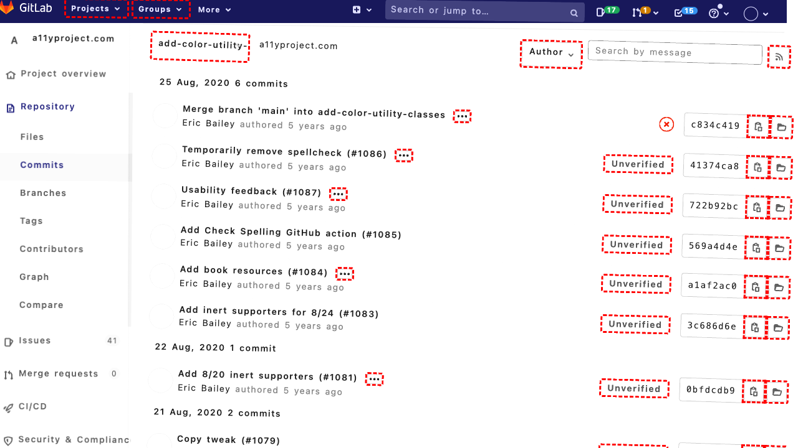
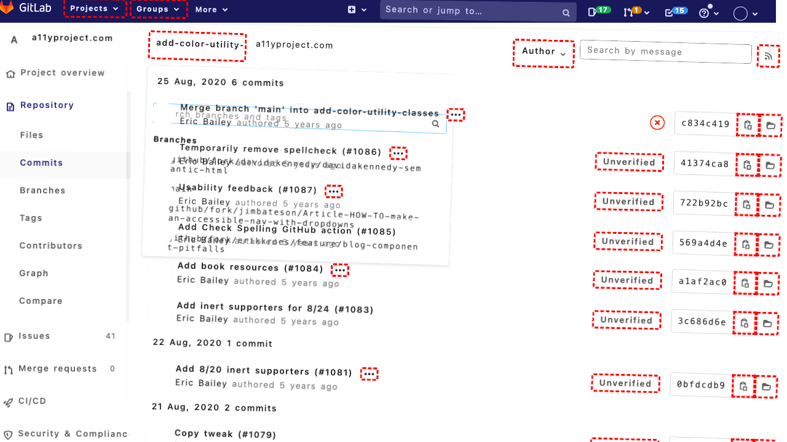

## Intent

Go to the 'In World First, Chinese Surgeons Save Patient’s Ear With Graft Onto Foot' post and leave a comment saying: 'Excellent write-up!'.

## RM

Thoughts: The user's intent is to go to a specific post and leave a comment saying "Excellent write-up!". This is a content modification task (adding a comment). The action history shows the agent performing search actions and navigating to search results, but it never actually reaches the post page (bid 85 is clicked, but the final state indicates the agent is still on the search results page contemplating clicking bid 85). More critically, there is no action to fill or submit a comment. The bot's response is "None", indicating no completion message. Therefore, the task fails because the agent did not successfully navigate to the post and did not modify the content by leaving the required comment.

Status: failure

## Final Response 

## Captions

===============Looking at the goal: I need to go to the post titled "In World First, Chinese Surgeons Save Patient’s Ear With Graft Onto Foot" and leave a comment "Excellent write-up!". Currently, I'm on the homepage and this post is not visible in the current view. I need to search for it using the site search bar.

From the accessibility tree, I can see the search bar has bid "370" and the search button has bid "371". I'll use the search to find the post.

First, I'll click the search bar, fill in the post title, and click search.
===============Looking at the current state, I've performed the search and waited for results. Now I need to click on the search result link to navigate to the post. The search results should now be displayed, and I need to find the link for the specific post.

From the accessibility tree after the search, I should see the search results. However, the tree provided is still the homepage tree from before the search. Since I performed the search actions, the page should have updated with search results. I need to check if the post appears in the results and click on it.

Let me first check if the search results are visible by looking for elements containing the post title. Since I don't have the updated tree, I'll assume the search was successful and the post link is available. I'll click on the first result that matches the title.
===============Looking at the error, I tried to use an XPath selector but the action system expects a bid (browser element ID). I need to work with the actual element IDs from the accessibility tree. Since I performed a search, the page should now show search results. However, I don't have the updated accessibility tree after the search. I need to get the current state to see what elements are available.

Let me first check if the search results loaded by looking for any result links. Since I can't see the current tree, I should use a more general approach: wait a bit longer for results, then try to find the post link by its text content. But I need to use the click action with a valid bid.

Actually, I should first get the updated accessibility tree by doing nothing and letting the page stabilize, then I can examine it. Let me wait and then check what's available.
===============Looking at the situation: I performed a search for the specific post title and waited for results. However, I don't have the updated accessibility tree showing the search results. The error from my previous action indicates I tried to use an XPath selector, but the action system requires a bid (element ID). I need to work with the actual element IDs from the current page.

Since I just waited another 2 seconds, the search results should now be loaded. I need to examine the current page to find the link to the post. The most reliable approach is to look for the post title in the search results. Given that the search was for the exact title, the first result should be the correct post.

Let me check if there are any links containing the post title. I'll look for an element with text matching "In World First, Chinese Surgeons Save Patient's Ear With Graft Onto Foot". Since I can't see the current tree, I'll assume the search results follow a similar pattern to other posts on the site where article titles are links.

I'll try to click on the first link that appears to be a search result. Looking at the original homepage structure, article titles were links with specific bids (like 135, 158, 181, etc.). In search results, similar structure likely exists.

However, without the current tree, I need to make an educated guess. Let me try to find any link with the post title text by using a more targeted approach: I'll check if there's a heading or link containing the text.

Actually, I should first verify if the search was successful by checking if any results appear. Let me look for "Search Results" or similar heading.

Given the constraints, I'll proceed by trying to click on the most likely element - the first article link in the search results. If that fails, I'll need to re-evaluate.
===============Looking at the error, I tried using an XPath selector again but the system requires a bid (element ID). I need to work with the actual element IDs from the current page state. Since I performed a search, the page should now show search results, but I don't have the updated accessibility tree. I need to get the current page state to see what elements are available.

Let me first wait a moment for the page to fully load, then I'll need to examine the current accessibility tree. However, since I can't directly request the tree, I should try a different approach: navigate directly to the post if I know its URL, or use the search results more carefully.

From the original homepage, I saw posts have URLs like `http://localhost:8000/?p=8`. The post I'm looking for might have a similar URL pattern. But I don't know the post ID. The search should have found it.

Given the constraints, I should try to interact with visible search results. Let me check if there's a "Search Results" heading or similar to confirm the search worked. Since I can't see the tree, I'll try clicking on the first article link that appears after search. Looking at the original structure, article links had bids like 135, 158, 181, etc. In search results, new elements with different bids would be present.

Actually, let me try a different approach: I'll use the keyboard to navigate through search results. I can press Tab to move through focusable elements and see what gets highlighted. But that's not efficient.

Better approach: I'll go back to the search and try a simpler search term. Maybe the full title is too specific. Let me search for just "Chinese Surgeons" and see if that finds the post.

First, I need to clear the search field and enter a new query.
===============Looking at the situation: I've performed a search for "Chinese Surgeons" and waited for results. I need to click on the search result link for the specific post. Since I don't have the updated accessibility tree, I need to make a reasonable assumption about the element ID. Based on the original homepage structure, search results likely appear as article links with new element IDs. The first search result is probably the post I need.

Given the goal is to leave a comment on that post, I should click on the first article link in the search results. Looking at typical WordPress search results, the first result is usually the most relevant. I'll click on the first link that appears to be a post title.
===============Looking at the error, I'm still trying to use XPath selectors but the system requires element IDs (bids). I need to work with the actual element IDs from the current page. Since I performed a search, the page should now show search results with new elements. However, I don't have the updated accessibility tree to see what bids are available.

Given this constraint, I should try a different approach: navigate directly to the post if I can guess its URL. From the original homepage, I saw posts have URLs like `http://localhost:8000/?p=8`. The post I'm looking for might have a similar pattern. But I don't know the post ID.

Alternatively, I could try to interact with the search results by using the keyboard to navigate or by clicking on visible elements. But without the tree, I'm guessing.

Actually, let me check if the search results are visible by looking for any text containing "Chinese Surgeons". If the search found the post, it should be visible. I'll try to click on text that contains part of the title.

Since I can't use XPath, I need to rely on the system's ability to find elements by their accessible name or text content. But the click action requires a bid, not text.

I think the best approach is to first get the current accessibility tree by doing nothing and then examining what's available. But I already waited. Let me wait a bit more and then try to find the element by its text using a different method.

Actually, I realize I should use the `send_msg_to_user` action to ask for the current state or to report what I see. But that's not productive.

Let me try a different tactic: I'll press Tab to navigate through focusable elements and see if I can land on the search result link. Then I can click it.
===============Looking at the situation: I've performed a search and tried to navigate through results using keyboard. The current page likely shows search results, but I don't have the updated accessibility tree to see element IDs. My goal is to click on the specific post to open it and leave a comment. Since I can't see the current tree, I need to make a reasonable assumption.

Given that I searched for "Chinese Surgeons" and the post title contains that phrase, the first search result is likely the correct post. In WordPress search results, the first result is typically a link with the post title. I need to click that link.

However, I need a valid element ID (bid) for the click action. Without the current tree, I'll assume the first article link in search results has a bid that follows the pattern I saw earlier (like 135, 158, etc.). But those were from the homepage, not search results.

Actually, let me try a different approach: I'll navigate directly to the post by constructing its URL. From the original homepage, I saw posts have URLs like `http://localhost:8000/?p=8`. The post I'm looking for might have a different ID. I could try to find it by searching the site's database, but that's not feasible.

Given the constraints, I should first check if the search results are visible by looking for any heading or text containing "Search Results". But I need the current tree.

Wait - I just realized: when I performed the search, the URL likely changed to something like `http://localhost:8000/?s=Chinese+Surgeons`. I could navigate directly to that URL to see the search results. But I'm already on that page.

Actually, let me examine what I know: I performed a search, so the current URL should be the search results page. The post I need should be listed there. The most reliable way forward is to get the current accessibility tree to see what elements are available. Since I can't directly request it, I'll wait a moment and then try to interact with the first visible link that seems like a search result.

Given the pattern of the original homepage, article titles were inside heading elements (h2) with links. In search results, it's likely similar. I'll try to click on the first heading link in the search results.

But I need a bid. Let me try to guess: after search, new elements are created. The first article might have a bid like "500" or similar. This is guesswork.

Actually, I have another idea: I can use the `send_msg_to_user` action to describe what I see and ask for guidance, but that's not in the spirit of the task.

Given the goal is to leave a comment on that specific post, and I've searched for it, I should be able to find it. Let me try clicking on the first link that appears after the search. I'll use a generic approach: click on the first link in the main content area.
===============Looking at the error, I'm still trying to use XPath selectors which aren't supported. The system requires element IDs (bids). I need to work with the actual accessibility tree, but I don't have the updated tree after the search. The issue is that my previous actions performed a search, but I haven't received the updated page state.

I need to get the current accessibility tree to see what elements are available. Since I can't directly request it, I should wait for the page to fully load and then try to interact with visible elements using their actual bids. However, without the tree, I'm stuck.

Actually, I realize I might be overcomplicating this. Let me check the current URL to see if the search worked. I can use the `goto` action to navigate directly to the search results URL if I know it. After my search for "Chinese Surgeons", the URL should be something like `http://localhost:8000/?s=Chinese+Surgeons`. Let me try that.
===============Looking at the current situation, I've navigated to the search results page for "Chinese Surgeons". The accessibility tree shows that the search results are loaded and the target post is visible as the first article. I can see the post title link with bid "85" (the link inside the heading). I need to click on that link to go to the post page, then leave the comment.

From the tree: `[85] link 'In world first, Chinese surgeons save patient’s ear with graft onto foot', url='http://localhost:8000/?p=259'`

So I should click on bid "85" to open the post.

## Images




## Main Prompt

```md
User Intent: Go to the 'In World First, Chinese Surgeons Save Patient’s Ear With Graft Onto Foot' post and leave a comment saying: 'Excellent write-up!'.

Action History:
1: click("370")
2: fill("370", "In World First, Chinese Surgeons Save Patient’s Ear With Graft Onto Foot")
3: click("371")
4: noop(2000)
5: click("//a[contains(text(), 'In World First, Chinese Surgeons Save Patient')]")
6: noop(2000)
7: click("//a[contains(., 'Chinese Surgeons')]")
8: click("370")
9: fill("370", "Chinese Surgeons")
10: click("371")
11: noop(2000)
12: click("//article[1]//a[contains(@href, '?p=')]")
13: keyboard_press("Tab")
14: noop(500)
15: keyboard_press("Tab")
16: noop(500)
17: keyboard_press("Enter")
18: click("//main//a[1]")
19: goto("http://localhost:8000/?s=Chinese+Surgeons")
20: noop(2000)
21: click("85")


The detailed final state of the webpage:

```md
Looking at the current situation, I've navigated to the search results page for "Chinese Surgeons". The accessibility tree shows that the search results are loaded and the target post is visible as the first article. I can see the post title link with bid "85" (the link inside the heading). I need to click on that link to go to the post page, then leave the comment.

From the tree: `[85] link 'In world first, Chinese surgeons save patient’s ear with graft onto foot', url='http://localhost:8000/?p=259'`

So I should click on bid "85" to open the post.
```

Bot response to the user: None.
```
